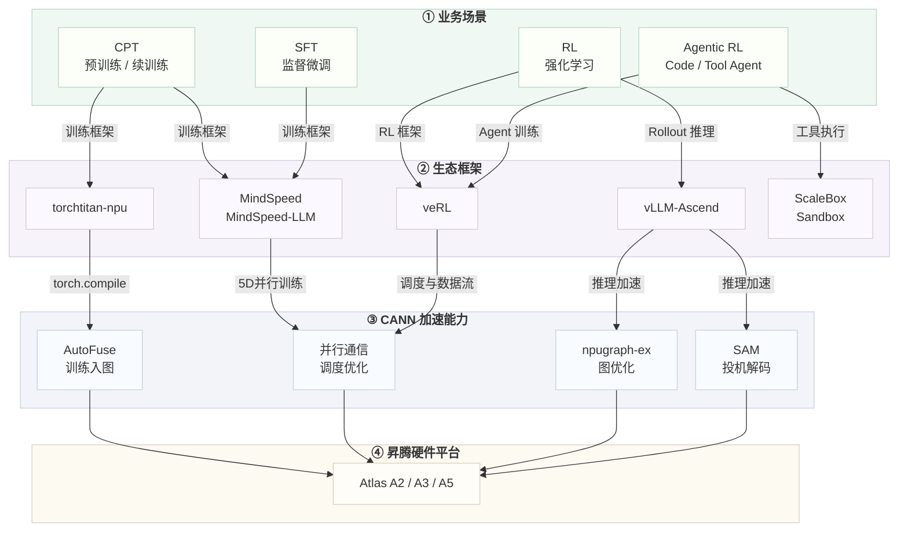

<h1 align="center">CANN-RECIPES-TRAIN</h1>

<p align="center">
  基于 CANN 平台的大模型训练优化实践<br>
  覆盖 CPT / SFT / RL 等主流训练场景，快速上手昇腾 NPU 训练，复现高性能优化方案
</p>

<p align="center">
  <a href="https://gitcode.com/cann/cann-recipes-train/blob/master/LICENSE"></a>
  
  
</p>

<p align="center">
  <sub>具体 Python、CANN 及依赖版本以各样例 README 为准。</sub>
</p>

<p align="center">
  <a href="#quickstart">🚀 快速开始</a> ·
  <a href="#samples">📦 样例列表</a> ·
  <a href="#user-guide">🗺️ 用户导航</a> ·
  <a href="https://gitcode.com/cann/cann-recipes-train/issues">💬 社区讨论</a>
</p>

---

## 🚀 最新动态

- [2026/09] 新增 [Qwen3.6-27B 模型 AscendC 算子生成监督微调支持](llm_sft/qwen36_ascendc/torchtitan/README.md)，包括 [TorchTitan-NPU 样例](llm_sft/qwen36_ascendc/torchtitan/README.md)和 [MindSpeed-MM 样例](llm_sft/qwen36_ascendc/mindspeed-mm/README.md)
- [2026/08] 新增 [DeepSeek-V4-Flash HiF8 低精度预训练](llm_pretrain/deepseekv4/README.md#deepseek-v4-flash-a5-hif8-%E4%BD%8E%E7%B2%BE%E5%BA%A6%E8%AE%AD%E7%BB%83)样例，在 Atlas A5 上使能单卡 HiF8 低精度预训练
- [2026/05] 新增 [DeepSeek-V4-Pro 模型续训练支持](llm_pretrain/deepseekv4/README.md)，基于 TorchTitan-NPU + AutoFuse，使能 **训练入图、AutoFuse**
- [2026/04] 新增 [DeepSeek-V3 MXFP8/HiF8 低精度预训练](llm_pretrain/DeepSeekV3/README.md)样例，在 Atlas A5 上完成 8K 序列低精度预训练复现
- [2026/04] 新增 [DeepSeek-V4-Flash 模型续训练 0day 支持](llm_pretrain/deepseekv4/README.md)，支持 **极简切分、训练入图、AutoFuse**
- [2026/02] 新增 [DeepSeek-V3.2 TorchTitan 预训练](llm_pretrain/deepseekv32/README.md)样例，在 Atlas A3 64 卡集群完成 32K 长序列预训练复现
- [2026/02] 新增 [Qwen3 系列模型 RL 训练使能 npugraph_ex 图模式](llm_rl/qwen3/verl-mindspeed/README.md)样例

<details>
<summary>📜 更多历史动态</summary>

- [2025/12] 新增 Qwen2.5 / Qwen3 模型 Code RL 长上下文代码生成强化学习样例
- [2025/12] 新增 Qwen3 系列模型 RL 训练使能 [SAM 投机推理](llm_rl/qwen3/verl-mindspeed/README.md)、[tool agent RL](agent_rl/qwen3_tool_agent/README.md)样例
- [2025/11] [Qwen3 模型长序列 RL](llm_rl/qwen3/verl-mindspeed/README.md)样例首次上线
- [2025/10] [DeepSeek-R1](llm_rl/deepseek/README.md)、[Qwen2.5 模型](llm_rl/qwen2_5/verl_npu_demo/README.md)样例首次上线

</details>

---

## 📖 概述

cann-recipes-train 为热门大模型和多模态模型提供**可复现、可迁移、面向高性能的训练优化样例**。每个样例围绕实际训练任务提供环境构建、数据与权重准备、启动脚本、性能结果和特性说明，并标注其覆盖的 CANN 训练原子能力，帮助开发者在昇腾 NPU 上快速完成模型训练。

仓库包含以下类型的实践：

| 类型 | 说明 | 目录 |
|------|------|------|
| 🔧 预训练 / 续训练 | 基于 TorchTitan-NPU、MindSpeed 等训练框架，覆盖长序列、低精度、AutoFuse、训练入图等优化 | `llm_pretrain/` |
| 🧪 监督微调 | 提供轻量 SFT 路径，适合快速验证模型、数据与训练流程 | `llm_sft/` |
| 🚀 强化学习训练 | 基于 veRL + MindSpeed + vLLM-Ascend，覆盖 GRPO / DAPO、长序列 rollout、投机推理等场景 | `llm_rl/` |
| 🎨 多模态强化学习 | 基于 FLUX GRPO，覆盖文生图模型 GRPO 训练、HPSv2 奖励优化及 NPU 适配 | `multimodal_rl/` |
| 🤖 Agent / Code RL | 面向工具调用、代码沙盒等 Agent 训练任务 | `agent_rl/` |
| 📚 优化特性文档 | 训练入图、SAM、序列级均衡调度、Length-Aware Resampler 等特性详细介绍 | `docs/` |

<h3 id="user-guide">🗺️ 用户导航</h3>

| 你是... | 推荐入口 | 预计耗时 |
|---------|---------|:-------:|
| 🆕 初次接触昇腾训练 | [一站式平台](#quickstart) → 浏览器环境跑通 SFT / RL 入门样例 | 10 min |
| 🛠️ 自有环境部署 | [样例列表](#samples) → 按模型与训练类型选择 README | 30 min |
| 🚀 关注大规模训练性能 | [预训练 / 续训练样例](#预训练--续训练) 与 [优化特性文档](#optimization-docs) | 按需 |
| 🤖 探索 Agent 训练 | [Agent / Code RL 样例](#agent--code-rl) | 按需 |
| 🤝 贡献代码 | [贡献指南](CONTRIBUTION.md) | 15 min |

### 为什么使用 cann-recipes-train

| 维度 | 说明 |
|------|------|
| ⚡ 热门模型快速适配 | DeepSeek-V4、DeepSeek-V3.2 等模型持续提供昇腾训练适配与优化样例 |
| 🚀 面向性能复现 | 覆盖长序列、低精度、融合算子、图模式、投机推理、多阶段 RL 流水等关键优化 |
| 🔧 生态框架协同 | 与 TorchTitan-NPU、MindSpeed、veRL、vLLM-Ascend 等生态联动 |
| 📐 多硬件场景覆盖 | 支持 Atlas A2 / A3 / A5 等不同硬件与单卡、多卡、多机场景 |
| 🤖 Agentic RL训练 | 持续沉淀 Tool Agent、Code RL、多轮工具调用和代码沙盒训练能力 |

### 与社区生态的关系



> 💡 本仓正在持续沉淀训练优化与 Agent 训练能力，欢迎开发者参与新模型适配、性能优化和文档共建。

---

<h2 id="quickstart">🚀 快速开始</h2>

### CANNLab一站式开发平台快速跑通第一个训练样例

「CANNLab一站式开发平台」提供预配置的 NPU / CANN 环境，可按样例 README 中的平台路径快速启动：

| 模型 | 场景 | 训练后端 | 硬件 | 体验 |
|------|------|----------|------|:--:|
| Qwen3-1.7B | 单卡 SFT 训练 | MindSpeed-LLM | A2 / A3 | [🚀 启动](llm_sft/qwen3/README.md#一站式平台快速启动sft训练示例) |
| Qwen3-1.7B | 单卡 SFT 训练 | TorchTitan-NPU | A2 | [🚀 启动](llm_sft/qwen3_1.7B_torchtitan/README.md#一站式平台快速启动sft训练示例) |
| Qwen2.5-1.5B-Instruct | 单卡 RL 入门 | veRL | A2 / A3 | [🚀 启动](llm_rl/qwen2_5/verl_npu_demo/README_single.md) |

> 📢 更多模型持续扩展中，欢迎在 [Issues](https://gitcode.com/cann/cann-recipes-train/issues) 反馈优先支持的训练样例。

---

<h2 id="samples">📦 样例列表</h2>

### 能力入口

> 展开版能力说明见 [CANN 原子化特性能力总览](docs/cann_capability_overview.md)，包含适用范围、已覆盖样例、开启方式和限制边界。

| 阶段 | 原子化特性 | 解决什么问题 | 代表样例 / 文档 |
|------|------------|--------------|------------------|
| 预训练 / 续训练 | 训练入图（torch.compile + AutoFuse） | 降低 Python 调度与小算子启动开销，提升训练执行效率 | [DeepSeek-V4 训练优化文档](docs/llm_pretrain/deepseek-v4_torchtitan_npu_autofuse.md) |
| 预训练 / 续训练 | 大规模并行训练（TP / PP / EP / CP / FSDP2） | 支撑超大模型在多机多卡上的显存切分、长序列训练和计算扩展 | [DeepSeek-V4](llm_pretrain/deepseekv4/README.md)、[DeepSeek-V3.2](llm_pretrain/deepseekv32/README.md) |
| 预训练 / 续训练 | 低精度训练（MXFP8 / HiF8） | 通过低精度数据格式兼顾显存、吞吐与训练精度 | [DeepSeek-V3 低精度训练文档](docs/llm_pretrain/deepseek-v3_pre_train_hif8_mxfp8.md) |
| 预训练 / 续训练 | Swap Optimizer / 优化器状态卸载 | 降低 FSDP2 场景下优化器状态的设备显存占用 | [DeepSeek-V4 训练优化文档](docs/llm_pretrain/deepseek-v4_torchtitan_npu_autofuse.md) |
| SFT | MindSpeed-LLM SFT 链路适配 | 提供数据处理、权重转换、训练启动的一站式微调链路 | [Qwen3-1.7B SFT](llm_sft/qwen3/README.md) |
| SFT | Ascend C 算子生成领域全参数微调 | 提供基于 TorchTitan-NPU 的 8 卡 910C（16 die）、CP8 × FSDP2 长序列领域微调 | [Qwen3.6-27B Ascend C 算子生成](llm_sft/qwen36_ascendc/torchtitan/README.md) |
| RL | TorchAir / npugraph_ex 推理图优化 | 在 rollout 推理阶段降低动态图调度开销，提升长序列 RL 性能 | [Qwen3 长序列 RL 训练优化文档](docs/llm_rl/qwen3_235B_32k_longseq_rl_train_optimization.md) |
| RL | SAM 无损投机解码 | 在保持训练结果一致性的前提下提升 rollout decode 效率 | [SAM 无损投机推理文档](docs/features/sam_speculative_decoding.md) |
| RL | Rollout Rebalance 序列级均衡调度 | 缓解 On-Policy rollout 中 response 长尾导致的推理负载不均 | [Rollout Rebalance 文档](docs/features/rollout_rebalance.md) |
| RL | Length-Aware Resampler | 基于历史 response 长度重排样本，降低 generation batch 内长短样本混排 | [Length-Aware Resampler 文档](docs/features/length_aware_resampler.md) |
| RL | EPLB / HDP / AllToAllV Reshard | 优化 MoE 专家负载、长序列数据并行和训推权重重分发效率 | [Qwen3 长序列 RL 训练优化文档](docs/llm_rl/qwen3_235B_32k_longseq_rl_train_optimization.md) |
| Agentic RL | 工具调用 / 代码沙盒训练链路 | 支持模型在训练中调用外部工具、代码沙盒或执行环境获得反馈 | [Qwen3 Tool Agent](agent_rl/qwen3_tool_agent/README.md)、[Code RL](agent_rl/qwen2_code_rl/README.md) |
| Agentic RL | Code RL 投机解码扩展 | 面向代码任务构造多轮工具调用训练闭环，并支持 suffix / EAGLE3 等投机解码扩展 | [Qwen3 Code ToolCall](agent_rl/qwen3_code_toolcall/README.md) |

### 样例入口

#### 预训练 / 续训练

> 面向大模型预训练、继续训练与低精度训练。适合关注 TorchTitan-NPU、MindSpeed、长序列、低精度和大规模并行训练的开发者。

| 样例 | 场景说明 |
|------|----------|
| [DeepSeek-V4-Flash / Pro](llm_pretrain/deepseekv4/README.md) | TorchTitan-NPU + AutoFuse 续训练，覆盖训练入图与大规模并行训练路径 |
| [DeepSeek-V3.2 32K 长序列预训练](llm_pretrain/deepseekv32/README.md) | 基于 TorchTitan-NPU 的 32K 长序列预训练适配与性能复现 |
| [DeepSeek-V3 MXFP8 / HiF8](llm_pretrain/DeepSeekV3/README.md) | 基于 MindSpeed 的低精度预训练样例，聚焦 MXFP8 / HiF8 训练实践 |

#### 监督微调

> 面向单卡和一站式平台的快速 SFT 体验。适合先跑通数据处理、权重转换和微调训练链路。

| 样例 | 场景说明 |
|------|----------|
| [Qwen3-1.7B SFT](llm_sft/qwen3/README.md) | MindSpeed-LLM SFT 样例，支持一站式平台快速启动 |
| [Qwen3-1.7B TorchTitan-NPU SFT](llm_sft/qwen3_1.7B_torchtitan/README.md) | 单卡 TorchTitan-NPU SFT 样例，支持一站式平台快速启动 |
| [Qwen3-30B-A3B 医学 SFT](llm_sft/qwen3_30b_a3b/README.md) | 基于 TorchTitan-NPU 的医学领域多卡全参微调与效果评测样例 |
| [Qwen3.6-27B Ascend C 算子生成](llm_sft/qwen36_ascendc/torchtitan/README.md) | 基于 TorchTitan-NPU 的 8 卡 910C（16 die）、CP8 × FSDP2 全参数监督微调样例 |
| [Qwen3.6-27B Ascend C 算子生成](llm_sft/qwen36_ascendc/mindspeed-mm/README.md) | 基于 MindSpeed-MM 的 8 卡 910C（16 die）、CP8 × FSDP2 全参数及 LoRA 监督微调样例 |

#### 强化学习训练

> 基于 veRL + MindSpeed + vLLM-Ascend，覆盖 GRPO / DAPO、长序列 rollout、图优化、投机解码和负载均衡等 RL 训练问题。

| 样例 | 场景说明 |
|------|----------|
| [DeepSeek-R1 RL](llm_rl/deepseek/README.md) | A3 大规模 GRPO 训练优化样例，适合参考高吞吐 RL 训练链路 |
| [Qwen3-235B-A22B / Qwen3-32B RL](llm_rl/qwen3/verl-mindspeed/README.md) | 覆盖 GRPO / DAPO、SAM、npugraph_ex、Length-Aware Resampler 等长序列 RL 特性 |
| [Qwen3-30B-A3B TorchTitan RL](llm_rl/qwen3/verl-torchtitan/README.md) | 基于 veRL + TorchTitan-NPU + vLLM-Ascend 的 GRPO 训练样例 |
| [Qwen2.5-1.5B RL 入门样例](llm_rl/qwen2_5/verl_npu_demo/README.md) | 单卡起步的 veRL 入门样例，包含奖励函数优化、训练可视化和 OpenCompass 评测 |

#### 多模态强化学习

> 面向文生图模型的强化学习训练，覆盖多模态生成、奖励模型优化和昇腾 NPU 适配。

| 样例 | 场景说明 |
|------|----------|
| [FLUX GRPO](multimodal_rl/flux_grpo/README.md) | 基于 DanceGRPO 的文生图 GRPO 训练样例，默认使用 HPSv2 奖励模型，支持 Atlas A3 16 die |

#### Agent / Code RL

> 面向工具调用、代码沙盒、长上下文代码生成和多轮交互式训练。适合探索 Agentic RL 与 Code RL 闭环。

| 样例 | 场景说明 |
|------|----------|
| [Qwen3 Tool Agent RL](agent_rl/qwen3_tool_agent/README.md) | 基于 verl-retool 的工具调用训练样例，展示 asyncLLM 与 agent_loop 训练流程 |
| [Code RL 长上下文代码生成](agent_rl/qwen2_code_rl/README.md) | 基于 ScaleBox 代码沙盒的长上下文 Code RL 样例，覆盖 LiveCodeBench 评测 |
| [Qwen3 多轮工具调用 Code RL](agent_rl/qwen3_code_toolcall/README.md) | 面向多轮工具调用的 Code RL 样例，包含推测解码扩展与训练结果分析 |

<h3 id="optimization-docs">优化特性文档</h3>

<details>
<summary>训练优化技术与特性文档（点击展开）</summary>

| 特性 | 文档 |
|------|------|
| DeepSeek-V4 TorchTitan-NPU + AutoFuse 训练优化 | [docs/llm_pretrain/deepseek-v4_torchtitan_npu_autofuse.md](docs/llm_pretrain/deepseek-v4_torchtitan_npu_autofuse.md) |
| DeepSeek-V3.2 32K 长序列预训练优化 | [docs/llm_pretrain/deepseek-v32_pre_train_optimization.md](docs/llm_pretrain/deepseek-v32_pre_train_optimization.md) |
| DeepSeek-V3 MXFP8 / HiF8 低精度训练 | [docs/llm_pretrain/deepseek-v3_pre_train_hif8_mxfp8.md](docs/llm_pretrain/deepseek-v3_pre_train_hif8_mxfp8.md) |
| Qwen3-235B 32K 长序列 RL 训练优化 | [docs/llm_rl/qwen3_235B_32k_longseq_rl_train_optimization.md](docs/llm_rl/qwen3_235B_32k_longseq_rl_train_optimization.md) |
| DeepSeek-R1 RL 训练优化 | [docs/llm_rl/deepseek_rl_train_optimization.md](docs/llm_rl/deepseek_rl_train_optimization.md) |
| CANN 原子化特性能力总览 | [docs/cann_capability_overview.md](docs/cann_capability_overview.md) |
| SAM 无损投机推理 | [docs/features/sam_speculative_decoding.md](docs/features/sam_speculative_decoding.md) |
| RL On-Policy 序列级均衡调度 | [docs/features/rollout_rebalance.md](docs/features/rollout_rebalance.md) |
| Length-Aware Resampler | [docs/features/length_aware_resampler.md](docs/features/length_aware_resampler.md) |

</details>

---

## 📖 目录结构

<details>
<summary>点击展开完整目录树</summary>

```text
cann-recipes-train/
├── llm_pretrain/                  # 预训练与续训练样例
│   ├── deepseekv4/                # DeepSeek-V4-Flash / Pro 续训练
│   ├── deepseekv32/               # DeepSeek-V3.2 32K 长序列预训练
│   └── DeepSeekV3/                # DeepSeek-V3 MXFP8 / HiF8 低精度预训练
├── llm_sft/                       # 监督微调样例
│   ├── qwen3/                     # Qwen3-1.7B MindSpeed-LLM SFT
│   ├── qwen3_1.7B_torchtitan/     # Qwen3-1.7B TorchTitan-NPU SFT
│   ├── qwen3_30b_a3b/             # Qwen3-30B-A3B 医学 SFT
│   └── qwen36_ascendc/            # Qwen3.6-27B Ascend C 算子生成 SFT
├── llm_rl/                        # 强化学习训练样例
│   ├── deepseek/                  # DeepSeek-R1 RL
│   ├── qwen3/                     # Qwen3 veRL + MindSpeed / TorchTitan 训练
│   └── qwen2_5/                   # Qwen2.5 veRL 入门样例
├── multimodal_rl/                 # 多模态强化学习样例
│   └── flux_grpo/                 # FLUX 文生图 GRPO 训练
├── agent_rl/                      # Agent 与 Code RL 样例
│   ├── qwen3_tool_agent/          # Qwen3 Tool Agent RL
│   ├── qwen2_code_rl/             # 代码沙盒 Code RL
│   └── qwen3_code_toolcall/       # 多轮工具调用 Code RL
├── docs/                          # 优化技术文档
│   ├── cann_capability_overview.md # CANN 原子化特性能力总览
│   ├── llm_pretrain/              # 预训练优化实践
│   ├── llm_rl/                    # RL 训练优化实践
│   ├── multimodal_rl/             # 多模态 RL 图片等资源
│   └── features/                  # 通用训练特性说明
├── ci/                            # CI 辅助脚本
├── CONTRIBUTION.md
├── LICENSE
└── README.md
```

</details>

---

## 🤖 智能代码助手

本仓已集成 Zread 代码仓库智能体，旨在通过 AI 技术为您提供更深度的代码理解与技术支持。

点击 [![Zread](https://img.shields.io/badge/Zread-Ask_AI-_.svg?style=flat&color=0052D9&labelColor=000000&logo=data%3Aimage%2Fsvg%2Bxml%3Bbase64%2CPHN2ZyB3aWR0aD0iMTYiIGhlaWdodD0iMTYiIHZpZXdCb3g9IjAgMCAxNiAxNiIgZmlsbD0ibm9uZSIgeG1sbnM9Imh0dHA6Ly93d3cudzMub3JnLzIwMDAvc3ZnIj4KPHBhdGggZD0iTTQuOTYxNTYgMS42MDAxSDIuMjQxNTZDMS44ODgxIDEuNjAwMSAxLjYwMTU2IDEuODg2NjQgMS42MDE1NiAyLjI0MDFWNC45NjAxQzEuNjAxNTYgNS4zMTM1NiAxLjg4ODEgNS42MDAxIDIuMjQxNTYgNS42MDAxSDQuOTYxNTZDNS4zMTUwMiA1LjYwMDEgNS42MDE1NiA1LjMxMzU2IDUuNjAxNTYgNC45NjAxVjIuMjQwMUM1LjYwMTU2IDEuODg2NjQgNS4zMTUwMiAxLjYwMDEgNC45NjE1NiAxLjYwMDFaIiBmaWxsPSIjZmZmIi8%2BCjxwYXRoIGQ9Ik00Ljk2MTU2IDEwLjM5OTlIMi4yNDE1NkMxLjg4ODEgMTAuMzk5OSAxLjYwMTU2IDEwLjY4NjQgMS42MDE1NiAxMS4wMzk5VjEzLjc1OTlDMS42MDE1NiAxNC4xMTM0IDEuODg4MSAxNC4zOTk5IDIuMjQxNTYgMTQuMzk5OUg0Ljk2MTU2QzUuMzE1MDIgMTQuMzk5OSA1LjYwMTU2IDE0LjExMzQgNS42MDE1NiAxMy43NTk5VjExLjAzOTlDNS42MDE1NiAxMC42ODY0IDUuMzE1MDIgMTAuMzk5OSA0Ljk2MTU2IDEwLjM5OTlaIiBmaWxsPSIjZmZmIi8%2BCjxwYXRoIGQ9Ik0xMy43NTg0IDEuNjAwMUgxMS4wMzg0QzEwLjY4NSAxLjYwMDEgMTAuMzk4NCAxLjg4NjY0IDEwLjM5ODQgMi4yNDAxVjQuOTYwMUMxMC4zOTg0IDUuMzEzNTYgMTAuNjg1IDUuNjAwMSAxMS4wMzg0IDUuNjAwMUgxMy43NTg0QzE0LjExMTkgNS42MDAxIDE0LjM5ODQgNS4zMTM1NiAxNC4zOTg0IDQuOTYwMVYyLjI0MDFDMTQuMzk4NCAxLjg4NjY0IDE0LjExMTkgMS42MDAxIDEzLjc1ODQgMS42MDAxWiIgZmlsbD0iI2ZmZiIvPgo8cGF0aCBkPSJNNCAxMkwxMiA0TDQgMTJaIiBmaWxsPSIjZmZmIi8%2BCjxwYXRoIGQ9Ik00IDEyTDEyIDQiIHN0cm9rZT0iI2ZmZiIgc3Ryb2tlLXdpZHRoPSIxLjUiIHN0cm9rZS1saW5lY2FwPSJyb3VuZCIvPgo8L3N2Zz4K&logoColor=ffffff)](https://zread.ai/hicann/cann-recipes-train) 徽章，进入其专属页面，开启在线智能代码学习与知识问答体验。

> 说明：当前代码仓库智能体服务处于试点阶段。在使用过程中，如果您发现 AI 生成内容存在准确性问题，或对智能助手功能有改进建议，欢迎通过 Issues 与我们交流。

---

## 🤝 参与贡献

欢迎各种形式的贡献：新模型适配、性能优化、训练脚本改进、文档完善、Bug 反馈。

请参阅 [贡献指南](CONTRIBUTION.md) 了解提交流程和代码规范。

---

## 📝 相关信息

- cann-recipes-train仓涉及的模型，如模型目录下存在License的，以该License为准。如模型目录下不存在License的，遵循Apache 2.0许可证，对应许可证文本可查阅[LICENSE](./LICENSE)
- [免责声明](DISCLAIMER.md)
- 加入交流群：通过扫描下方微信二维码添加 cann-recipes 小助手，加入微信群与我们进一步交流。

<p align="center">
  
</p>

---

<p align="center">
  <sub>Made with ❤️ by the CANN Team · <a href="https://gitcode.com/cann">More CANN Projects</a></sub>
</p>
