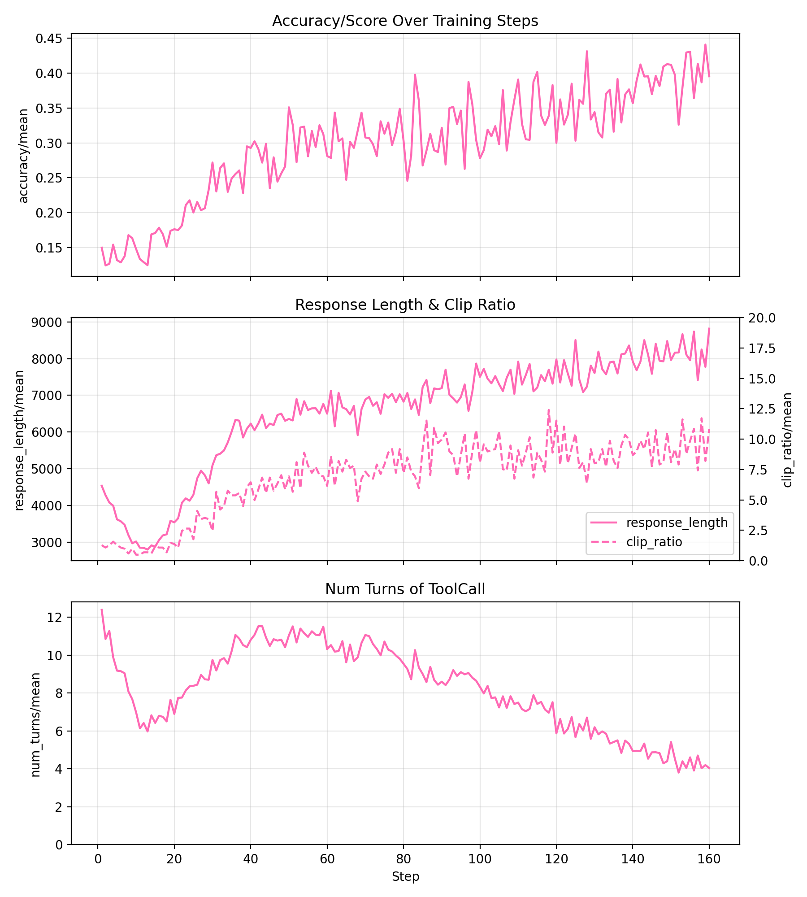

# 基于verl框架和代码沙盒环境工具调用的代码强化学习实践

## 概述

本项目基于 Qwen3-1.7B 模型，采用 [verl](https://github.com/volcengine/verl) 强化学习框架，基于适配昇腾平台的代码沙盒服务 [ScaleBox](https://gitcode.com/icip-cas/ScaleBox)，实现了高效且稳定的 ***长上下文多轮工具调用 Code RL*** 训练。我们的贡献主要有：

1. 开发了一个可扩展的分布式代码执行沙盒 ScaleBox，支持大规模多机部署、主流 RL 框架兼容训练及多种模型与基准的高效统一评估；
2. 提供了融合 verl 与 ScaleBox 的统一部署镜像，支持在单一节点中同时运行 ScaleBox 服务与 verl 训练任务，同时支持零成本迁移至华为云平台 [ModelArts](https://www.huaweicloud.com/product/modelarts.html)；
3. 在昇腾环境中验证了基于 verl 框架与 ScaleBox 沙盒的 Code RL 训练效果。
4. 组织Coding Toolcall的SFT数据以及SFT策略, 并在RL中引入Coding Agent多轮工具调用的训练（首个开源的基于verl支持多轮工具调用的Coding Agent RL Recipe）。

[ScaleBox](https://gitcode.com/icip-cas/ScaleBox) 是一个可扩展的分布式代码执行沙盒，其核心特性包括：

1. 可扩展的分布式代码沙盒体系
    - 支持多机分布式沙盒部署与请求负载均衡
    - 支持单元测试并行与实例级并行

2. 面向 Code RL 的统一训练接口和评估套件
    - 提供高效的批量评估接口 `common_evaluate_batch`，相较于`run_code`，通过单次请求处理多个测试用例，显著提升训练效率
    - 内置对 LiveCodeBench、HumanEval、MBPP 等主流代码评测基准的支持，实现一键式快速评估

3. 灵活的 Special Judge 判题机制
    - 支持自定义判题逻辑，能够灵活适应具有多种正确答案的复杂编程题目


## 硬件要求

Atlas A2/A3 系列产品，单机八卡

## 软件要求

- verl: commit c651b7b4207e408875f132c4226969ef3495d408 (based on v0.7.0.dev)
- vllm==0.11.0
- vllm_ascend==v0.11.0rc1

## 文件说明

```
├── patches
│   └── verl                                              # 修改补丁总目录
│       ├── 0001-verl-feature-improve_rl_usability.patch  # verl支持Code RL的补充性修改
|       └── 0002-enable-tool-agent-loop.patch             # verl支持多轮工具调用的补充性修改
├── figures                                               # 图表目录
│   ├── evaluation_progress.png                           # 训练ckpts的测试折线图
│   └── training_progress.png                             # 训练指标进度折线图   
├── tool_config                                           # 工具调用配置文件目录
│   └── scalebox_tool_config.yaml                         # ScaleBox工具调用配置文件
├── build_dataset.py                                      # 示例训练RL数据集构建脚本
├── filter_sft_data.py                                    # 示例SFT工具调用数据集构建脚本
├── scalebox.py                                           # verl适配ScaleBox的自定义奖励函数文件
├── run_code_rl_demo.sh                                   # 示例RL训练脚本
├── run_toolcall_sft_demo.sh                              # 示例多轮工具调用SFT训练脚本
└── README.md                                             # 说明文档
```

## 环境准备

### 构建 Docker 镜像

1. 构建支持 Code RL 的 verl 镜像, verl.Dockerfile与verl_sandbox.Dockerfile请参见agent_rl/qwen2_code_rl样例中的文件。

```bash
docker build --network=host -f verl.Dockerfile -t verl:main-c651b7b-py311-cann8.3.RC1 .
```

2. 在 verl 镜像基础上，构建支持 ScaleBox 的镜像，实现 ScaleBox 和 verl 的融合部署

首先拉取 ScaleBox 代码，以获得配置环境需要的脚本和数据：

```bash
git clone https://gitcode.com/icip-cas/ScaleBox
```

然后在 ScaleBox 项目下，执行：

```bash
docker build --network=host -f verl_sandbox.Dockerfile -t verl_sandbox:main-c651b7b-py311-cann8.3.RC1 .
```

### 构建适配 ScaleBox 的 verl 框架

1. 拉取 verl 代码并切换到指定版本

```bash
git clone https://github.com/volcengine/verl
cd verl
git checkout c651b7b4207e408875f132c4226969ef3495d408
cd ..
```

2. 应用指定 patch

为了更好地执行 Code RL 训练任务，verl 框架需应用以下 patch。该 patch 主要包含以下修改：

- 在 `prime reward manager` 中，增加对 `code_contests` 数据源的支持；
- 调整 `prime reward manager` 的并发进程数，从 64 降至 32，以避免沙盒资源竞争；
- 延长 `prime reward manager` 的任务超时时间，从 300s 延长至 3000s，以支持更大批量数据下的代码执行；
- 增强训练过程中的日志打印，便于调试。
- 支持Coding多轮工具调用的训练逻辑。

遵循下面的指令应用对应 patch：

```bash
git apply patches/verl/0001-verl-feature-improve_rl_usability.patch
git apply patches/verl/0002-enable-tool-agent-loop.patch
```

### 部署 ScaleBox 服务

1. 启动 verl_sandbox 融合镜像

```bash
docker run -it --privileged --name=start_verl_sandbox --user root --network host \
  --shm-size 500g \
  --device=/dev/davinci0 \
  --device=/dev/davinci1 \
  --device=/dev/davinci2 \
  --device=/dev/davinci3 \
  --device=/dev/davinci4 \
  --device=/dev/davinci5 \
  --device=/dev/davinci6 \
  --device=/dev/davinci7 \
  --device=/dev/davinci_manager \
  --device=/dev/hisi_hdc \
  --device /dev/devmm_svm \
  -v /usr/local/dcmi:/usr/local/dcmi \
  -v /usr/bin/hccn_tool:/usr/bin/hccn_tool \
  -v /usr/local/sbin:/usr/local/sbin \
  -v /usr/local/bin/npu-smi:/usr/local/bin/npu-smi \
  -v /usr/local/Ascend/driver:/usr/local/Ascend/driver \
  -v /usr/local/Ascend/firmware:/usr/local/Ascend/firmware \
  -v /etc/ascend_install.info:/etc/ascend_install.info \
  -v /etc/hccn.conf:/etc/hccn.conf \
  -v /sys/fs/cgroup:/sys/fs/cgroup:ro \
  verl_sandbox:main-c651b7b-py311-cann8.3.RC1 /bin/bash
```

2. 激活 ScaleBox 服务必备环境

```bash
source /home/ma-user/miniconda3/bin/activate sandbox-base
```

3. 部署 ScaleBox 服务

以下提供针对 Code RL 单节点训练的部署命令，更多分布式部署功能见 [ScaleBox](https://gitcode.com/icip-cas/ScaleBox) 仓库

```bash
export HOST=0.0.0.0           # 服务器主机地址
export PORT=8080              # 服务端口
export WORKERS=32             # Uvicorn 服务并行 Worker 数量
export MAX_MEM=50000000      # 单进程最大内存占用

cd ScaleBox
make run-online > deploy_${HOST}:${PORT}.log 2>&1 &
```

执行上述命令后，服务成功部署至`http://localhost:8080`。基于下面的命令可验证服务是否部署成功：

```bash
curl 'http://localhost:8080/run_code' \
  -H 'Content-Type: application/json' \
  --data-raw '{"code": "print(\"Hello, world!\")", "language": "python"}'
```

预期返回：

```
{"status":"Success","message":"","compile_result":null,"run_result":{"status":"Finished","execution_time":0.02984905242919922,"return_code":0,"stdout":"Hello, world!\n","stderr":""}
```

## 数据集准备
### SFT 工具调用数据构建
基于 [Gen-Verse/Open-AgentRL-SFT-3K](https://huggingface.co/datasets/Gen-Verse/Open-AgentRL-SFT-3K)数据，过滤出其中包含多轮python工具调用的Coding推理数据，并将其转换格式以符合后续RL训练。下载及处理脚本为：

```bash
python filter_sft_data.py
```

### RL数据构建
基于 [PrimeIntellect/verifiable-coding-problems](https://huggingface.co/datasets/PrimeIntellect/verifiable-coding-problems) 数据，过滤其中较高质量的 Python 代码数据部分，作为RL训练数据（verifiable-coding-problems-python-only）。具体数据处理脚本为：

```bash
python build_dataset.py
```

## 工具调用微调
1. 准备模型权重。

```bash
hf download Qwen/Qwen3-1.7B --local-dir Qwen/Qwen3-1.7B
```

2. 工具调用的SFT脚本为`run_toolcall_sft_demo.sh`，可依情况对应更改默认模型权重和数据等路径：

```bash
source /home/ma-user/miniconda3/bin/activate base  # 激活训练环境

mkdir -p log/sft_run_log
bash run_toolcall_sft_demo.sh
```

3. 选用sft_step_50的ckpt, 合并训练好的模型权重。

```bash
python3 -m verl.model_merger merge \
    --backend fsdp \
    --local_dir checkpoint/multiturn-toolcall-sft-qwen-3-1b/global_step_50 \
    --target_dir checkpoint/multiturn-toolcall-sft-qwen-3-1b/global_step_50/huggingface
```

## 强化学习训练

强化学习的训练脚本为`run_code_rl_demo.sh`，可依情况对应更改默认模型权重和数据等路径：

```bash
bash run_code_rl_demo.sh
```

## 训练结果: 

下图为训练中各个指标，图一为模型在训练数据(无重复数据)上的得分，图二为推理长度及截断比例，图三为工具调用交互轮次。

可以看到在Token预算不紧张且截断比例较低的时候，模型精度随着工具调轮次用同显著增长，且模型推理长度快速爆炸。在遇到推理长度墙的时候，Reasoning Tokens会逐步侵蚀ToolCall Tokens, 使工具调用轮次趋于某一固定值。

<p align="center">
  
</p>

## 模型评测

本实验基于 [LiveCodeBench](https://github.com/LiveCodeBench/LiveCodeBench) 数据集评测模型的代码生成能力，推理参数遵循 [DeepSeek-R1](https://arxiv.org/abs/2501.12948) 相关实验设置。

### 测评设置

LiveCodeBench 评测数据相关参数：

- release_version: v5
- start_date: 2024-08-01
- code_execution: [ScaleBox](https://gitcode.com/icip-cas/ScaleBox)

推理相关参数：

- n: 4
- temperature: 0.6
- top_p: 0.95
- max_tokens: 32768

| Steps | LiveCodeBench (Pass@1) |
|-------|------------------------|
| 0   | 12.35 |
| 20  | 13.47 |
| 40 | 16.07 |
| 60 | 17.28 |
| 80 | 18.75 |
| 100 | 18.79 |
| 120 | 20.74 |
| 140 | 23.83 |
| 160 | 25.41 |

如下图可视化：
<p align="center">
  
</p>

## 未来工作

加入Toolcall Reward，不影响精度情况下，稳定训练中的Toolcall次数以及模型行为，减少因Token预算的紧张或截断比例过高导致的工具调用轮次的波动。