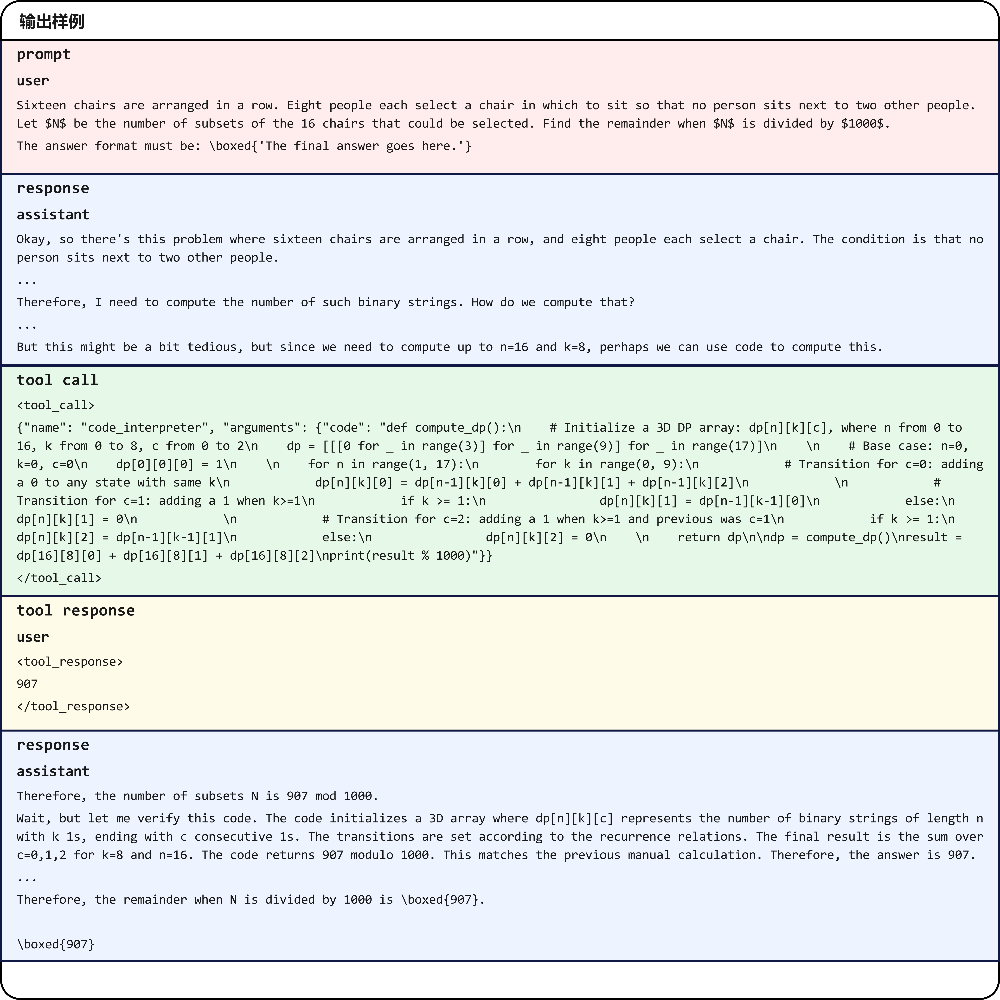
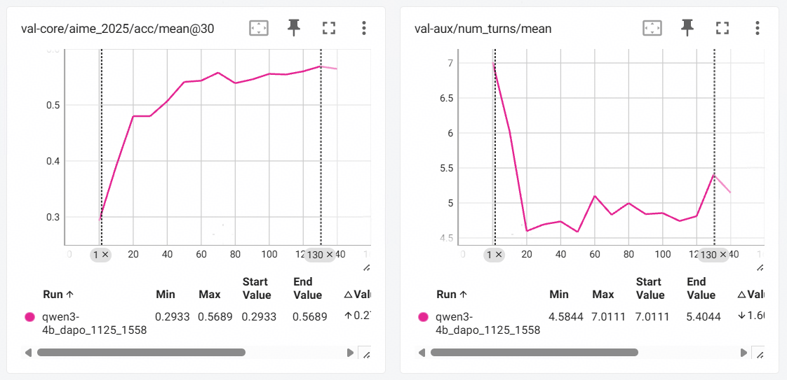
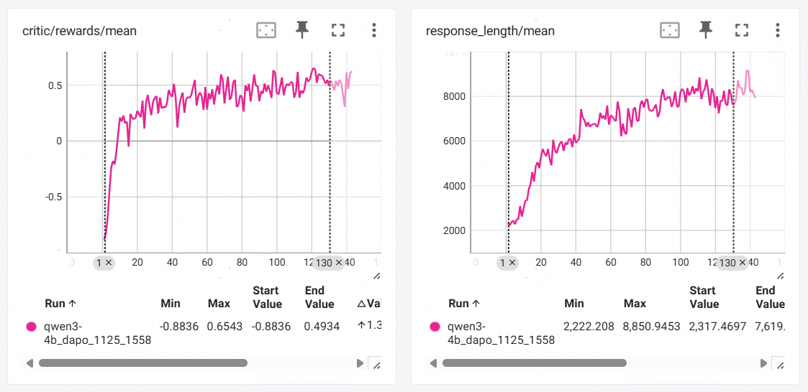
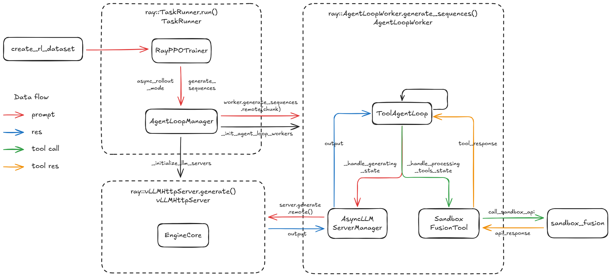
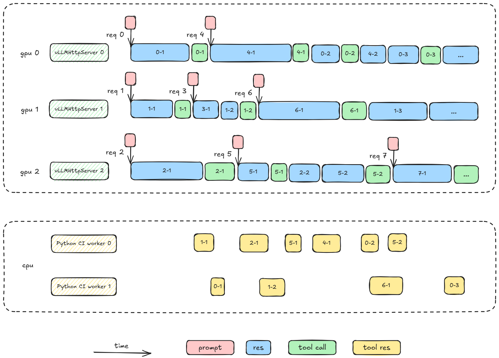

# 基于verl-retool的agent样例

### 概述

本样例参考verl/recipe中的retool项目，在NPU上进行agent RL训练。训练过程分为如下两步：

- SFT训练：使用ReTool-SFT数据集对Qwen3-4B-Instruct-2507模型进行SFT训练，帮助模型学会调用Sandbox工具进行python编程；
- RL训练：使用DAPO-Math-17k数据集对前一步SFT过的模型进行RL训练，帮助模型更好地使用Sandbox工具，辅助自身推理思考。

本样例将帮助大家了解verl中的`asyncLLM`和`agent_loop`特性，使用昇腾NPU完成agent RL训练任务。

### 支持的产品型号

Atlas A2/A3系列产品。

### 文件说明

| 文件路径                                                     | 说明                                     |
| :----------------------------------------------------------- | :--------------------------------------- |
| [0001-Fix-reward-function-not-accessing-num_turns.patch](patches/0001-Fix-reward-function-not-accessing-num_turns.patch) | 修复奖励函数获取不到num_turns值的bug     |
| [0002-Update-paths-in-retool_sft_preprocess.py.patch](patches/0002-Update-paths-in-retool_sft_preprocess.py.patch) | 修改retool_sft_preprocess.py中的路径配置 |
| [0003-Modify-compute_score-to-encourage-tool-call.patch](patches/0003-Modify-compute_score-to-encourage-tool-call.patch) | 修改奖励函数，鼓励工具调用               |

### 环境准备

1. 使用Docker构建环境，请根据实际产品选择Docker镜像和设备数量，文档以A3为例。

    ```shell
    # 获取Docker镜像
    docker pull quay.io/ascend/vllm-ascend:v0.10.2rc1-a3
    
    # 构建Docker容器
    docker run \
    --device=/dev/davinci0 --device=/dev/davinci1 --device=/dev/davinci2 --device=/dev/davinci3 --device=/dev/davinci4 --device=/dev/davinci5 --device=/dev/davinci6 --device=/dev/davinci7 --device=/dev/davinci8 --device=/dev/davinci9 --device=/dev/davinci10 --device=/dev/davinci11 --device=/dev/davinci12 --device=/dev/davinci13 --device=/dev/davinci14 --device=/dev/davinci15 --device=/dev/davinci_manager --device=/dev/devmm_svm --device=/dev/hisi_hdc \
    -v /etc/localtime:/etc/localtime \
    -v /usr/local/dcmi:/usr/local/dcmi \
    -v /usr/local/Ascend/driver:/usr/local/Ascend/driver \
    -v /usr/local/Ascend/firmware:/usr/local/Ascend/firmware \
    -v /var/log/npu/:/usr/slog \
    -v /usr/local/bin/npu-smi:/usr/local/bin/npu-smi \
    -v /sys/fs/cgroup:/sys/fs/cgroup:ro \
    -v /etc/ascend_install.info:/etc/ascend_install.info \
    -v ${HOST_WORKSPACE}:${HOST_WORKSPACE} \
    -w ${HOST_WORKSPACE} \
    --shm-size=100g \
    --privileged=true \
    -itd \
    --net=host \
    --name ${YOUR_CONTAINER_NAME} \
    quay.io/ascend/vllm-ascend:v0.10.2rc1-a3 \
    /bin/bash
    
    # 进入容器
    docker exec -it ${YOUR_CONTAINER_NAME} bash
    ```

    其中：
    - `-v ${HOST_WORKSPACE}:${HOST_WORKSPACE}`为挂载业务目录
    - `-w ${HOST_WORKSPACE}`为设置工作目录，进入后直接操作
    - `--name ${YOUR_CONTAINER_NAME}`为配置容器名
    
2. 安装CANN软件包。

    本样例依赖的CANN软件版本为`CANN：8.2.RC1`，请从[软件包下载地址](https://www.hiascend.com/developer/download/community/result?module=cann&cann=8.2.RC1)下载如下软件包，并参考[CANN安装文档](https://www.hiascend.com/document/detail/zh/CANNCommunityEdition/82RC1/softwareinst/instg/instg_0000.html?Mode=PmIns&InstallType=local&OS=Debian&Software=cannToolKit)进行安装。

    - 开发套件包：`Ascend-cann-toolkit_${version}_linux-${arch}.run`
    - 二进制算子包：`Ascend-cann-kernels-${chip_type}_${version}_linux-${arch}.run`
    - NNAL加速包：`Ascend-cann-nnal_${version}_linux-${arch}.run`

    软件包文件名中`${version}`表示CANN包版本号，`${arch}`表示CPU架构（如aarch64、x86_64）。

3. 下载项目源码并安装依赖的python库。

     ```shell
     git clone https://gitcode.com/cann/cann-recipes-train.git
     cd cann-recipes-train/agent_rl/qwen3_tool_agent
     pip install -r requirements.txt
     ```

4. 安装verl。

    ```shell
    git clone https://github.com/volcengine/verl.git
    cd verl
    git checkout 95470480
    
    # 使能patch修改
    git am ../patches/*.patch
    
    pip install -e .
    cd recipe/retool
    ```

### SFT训练

1. 准备数据集。

    执行sft数据集处理脚本。

    ```shell
    python3 retool_sft_preprocess.py
    ```
    
2. 准备模型权重。

    ```shell
    hf download Qwen/Qwen3-4B-Instruct-2507 --local-dir ReTool-SFT/model/Qwen3-4B-Instruct-2507
    ```

3. 将SFT训练脚本`run_qwen3_4b_sft_npu.sh`从`qwen3_tool_agent`移动到`qwen3_tool_agent/verl/recipe/retool`目录下，开始SFT训练。

    ```shell
    mkdir -p log/sft_run_log
    bash run_qwen3_4b_sft_npu.sh
    ```

4. 合并训练好的模型权重。

    ```shell
    python3 -m verl.model_merger merge \
        --backend fsdp \
        --local_dir checkpoint/multiturn-sft-qwen-3-4b-instruct/global_step_186 \
        --target_dir checkpoint/multiturn-sft-qwen-3-4b-instruct/global_step_186/huggingface
    ```

### RL训练

1. 准备Sandbox环境。

    参考[SandboxFusion/README.md](https://github.com/bytedance/SandboxFusion/blob/main/README.md)准备并启动Sandbox服务，启动成功后会显示如下信息：

    ```shell
    INFO:     Application startup complete.
    INFO:     Uvicorn running on http://0.0.0.0:8080 (Press CTRL+C to quit)
    ```

2. 准备训练数据集和验证数据集。

    ```shell
    # train
    hf download BytedTsinghua-SIA/DAPO-Math-17k --repo-type=dataset --local-dir dataset/BytedTsinghua-SIA/DAPO-Math-17k
    # val
    hf download yentinglin/aime_2025 --repo-type=dataset --local-dir dataset/yentinglin/aime_2025
    ```
    
3. 将RL训练脚本`run_qwen3_4b_dapo_npu.sh`从`qwen3_tool_agent`移动到`qwen3_tool_agent/verl/recipe/retool`目录下，开始RL训练。

    ```shell
    mkdir -p log/rl_run_log
    bash run_qwen3_4b_dapo_npu.sh
    ```

4. 训练结果。

    `val_before_train`（step 0），aime_2025数据集验证指标如下：

    - val-core/aime_2025/acc/mean@30: 0.29
    - val-aux/num_turns/mean: 7.0

    130个step训练后，aime_2025数据集验证指标如下：

    - val-core/aime_2025/acc/mean@30: 0.57
    - val-aux/num_turns/mean: 5.4
    
4. 训练后模型response样例：

    

    从样例中可以看出，训练后的模型在解决问题的时候先使用大段的文本推理（图片中有所省略）对用户输入的问题进行分析，然后调用代码工具处理复杂的动态规划计算，代码工具计算出结果后作为新的输入传输给模型，模型对代码返回的结果校验后输出最终的答案。可以总结为如下流程：
    
    **问题输入$\longrightarrow$模型思考$\longrightarrow$调用代码工具$\longrightarrow$返回结果作为新一轮的输入$\longrightarrow$模型思考$\longrightarrow$生成答案**
    
4. 关键训练曲线

    **val-core/aime_2025/acc/mean@30**：验证集的准确率。

    **val-aux/num_turns/mean**：验证时num_turns的值，每一次user或者assistant的输入都算一次num_turn。
    
    
    
    **critic/rewards/mean**：训练时单step的平均奖励。
    
    **response_length/mean**：训练时单step模型的平均响应长度。
    
    

### 附录

#### ToolAgent代码结构

`ToolAgentLoop`是agent RL训练中的核心类，是实现multi-turn交互中Agent reasoning$\longrightarrow$tool call循环的关键。

其中的关键状态处理包括`_handle_generating_state()`和`_handle_processing_tools_state()`，`_handle_generating_state()`负责调用大模型生成响应和检查是否需要调用工具，`_handle_processing_tools_state()`负责执行工具调用和将工具返回结果格式化并作为下一轮的输入。

`AsyncLLMServerManager`作为一个管理多个vLLMHttpServer的类，具有以下两个功能：

- 负载均衡：在首轮请求时选择请求最少的Server实例发送；
- 粘性会话：将多轮会话的补全请求发送到同一个Server实例，从而复用之前对话的缓存，提高硬件利用率。



#### ToolAgent异步流水

在ToolAgent异步流水中，每一个prompt的request都会遵循`AsyncLLMServerManager`的规则，在此基础上实现vLLM推理和Python CI工具调用的异步并行。

本样例rollout过程中，模型推理与外部工具执行的并行情况如下图所示。



