# 基于veRL前端&A3集群的DeepSeekR1模型RL训练优化实践

## 前言

### 背景

DeepSeek-R1发布后，大模型的RL训练得到了广泛的关注，各大厂商以及开源社区都进行了大量的RL训练实践，致力于构建更高效的RL训练系统。本文基于开源veRL框架，搭配MindSpeed与vllm-ascend框架，经过深度优化与适配，在Atlas A3集群上实现了高吞吐性能。

本文中涉及的开源框架如下表所示。

| **框架名称**  | **介绍**  |
| ----- | ---- |
| [veRL](https://github.com/volcengine/verl) | 开源​​LLM强化学习框架​​，结合单控制器（控制流）与多控制器（计算流）优势，简化了RL算法（如PPO、GRPO）实现。<br>其训练支持FSDP、FSDP2与Megatron-LM，推理支持vLLM、SGLang与HFTransformers。     |
| [vLLM](https://github.com/vllm-project/vllm) | 为大语言模型提供高吞吐量和内存高效推理服务的开源引擎，使用PagedAttention技术高效实现KVcache的内存管理，并支持众推理特性。      |
| [vLLM-Ascend](https://github.com/vllm-project/vllm-ascend) | vLLM的​​昇腾NPU适配插件，支持NPU上的诸多优化。本实践过程中的一些优化贡献到了该开源仓。  |
| [Megatron-LM](https://github.com/NVIDIA/Megatron-LM) | ​超大规模语言模型训练框架，支持多种分布式并行策略​​。                            |
| [MindSpeed](https://gitee.com/ascend/MindSpeed) <br> [MindSpeed-LLM](https://gitee.com/ascend/MindSpeed-LLM) |  MindSpeed：针对NPU的大模型训练加速库，提供Megatron-LM框架对NPU的基本功能适配以及一些亲和NPU的优化特性。<br> MindSpeed-LLM：基于昇腾生态的大语言模型分布式训练框架，支持分布式预训练、分布式指令微调，并提供了对应的开发工具链。依赖Megatron-LM与MindSpeed。|
| [MindSpeed-RL](https://gitee.com/ascend/MindSpeed-RL) | 基于昇腾生态的强化学习加速框架，本优化实践对其进行了一些借鉴参考。 |

 

### 技术路径选择

#### 为何选择全共卡部署？

Deepseek R1的每一步训练可大致分为三个计算密集的阶段：推理生成完整问答数据（rollout/generate）-> 参考模型计算参考概率分布（ref）-> 训练模型计算loss并反向更新（update）；对于Deepseek R1这个具有671B参数的大模型而言，以上三个阶段都需要大量的计算资源。因此，rollout/ref/update三个模型共卡部署、分时复用计算资源是一种简单高效的部署策略。

此外，rollout部分我们并未采用推理常用的PD分离部署策略（即Prefill阶段与Decode阶段分别实例化部署在不同的机器资源），因为整个RL训练中推理Prefill部分耗时占比很小，优化收益不高。

#### 为何选择完整适配MindSpeed？

Deepseek R1模型训练用到的Megatron训练引擎存在两种使用方式：轻量化按需调用和完整的Megatron使用。

- 轻量化按需调用：veRL对Megatron训练引擎的使用是轻量化的，仅调用必要的Megatron接口，例如：分布式初始化、模型和优化器构造、训练前反向相关接口。

- 完整的Megatron使用：需要命令行传入Megatron配置参数并解析，得到全局可感知的Megatron参数。

虽然轻量化使用Megatron对其他库的依赖较小，适配工作量也相对较低，但实践中发现MindSpeed、MindSpeed-LLM需要基于完整Megatron框架运行。为了在NPU上实现较优的训练性能，目前仍需要依赖MindSpeed与MindSpeed-LLM库。

**这带来了一个训练引擎NPU适配路径选择的问题：继续沿用轻量化调用Megatron的方案，还是选择完整适配Megatron与MindSpeed？** 这需要实测得到问题答案。

首先尝试轻量级适配Megatron，仅把Megatron中不兼容NPU的算子和模块做一些替换，让veRL的训练能够跑通，但总体的训练性能很差。于是下一步进行veRL+Megatron+MindSpeed的全面适配，确保后续可直接复用MindSpeed的大量NPU训练优化特性。

下面针对Dense模型进行小规模的实验，对比两种适配方案的训练性能。实验配置为Atlas A2训练系列产品8卡环境，采用Qwen7B模型，prompt和response的平均长度相近（分别为103与260），推理采用TP2DP4模式，训练采用TP2PP4模式。实验数据如下图所示：


从训练侧性能来看，使用MindSpeed后总耗时从202.4s降低到49.6s，性能提升75.7%。在如此明显的性能收益下，本实践决定最终选择进行veRL对MindSpeed的适配，从而提升整体的训练吞吐量。

#### 为何选择vLLM Ascend？

vLLM Ascend通过​**​**硬件插件化机制​​解耦了框架与硬件依赖，用户无需修改核心代码即可在昇腾NPU上部署模型，代码完全开源，且持续进行新特性适配。目前vLLM Ascend已经支持vLLM的V1模式，并针对DeepSeekR1的TorchAir图模式进行了优化，这对于rollout部分的优化很有必要。 

### veRL适配和优化实践总览
--------------------------

我们对veRL开源代码进行了NPU适配，并进行了一些关键性能优化。

核心适配主要包括：

- 训练引擎：完整适配了Megatron-LM、MindSpeed与MindSpeed-LLM，以获得较好的NPU训练性能。

- 模型支持：本实践使用的veRL版本尚未完全支持DeepSeek R1模型训练，需要开发适配。

- 推理引擎：vLLM Ascend暂未支持多机场景的sleep特性，需要手动实现offload与onload、init\_cache与free\_cache。

本实践在如下四个方面对veRL进行了性能优化：

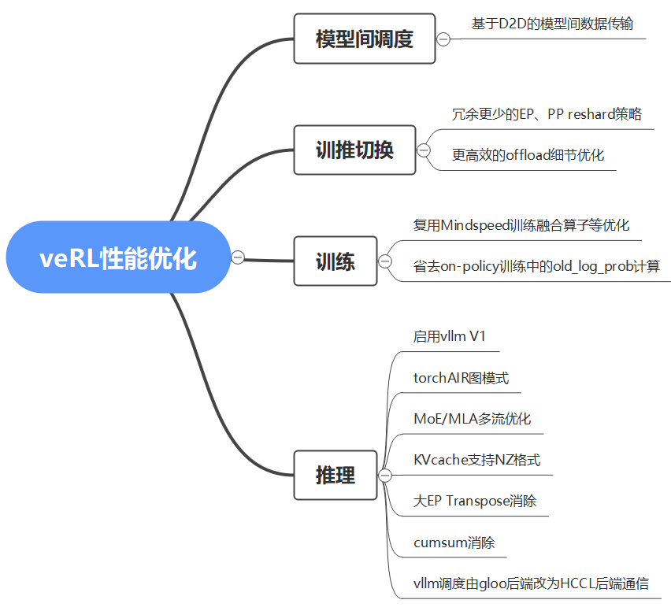

为了方便用户直观了解改动内容，仓库中的代码通过patch方式提交，所以存在较多冗余代码。

### 详细性能结果

基于Atlas A3 128卡环境，随机初始化权重，Prefill/Decode阶段长度分别为1K与3K（强制推理到3K序列长度，强制专家负载均衡），系统吞吐达到250.2tps/卡。

<table border=1px">
<tr>
<th><strong>模型</strong></th>
<th><strong>部署方式</strong></th>
<th><strong>部署环境</strong></th>
<th><strong>RL框架</strong></th>
<th><strong>推理引擎</strong></th>
<th><strong>训练引擎</strong></th>
<th><strong>数据集</strong></th>
<th><strong>step</strong></th>
<th><strong>平均输入长度</strong></th>
<th><strong>平均输出长度</strong></th>
<th><strong>batchsize</strong></th>
<th><strong>采样数</strong></th>
<th><strong>rollout部署</strong></th>
<th><strong>actor部署</strong></th>
<th><strong>ref部署</strong></th>
</tr>
<td>DeepSeek-R1 671B</td>
<td>全共卡</td>
<td>128 * A3</td>
<td>veRL</td>
<td><p>vLLM</p>
<p>+vLLM-Ascend</p></td>
<td><p>Megatron</p>
<p>+MindSpeed</p></td>
<td>gsm8k</td>
<td>5</td>
<td>75</td>
<td>3039.8</td>
<td>512</td>
<td>16</td>
<td><p>256die</p>
<p>DP128TP2EP256</p></td>
<td><p>256die</p>
<p>TP4EP8PP8</p></td>
<td><p>256die</p>
<p>TP4EP8PP8</p></td>
</tr>
</table>


<table border="1">
<tr>
<th colspan="4"><strong>数据生成(s)</strong></th>
<th><strong>训练(s)</strong></th>
<th colspan="2"><strong>训推切换(s)</strong></th>
<th><strong>总耗时(s)</strong></th>
<th><strong>推理吞吐<br />
(tokens/s/卡)</strong></th>
<th><p><strong>训练吞吐</strong></p>
<p><strong>(tokens/s/卡)</strong></p></th>
<th><p><strong>系统吞吐</strong></p>
<p><strong>(tokens/s/卡)</strong></p></th>
</tr>
<tr>
<td colspan="4">436.86</td>
<td>323.97</td>
<td colspan="2">35.63</td>
<td rowspan="3">796.8</td>
<td rowspan="3">686.8</td>
<td rowspan="3">607.2</td>
<td rowspan="3">250.2</td>
</tr>
<tr>
<td>rollout (s)</td>
<td>ref prefill (s)</td>
<td>reward (s)</td>
<td>adv (s)</td>
<td> update(s)</td>
<td>reshard(s)</td>
<td>offload等(s)</td>
</tr>
<tr>
<td>318.27</td>
<td>104.7</td>
<td>13.7</td>
<td>0.188</td>
<td>328.8</td>
<td>11.18</td>
<td>24.45</td>
</tr>
</table>


## 框架与模型适配

### veRL+MindSpeed适配

如前文所述，veRL完整适配Megatron+MindSpeed需要命令行传入Megatron和MindSpeed所需的参数并解析。这个过程主要分为两步：veRL配置参数转换为Megatron配置参数、Megatron解析配置参数并初始化。这两步对应的代码如下所示，该代码已通过patch嵌入到了worker的初始化当中：

```
#  verl_patches/workers/megatron_workers.py : actor_rollout_ref_worker_init
megatron_config = translate_verl_train_configs_to_megatron(config)
initialize_megatron(config=megatron_config)

```

#### veRL参数转换为Megatron参数

首先通过translate\_verl\_train\_configs\_to\_megatron函数将veRL的训练参数、模型参数等通过字典映射为Megatron对应的参数名，之后再利用参数字典构造一个MegatronConfig实例用于后续Megatron+MindSpeed初始化（MegatronConfig类相关代码来自MindSpeed-RL）。具体打开来看，转换得到Megatron配置参数的核心代码示例如下：

```
#  字典的key是megatron或MindSpeed参数名，value来自veRL参数、模型参数或用户配置

#  重计算参数转换，value为veRL参数
if config.actor_rollout_ref.model.enable_gradient_checkpointing:
    config_dict['recompute_granularity'] = config.actor_rollout_ref.model.gradient_checkpointing_kwargs.activations_checkpoint_granularity
    config_dict['recompute_method'] = config.actor_rollout_ref.model.gradient_checkpointing_kwargs.activations_checkpoint_method
    config_dict['recompute_num_layers'] = config.actor_rollout_ref.model.gradient_checkpointing_kwargs.activations_checkpoint_num_layers

#  模型参数转换，value来自模型的config.json
config_dict['num_layers'] = model_configs['num_hidden_layers']
config_dict['hidden_size'] = model_configs['hidden_size']

#  MindSpeed训练优化特性，value暂时硬编码，后续可在veRL yaml文件中配置对应的新参数项，允许用户从启动脚本传入配置
config_dict['use_fused_swiglu'] = True
config_dict['use_fused_rotary_pos_emb'] = True

```


#### Megatron解析配置参数并初始化

获得训练配置后，调用initialize\_megatron函数即可完成训练引擎的初始化，该函数主体来自MindSpeed-RL，整体流程主要包括两步：

- Megatron参数解析：首先将MegatronConfig转为命令行参数，然后引用MindSpeed-LLM完成对Megatron的patch，接着通过parse\_args函数将命令行参数传递给Megatron。

  为了保证功能的正确性，此处调整MindSpeed中torch.compile和num\_layer\_list解析相关逻辑；为了提升训练性能，参考MindSpeed-RL调整Megatron的\_communicate\_shape函数。

- 通信域初始化：调用\_initialize\_distributed函数完成了Megatron通信域的初始化。

  需要注意veRL与MindSpeed-RL的资源初始化方式不同，veRL中一个worker本身只有一张卡，因此其set\_device操作需要将rank全部设置为0。

本实践使用的veRL的commit版本中Actor、Rollout与Ref共进程，但分属两个worker实例。若按照前述Megatron适配逻辑，一个进程两次做Megatron初始化会产生报错。考虑到Megatron引擎只有一份且Actor与Ref是完全一样的模型，Actor与Ref模型使用相同的并行策略会更加简便，因此我们将代码调整为Actor、Rollout、Ref三者共worker实例的形式，Actor与Ref模型共享Megatron训练配置。

### veRL+vLLM-Ascend适配

鉴于当前vLLM社区已成功开发并优化了vLLM-Ascend仓，实现了在NPU上对Deepseek R1模型结构的良好适配，并取得较优异的性能，因此本实践中veRL的推理侧选择使用vLLM框架。为了使veRL能够与vLLM-Ascend兼容，本实践进行了部分接口参数的修改，修改主要集中于"verl\_patches/workers/vllm\_rollout/vllm\_rollout\_spmd.py"文件。

| **主要操作**   | **详细描述**  |
| ----- | ---- |
| 手动使能vLLM-Ascend的patch | patch包含vLLM-Ascend对于vLLM的一些类、函数、以及部分变量类型的调整，当前版本需要在import vllm前手动引入patch。   |
| 初始化DP通信域   | 配置VLLM_DP_MASTER_PORT保证每个DP group都有独立的通信端口用于组内进程同步，同时通过VLLM_DP_MASTER_IP指定 DP 组主节点 IP，适应动态集群环境。   |
| 关闭sleep模式   | 当前NPU上的sleep模式在多机上存在失效问题，无法释放显存；不显式关闭会导致weight与kv_cache被vLLM自定义的内存池管理，后续无法通过torch_npu手动卸载。  |
| 配置max_num_batched_token       |   在加载真实权重后，max_num_batched_token的默认值8192会导致在专家分配不均时出现部分卡OOM，因此需要配置max_num_batched_token=1024，配置enable_chunked_prefill=True。      |

使能vLLM-Ascend优化特性需要在vLLM初始化时传入以下additional\_config参数：

```
additional_config={
    "torchair_graph_config": {
        "enabled": VLLM_ENABLE_GRAPH_MODE,    #  使能图模式
        "use_cached_graph": False,
        "graph_batch_sizes_init": False,
        "graph_batch_sizes": [max_num_seqs],  #  配置图模式中每个DP rank的batch size
        "enable_multistream_mla": True,       #  图模式中，使能MLA多流，将MLA的vector操作放到另一个流中。
        "enable_multistream_moe": True,       #  图模式中，使能MoE多流，将共享专家计算放到另一个流中
        "enable_view_optimize": False,        #  图模式中，消除部分transpose操作
        "enable_kv_nz": True,                 #  图模式中，使能kvcache 的 NZ 排布
    },
    "ascend_scheduler_config": {
        "enabled": True,                      #  使用vllm ascend的scheduler
    },
    "refresh": True
},

```

- 启用vLLM-Ascend的优化特性，包含使能图模式，使能MLA多流、MoE多流，使能kv\_cache的NZ格式。

- 显式配置enable\_expert\_parallel=True，使能vLLM 的EP并行。

这些优化项的实现原理可以参考[性能优化：推理](#性能优化：推理)章节。

### veRL支持Deepseek R1

训练侧模型需要适配主要因为如下两点：

- 本实践使用的veRL的commit版本当时尚未适配Deepseek R1训练模型。

- 本实践使用的MindSpeed版本需要配套使用版本较低的Megatron 0.8版本，而veRL需要使用0.11/0.12版本，部分Megatron配置尚未被MindSpeed支持，因此需要额外适配调整。

训练侧模型的详细适配操作如下表所示：

| **适配操作**   | **详细内容**   |
| ----- | ---- |
| 模型配置参数适配 | MindSpeed版本匹配的Megatron版本较低，需要适配MLATransformerConfig类，配置Deepseek R1模型的特有参数，包含MLA参数、MoE参数等。   |
| 模型前向推理输入适配   | veRL对attention_mask中的掩码与torch_npu的接口要求不一致，所以增加了convert_mask_for_npu_fa转换函数，对输入的mask做变换。   |
| 模型初始化的参数适配   | 适配get_gpt_decoder_block_spec函数。<br>Deepseek R1的rope_scaling配置通过MindSpeed传递。<br>使用MindSpeed-LLM的deepseek_spec实现。  |
| McoreToHF权重转换适配   | 对于DeepSeek R1模型，新增了McoreToHFWeightConverterDeepseekV3类，实现了对MLA、MoE等参数名从megatron格式到HuggingFace格式的映射。    |

以上适配操作在"verl\_patches/verl\_adaptor.py"文件中通过对registry中各字典更新来使能，具体的patches代码介绍详见本文[附录](#附录)部分。


## 性能优化：模型间调度

### 训练任务下发慢问题
----------------------

#### 训练侧通信异常现象

调测中发现veRL训练侧（compute\_ref\_log\_prob、update\_actor）性能不及预期，这两个阶段profiling显示一些卡第一个通信耗时极长：compute\_ref\_log\_prob计算第一个通信大概50s+，update\_actor第一个通信耗时大概90s+。

如下图所示，256Die训练中ref profiling 0号卡的第一个通信耗时异常。

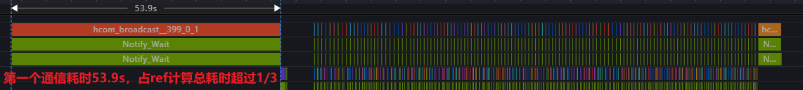 

#### 训练侧任务启动时差过大现象

对每张卡的generate\_sequences、compute\_ref\_log\_prob、update\_actor前后都进行详细时间打点，观察到generate\_sequences和compute\_ref\_log\_prob
在每张卡上的结束时间是一致的，但compute\_ref\_log\_prob和update\_actor在每张卡上的启动时间不一致。

具体现象是，0卡总是启动最早，最后一张卡启动最晚，每张卡串行启动，并且训练侧最大启动时间差非常接近profiling中第一个超长通信的耗时。如下图所示，256Die训练中，0卡与255卡的update启动时差可以达到96秒。

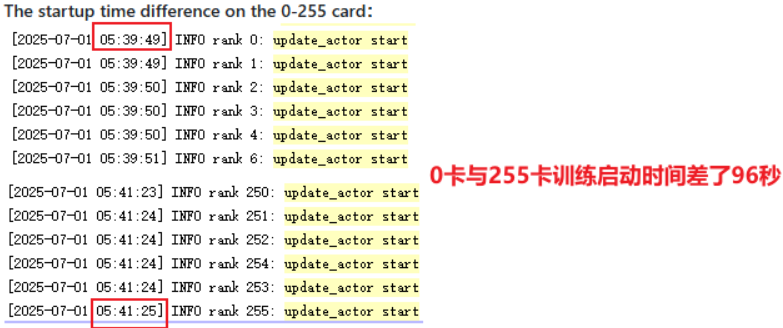

#### veRL控制器逻辑分析

这里已经可以断定veRL训练侧性能差是因为任务下发存在显著时间差，可能与veRL控制器逻辑有关。根据"verl/single\_controller/ray/base.py"中的func\_generator函数所示，veRL在CPU侧主进程中调用一个任务接口后，实际执行如下所示的3个步骤：

- dispatch\_fn：主进程将持有的任务输入数据在batch维度按照任务DP size划分为多份。

- execute\_fn：主进程给每个worker进程下发任务。

- collect\_fn：主进程收集每个worker的输出结果，并在batch维度拼接成一份完整结果。

dispatch\_fn和collect\_fn分别做了输入tensor的split和输出tensor的concat操作，实际观察耗时很短。再分析execute\_fn，对应erl/single\_controller/ray/base.py中的execute\_all\_async函数，如下图所示。这里代码逻辑符合前面观察到的每个worker串行启动任务的现象，在第586行之前加时间打点可证实是串行任务下发导致不同worker任务启动存在时间差，进而导致训练侧表现出的性能差问题。


 

#### 性能问题分析结论

**ray给一个worker下发任务都包括至少三步：输入数据序列化、数据传输、输出数据序列化。因此，当任务的输入tensor数据量很大时，大量worker的任务下发耗时会不断累积，从而造成训练性能瓶颈**。

此外，相较于训练侧任务，generate\_sequences任务下发耗时在一秒内，也能从侧面证明任务下发耗时与数据量有关。如下图所示，gen输入数据量远小于训练侧输入数据量，原因是多方面的：

- gen在dispatch\_fn划分数据时使用的DP等于总卡数（例如256），远大于训练侧的DP大小（例如8）。

- GRPO训练中，gen的输入batch\_size没有经过n\_sample倍数放大。

- gen的输入仅为prompt，而训练侧部分输入的序列长度等于prompt+response。


#### veRL控制器逻辑总结

经过以上分析，对于单个worker而言，veRL控制器任务间调度逻辑可用如下流程图描述：


如下时序图可以更清楚看到veRL框架任务下发产生的性能瓶颈。


### 性能优化：D2D数据传输

#### 优化思路

根据前文分析，本实践的目标是提升veRL训练侧任务下发性能，使得大规模训练中所有worker尽可能同时开始执行任务，消减worker间互相等待造成的资源浪费，提升训练侧吞吐。

此外，本实践尝试将veRL中ray下发任务改为多线程并行，但实测并不能满足需要：

- ref计算任务下发只能从66秒减少至24秒，难以实现任务下发耗时全部消除的效果。

- 多线程并行下发任务会导致某些worker存在tensor数据序列化出错，难以解决。

通过梳理优化方案的设计方向，本实践决定主要朝以下两个目标发力。

- **目标1：减少数据在任务间传递的耗时**。

根据此前分析，veRL在NPU上大规模训练时性能较差，主要是串行任务下发过程中包含每个worker输入数据的序列化、ray传输、反序列化。但其实大多训练侧任务的输入数据由前序任务产生在device侧，将数据发送至host侧，由主进程调整后再发送回device侧，此流程从性能角度来看并不合理。

可以考虑利用AlltoAllV集合通信直接实现D2D数据直传来加速veRL任务间的数据流，即原本的主进程collect+dispatch处理数据的逻辑使用AlltoAllV在device间通信过程中直接实现。此外，由于我们veRL训练中actor模型与ref模型并行策略一致，DP
rank排布完全一致，所以ref使用过的输入输出数据与update所需输入数据完全一致，甚至可以省掉集合通信操作。

- **目标2：任务控制维持veRL单控制器的逻辑**。

veRL上层用Ray做调度，在worker间传递数据，实现RL算法的控制流，也就是所谓的单控制器。veRL单控制器的优势是架构清晰，简化不同的RL算法在框架下的实现：只需要写好worker的方法，然后在主进程训练流程中择机调用即可。

而数据在多个worker之间直接通信传递属于多控制器逻辑，会将RL训练中任务间控制逻辑的实现复杂化，与veRL框架原本的设计理念不符。

可以考虑将veRL的控制流与数据流解耦开来，数据流尽可能使用D2D直传加速，控制流逻辑维持不变：采用cache的方式，将后续任务同样会使用的数据在device侧原地缓存，后续任务执行时按需从缓存中拉取；其他必须返回至CPU侧的数据、必须从CPU侧获取的数据维持原本与控制流耦合的逻辑。

#### 总体流程

我们使用TensorCache在device管理前后任务间共用的tensor，从而加速传输速度，减少任务下发耗时。对于单个worker而言，新方案中任务间的流程大致如下：

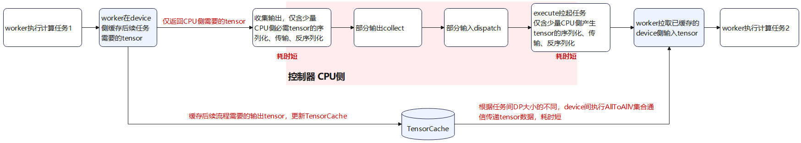

以下时序图展示了方案的收益来源：主要为数据流加速后，任务下发至worker的耗时大大减少，worker间任务启动时差大大降低。


此外，为了尽可能减少数据在host侧主进程和device侧worker进程间传输的开销，需要细致优化RL训练中的数据流。考察主要的三个任务generate\_sequences、compute\_ref\_log\_prob与update\_actor，veRL原本的数据流如下，所有输入输出tensor都经过主进程：

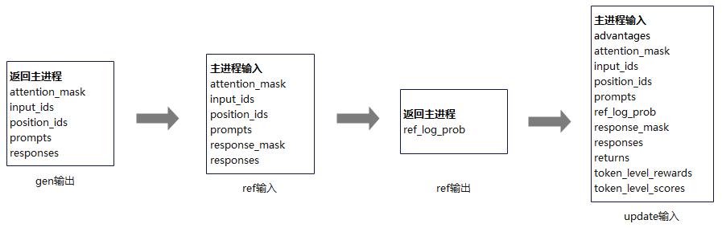

为了最大化加速数据流，需要主进程的训练主流程代码配合修改，确保只在host和device间传输必要的tensor（例如host侧计算的输出作为device侧计算的输入，或者device计算的输出作为host侧计算的输入），最终实现如下的数据流：


#### TensorCache设计细节

TensorCache类设计如下，每个worker实例将持有一个TensorCache，即每个device上有一个TensorCache管理tensor数据。


| **属性或方法**   | **作用说明**  |
| ----- | ---- |
| mini_bs | GRPO中单步训练的batchsize大小，结合cache中tensor的batch轴大小计算其src DP size。   |
| tensor_cached   | cache中缓存的tensor字典，key是tensor的name。   |
| cached_tensors()  | 给定DataProto数据，缓存其中的tensor。可以指定某些tensor不缓存，也可以指定某些tensor在缓存的同时不删除（后续会传递至CPU侧使用）。  |
| get_cached_tensors() | 从cache中获取给定name的tensor，返回一个DataProto实例。 |
| clear() | 清空cache，一般在update_actor结束后调用。 |


get\_cached\_tensors()中可能涉及AlltoAllV通信，具体有两种情况：

- 当前任务与前序任务的DP rank排布一致

  当update任务使用ref计算任务更新过的缓存时会出现这种情况。此时每张卡在两个任务中所用同name的数据完全一致，所以直接使用cache中数据即可，无需通信。

- 当前任务与前序任务的DP rank排布不一致

  当ref计算任务使用generate任务更新过的缓存时会出现这种情况。此时需要对缓存中tensor在batch维度做reshard，相当于使用AlltoAllV通信完成veRL原本主进程做的dispatch+collect逻辑。以8卡为例，AlltoAllV要实现的通信效果如下。

  

 

#### 性能收益 

优化完成后，在Atlas A3 128卡环境上进行验证，采用随机初始化权重，prompt长度为0.075K，response长度为3K，优化前后训练侧启动耗时对比如下。可以看出，训练侧的任务下发耗时基本被消除。
|  |  优化前启动最大时差  | 优化后启动最大时差    | 收益    |
| ----- | ---- |---- | ---- |
| compute_ref_log_prob |  ~57s   | <1s   | ~98.2%   |
| update_actor  | ~73s   | ~5s    | ~93.2%  |

在另一组相同规模的实验中，保持其他变量不变，对比第3步训练打屏性能数据，验证端到端收益情况如下，结果达到了预期目标。

|  |  优化前 | 优化后启动最大时差    | 收益    |
| ----- | ---- |---- | ---- |
| timing_s/ref（s） |  156.804  | 105.061 | ~33.0% |
| timing_s/update_actor（s） | 400.891 | 334.152 | ~16.6% |
| perf/throughput（tps） | 208.5 | 238.46 | ~14.4% |

**但目前该方案还存在一些使用限制**：

- 当前不支持balance\_batch、pack序列使能。支持balance\_batch需要TensorCache配合CPU侧调整缓存中样本的顺序和内容，可能较为复杂。

- 当前只考虑ActorRolloutRef共worker实例的场景，其他场景下通信的模式可能需要调整。

- 当前只支持GRPO on-policy，off-policy可能需要batch\_size方面的细节调整。

 

## 性能优化：训推切换

大模型RL训练中涉及训练和推理两种状态，当模型完成了一次训练更新，接下来的推理就需要使用更新后的模型参数。由于训练和推理通常采用不同的并行策略，因此模型参数传递给推理侧过程中需要进行数据的重新划分调整，即reshard。另一方面，由于本实践选择了ActorRolloutRef三个模型全共卡部署的策略，训推切换间还需要将前一模型offload至host侧，再加载后续使用的模型至device侧。因此本实践对reshard和offload两方面都做了优化。

### reshard优化

#### 基于 AlltoAllV 的专家参数定向路由方案

DeepSeek R1作为典型的MoE架构模型，其专家层（Expert Layer）参数规模占比超70%，且采用动态路由机制，使得专家参数（EP）的分片迁移成为训练转推理阶段的关键瓶颈之一。针对DeepSeek R1 模型的专家参数迁移需求，方案以通信拓扑映射为核心，基于AlltoAllV 操作设计定向张量路由机制，实现训练参数向推理架构的零冗余迁移。

**原方案**

通过识别含".mlp.experts.linear\_fc"关键字的参数名，触发EP路由专家参数迁移逻辑。首先在ep\_group范围执行专家参数的all\_gather获取全部路由专家参数（256专家），再使用推理侧的load\_weight加载单卡所需的专家参数（1专家）。下图以总计8个路由专家为例展示了这一过程，当前假定本轮迭代到的参数已通过Broadcast分发到各PP rank上，同一个pp group内参数相同。

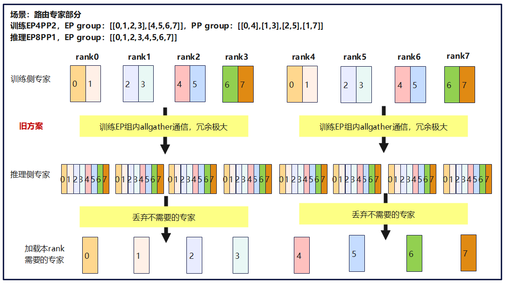

通过全量聚合实现参数迁移虽然代码实现简单，但在大规模异构环境中存在显著局限性：

- 通信冗余

  ep\_group的all\_gather操作保持全量广播特性。以上图训练 EP4→推理EP8为例，原始逻辑仍会将本地分片发送至ep\_group内所有成员（如 EP4 时会向4 个rank 全量传输），而非仅传输至目标推理rank。具体来看，训练rank 0仅需向推理rank 0 和 rank 1 发送分片时，全量广播会额外向rank 2 和rank 3传输无效数据，导致 50% 的带宽浪费，且冗余比例会随 ep\_size的增大而进一步攀升。

- 内存峰值放大

  ep\_group的all\_gather操作会将所有专家的当前Tensor都聚合到各个rank上。671B模型训练中，全聚合256个7168×4096的路由专家W1权重，单卡增量内存会达到0.54G\*256=14G，极大增大了OOM的风险。

**优化方案**

针对上述分析中的路由专家冗余迁移的问题，我们基于AlltoAllV通信设计了定向路由机制，实现训练参数向推理架构的零冗余迁移。方案如下图所示：

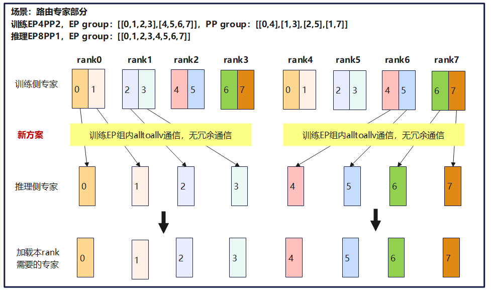

基于训练侧全局 rank 的专家归属，生成稀疏发送路由（以示例中8个发送缓冲区为例，上图0-7分别表示8个专家参数）：
- rank0（训练Group0）：持有专家 0、1，需分别定向发送至推理rank0和rank1，故发送表为[0, 1, ∅, ∅]（前两个位置为有效专家，后两个位置为空）。

- rank4（训练Group1）：无待发送专家（其分片已由同组其他rank传输），发送表为[∅, ∅, ∅, ∅]。
- rank6（训练Group1）：持有专家4、5，需分别定向发送至推理rank4和rank5，故发送表为[4, 5, ∅, ∅]（前两个位置为有效专家，后两个位置为空）。

推理侧接收路由表构建：

- rank0：仅需接收训练同组 rank0 的专家，接收表为\[0, ∅, ∅, ∅\]。
- rank4：需接收训练Group1中来自rank6的专家，接收表为\[∅, ∅, 6, ∅\]。
- rank6：接收训练Group1中来自rank7的专家，接收表为\[∅, ∅, ∅, 7\]。

以单卡路由专家w1参数为例，如下表所示，reshard带来的增量内存相对收益达到99.6%。同理计算可得，通信量相对收益也达到99.6%。

|      |  单层专家数    | 单卡单层推理侧路由专家w1参数量    | 推理EP   | 单卡增量内存   |
| ---- | ---- | ---- | ---- | ---- |
|  优化前    |  256    |  2*(7168*2048)*2=0.0547 GB    | 256     |  AllGather需要准备全部专家所需空间：0.0547*256=14G    |
|  优化后    |  256    |  2*(7168*2048)*2=0.0547 GB    |  256    |  AlltoAllV最多需要一个专家所需空间：0.0547*(256/256)=0.0547G    |
| 相对收益   |   -   |   -   |   -   |  99.6%    |


**约束条件**

- 当前只支持Megatron使能"moe\_tp\_extend\_ep"的场景。

- 训练EP能整除推理EP。

#### PP域Broadcast通信优化

**原方案**

目前Deepseek R1推理侧没有使用PP并行策略，因此需要训练模型参数在PP域内聚合起来。原始Reshard采用参数遍历的模式，遵循“先广播再聚合”的处理逻辑：

1. 先通过 Broadcast 操作将参数分发至各个训练PP rank，如此一来每张卡都有模型全部layers的参数切片。

2. 再对每个layer内的参数切片执行TP域AllGather等后续流程，使推理侧收集到全部所需参数。

以上过程如下图所示。在此模式下，同名参数在不同训练PP rank上进行了重复的TP域AllGather，带来了显著的通信冗余开销。

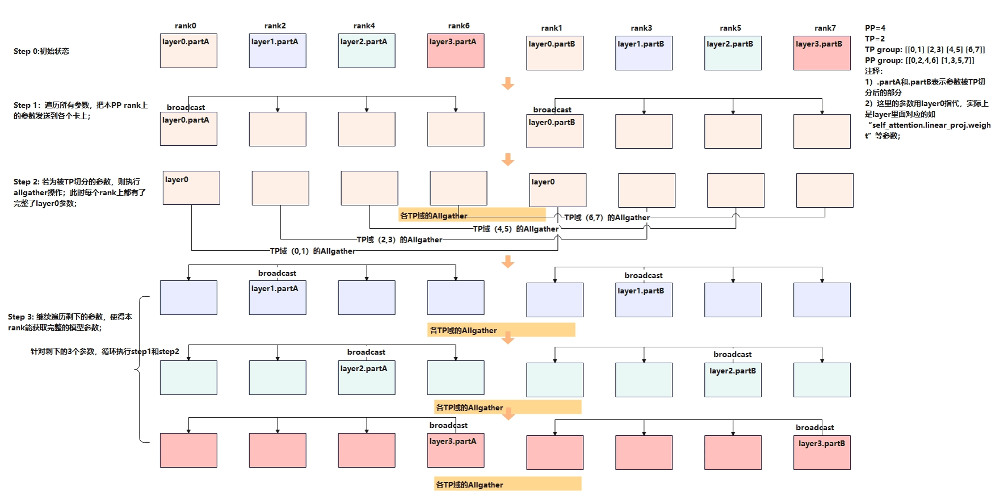

**优化方案**

针对TP切分的参数，我们重构了reshard流程：优先在TP域内执行AllGather完成参数分片的局部聚合，随后在PP域内执行一次AlltoAll实现参数在PP域内的广播。

新方案流程如下图所示，其优势主要来自以下两点：

1. 先TP域后PP域的顺序调整减小了总通信量和通信次数。

2. 原本PP域内一个参数做一次Broadcast，优化后一次AlltoAll即可完成PP个参数的广播，通信效率更高。

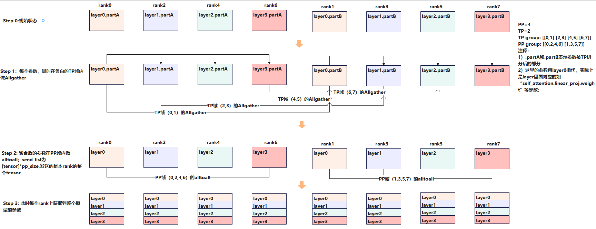

需要注意的是，当前部分参数不使用此新方案处理，如".mlp.experts.weight"使用专家的AlltoAllV优化；"embedding"、"output\_layer"等输入输出相关参数，以及MLP的dense层等，将在后续进行迭代优化。

**优化前后的通信对比**

优化前后的通信对比如下表所示：


|      |  模型总层数    | 单层完整参数量    | 单层TP参数个数    |  训练PP   |  训练TP    | Step1 通信量（以每卡接收量计）、通信次数     |  Step2 通信量（以每卡接收量计）、通信次数    |
| ---- | ---- | ---- | ---- | ---- | ---- | ---- | ---- |
|  优化前    |   n   | m     |   k   |  p   |  t    | PP域广播收集全部参数，通信量近似为：n\*m/t <br>  通信次数：n\*k   |   TP域全聚合收到全部参数，通信量近似：n\*m <br> 通信次数：n\*k   |
|  优化后    |   n   |  m    |  k    |   p   |  t    |  TP域参数全聚合，通信量近似为：n\*m/p <br> 通信次数：n\*k/p    |  PP域AlltoAll收集全部参数， 通信量近似：n\*m <br>   通信次数：n\*k/p  |
|  通信量变化    |   -   |   -   |   -   |   -   |   -   |  通常p大于t，例如p=8，t=4，所以优化后第一步通信量减少一半    |   无变化   |
|  通信次数变化    |   -   |   -   |   -   |  -   |   -   |  TP域AllGather通信次数：减少(p-1)/p * n*k次    |  PP域通信次数：减少(p-1)/p * n\*k次    |


### offload优化

在NPU上进行offload时，存在一定的适配工作量。由于veRL中使用的vLLM的wake\_up和sleep功能在NPU多机实测中仍存在问题，所以目前暂未启用该功能。本实践参考MindSpeed-RL的实现，通过onload\_model\_weight和init\_cache\_engine替代了wake\_up功能，并通过offload\_model\_weight和free\_cache\_engine替代了sleep功能。

本实践进一步对offload做出了一些细节调整以优化性能，主要包括以下两点：

- 在训练后紧接着进行reshard时，仍需要训练模型的权重，因此训练后无需卸载Megatron权重，推理前也无需再次加载，因此这两步冗余的offload/onload操作可省去。

- 推理init\_cache\_engine操作可以尽量后置，例如放在reshard结束后、卸载Megatron训练权重之后执行。这样做能够有效降低峰值内存，进而提高vLLM内存利用率，有助于提升推理性能。 

调整前后的offload/onload流程对比如下图所示：

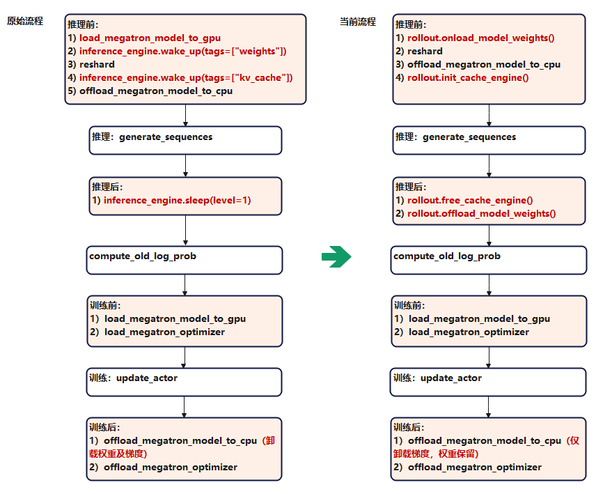

## 性能优化：训练

### 复用MindSpeed训练优化

本实践将veRL对接了MindSpeed，因此训练侧主要复用了MindSpeed/MindSpeed-LLM的优化技术，具体优化配置位于：verl\_patches/train\_engine/initialize\_training.py，如下图所示：


### old_log_prob免计算

对于GRPO这类on-policy训练算法，其old\_log\_prob计算结果与update\_actor前向计算所得的log\_prob数值相同（因为训练模型参数一致），因此可直接使用log\_prob.detach()替代old\_log\_prob，从而省去一次训练模型前向计算的耗时。


由于所用的veRL commit版本已包含了该优化的预设配置参数，因此本实践补充实现了该优化。将config.actor\_rollout\_ref.actor.recompute\_old\_log\_prob设置为False即可启用该优化。

## 性能优化：推理

数据生成推理阶段一直是RL训练性能优化的重中之重，在长序列场景下，推理阶段耗时可占总体耗时的80%以上；在当前DeepSeek-R1的1K推3K场景下，推理阶段耗时亦是接近总体耗时的一半。因此，本实践着重针对RL推理的框架调度、通信、模型算子亲和等多方面做了性能优化，最终在**DeepSeek-R1的1K推3K场景达成推理吞吐610+ token/p/s**，主要历程如下图所示：


以上所有优化代码已全部合入[vLLM-Ascend社区仓](https://github.com/vllm-project/vllm-ascend)，本节将对其中收益贡献较大的TorchAir整图下沉使能、MoE/MLA多流、零冗余TP转EP通信优化、KVCache支持NZ、大EP的Transpose/Cumsum消除、RL推理调度bound优化等特性做逐一介绍。

### TorchAir整图下沉

#### 现象分析

PyTorch的Eager模式可以通过Ascend Extension for PyTorch（torch\_npu）无缝对接昇腾硬件，但推理总耗时会受到算子下发调度开销的拖累，出现所谓调度Bound的现象而极大地影响性能。下图以DeepSeek-V3的MLA结构为例，为Pytorch在Eager模式下的调度开销做了一个直观的展示：NPU在主要时间里都保持空闲，CPU侧算子调度开销成为了推理耗时的主要因素。


#### 优化方案

针对这一问题，PyTorch 2.0发布了重磅特性torch.compile，基于TorchDynamo实现了基于CPU/GPU的原生图模式能力，支持将网络中的算子成图并统一调度，消除Decode推理过程中的调度时延。相应地，TorchAir（Torch Ascend Intermediate Representation）是昇腾适配TorchDynamo到Ascend IR的中间件，为Pytorch在NPU环境下的图模式提供了基础。本实践通过在vLLM中使能TorchAir图模式，消除了rollout阶段推理Decode部分的算子下发开销。

#### 优化效果

开启TorchAir图模式后单层模型对应Profiling如下图所示，可见其中的调度开销被完全消除：

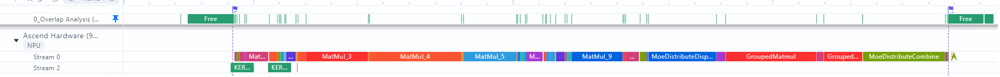

实测双层Dense + MoE网络推理在图模式下耗时优化9.5ms，在671B全参整网中Decode吞吐提升翻倍。

### MoE/MLA多流

#### 现象分析

TorchAir图模式支持在网络脚本中表达算子多流执行的语义，基于这一功能，结合DeepSeek-V3网络结构特点，可以将部分算子做多流并发执行，提升Decode性能。

##### MoE多流-通算并行

DeepSeek-V3网络的MoE结构计算路由专家与共享专家的激活值，其中，路由专家的权重被EP切分，需要在GroupedMatmul计算前后做卡间的AlltoAll通信（由MC2算子实现）；共享专家权重被TP切分，需要在Matmul计算后做卡间AllReduce通信，且路由专家与共享专家的计算无数据依赖关系。

在vLLM-Ascend的原生实现中，共享专家计算和路由专家计算串行执行，对应如下图所示的Profiling，可见其在计算与通信的编排上存在以下两个问题：


- MC2算子（同时包含通信与Vector计算）执行时，Cube运算单元闲置。

- 共享专家计算耗时较短，但其后AllReduce操作与MC2并发，导致通信带宽抢占。

##### MLA多流-CV并行

与MoE结构类似，DeepSeek-V3网络的MLA结构中亦存在部分无数据依赖的计算步骤。原生vLLM-Ascend的实现未考虑这一特点，将所有算子串行执行，因而存在进一步的优化空间。


#### 优化方案

针对MoE部分，本实践基于TorchAir的多流能力将共享专家的计算拆分到并行的计算流上作重新排布。将共享专家的"gate\_up\_proj"矩阵运算与路由专家的"dispatch"通信算子并行，共享专家的"down\_proj"矩阵运算与路由专家的"combine"通信算子并行，通过通算并行的方式优化Decode耗时。


同时，为了避免共享专家"down\_proj"计算结束后的AllReduce通信拖尾，本实践额外通过保存共享专家冗余权重的方式消除张量并行带来的AllReduce通信。由于共享专家本身矩阵运算规模较小，即使不做TP切分也可以被MC2算子基本掩盖，获得进一步的性能收益。

类似地，针对MLA部分，同样可以经过一定的流水排布将无数据依赖的Cube与Vector计算作多流并行执行，提升Decode性能。

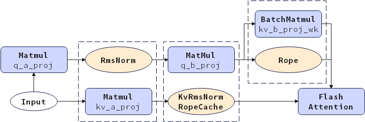

#### 优化效果

开启MoE多流与MLA多流优化后的网络片段Profiling如下图所示：


可见MoE层共享专家计算和MLA层Vector计算已被卸载到从流中，相关耗时被对应通信算子、Cube计算算子所掩盖，对应单步Decode TPOT优化6ms，整网推理吞吐提升7%。

### 零冗余TP转EP通信优化

#### 现象分析

为了突破单设备内存限制，本实践推理阶段针对MLA层与MoE层分别使用TP和EP切分，将DeepSeek-V3完整模型拆分到多个设备运行。在vLLM-Ascend的原生实现中，MLA层通过AllReduce完成张量并行场景下的数据汇聚，MoE层通过Split算子从中取出本卡需要的数据完成TP切分到EP切分的转化，此处AllReduce + Split的组合引入了通信量和计算量的双重冗余。


#### 优化方案

本实践采用零冗余的TP转EP的通信方案，在Decode阶段将MLA层的AllReduce算子替换为ReduceScatter算子，使MoE层仅接收本卡计算所必需的数据，并将MoE层末尾的AllGather通信移至MLA层，保证原本的TP切分逻辑的正确性。由于AllReduce算子的通信量与ReduceScatter与AllGather算子的通信量之和相当，从而本方案在MLA层整体通信量保持不变的前提下，消除了MoE部分原本的AllGather通信与Split算子。


#### 优化效果

零冗余TP转EP通信优化使能前后的算子列表如下所示，开启优化后MoE层内的StridedSlice和AllGather算子被消除。另一方面，MoE层通信的减少还进一步缓解了卡间通信不均衡问题，最终推理TPOT优化2ms以上，Decode吞吐提升超过3%。

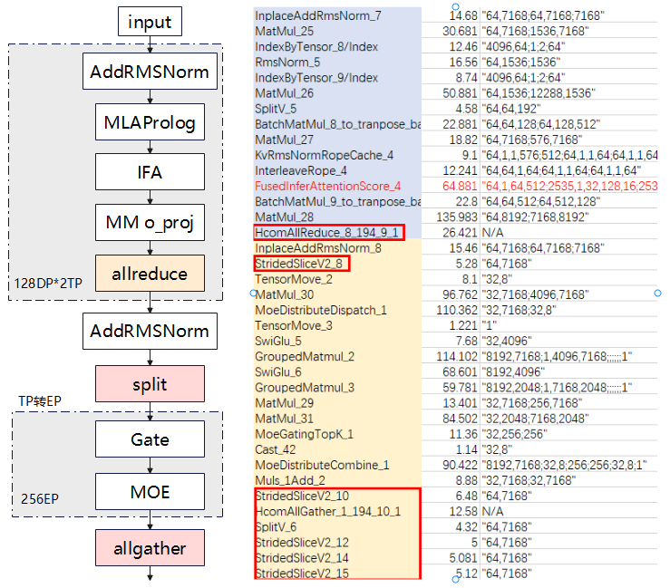


### KVCache支持NZ

#### 现象分析

NZ是NPU上的一种特殊的私有数据格式，如下图所示，其将完整数据划分为数据块，并采取块之间列优先，块内行优先的内存排布方式。

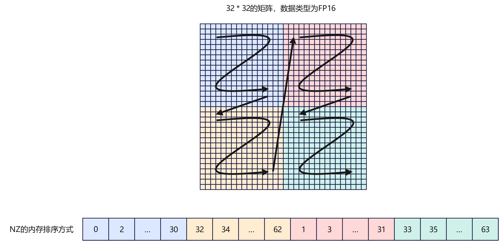

在矩阵进行分块计算时，NZ格式可以使计算单元访问连续的数据内存，因而能够最大程度挖掘出NPU Cube 单元的性能。算子一般包含将数据格式转化为NZ的步骤，通过预先将KVCache按照NZ格式进行存储，可以消除FusedInferAttentionScore算子内部的格式转换阶段，并优化推理Decode阶段FA算子的性能。

#### 优化方案

在Prefill与Decode阶段分别指定KvRmsNormRopeCache算子的cache\_mode参数为"PA\_BLK\_NZ"和"PA\_NZ"，即可按照NZ格式存储KVCache。同时亦需要对KV作相关变换，以满足NZ格式场景下FA算子对输入参数shape及layout的约束。

#### 优化结果

本实践在vLLM-ascend中torchair\_graph\_config下新增了用于控制KVCache NZ优化的配置项enable\_kv\_nz。该优化的收益随序列长度上升而增长，具体结果如下图所示，序列长度为3K时Decode TPOT收益将超过1ms。


### 大EP的冗余算子消除

#### 现象分析

##### 冗余Transpose算子

DeepSeek-V3模型普遍使用大EP的推理部署方式，通过减少MoE部分参与GroupedMatmul计算的路由专家数量，以降低单次Decode耗时。然而，在分析EP256配置下的profiling时发现，GroupedMatmul算子执行前出现了额外的Transpose操作，导致性能反而出现较大劣化。

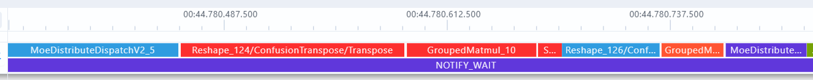

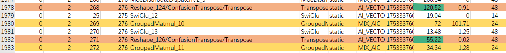

上图的profiling信息显示，单层MoE中的Transpose算子总耗时**高达175us**。经过模型代码排查、对比EP128无Transpose场景的dump图，发现问题由以下原因导致：

- 在EP256单卡1专家的配置下，由于专家权重shape中存在值为1的维度，导致针对权重的Transpose算子触发TorchAir的"enable\_view\_optimize"优化（详见[PyTorch图模式使用指导 > View类算子优化功能](https://www.hiascend.com/document/detail/zh/Pytorch/710/modthirdparty/torchairuseguide/torchair_00033.html)）而被插入了额外的Reshape算子。
  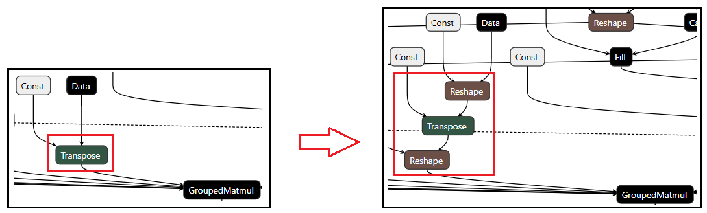

- 新引入的Reshape算子使融合Pass "GroupedMatmulTransFusionPass"无法检测到其预定目标模式，最终导致Transpose算子被保留到图执行阶段。
  

 

##### 冗余Cumsum算子

DeepSeek-V3网络的多路由专家计算由GroupedMatmul算子实现，该算子用于批量处理多个矩阵乘法操作，通过将具有相同或相似形状的矩阵乘法操作组合在一起，减少内存访问开销和计算资源的浪费，从而提高计算效率。对应的torch\_npu接口“npu\_grouped\_matmul”依赖入参“group\_list”获取每个子矩阵运算中实际M轴的大小，并支持以“**累加和数列**”或“**逐维度指定**”两种形式提供这一参数。vLLM-Ascend的模型脚本中使用了“累加和数列”模式而非后者，因而在MoE层中引入了用于实现累加和的Cumsum算子。

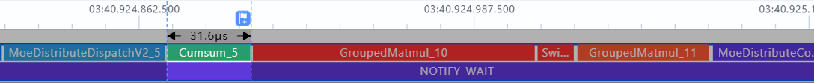

实际上，这一累加过程是多余的，通过配置"npu\_grouped\_matmul"接口的"group\_list\_type=1"参数可以将group\_list按照"逐维度指定"的方式提供，从而省去Cumsum算子的开销。

#### 优化方案

优化项"enable\_view\_optimize"在TorchAir中默认开启，目标是为了融合连续的view类算子。由于DeepSeek-V3网络不涉及这一目标场景，所以选择将其在"additional\_config"配置中显式关闭，避免因此导致的Transpose/Gmm算子融合失败。

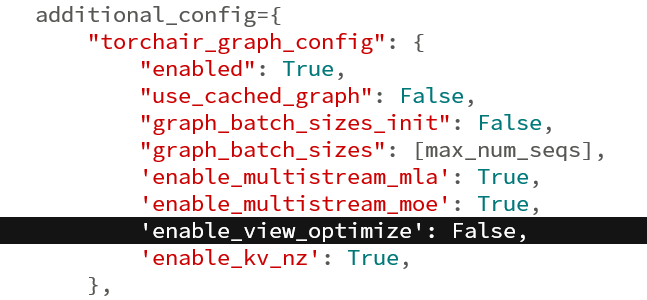

同时，修改vLLM-ascend的网络脚本，调整"npu\_grouped\_matmul"接口的"group\_list\_type"配置，以消除原本的Cumsum操作。

#### 优化效果

调整TorchAir的优化功能开关"enable\_view\_optimize"和torch\_npu接口"npu\_grouped\_matmul"的配置后，MoE阶段关键路径上的Transpose/Cumsum算子即被消除。尽管GroupedMatmul算子耗时有所增加，仍能获得单层158us，整网9ms的Decode性能收益，在3K推理长度下可将rollout总耗时优化**超过28s**。


 

### RL推理调度bound优化

#### 现象分析

在对Decode模型侧进行较大性能优化之后，纯模型耗时在整体Rollout中的占比显著减低，这意味着如果仅仅优化纯模型的性能，后续在整体Rollout吞吐量的提升上面将面临较大局限。基于此，结合当时Rollout耗时373s（对应吞吐547 token/p/s）的数据，对整体RL推理过程进行了重新拆解与分析，结果如下：


上图中可以看到，**Prefill和Decode的纯模型计算时间在RL推理的整体耗时占比已不足60%，其余40%耗时集中在Decode的前后处理、vLLM V1 Engine调度以及RL训推切换前权重内存卸载等调度操作上**。为了进一步提升Rollout性能，需要从单纯关注模型性能优化转向优化此类推理场景下的“调度bound”问题。经过深入分析，得到如下结果：
1.  vLLM Sche部分：耗时集中在调度前的全卡DP域间的EOS检测同步，通过CPU的AllReduce通信来获取"has\_unfinished\_requests"的结果，决定是否需要执行dummy\_batch。此CPU通信单次平均耗时10ms，推理3000次后叠加**耗时高达30s**。

2. Decode prepare input部分：耗时集中在全DP域间的P/D检测同步，与上面的“vLLM Sche部分”类似，单次耗时10ms，Decode 3000次后叠加总**耗时高达30s**。这里值得一提的是，RL推理的部署方案是P/D共卡，故需要在Sche阶段判断当前DP间是否存在PD混合部署，来决定走Prefill的AlltoAll还是Decode的Dispatch/Combine，以防止DP间的通信算子不一致导致阻塞。后续若此实践方案切换到P/D分离部署，将不再需要此通信。

3. RL Sche部分：推理结束后切换到训练之前，RL框架需要先卸载推理阶段的内存，然后将模型权重resharing到训练阶段。但经过测试发现，调用"torch.cuda.empty\_cache()"接口卸载内存也需要耗时4s左右，细究其原因，发现其调用了底层的"aclrtFreePhysical"接口，将torch内存池释放给了操作系统。单次释放的内存约26G，推理转训练、训练转推理过程中共发生两次内存释放，**总耗时约8s。**从原理上看，减少将内存直接释放给OS的操作，并在[Ascend Extension for PyTorch](https://www.hiascend.com/document/detail/zh/Pytorch/710/index/index.html)的内存管理中进行内存复用，将有助于进一步提升训推切换的整体效率。

#### 优化方案

针对全卡DP间EOS检测、P/D检测同步的CPU AllReduce通信，我们计划将其从Gloo后端的CPU侧通信修改为HCCL后端的NPU侧通信，相关原理示意图如下：

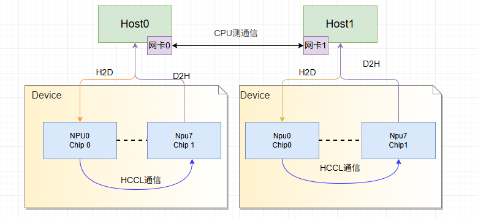

此处AllReduce通信实际通信量很小，仅为字节级别，所以Atlas A3系列产品的全互联HCCS高通信带宽对我们并无助益，我们关注的是CPU的TCP协议通信和NPU的HCCS通信的时延对比：

| 对比项     |  NPU-HCCS (HCCL)    |  CPU-TCP (Gloo)    |
| ---- | ---- | ---- |
|  延迟 (Latency)    |  极低（微秒级，通常 < 10μs）    |  较高（数十到数百微秒，受OS调度/协议栈开销影响）    |
|  协议开销    |  专用硬件协议，绕过OS内核，处于数据链路层（L2）    | 需经过TCP/IP协议栈（内核态-用户态切换），处于传输层（L4）     |
| 大集群扩展性     |  近线性扩展    |   随节点数增加，延迟显著上升（树形/环形拓扑的跳数增加）   |


在Atlas A3 128卡环境上，单次CPU-TCP通信耗时远超us级，达到了10ms的量级。经过测试发现CPU的通信效率与集群大小强相关，Gloo通信使用树形算法，随着集群规模的增大，时延呈O(log2​ N)增长；而NPU的HCCL通信，使用Double-Ring通信算法、分级通信等算法优化，时延线性度高。因此推算通信后端切换到HCCL后，可显著降低通信延时，获得较大性能收益。

#### 优化效果

在Atlas A3 128卡环境中，将vLLM调度前处理的"has\_unfinished\_requests"函数，以及Decode前处理的"\_get\_forward\_metadata\_across\_dp"函数中allreduce通信的后端由Gloo修改为HCCL之后，单通信耗时由原14ms优化到了3ms以内，如下图所示：


在Atlas A3 128卡上DSR1-671B完整网络上取得的收益如下：

1.  推理吞吐由519 tps优化到618 tps。

2.  推理耗时由385s优化到322s ，收益约为60s （2次通信\* 10ms 优化\* 3072次Decode推理），提升比例接近20%，效果显著。
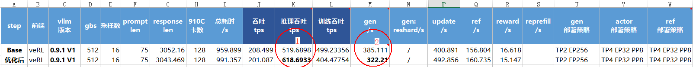

  

## 附录

### veRL patch修改介绍

本实践的目标是以patch的方式尽可能非侵入式适配veRL，配合本实践提供的patch和启动脚本，目前仅需在“
verl/workers/megatron\_workers.py”中手动添加一行代码即可导入veRL的适配补丁，如下图：

```
from verl_patches import prelude_patch
```


以下表格是相关代码的介绍，以及与veRL原代码的对应关系，大多为patch代码。
<table><thead align="left"><tr><th valign="top" width="18.310000000000002%" ><p >上级目录分类</p>
</th>
<th valign="top" width="22.31%" ><p>veRL对应patches文件</p>
</th>
<th valign="top" width="25.069999999999997%"><p >veRL原文件</p>
</th>
<th valign="top" width="34.31%"><p>修改描述</p>
</th>
</tr>
</thead>
<tbody><tr><td rowspan="5" valign="top" width="18.310000000000002%"><p >verl_patches/models/mcore</p>
</td>
<td valign="top" width="22.31%"><p>config_converter.py</p>
</td>
<td valign="top" width="25.069999999999997%"><p>verl/models/mcore/config_converter.py</p>
</td>
<td valign="top" width="34.31%"><p>适配Deepseek R1的transformer config</p>
</td>
</tr>
<tr><td valign="top"><p>model_forward.py</p>
</td>
<td valign="top"><p>verl/models/mcore/model_forward.py</p>
</td>
<td valign="top"><p>适配torch_npu.npu_fusion_attention的attention_mask，因其与veRL原生掩码含义有区别</p>
</td>
</tr>
<tr><td valign="top"><p>model_initializer.py</p>
</td>
<td valign="top"><p>verl/models/mcore/model_initializer.py</p>
</td>
<td valign="top"><p>适配Deepseek R1模型初始化参数，获取layer_spec</p>
</td>
</tr>
<tr><td valign="top"><p>weight_converter.py</p>
</td>
<td valign="top"><p>verl/models/mcore/weight_converter.py</p>
</td>
<td valign="top"><p>适配Deepseek R1的参数名从Mcore到HF的转换</p>
</td>
</tr>
<tr><td valign="top"><p>weight_loader_registry.py</p>
</td>
<td valign="top"><p>verl/models/weight_loader_registry.py</p>
</td>
<td valign="top"><p>新增Deepseek R1的权重保存函数，暂未实现</p>
</td>
</tr>
<tr><td valign="top" width="18.310000000000002%"><p>verl_patches/single_controller</p>
</td>
<td valign="top" width="22.31%"><p>decorator.py</p>
</td>
<td valign="top" width="25.069999999999997%"><p>verl/single_controller/base/decorator.py</p>
</td>
<td valign="top" width="34.31%"><p>训练DataProto数据携带全局DP rank信息，供TensorCache reshard使用</p>
</td>
</tr>
<tr><td rowspan="5" valign="top" width="18.310000000000002%"><p>verl_patches/train_engine</p>
</td>
<td valign="top" width="22.31%"><p>base_config.py</p>
</td>
<td valign="top" width="25.069999999999997%">&nbsp;&nbsp;</td>
<td valign="top" width="34.31%"><p>来自MindSpeed-RL，MegatronConfig的基类</p>
</td>
</tr>
<tr><td valign="top"><p>initialize_training.py</p>
</td>
<td valign="top">&nbsp;&nbsp;</td>
<td valign="top"><p>veRL配置转Megatron/MindSpeed实现后两者的完整参数解析，以及参考MindSpeed-RL实现Megatron分布式初始化</p>
</td>
</tr>
<tr><td valign="top"><p>megatron_config.py</p>
</td>
<td valign="top">&nbsp;&nbsp;</td>
<td valign="top"><p>来自MindSpeed-RL，MegatronConfig类，用于收集Megatron配置参数</p>
</td>
</tr>
<tr><td valign="top"><p>megatron_patch.py</p>
</td>
<td valign="top">&nbsp;&nbsp;</td>
<td valign="top"><p>Megatron优化patch，来自MindSpeed-RL</p>
</td>
</tr>
<tr><td valign="top"><p>mindspeed_patch.py</p>
</td>
<td valign="top">&nbsp;&nbsp;</td>
<td valign="top"><p>MindSpeed功能patch，支持num_layer_list正确解析</p>
</td>
</tr>
<tr><td rowspan="4" valign="top" width="18.310000000000002%"><p>verl_patches/trainer</p>
</td>
<td valign="top" width="22.31%"><p>config/ppo_mindspeed_trainer.yaml</p>
</td>
<td valign="top" width="25.069999999999997%"><p>verl/trainer/config/ppo_megatron_trainer.yaml</p>
</td>
<td valign="top" width="34.31%"><p>新增部分训练配置参数，将会替代veRL原本的yaml来使用</p>
</td>
</tr>
<tr><td valign="top"><p>ppo/ray_trainer.py</p>
</td>
<td valign="top"><p>verl/trainer/ppo/ray_trainer.py</p>
</td>
<td valign="top"><p>适配ActorRolloutRef共worker实例、D2D数据直传加速，以及增加部分参数校验</p>
</td>
</tr>
<tr><td valign="top"><p>main_ppo_npu.py</p>
</td>
<td valign="top"><p>verl/trainer/main_ppo.py</p>
</td>
<td valign="top"><p>适配ActorRolloutRef共worker实例、导入一些patch，将会替代veRL原本的main_ppo.py来使用</p>
</td>
</tr>
<tr><td valign="top"><p>verl_trainer_adaptor.py</p>
</td>
<td valign="top">&nbsp;&nbsp;</td>
<td valign="top"><p>应用trainer的patch</p>
</td>
</tr>
<tr><td rowspan="4" valign="top" width="18.310000000000002%"><p>verl_patches/utils</p>
</td>
<td valign="top" width="22.31%"><p>megatron/tensor_parallel.py</p>
</td>
<td valign="top" width="25.069999999999997%" ><p>verl/utils/megatron/tensor_parallel.py</p>
</td>
<td valign="top" width="34.31%"><p>去除会引发报错的torch.compile装饰器</p>
</td>
</tr>
<tr><td valign="top"><p>megatron_utils.py</p>
</td>
<td valign="top"><p>verl/utils/megatron_utils.py</p>
</td>
<td valign="top" ><p>新增onload，offload函数，以及优化resharding代码</p>
</td>
</tr>
<tr><td valign="top"><p>model.py</p>
</td>
<td valign="top"><p>verl/utils/model.py</p>
</td>
<td valign="top"><p>无VPP模式下的各pp stage的层名转换</p>
</td>
</tr>
<tr><td valign="top"><p>reshard.py</p>
</td>
<td valign="top">&nbsp;&nbsp;</td>
<td valign="top"><p>支持EP使用AlltoAllV做无通信冗余的reshard</p>
</td>
</tr>
<tr><td rowspan="6" valign="top" width="18.310000000000002%"><p>verl_patches/workers</p>
</td>
<td valign="top" width="22.31%"><p>actor/megatron_actor.py</p>
</td>
<td valign="top" width="25.069999999999997%"><p>verl/workers/actor/megatron_actor.py</p>
</td>
<td valign="top" width="34.31%"><p>MegatronPPOActor类的patch，额外支持非pack场景、增加训练侧profiling等</p>
</td>
</tr>
<tr><td valign="top"><p>sharding_manager/megatron_vllm.py</p>
</td>
<td valign="top"><p>verl/workers/sharding_manager/megatron_vllm.py</p>
</td>
<td valign="top"><p>优化reshard代码</p>
</td>
</tr>
<tr><td valign="top"><p>vllm_rollout/engine_core.py</p>
</td>
<td valign="top">&nbsp;&nbsp;</td>
<td valign="top"><p>修复vLLM KVCache内存申请不一致的问题</p>
</td>
</tr>
<tr><td valign="top"><p>vllm_rollout/vllm_parallel_state.py</p>
</td>
<td valign="top">&nbsp;&nbsp;</td>
<td valign="top"><p>适配vLLM-Ascend的DP通信域创建</p>
</td>
</tr>
<tr><td valign="top"><p>vllm_rollout/vllm_rollout_spmd.py</p>
</td>
<td valign="top"><p>verl/workers/vllm_rollout/vllm_rollout_spmd.py</p>
</td>
<td valign="top"><p>适配vLLM-Ascend，新增offload，onload，free_cache相关函数</p>
</td>
</tr>
<tr><td valign="top"><p>megatron_workers.py</p>
</td>
<td valign="top"><p>verl/workers/megatron_workers.py</p>
</td>
<td valign="top"><p>ActorRolloutRefWorker类的patch，支持ActorRolloutRef共worker示例、基于TensorCache的D2D数据直传加速等</p>
</td>
</tr>
<tr><td rowspan="6" valign="top" width="18.310000000000002%"><p>verl_patches</p>
</td>
<td valign="top" width="22.31%"><p>bert_padding.py</p>
</td>
<td valign="top" width="25.069999999999997%">&nbsp;&nbsp;</td>
<td valign="top" width="34.31%"><p><a href="https://github.com/Dao-AILab/flash-attention/blob/main/flash_attn/bert_padding.py" target="_blank" rel="noopener noreferrer">参考代码</a>，替代flash_attn.bert_padding，用于解决import报错问题</p>
</td>
</tr>
<tr><td valign="top"><p>prelude_patch.py</p>
</td>
<td valign="top" >&nbsp;&nbsp;</td>
<td valign="top" ><p>需要提前加载的patch，包含optimizer和bert_padding替换</p>
</td>
</tr>
<tr><td valign="top"><p>profiler.py</p>
</td>
<td valign="top">&nbsp;&nbsp;</td>
<td valign="top" ><p>NPU上的profiling采集和解析工具</p>
</td>
</tr>
<tr><td valign="top"><p>tensor_cache.py</p>
</td>
<td valign="top">&nbsp;&nbsp;</td>
<td valign="top" ><p>TensorCache类，用于实现训练stage间数据D2D直传，加速大规模集群下训练侧ray任务下发</p>
</td>
</tr>
<tr><td valign="top"><p>tools.py</p>
</td>
<td valign="top">&nbsp;&nbsp;</td>
<td valign="top" ><p>调测工具</p>
</td>
</tr>
<tr><td valign="top"><p>verl_adaptor.py</p>
</td>
<td valign="top">&nbsp;&nbsp;</td>
<td valign="top"><p>应用多个patches</p>
</td>
</tr>
</tbody>
</table>

### 代码样例执行说明

请参见[DeepSeekR1模型样例使用指导](../rl_train/deepseek/README.md)。
