# CANN+TorchTitan: DeepSeek-V3.2 32k长序列预训练昇腾优化实践

随着 DeepSeek 团队发布 DeepSeek-V3.2，其创新的 **DeepSeek Sparse Attention (DSA)** 架构通过稀疏注意力机制显著提升了长序列计算效率，迅速成为业界关注的焦点。为把握这一技术趋势，众多厂商迫切希望快速完成 DSA 的适配与复现，并将其融合到自有模型中探索性能收益，这也对昇腾 NPU 上训练框架的快速适配提出了挑战。

本文主要介绍基于昇腾 (Ascend) NPU 集群，利用 PyTorch 官方原生大模型训练框架 **TorchTitan**，实现 DeepSeek-V3.2 全链路预训练适配的技术实践。我们不仅打通了复杂的混合并行策略，更在业界率先攻克了 DSA 算子的反向传播难题，结合 torch.compile 编译加速，实现了从模型定义到算子编译的原生对齐。CANN团队复现的DeepSeek-V3.2长序列CPT训练，在A3 64卡集群极致显存场景下性能达成**29 TPS/卡**。

---

## Highlights

* 训练框架使用TorchTitan + TorchTitan-npu插件化方案，并行策略使能**原生TP/PP/EP/FSDP2**昇腾适配，同时针对稀疏DSA结构提出Custom CP，在A3 64卡完成32K长序列CPT训练，涉及的[训练框架代码](https://gitcode.com/cann/cann-recipes-train/tree/master/llm_rl)已完全开源
* 基于Ascend C实现NPU **Lightning Indexer和Sparse Flash Attention正反向融合Kernel**，发挥稀疏计算潜力，Ascend C Kernel[技术文档](https://gitcode.com/cann/cann-recipes-infer/blob/master/docs/models/deepseek-v3.2-exp/deepseek_v3.2_exp_AscendC_operator_guide.md)和[代码](https://gitcode.com/cann/ops-transformer)已开源
* 基于FSDP2（Fully Sharded Data Parallel 2）的原生内存优势，配合A3超节点的高通信带宽的硬件特性，权重预取的通信能被计算完全掩盖；同时凭借A3高速H2D带宽使能 **Swap Optimizer** 至 Host 内存，实现了671B长序列全量微调的内存**最小化部署方案**
* TorchTitan-npu 无缝对接**torch.compile + Inductor**图优化能力，实现FX计算图pass优化，在DeepSeek-V3.2预训练场景拿到性能收益，是未来训练场景PyTorch编译优化的主战场

## Outline

* [为什么选择TorchTitan](#为什么选择TorchTitan)
* [分布式并行策略](#分布式并行策略)
* [内存优化](#内存优化)
* [DSA融合算子](#dsa融合算子)
* [FSDP2+Torch.compile+inductor加速](#fsdp2torchcompileinductor)
* [Benchmark](#benchmark)
* [Future Plan](#future-plan)

## 为什么选择TorchTitan

### 原生分布式编程模型

TorchTitan 最根本的优势在于深度应用 DTensor，将张量并行抽象为一等公民语义，实现并行策略的乐高式组合。

* **统一抽象**：DTensor 通过 Placement（Shard/Replicate/Partial）将参数切分与模型定义解耦，开发者仅需配置子模块的 ParallelStyle 声明切分方式，无需显式编写通信逻辑。

* **多维组合**：基于携带完整设备网格的 DTensor，TorchTitan 可以极低侵入成本实现 5D 并行（FSDP2+TP+PP+EP+CP）组合，在支持丰富特性的同时保持代码库紧凑、模块化。

### 无缝接入 PyTorch 生态

TorchTitan 是 PyTorch 社区原生的大模型训练框架，接入 TorchTitan **有助于加速昇腾生态与 PyTorch 社区深度融合，复用开源方案，有效提升 NPU 训练场景的易用性**。

#### torch.compile 深度集成

TorchTitan 原生支持 torch.compile，借助 Inductor 编译器实现训练优化：

* **FX图变换**：通过 FX 捕获静态图，执行通算调度、模式匹配等图级 Pass，自动削减冗余操作，生成精简中间表示。
* **算子融合**：依赖 Triton 实现水平融合（合并连续逐元素操作链）与垂直融合（将计算密集型算子与偏置、激活等合并），降低内存访问与内核启动开销。后续 CANN 平台可通过 Ascend C 自动融合对接 Inductor，进一步提升性能。

#### PyTorch社区原生工具集成

TorchTitan 将 PyTorch 生态中的工具系统集成，提供开箱即用的稳定性与调试能力：

* **分布式检查点**：原生集成 DCP，支持异步保存；CheckpointManager 以低开销保存模型分片、优化器状态及加载器偏移量，恢复时自动定位最新检查点并校验完整性。
* **容错和维测**：TorchFT 可实现副本级检查点管理，在 HSDP 场景下节点故障时可仅恢复故障节点，显著提升平均无故障时间；基于 FlightRecorder 可缓存通信类型、数据量、调用栈等信息，辅助定位死锁与训练超时根因。
* **低精度训练**：插件化集成 TorchAO，复用其低精度数据类型抽象与量化 recipe，社区已在 TorchTitan 中实现对 FP8 / MxFP8 数据类型的支持，完成低精度 MoE 网络训练验证。

## TorchTitan-npu插件化支持方案

TorchTitan 提供了 **ModelConverter** 机制，作用在模型定义后、并行策略（TP/FSDP 等）应用之前，可以在不修改原始模型定义的前提下，通过注册机制对模型模块进行替换或重写，详细介绍请参考[官方文档](https://github.com/pytorch/TorchTitan/blob/v0.2.1/docs/extension.md?plain=1#L20)
基于这套机制，我们设计了NPU插件化适配方案，预期目标是：

- 不修改上游模型代码，方便跟踪上有更新
- 支持优化项通过开关配置
- 支持多种优化项自由组合

当前我们主要使能融合算子优化，量化、optimizer优化等特性在逐步扩展中；这套机制也方便结合torch.compile等能力可以实现进一步的优化。

**使用示例：**

```yaml
[model]  # 在model配置下指定需要使能的融合算子即可
converters = ["npu_dsa", "npu_rms_norm", "npu_permute", "npu_gmm"]
```

## 分布式并行策略：

### MoE的TP策略优化

大EP场景下，路由专家不做TP切分（TP extend EP），TorchTitan原生的MoE TP策略如下图所示：

<p align="center">
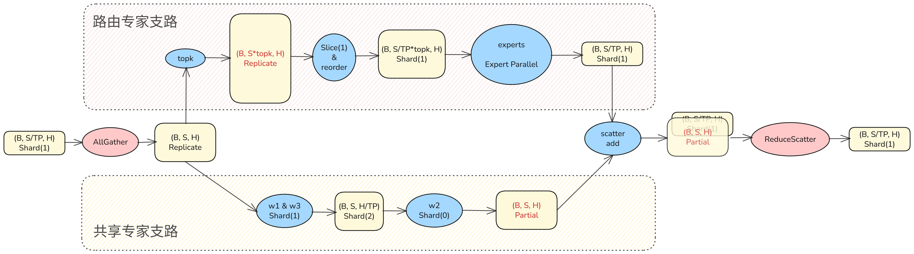
</p>
以上策略在两个分支上都存在不合理之处：

* 路由专家分支接收在TP域AllGather之后的激活tensor，一个TP域内每个rank对相同的tensor做了topk选择，产生了计算和内存的冗余；同时Reorder重排布模块又做了Sequence Parallel，相当于前面TP域AllGather对路由专家分支来说是冗余操作。
* 共享专家分支与传统的TP不同，其输出没有立刻做ReduceScatter通信，而是维持Partial这种不安全的状态，并且占据内存较多。

以上不合理之处与TP域的AllGather和ReduceScatter位置安排不合理有关，可将这两个通信移动至共享专家分支，而路由专家分支不需要TP域的通信。调整后MoE的TP策略如下图所示，路由专家支路不再有冗余的计算和通信，共享专家支路为普通的TP策略：
<p align="center">
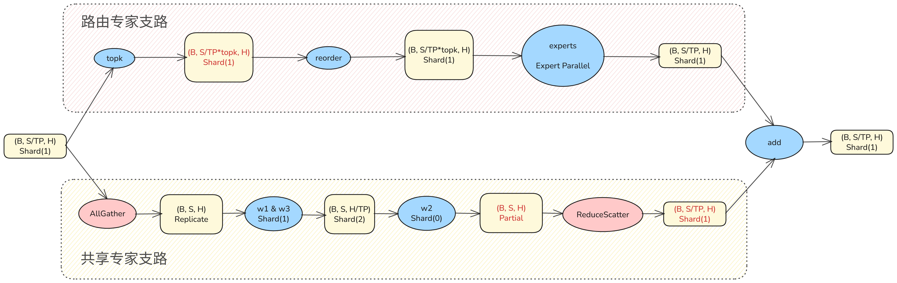
</p>

### 自定义CP策略

#### torch原生CP介绍

长序列场景下，通过Context Parallel（CP）对输入数据的Sequence维度尤为重要，可大大降低激活内存的占用。

TorchTitan使用了torch原生提供的context parallel能力，其原理如下图所示：使用一个上下文环境包裹模型训练step，上下文内部对模型输入做sequence轴切分，同时将Attention算子替换为RingAttention或AllGatherKV实现以确保Attention计算正确。
<p align="center">
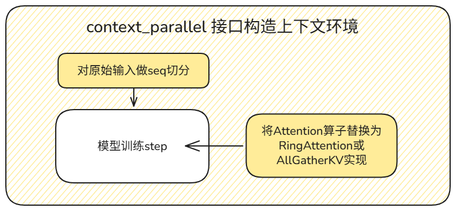
</p>

#### 针对DSA的自定义CP

DeepSeek-V3.2模型与传统稠密注意力模型不同，其内部的Lightning Indexer和DSA稀疏注意力在CP场景下都需要对Key和Value进行处理以确保计算的正确性。由于DeepSeek-V3.2内部注意力结构更加复杂，且Attention算子不再是常用的SDPA，torch原生的CP能力并不适用。在此背景下，我们在遵循torch原生CP设计逻辑的基础上，为DeepSeek-V3.2设计实现了自定义CP，其原理如下图所示：
<p align="center">
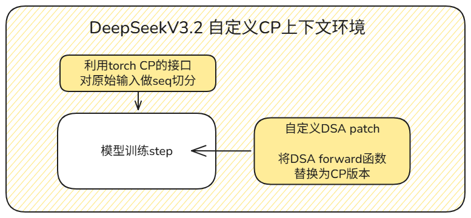
</p>

CP场景下，需确保q_indexer与query分别和完整序列的k_indexer、key value进行过注意力计算，一般有两种方式达成此目的：RingAttention形式，或直接对KV做序列维度AllGather。

* **RingAttention形式**：实现复杂，且对Indexer与稀疏注意力计算都需要实现，综合来看开发复杂且不够灵活。
* **对KV做序列维度AllGather**：实现简单灵活。此外，考虑到weight absorb模式下KV的内存占用较小、Indexer中key也内存占用很小，AllGather带来的内存代价完全可以接受。

综合以上分析，我们实现了CP版本的DSA forward函数，仅仅是在原版代码上增加对KV的AllGather通信。以使用NPU融合算子的DSA实现为例，CP场景下的计算逻辑如下图所示：
<p align="center">
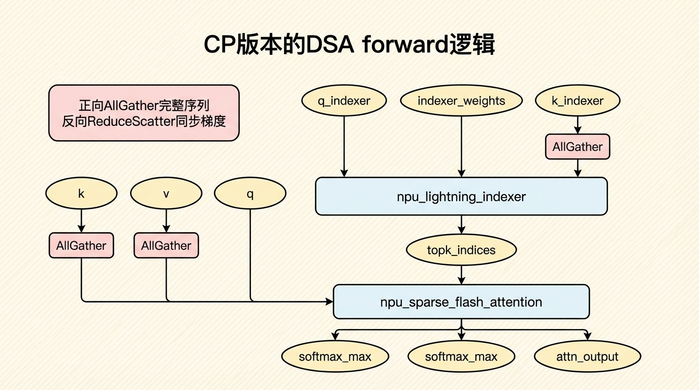
</p>
值得一提的是，我们首先实现了 CustomContextParallelContext 基类，其中只进行模型输入的序列切分，用户可在子类中自定义模型前向计算的CP patch逻辑，具有较好的可扩展性。

### DTensor计算的Sharding策略优化

#### 算子Sharding策略

当使用DTensor进行计算，算子下发时需要对算子的输入（包含权重）、输出生成sharding策略。对于一个DTensor，若选定的sharding策略与当前状态不符，就会触发DTensor的状态转变，会引入Slice或通信等额外的操作，会对性能甚至内存产生非常不利的影响。因此，对算子生成合理的sharding策略是至关重要的，本小节将介绍对两个NPU算子的sharding策略优化。

#### Matmul Sharding策略优化

TP场景下，当前默认的matmul sharding策略生成并不合理。以q_lora矩阵乘为例，该矩阵乘在TP域内不做任何切分，因此直接计算matmul即可，如下图右侧所示。

但目前sharding策略生成并不合理，如下图左侧所示，生成的策略希望将简单的Replicate矩阵乘转为权重做TP行切的形式，引入了很多额外操作，大大影响性能：

* **输入X**：从Replicate变为Shard(2)，需要Slice操作。
* **权重W**：从Replicate变为Shard(0)，需要Slice操作。
* **输出Y**：由于TP策略中指定q_lora模块不做并行，因此最终该matmul输出需要调整为Replicate状态，从Partial到Replicate则需要AllReduce通信。
<p align="center">
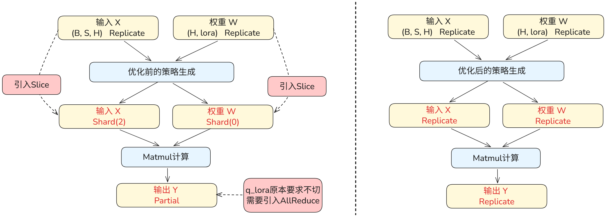
</p>
实际上，pytorch已经编写了较为完善的matmul sharding策略生成函数，可以利用该函数获取更合理的sharding策略。针对以上示例，可通过如下代码获得预期的合理策略：

#### Matmul Backward Sharding策略优化

matmul_backward算子当前也有sharding策略不合理的问题。以模型末尾的output矩阵乘为例，其正向是权重TP列切的形式，反向时输入的切分状态和生成的默认切分策略如下图左侧所示，策略的不合理引入了冗余操作：

* **输入X**：从Replicate变为Shard(2)，需要Slice操作。
* **梯度dY**：从Shard(2)变为Replicate，需要AllGather通信，且占据更多内存。
* **权重W**：从Shard(1)变为Shard(0)，需要AllToAll通信。

<p align="center">
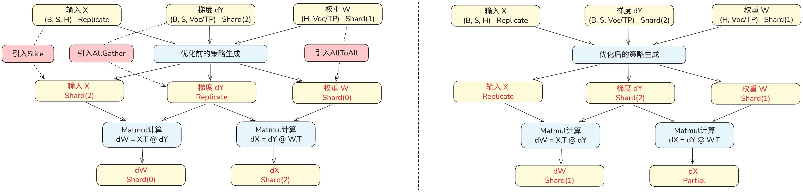
</p>

虽然torch没有matmul反向的sharding策略生成函数，但考虑到matmul反向实际上就是计算dX和dW的两个矩阵乘，我们设计对两个矩阵乘分别调用 _mm_like_strategy 生成策略然后融合得到最终的matmul反向sharding策略。

此外，由于_mm_like_strategy 对一个matmul会生成多条策略，还需要考虑如何选择更合理的策略。由于通常计算中不会再调整权重的切分状态，我们从众多策略中分别选择不调整W切分状态的策略（dX计算）和dW与W切分状态一致的策略（dW计算），将两条策略融合后即可得到上图右侧的理想策略。可以看到，理想的策略实际上就是对算子的输入tensor不再做切分状态的调整，这样也就没有了额外操作的引入。

## 内存优化

### 最小化切分策略

本次部署面临的核心挑战是，在**64卡A3小规模集群**上部署参数量高达671B的DeepSeek-V3.2模型训练任务。考虑到TorchTitan当前使用FP32类型存储模型权重，DeepSeek-V3.2权重及梯度即占据**5368GB**，超过了32卡A3的总内存大小4096GB，因而64卡已经是模型部署可能的最小规模。在此约束下，部署策略需要围绕‘极限压缩单卡内存占用’这一主线展开。

#### FSDP2流程与特点

FSDP2作为PyTorch分布式训练的核心演进方案，其核心流程是在每个计算步骤（前向/反向）中按需全量收集（AllGather）被切分到各设备的模型参数，计算完成后立即释放非本设备参数，从而降低模型参数及梯度相关的驻留内存。相较于FSDP1，FSDP2在分片粒度、通信重叠和内存复用方面进行了深度优化：支持参数、梯度与优化器状态的统一分片管理；采用逐层（layer-wise）收集与释放机制，实现通信与计算的相互掩盖的高效流水；同时原生适配混合精度训练与TorchTitan框架的自动化切分配置。

<p align="center">
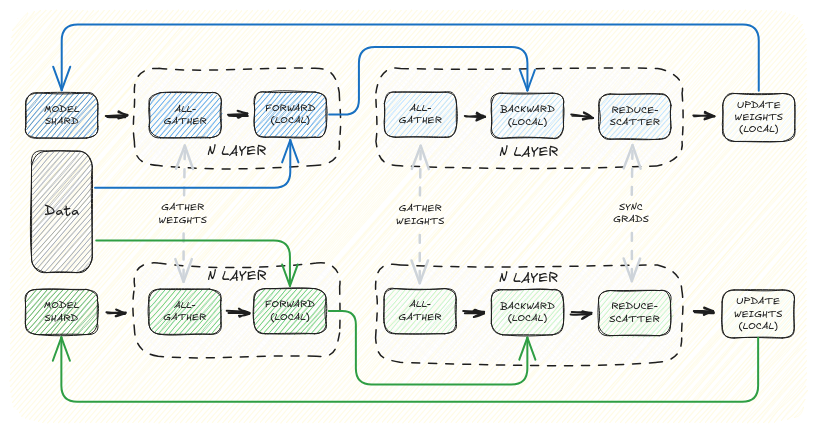
</p>

#### 零冗余权重

在 MoE模型常见的大EP小TP模式部署下，尽管模型内占据主要参数量的MoE部分通过EP与流水线并行（PP）实现完全切分，各专家权重被无冗余地散布，Attention/共享专家部分的权重往往是在卡间进行冗余复制的。在此类混合并行策略导致局部参数冗余的场景下，FSDP2的优势尤为突出：通过将冗余部署的Attention权重与共享专家参数以DP域为单位进行二次分片，FSDP2能够在保持计算逻辑不变的前提下，显著削减跨DP域的参数副本数量，为更大批量或更长序列训练释放宝贵资源。

<p align="center">
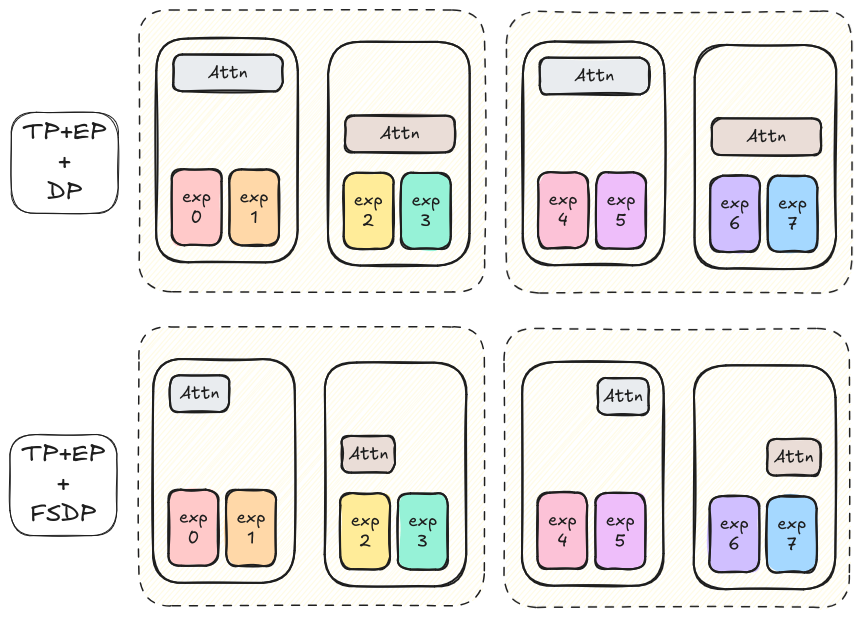
</p>

具体而言，考虑PP2TP4DP16的场景，单卡非MoE权重和梯度的总占用量约为(671B - 654B)/PP2/TP4 * 8Byte = ~18GB，考虑到其中部分权重不参与TP切分（如`qkv_a`与`indexer`），实际值将会进一步增加。DP16场景开启FSDP后，权重和梯度在各DP域间做完全均分，几乎可以完全消除相关的内存占用。最终，我们对比了如下几种切分策略，在考虑MoE极端负载不均衡的可能后选择了**PP2TP4EP64**为基础的切分方式。
<p align="center">
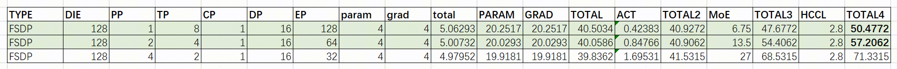
</p>

### Swap Optimizer

大模型训练中常用的AdamW优化器中需存储两个FP32的动量，这会带来巨大的内存代价：训练的前反向计算期间，优化器不会被使用，因此优化器会浪费巨量的device内存。

针对这一问题，MindSpeed开源训练框架设计了[SwapOptimizer特性](https://gitcode.com/Ascend/MindSpeed/blob/master/docs/features/swap-optimizer.md)，其优化内存的方式如下：

* 为节省device内存，在前反向期间将优化器卸载至host内存。
* 为了降低优化器更新时的内存峰值并尽可能提升性能，以param为粒度将“优化器加载——优化器更新——优化器卸载”设计为切片流水并行的形式。

<p align="center">

</p>

本样例在TorchTitan框架下参考并实现了SwapOptimizer特性，大大节省了训练时的device内存空间。与MindSpeed有所不同的是，TorchTitan训练中优化器只管理两个FP32动量，并且需要处理权重为DTensor的场景。

## DSA融合算子
### LI/SFA
`LightningIndexer/SparseFlashAttention`相关算子介绍可参考[NPU DeepSeek-V3.2 Ascend C 融合算子优化](https://gitcode.com/cann/cann-recipes-infer/blob/master/docs/models/deepseek-v3.2-exp/deepseek_v3.2_exp_AscendC_operator_guide.md)

### SparseLightningIndexerGradKLLoss

`SparseLightningIndexerGradKLLoss`基于一系列操作得到Sparse Training Stage每一个 token 对应的 Top-$k$ 个位置的反向梯度计算，并融合了Loss的计算。反向梯度计算的过程依赖于Sparse Flash Attention计算过程softmax的聚合与归一化结果与Lightning Indexer自身的输出分布，考虑到显存与算力的平衡，`SparseLightningIndexerGradKLLoss`算子在保留了一些重要正向计算结果的前提下进行了部分重计算。Lightning Indexer的正向输入Index Query $\tilde{Q}\in\R^{g\times d}$、Index Key $\tilde{K}\in\R^{S_{k}\times d}$，Sparse Flash Attention的正向输入Query $Q\in\R^{g\times d}$、Key $K\in\R^{S_{k}\times d}$,$W\in\R^{g\times 1}$，其中 $g$ 为 GQA 对应的 group size，$d$ 为每一个头的维度，$S_{k}$ 是上下文的长度，`SparseLightningIndexerGradKLLoss`算子的具体计算流程如下：

1. Lightning Indexer正向 Top-$k$ value的计算公式：

$$
_{t,:}=W_{t,:}@ReLU(\tilde{q}_{t,:}@\tilde{K}_{topk,:}^\top)
$$

- 其中，$W_{t,:}$是$W$矩阵中第$t$个token对应的$weights$，$\tilde{q}_{t,:}$是$\tilde{Q}$矩阵第$t$个token对应的$G$个query头合轴后的结果，$\tilde{K}_{topk,:}$为根据$\tilde{q}_{t,:}$的Top-$k$索引从$\tilde{K}$矩阵中取出的token组成的矩阵。

2. Sparse Flash Attention正向 Top-$k$ value的计算公式：

$$
_{t,:} = \text{Softmax}(q_{t,:} @ K_{topk,:}^\top/\sqrt{d})
$$

- 其中，$p_{t,:}$是第$t$个token对应的Softmax结果，$q_{t,:}$是$Q$矩阵第$t$个token对应的$G$个query头合轴后的结果，${K}_{topk,:}$为根据${q}_{t,:}$的Top-$k$索引从$K$矩阵中取出的token组成的矩阵。

3. 在训练阶段，需要将Lightning Indexer的输出与Sparse Flash Attention的softmax结果进行对齐计算loss，对应的loss function为：

$$
oss{=}\sum_tD_{KL}(p_{t,:}||Softmax(I_{t,:}))
$$

- 其中，$p_{t,:}$作为target distribution，需要在之前的计算结果上进行所有的head的求和，然后把求和结果沿着上下文方向进行L1正则化得到。$D_{KL}$为KL散度，其表达式为：
  
  $$
  D_{KL}(a||b){=}\sum_ia_i\mathrm{log}{\left(\frac{a_i}{b_i}\right)}
  $$

4. 通过求导可得Loss的梯度表达式：

$$
I\mathop{{}}\nolimits_{{t,:}}=Softmax \left( I\mathop{{}}\nolimits_{{t,:}} \left) -p\mathop{{}}\nolimits_{{t,:}}\right. \right.
$$

5. 利用链式法则可以进行weights，query和key矩阵的梯度计算：

$$
W\mathop{{}}\nolimits_{{t,:}}=dI\mathop{{}}\nolimits_{{t,:}}\text{@} \left( ReLU \left( S\mathop{{}}\nolimits_{{t,:}} \left) \left) \mathop{{}}\nolimits^{\top}\right. \right. \right. \right.
$$

$$
\mathop{{\tilde{q}}}\nolimits_{{t,:}}=dS\mathop{{}}\nolimits_{{t,:}}@\tilde{K}_{topk,:}
$$

$$
\tilde{K}_{topk,:}=\left(dS\mathop{{}}\nolimits_{{t,:}} \left) \mathop{{}}\nolimits^{\top}@\tilde{q}\mathop{{}}\nolimits_{{:t, :}}\right. \right.
$$

- 其中，$S$为$\tilde{Q}$和$\tilde{K}$矩阵乘的结果，$S_{t,:}$是$S$矩阵中第$t$行。$dW_{t,:}$是$dW$矩阵中第$t$行；$dq_{t,:}$是$d\tilde{Q}$矩阵中第$t$行；$d\tilde{K}_{topk,:}$是$d\tilde{K}$矩阵中Top-$k$索引对应行的累加值。

实际开发中需要充分利用昇腾硬件的特征以实现更好的性能，以下将详细介绍当前的解决方案及具体实现方式。

#### SLIG算子Tiling设计

算子核间 Tiling 设计如下：

`SparseLightningIndexerGradKLLoss`对B和S轴进行分核切分处理

算子核内 Tiling 设计如下：

`SparseLightningIndexerGradKLLoss`一次计算的基本块大小为$(128,128)$。

- L1空间划分如下部分：
  
  - $Q$ 矩阵：$128\times 576\times2\text{ Bytes}=144\text{ KB}$，即$Q$ 矩阵矩阵常驻于L1；
  - $Qindex$ 矩阵 使能Double Buffer：$2\times64\times 128\times2\text{ Bytes}=32\text{ KB}$，即$Qindex$ 矩阵常驻于L1；
  - $Gather$ 矩阵 使能Double Buffer：$2\times128\times 128\times2\text{ Bytes}=64\text{ KB}$，其中$Gather$矩阵每次的搬运大小为$(128,128)$；
  - $reluGrad$ 矩阵：$64\times 2048\times2\text{ Bytes}=288\text{ KB}$，其中$reluGrad$矩阵每次的搬运大小为$(64,2048)$。
- L0A，L0B，L0C使能DoubleBuffer，分别划分为$2\times32\text{ KB},2\times32\text{ KB},2\times64\text{ KB}$，
  
  - 在 $C_1$ 阶段$MatmulP$一次搬入 L0A 和 L0B的矩阵块大小分别为 $(128,128) / (128,64),(128,128)$。
  - 在 $C_1$ 阶段$MatmulSy$一次搬入 L0A 和 L0B的矩阵块大小分别为 $(64,128),(128,128)$。
  - 在 $C_2$ 阶段$MatmulDk$一次搬入 L0A 和 L0B的矩阵块大小分别为 $(128,64),(64,128)$。
  - 在 $C_2$ 阶段$MatmulDq$一次搬入 L0A 和 L0B的矩阵块大小分别为 $(64,128),(128,128)$。

#### SLIG Pipeline 设计

`SparseLightningIndexerGradKLLoss`的计算流程有五个阶段：即预处理Gather($V_0$)，矩阵乘和ReLu操作($C_1$)，以及后续$V_1$侧多个向量计算，$C_1$侧矩阵乘和后处理ScatterAdd操作($V_2$)。相较于`LightningIndexer`和`SparseFlashAttention`算子而言，该算子计算流程更为繁琐，数据依赖更加复杂，朴素的流水排布导致Cube和Vector计算过程中出现大量气泡，无法充分发挥算力优势。为了防止多个阶段的串行执行，需要提前下发 (Preload) 一次 $V_0$ 以实现流水的互相掩盖。具体流水效果图如下图所示：
<p align="center">
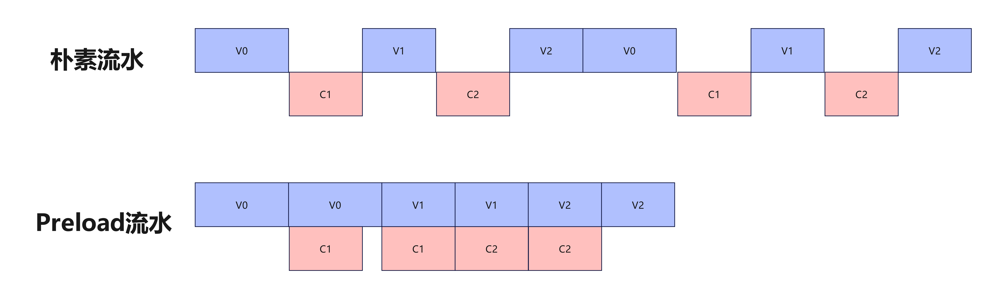
</p>

#### 离散访存优化

`SparseLightningIndexerGradKLLoss`算子Gather($V_0$)和ScatterAdd($V_2$)阶段都需要采用离散访存。对于非 Sparse 场景的 Attention 算子，数据访存一般是连续的，因此单次数据搬运耗时相较于指令下发耗时更长，可实现连续的多次访存，达到较高的访存带宽。然而对于 Sparse Attention 的离散访存而言，单次访存的耗时大幅下降，甚至可能小于指令下发的耗时，这就会导致严重的指令下发阻塞，如下图所示。

<p align="center">

</p>

基于 A3 芯片 Cube 核和 Vector 核数比为1:2的特性,利用 Vector 核发射访存指令，
将指令的下发效率提高一倍。另一方面，单次访存的数据量本身也会影响实际达到的带宽，
而离散访存单次的访存量较小，这会导致数据搬运本身的耗时高于预期。
针对这一问题,可以将离散的数据点两两聚合,利用srcGap参数实现成对的数据访存,提升访存带宽,如图所示。

<p align="center">

</p>

#### 合轴优化

`SparseLightningIndexerGradKLLoss`算子由于不同QueryToken对应的KeyToken不同，因此把N轴放到内层循环轴，将B和S轴作为切分轴。

### SparseFlashAttentionGrad

`SparseFlashAttention`算子整体沿用[FlashAttentionGrad](https://gitcode.com/cann/ops-transformer/blob/master/attention/flash_attention_score_grad/docs/FAG%E7%AE%97%E5%AD%90%E8%AE%BE%E8%AE%A1%E4%BB%8B%E7%BB%8D.md)的计算流程，针对离散访存进行了指令缩减及搬运聚合的细致优化，反向计算整体分为以下几个核心步骤，整体计算逻辑如下：

1. 根据Top-$k$索引从$K$矩阵中取出对应的的token组成$K_{topk}$矩阵。

$$
_{topk} = \text{Gather}(K, \text{Top-K index})
$$

2. 重计算Sparse Flash Attention正向softmax结果：

$$
= \text{Softmax}(Q @ K_{topk}^\top/\sqrt{d})
$$

3. 通过 $dY$ 与转置后的 $V$矩阵进行矩阵乘法得到$dP$：

$$
dP = dY @ V^T
$$

4. 将$dP$ 与 `FlashSoftmaxGrad` 计算结果做减法，再与$P$ 相乘得到 $dS$：

$$
dS = P *(dP - \text{FlashSoftmaxGrad}(dY @ attention\_in))
$$

- 其中，`FlashSoftmaxGrad` 的输入为反向梯度 `dY`和正向输出 `attention_in`。

5. 利用链式法则可以进行query、key和value矩阵的梯度计算：

$$
dQ = dS @ K_{topk} /\sqrt{d}
$$

$$
dK = \text{ScatterAdd}(dS^\top @ Q /\sqrt{d},\text{Top-K index} )
$$

$$
dV = P^\top @ dY
$$

#### SFAG 算子 Tiling 设计

算子的 Tiling 设计决定了储存空间是否被充分利用，进而影响整体的算力利用率以及算子性能。针对`SparseFlashAttentionScoreGrad`，本章分别阐述核间和核内的 Tiling 设计。

核间 Tiling 设计采用了如下方案：

当前`SparseFlashAttentionScoreGrad`算子将Batch轴与 $S_{Q}$ 合轴后作为分核轴，核数随分核轴连续排布。

- T = B *  $S_{Q}$
- CoreProcessNum = CeilDiv(T, CoreNum)

核内 Tiling 设计采用了如下方案：
**核内空间划分**：

|                           | 左矩阵L1基本块     | 右矩阵L1基本块    |
| ------------------------- | ------------------ | ----------------- |
| $Q_{index}$ @ $K_{index}$ | 128 * 576          | 128 * 128 * 2(DB) |
| $d_{y}$  @V               | 128 * 512          | 128 * 128 * 2(DB) |
| $d_{s}$ @ K               | 128 * 128 * 2(DB)  | 128 * 128 * 2(DB) |
| $d_{s}$ @ Q               | 128 * 128 * 2(DB)  | 128 * 576         |
| $d_{y}$ @ P               | 128 * 128  * 2(DB) | 128 * 512         |

- $Q_{index}$以基本块$128\times 256$的粒度载入到L1中，并在单基本块完成计算流的过程中常驻L1，以在$d_{s}$ @ $Q_{index}$计算中复用，减少重复访存量，同样的技巧也应用在$V_{index}$。如表中所示，其他矩阵乘计算中，受L1空间限制，源数据搬运启用DoubleBuffer,实现搬运与计算并行。同时UB上的基本块采用$128\times 128$。

#### SFAG Pipeline 设计

`SparseFlashAttentionScoreGrad`的计算流程包括五个阶段：$K_{index}$和$V_{index}$离散转连续的数据搬运（V0），$Q_{index}$@$K_{index}$和$d_{y}$@V（C1），计算P和$d_{s}$（V1），计算$d_{s}$@K，最后是$d_{k}$和$d_{V}$离散写出核外（V2）。严格按照计算图的基础流水排布如下图上半部分所示，多个阶段串行执行，会导致计算过程中出现大量的气泡。这里优化为在起步阶段连续发起两次V0和C1，接触后续计算的数据依赖，以实现流水的掩盖。效果如下图下半部分所示，可以看到CV间并行执行，大大减少了CV数据依赖损耗。

<p align="center">
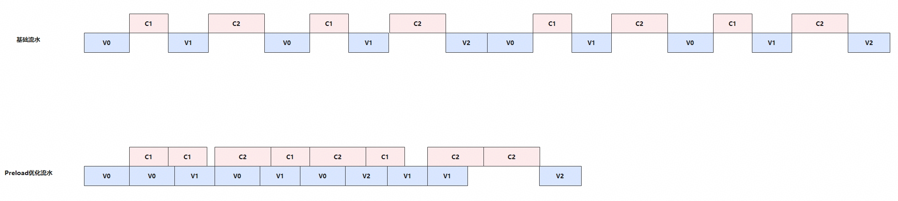
</p>

#### 离散访存优化

相较于传统FAG，SFAG增加了大量的离散访存，且单次访存的数据量较小，这样会导致访存指令本身的开销较大，带宽也无法充分发挥，针对此类问题，可以通过Vector核对离散数据做非连续转连续排布，以$128\times headDim$为基本块放置到workspace临时空间，而Cube侧发起计算时可以连续搬运输入数据，显著提高带宽利用率，如下图所示。

<p align="center">
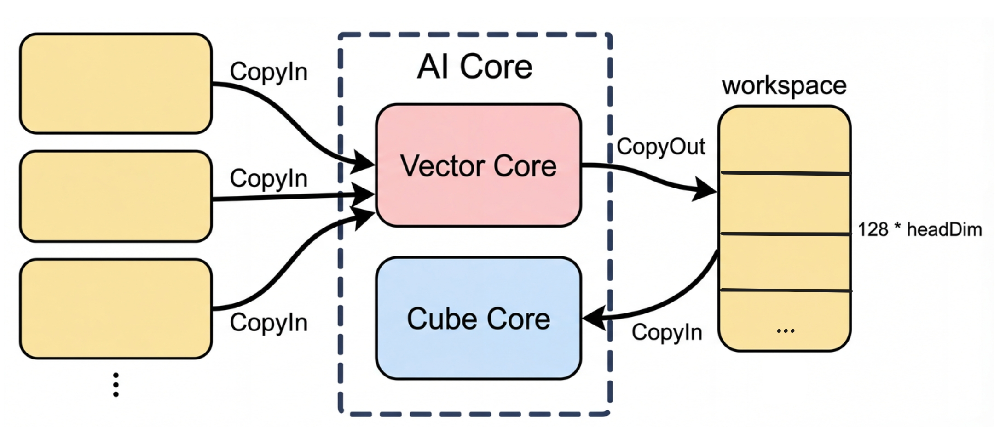
</p>

## FSDP2+Torch.compile+inductor加速

### A3超节点下的FSDP2预取掩盖

在本实践中，随着模型参数量和序列长度的激增，通信开销往往成为制约集群扩展效率的瓶颈。在 TorchTitan + CANN 的原生适配中，我们深度利用了 **FSDP2** 的核心特性——**权重预取（Weight Prefetching）**，并结合 A3 超节点的高带宽优势，实现了计算与通信的极致并发。

1）FSDP2 权重预取：确定性的通信流水线

FSDP2 基于 DTensor 构建，相较于传统 FSDP 提供了更细粒度的通信控制能力。我们在 NPU 上实现了精确的层间流水线调度：

当计算流（Compute Stream）执行第 N 层 Transformer Block 的前向或反向计算时，通信流（Communication Stream）已通过异步调度发起第 N+1 层的 AllGather 操作，提前聚合下一层所需的全量参数；与此同时，第 N 层计算完成后，其参数会立即被重新切分（reshard）回各卡，释放显存。

这种设计带来两方面收益：一是显著降低了模型参数的峰值显存占用；二是通过"预取"使计算单元无需等待参数就位，实现了通信与计算的真正并发（Compute-Communication Overlap）。

但需要注意的是，通算掩盖的前提是通信耗时短于计算耗时。仅靠软件层面的预取调度并不充分——若通信延迟远大于计算时间，流水线仍会产生阻塞。在这一点上，A3 超节点的高带宽互联架构发挥了关键作用，其高吞吐、低延迟的通信能力有效压缩了 AllGather 的耗时，为通算掩盖提供了硬件基础。
<div align="center">
  
</div>

2）软硬协同下的通算全掩盖

在上图实际 Profiling 中可以观察到，权重预取的All_gather通信几乎被Device侧的计算完全覆盖，DeepSeek-V3.2 的训练流水线呈现出极高的紧凑度，性能得到有效提升。

这一结果源于 FSDP2 预取机制与 A3 高带宽能力的协同配合：

* **软件侧**：FSDP2 通过异步预取，将通信任务精确地调度到计算间隙中；
* **硬件侧**：A3 的大带宽互联确保通信任务能在计算窗口内完成，使通信延迟完全隐藏于 NPU 的 Device 侧计算之中。

### Inductor 图优化加速

即使不依赖算子融合与 CUDA Graphs，Inductor 依然通过**Codegen Wrapper** 和 **静态化分析** 一定程度上缓解了 Host-bound 问题。它将原本由 Python 解释器逐行驱动的动态调度过程，转化为预编译的高效计算图执行流，通过在编译期完成算子选型、shape推导和内存规划，开启 Inductor 编译，能够成功绕过 PyTorch 运行时昂贵的 Dispatcher 分发机制和 Python 交互开销，加快 host 侧算子下发速度。

Inductor 编译将原本Eager模式下每个算子下发固定开销在编译期间解决，运行时host侧只剩下最精简的Kernel Launch调度，通过Profiling我们可以看出，原本linear层包含aten::t和aten::matmul两个算子，需要经过PythonDispatchMode下发具体算子，整体的host侧下发耗时为409.5us；开启compile后通过可执行python文件直接完成算子下发，同样四个操作仅需要118.8us的下发时间。

<div align="center">
  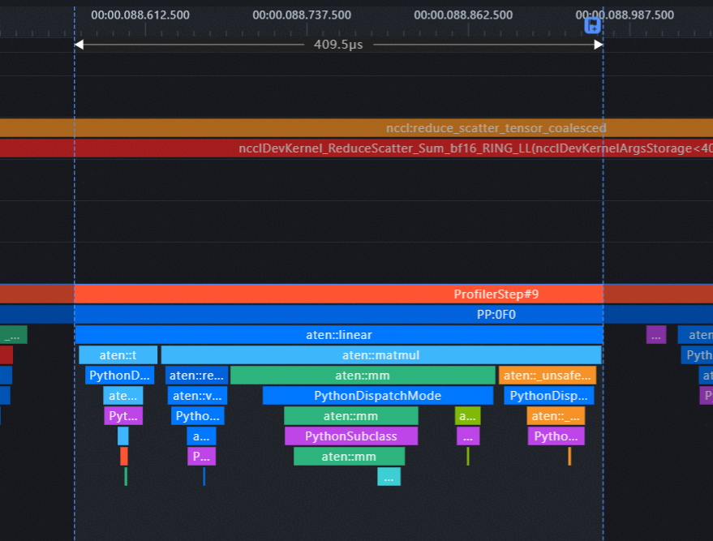
</div>

开启inductor后：
<div align="center">
  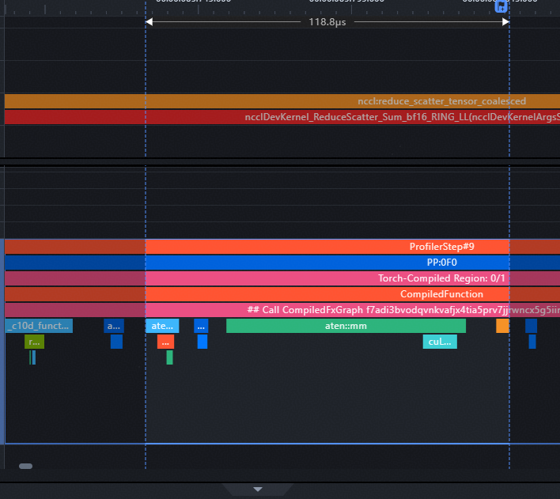
</div>

### bypass自动融合

在 Inductor 编译流程中，除了通过 fx_passes 进行图优化外，还包含以下几个关键步骤：

- decompositions 将复杂算子分解为基础算子组合；
- lowerings 字典将 FX 节点映射为对应的 IR 节点；
- Scheduler 根据融合收益对算子进行拓扑排序与调度决策；
- Scheduler 输出融合后的 IR 节点以及对应的执行计划；
- 最后由 Codegen 阶段将这些信息进一步转换为可执行的 Triton Python 代码。

实验中我们发现，当前 NPU 上由 Inductor 自动融合生成的 Triton 算子，其编译时间和执行性能均表现较差。因此，现阶段我们暂时绕过了 Inductor 流程中的 Triton Codegen 部分，后续将接入Ascend C Codegen 以更好地支持在 NPU 上使用 Inductor 后端进行完整编译。

<p align="center">
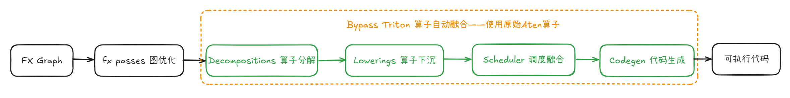
</p>

通过在 compile 之前清空 lowerings 和 decompositions，使得大部分Aten算子都不会被分解也不会下沉到Inductor IR，fallback到算子原始实现；此外，由于在`GraphLowering`中会对没有显式指定内存布局的反向算子添加`require_contiguous`约束，对于不连续的张量插入copy（clone）操作变为连续内存，这一操作会在反向阶段将aten算子转为单独的triton算子实现，我们对以上代码进行修改，去除对于反向算子的布局操作，所有算子均使用原始的布局，可以完全屏蔽triton算子。

## Benchmark

### 精度

我们在A3集群上预训练DeepSeek-V3.2模型实践表明，语言模型损失（lm loss）与梯度范数（grad norm）稳健收敛，表明TorchTitan框架结合TorchTitan-npu适配在大规模模型训练中的稳定性与高效性。lm loss从训练初始step1的12.25稳步下降至step37的8.37，全程保持持续递减趋势，无明显震荡；梯度同步从初始28.24平稳回落至16.03，整体趋于收敛且无异常波动。

<p align="center">
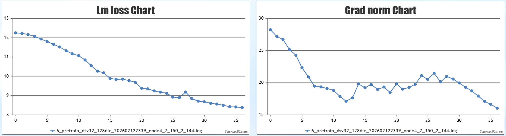
</p>

与此同时，对DeepSeek-V3.2网络所提出的Lighting Indexer也进行了训练。在整个预训练过程中，indexer loss稳步下降，且全程保持平稳递减。结合lm loss和grad norm变化曲线证明在大规模分布式场景下精度正常，能够高效支撑DeepSeek-V3.2模型的预训练任务。

<p align="center">

</p>

### 性能

当前TorchTitan-npu通过融合算子以及inductor的优化，能在基于Torch原生小算子实现的基础上，实现较为明显的性能提升；未来当Inductor后端接入昇腾原生的Ascend C Codegen，预期会有更加明显的性能收益。

#### 融合算子

通过前文提到的轻量级插件化方式，可以实现在不修改torchtitian代码的前提下，实现对NPU基础融合算子的支持，当前支持配置`RMSNorm`、`Rope`、`GMM`、`permute/unpermute`四个基础融合算子和DeepSeek-V3.2模型`DSA`融合算子`（LI/SFA/LIG）`，可以通过在训练配置toml文件中`converters`简单配置生效。

由于原始小算子实现存在较大的内存开销，我们在8层裁剪模型（1个dense层，7个moe层，每个moe层8个专家）和4层裁剪模型（1个dense层，3个moe层，每个moe层8个专家），设置训练长度4k，与小算子实现性能进行对比，性能及内存情况如下：

| 裁剪模型 | 实现方式 | 内存 (Memory) | 性能 (Performance) |
|---------|---------------|-------------------|-------------------|
| 8层裁剪模型 |  原始小算子实现 | 58.32G | 155TPS |
| 8层裁剪模型 |矩阵吸收 + DSA融合算子 | 50.54G | 400TPS |
| 4层裁剪模型 |  原始小算子实现 | 54.58G | 402TPS |
| 4层裁剪模型 |矩阵吸收 + DSA融合算子 | 38.71G | 568TPS |

DeepSeek-V3.2模型在使能`DSA`融合算子后，不仅可以显著降低训练中的内存占用，同时提升计算速度。

进一步开启基础融合算子，在完整DeepSeek-V3.2模型上测试单个step内计算时间减少**5.16%**，实验采集了融合算子开启前后，device侧的执行耗时：

| 算子类型 | 融合前耗时 | 融合后耗时 | 时间节省 | 性能提升比例 |
|---------|-----------|-----------|---------|-------------|
| **RMSNorm** | 138.7μs | 39.9μs | 98.8μs | **71.2%**  |
| **Permute** | 803.9μs | 127.3μs | 676.6μs | **84.2%**  |
| **GMM** | 3.1ms | 2.4ms | 0.7ms | **22.6%**  |


#### torch.compile
我们参考原始TorchTitan代码中`apply_compile`对于逐个`transformer block`进行整图编译的方式，将完整Attention部分拆分为`MLAProlog`，`inner_attention`，`MLAEpilog`三个部分，由于`inner_attention`已经使用DSA融合算子实现，host侧不需要过多的小算子下发，因此是否compile对整体性能影响不大。对于`MLAProlog`和`MLAEpilog`两个部分以及MoE部分的router、gate等进行编译，缓解小算子较多带来的host侧下发开销。

<p align="center">

</p>

开启compile后，对于MLAProlog存在明显host bound的情况有明显优化，原始host侧下发时间：

| | host侧下发时间 | device侧计算执行时间 |
|---|---|---|
| 开启compile前 | 11.0ms | 10.7ms |
| 开启compile后 | 5.7ms | 4.5ms |


在完整DeepSeek-V3.2模型实测，开启inductor compile后，单层耗时减少**5.1%**。由于DeepSeek-V3.2模型计算耗时集中于SFA、LI等主要算子，开启inductor对于host侧下发优化对整网性能提升效果有限。

## Future Plan

TorchTitan-npu 当前主要是兼容社区的生态，将PyTorch原生简单易用的TorchTitan生态迁移到NPU上，使得社区可以快速将训练任务迁移到昇腾芯片上部署，丰富CANN的训练生态；未来将进一步在基于torch.compile的开箱性能上持续优化；当前SFAG算子将在下一个CANN版本进行升级，大幅提升性能；此外我们还将在以下方向持续演进：

### Ascend C Autofuse对接

PyTorch框架在图模式下的Inductor组件为此提供了基础的算子融合与编译能力，其设计兼容现有PyTorch生态，具备良好的软件继承性。然而，由于NPU与GPU在内存架构、计算单元及并行机制等方面存在本质差异，直接沿用面向GPU的优化策略难以充分发挥NPU的硬件潜力，因此现阶段通过 Bypass Triton 方式规避 Triton 后端在 NPU 上的性能不足。
<p align="center">
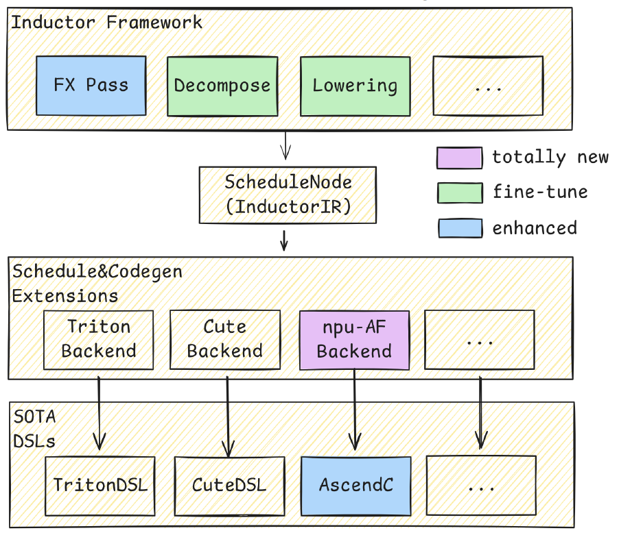
</p>
为在继承Inductor整体流程与接口的基础上实现针对NPU的高效融合，需具备面向NPU的即时编译（JIT）算子生成能力。为此，CANN框架继承的AutoFuse组件针对NPU架构特征进行了深度优化，实现了从计算图到高效NPU算子代码的自动化映射与生成。该组件不仅保持与Inductor技术的协同与兼容，更进一步通过架构感知的融合策略、内存访问优化与指令调度等手段，显著提升了算子融合在NPU上的执行效率，从而支撑复杂模型在NPU平台上的高性能部署，因此将进一步提升inductor编译后的模型性能。

### DualPipeV支持

[DualPipeV ](https://sail.sea.com/blog/articles/63)是一种专为大规模 MoE 模型（如 DeepSeek-V3）设计的高效流水线并行（Pipeline Parallelism, PP）调度策略，其脱胎自DeepSeek团队设计的[DualPipe](https://github.com/deepseek-ai/DualPipe)并借鉴了[InterLeave1F1B](https://arxiv.org/pdf/2104.04473)。

<p align="center">

</p>

DualPipeV的核心设计理念是：一个设备上可以同时承载一个前向计算batch和一个反向计算batch，两者的通信和计算可以互相并行，以此可以很大程度上用另一个batch的计算掩盖MoE EP并行带来的通信开销。

TorchTitan社区已初步支持DualPipeV特性，但在实践中发现无法在ZeRO3 DP切分的场景下使能DualPipeV，原因是torch原生的dW计算实现约束了权重W不能在DP域维持切分状态。为了同时拿到内存和性能收益，后续会对TorchTitan进行适配，以实现ZeRO3与DualPipeV同时使能。

### TP_async支持

TP 通过 AllGather 和 ReduceScatter 在层内完成跨卡同步，通信延迟直接暴露在关键路径上。Async TP 的核心思想是将通信与计算算子同时进行分解——AllGather 拆分为多个 Send/Recv，Matmul 拆分为对应的子 Matmul——使得一个子 Matmul 的计算与下一个 chunk 的数据传输并发执行，从而隐藏通信延迟。

<p align="center">
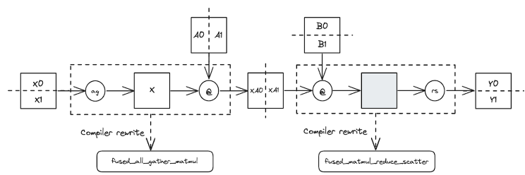
</p>

在 TorchTitan-npu 中，Inductor 编译器在 FX 计算图的阶段，可以识别这种**all_gather + mutmal**或者 **matmul + reduce-scatter**这种pattern，并自动完成这一分解与重排序，无需修改模型代码。配合 A3 节点内的高带宽卡间互联，层内 TP 通信可被有效压缩并隐藏在计算窗口之中。


