# Qwen3-235B 32K长序列RL训练优化实践

本文系统总结了基于verl框架与A3集群的Qwen3-235B模型32K长序列强化学习训练优化实践，详细介绍了对RL长序列场景下特有的**长尾序列负载不均**、**显存瓶颈**等问题进行的多项优化。通过文中所述技术，本实践成功将系统吞吐从个位数大幅度提升至122TPS/卡。同时，本文还与近期发布的Seer长序列RL训练系统中的相关优化思路进行了对比分析，揭示了技术路线上的共识与差异。

## 1. 前言
### 1.1 背景

长序列处理能力是推动大型语言模型走向实用化的关键。以具备32K上下文长度处理能力的Qwen3-235B模型为例，它能够有效应对长篇文章解析、复杂多轮对话和大规模代码编写等现实任务，在金融研报分析、法律条文解读以及科研文献理解等多个领域都展现出重要的应用价值。因此，如何高效处理训练与推理过程中的长序列数据，已成为影响模型部署效率的关键因素。

特别地，在强化学习场景中，模型不仅需要在超长上下文中进行复杂的思维链（CoT）推理与奖励训练，还面临**HBM内存消耗随序列长度线性增长、长尾序列分布导致负载不均等挑战**，这无疑对训练与推理系统的效率及稳定性提出了更高要求。

针对上述问题，本实践在[前序工作](https://gitcode.com/cann/cann-recipes-train/blob/master/docs/llm_rl/deepseek_rl_train_optimization.md)基础上，沿用verl的前端，采用vLLM-Ascend作为推理引擎，MindSpeed作为训练引擎，在64卡A3集群上对Qwen3-235B模型进行了32K长序列GRPO算法的强化学习训练优化。本实践系统性地从**模型切分策略**、**长序列负载均衡**、**计算与通信效率**等多个维度入手，显著提升了长序列训练吞吐，最终实现122TPS/卡的系统性能。

值得一提的是，近期月之暗面&清华发布的论文[《Seer: Online Context Learning for Fast Synchronous LLM Reinforcement Learning》](https://arxiv.org/html/2511.14617v1)中，也提出了多项针对长序列强化学习的优化策略，与本实践的思路高度契合。本文也对其中的一部分策略进行了对比分析。

### 1.2 优化实践总览

本实践对verl开源代码进行了以下关键功能的适配与优化：

-   训练引擎适配：verl框架当前已经原生支持MindSpeed训练引擎，但在开启moe\_alltoall\_overlap后会出现专家权重加载异常问题，本实践针对该问题进行了修复与适配。

-   推理引擎优化：推理过程中的sleep模式依赖torch\_npu的虚拟内存动态切换，目前采用[前序工作](https://gitcode.com/cann/cann-recipes-train/blob/master/docs/llm_rl/deepseek_rl_train_optimization.md)的方法实现推理权重及kv\_cache的加载与卸载。

-   框架适配：参考[前序工作](https://gitcode.com/cann/cann-recipes-train/blob/master/docs/llm_rl/deepseek_rl_train_optimization.md)修改了verl框架，在GRPO这类on-policy训练算法中实现了old\_log\_prob免计算。

本实践针对长序列推理和训练中的性能瓶颈与内存占用，进行了系统性地优化，具体方法如下图所示：

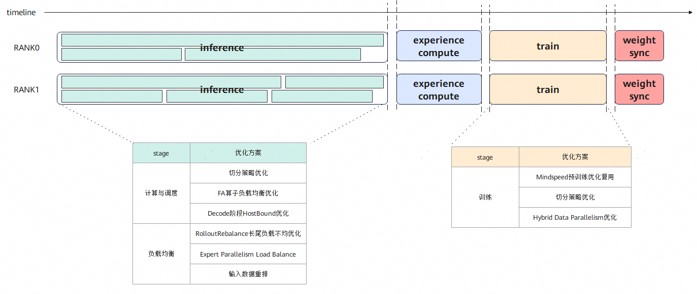

### 1.3 详细性能结果

#### 1.3.1 GRPO算法

在Atlas A3（64卡）集群上，对加载了真实权重的Qwen3-235B-A22B模型进行了GRPO算法RL训练，在Prompt/Response最大长度分别为2K与32K的场景下，系统吞吐达到122TPS/卡。

|模型|部署方式|部署环境|RL框架|推理引擎|训练引擎|数据集|step|平均输入长度|平均输出长度|batchsize|采样数|rollout部署|actor部署|ref部署|
|--|--|--|--|--|--|--|--|--|--|--|--|--|--|--|
|Qwen3-235B-A22B|全共卡|64 * A3|verl|vLLM+vLLM-Ascend|Megatron+MindSpeed|deepscaler|1|73.7|7344.973|512|16|128die DP32TP4EP128|128die TP4PP4CP4EP32|128die TP4PP4CP4EP32|

<table><thead align="left"><tr id="row1458491718124"><th class="cellrowborder" colspan="4" valign="top" id="mcps1.1.10.1.1">
数据生成(s)

</th>
<th class="cellrowborder" valign="top" id="mcps1.1.10.1.2">
训练(s)

</th>
<th class="cellrowborder" valign="top" id="mcps1.1.10.1.3">
总耗时(s)

</th>
<th class="cellrowborder" valign="top" id="mcps1.1.10.1.4">
推理吞吐

(tokens/s/卡)

</th>
<th class="cellrowborder" valign="top" id="mcps1.1.10.1.5">
训练吞吐

(tokens/s/卡)

</th>
<th class="cellrowborder" valign="top" id="mcps1.1.10.1.6">
系统吞吐

(tokens/s/卡)

</th>
</tr>
</thead>
<tbody><tr id="row17585181717125"><td class="cellrowborder" colspan="4" valign="top" headers="mcps1.1.10.1.1 ">
5351.17

</td>
<td class="cellrowborder" valign="top" headers="mcps1.1.10.1.2 ">
2353.23

</td>
<td class="cellrowborder" rowspan="3" valign="top" headers="mcps1.1.10.1.3 ">
7780.36

</td>
<td class="cellrowborder" rowspan="3" valign="top" headers="mcps1.1.10.1.4 ">
233.56

</td>
<td class="cellrowborder" rowspan="3" valign="top" headers="mcps1.1.10.1.5 ">
403.5

</td>
<td class="cellrowborder" rowspan="3" valign="top" headers="mcps1.1.10.1.6 ">
122.05

</td>
</tr>
<tr id="row19585817141211"><td class="cellrowborder" valign="top" headers="mcps1.1.10.1.1 ">
rollout (s)

</td>
<td class="cellrowborder" valign="top" headers="mcps1.1.10.1.1 ">
ref prefill (s)

</td>
<td class="cellrowborder" valign="top" headers="mcps1.1.10.1.1 ">
reward (s)

</td>
<td class="cellrowborder" valign="top" headers="mcps1.1.10.1.1 ">
adv (s)

</td>
<td class="cellrowborder" valign="top" headers="mcps1.1.10.1.2 ">
update(s)

</td>
</tr>
<tr id="row19585317161215"><td class="cellrowborder" valign="top" headers="mcps1.1.10.1.1 ">
4065.71

</td>
<td class="cellrowborder" valign="top" headers="mcps1.1.10.1.1 ">
1262.269

</td>
<td class="cellrowborder" valign="top" headers="mcps1.1.10.1.1 ">
21.538

</td>
<td class="cellrowborder" valign="top" headers="mcps1.1.10.1.1 ">
1.654

</td>
<td class="cellrowborder" valign="top" headers="mcps1.1.10.1.2 ">
2353.23

</td>
</tr>
</tbody>
</table>

（注：当前step1统计时间中不包含前置的模型初始化，图编译等部分，只包含上图所示各个阶段。）

#### 1.3.2 DAPO算法

在GRPO训练的基础上引入DAPO优化，具体配置如下：

-   设置clip阈值（clip\_low=0.2，clip\_higher=0.28）。

-   使用token-level重要性采样（rollout\_is\_threshold=2.0）。

-   不使用kl\_loss（actor\_rollout\_ref.actor.use\_kl\_loss=False）。

-   在token-level计算Policy Gradient Loss（actor\_rollout\_ref.actor.loss\_agg\_mode=\"token-mean\"）。

-   打开样本过滤（algorithm.filter\_groups.enable=True），去除掉group内reward全部为0或1的样本。

本实践基于Atlas A3（64卡）集群，对加载了真实权重的Qwen3-235B-A22B模型，使用DAPO算法进行RL训练。模型Prefill与Decode阶段长度分别设置为2K与34K。由于在dapo-math-17k数据集上模型回答普遍变长，为保障训练效率，调整GBS=128。性能测试结果如下： 

|模型|部署方式|部署环境|RL框架|推理引擎|训练引擎|数据集|step|平均输入长度|平均输出长度|batchsize|采样数|rollout部署|actor部署|ref部署|
|--|--|--|--|--|--|--|--|--|--|--|--|--|--|--|
|Qwen3-235B-A22B|全共卡|64 * A3|verl|vLLM+vLLM-Ascend|Megatron+MindSpeed|dapo-math-17k|1|132.78|10119.23|128|16|128die DP32TP4EP128|128die TP4PP4CP4EP32|128die TP4PP4CP4EP32|

<table><thead align="left"><tr id="row147221820256"><th class="cellrowborder" colspan="5" valign="top" id="mcps1.1.11.1.1">
数据生成(s)

</th>
<th class="cellrowborder" valign="top" id="mcps1.1.11.1.2">
训练(s)

</th>
<th class="cellrowborder" valign="top" id="mcps1.1.11.1.3">
总耗时(s)

</th>
<th class="cellrowborder" valign="top" id="mcps1.1.11.1.4">
推理吞吐

(tokens/s/卡)

</th>
<th class="cellrowborder" valign="top" id="mcps1.1.11.1.5">
训练吞吐

(tokens/s/卡)

</th>
<th class="cellrowborder" valign="top" id="mcps1.1.11.1.6">
系统吞吐

(tokens/s/卡)

</th>
</tr>
</thead>
<tbody><tr id="row373141816251"><td class="cellrowborder" colspan="5" valign="top" headers="mcps1.1.11.1.1 ">
6638.49

</td>
<td class="cellrowborder" valign="top" headers="mcps1.1.11.1.2 ">
797.93

</td>
<td class="cellrowborder" rowspan="3" valign="top" headers="mcps1.1.11.1.3 ">
7833.16

</td>
<td class="cellrowborder" rowspan="3" valign="top" headers="mcps1.1.11.1.4 ">
100.56

</td>
<td class="cellrowborder" rowspan="3" valign="top" headers="mcps1.1.11.1.5 ">
411.14

</td>
<td class="cellrowborder" rowspan="3" valign="top" headers="mcps1.1.11.1.6 ">
41.88

</td>
</tr>
<tr id="row8731118172518"><td class="cellrowborder" valign="top" headers="mcps1.1.11.1.1 ">
rollout (s)

</td>
<td class="cellrowborder" valign="top" headers="mcps1.1.11.1.1 ">
num_gen_batches

</td>
<td class="cellrowborder" valign="top" headers="mcps1.1.11.1.1 ">
rollout  / 单轮推理(s)

</td>
<td class="cellrowborder" valign="top" headers="mcps1.1.11.1.1 ">
reward (s)

</td>
<td class="cellrowborder" valign="top" headers="mcps1.1.11.1.1 ">
adv (s)

</td>
<td class="cellrowborder" valign="top" headers="mcps1.1.11.1.2 ">
update(s)

</td>
</tr>
<tr id="row37341811254"><td class="cellrowborder" valign="top" headers="mcps1.1.11.1.1 ">
6619.78

</td>
<td class="cellrowborder" valign="top" headers="mcps1.1.11.1.1 ">
2

</td>
<td class="cellrowborder" valign="top" headers="mcps1.1.11.1.1 ">
3262.39

</td>
<td class="cellrowborder" valign="top" headers="mcps1.1.11.1.1 ">
18.43

</td>
<td class="cellrowborder" valign="top" headers="mcps1.1.11.1.1 ">
0.28

</td>
<td class="cellrowborder" valign="top" headers="mcps1.1.11.1.2 ">
797.93

</td>
</tr>
</tbody>
</table>

打开样本过滤后，在第一个训练step中进行2个batch的推理，单轮推理时间为3262.39s，总推理时间为6619.78s，单步总耗时为7833.16s，推理吞吐达到100TPS，总吞吐达到41.88TPS。

前15个step训练reward和response length曲线如下：

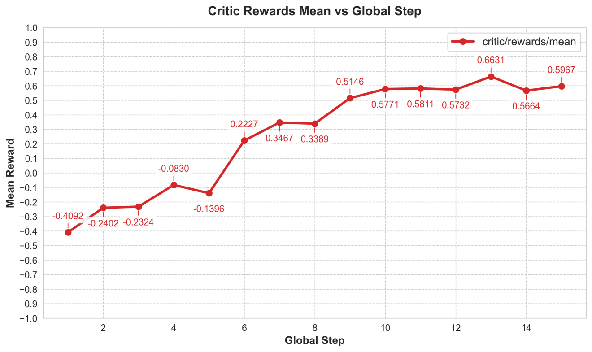

## 2. 推理优化

在强化学习训练中，数据生成推理阶段一直是性能优化的重中之重，在长序列场景下，推理阶段的耗时可占总体耗时的70%以上；在当前Qwen3-235B模型的2K推32K场景下，推理阶段耗时亦是如此。为攻克此难题，我们针对RL推理的框架调度、通信、负载均衡等多方面进行了深度优化，最终在**Qwen3-235B的2K推32K场景，将推理吞吐提升至233 token/s/卡**，主要历程如下图所示（图中展示为系统吞吐的变化）：

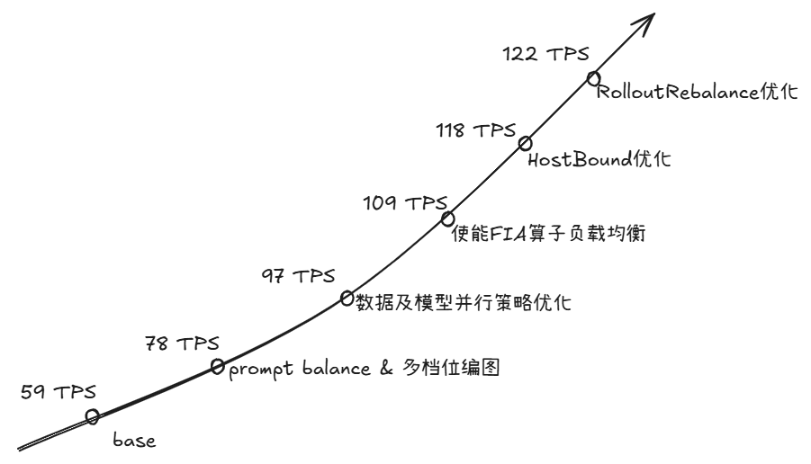

### 2.1 内存占用分析与部署策略选择

在大模型推理过程中，内存占用主要包含以下几部分：模型权重、预留激活内存和
KV Cache，其各自大小通过如下的方式确定：

1.  **模型权重**：由具体模型和切分配置决定。\
    具体到 Qwen3-235B-A22B 模型和 TP4DP32EP128
    的切分配置中，模型权重共占用约**7.09GB**内存空间。

    |TP|DP|EP|模型权重(GB)|Embedding/LmHead(GB)|QKV(GB)|O(GB)|MoE(GB)|Gate(GB)|
    |--|--|--|--|--|--|--|--|--|
    |4|32|128|7.09|0.58|1.65|1.47|3.30|0.09|

2.  **预留激活内存/KV Cache**：预留激活内存由初始化阶段的实测决定；KV Cache 内存则在激活内存与模型权重之外，按照预设比例在剩余内存中分配。
    在推理的预热阶段，框架使用一批预设数据执行模型，并记录模型推理时网络计算过程中分配的峰值激活内存，这一过程通常被称为profiling\_run。如下图所示，在profiling\_run结束之后：
    
    1.  通过 torch\_npu 的内存系列接口 mem\_get\_info/memory\_stats，可以查询当前设备使用内存 used(1) ，当前 Torch 分配内存 current(2) ，其差值即为模型执行时非 torch 管理内存的数量 others(3) 。此值与Torch 峰值内存 peak(4) 叠加，可以获取网络执行过程中对 NPU 内存的最大占用量，其中包含了外部内存、模型权重内存以及 profiling\_run 中测量到的峰值激活内存。
    
    2.   vLLM 启动时会指定其最大使用的 NPU 内存量(5)，在除去前述的各内存占用项后，由 vLLM 申请，专用于存储 KVCache(6) 。
    
        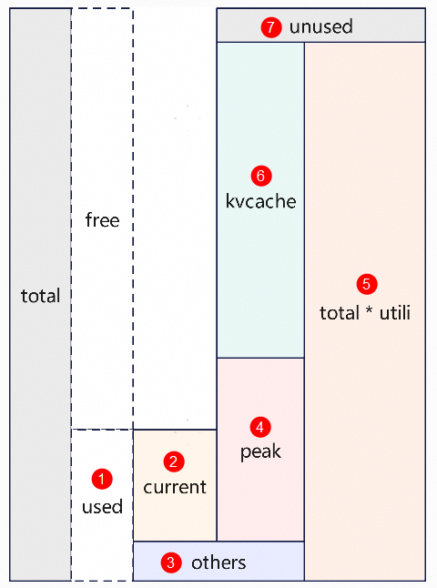

**在 Prefill 阶段**，系统使用初始 prompt 数据填充 KV Cache，本实践RL场景下输入序列通常较短，对 KV Cache 的内存需求并不突出。为提升效率，推理框架通常会将多个 prompt 拼接在一起，在一次 prefill 中完成多个序列 KV Cache 的填充。拼接后 prompt 的最大长度由参数 max\_num\_batched\_tokens 控制。一方面，在 DP-Attention/EP-MoE 的模型部署下， MoE 层往往会因为专家负载不均衡而出现较大显存激活值挤占 KV Cache 内存空间，在显存受限场景下通常不能将 max\_num\_batched\_tokens 设置过大，而本实践适配了Chunk-MoE的新特性有效降低了prefill阶段的峰值内存，因此配置了较大的max\_num\_batched\_tokens，具体适配代码可参考开源仓库。另一方面，由于RL step间可能产生的内存碎片，后续step中Prefill阶段的实际峰值内存往往会出现增长，因而KV Cache内存也需要在合理的范围内进行分配，为后续step的Prefill激活内存空间留出一定的裕度。基于以上考虑，本实践最终采取了max\_num\_batched\_tokens=32768 和 gpu\_memory\_utilization=0.87 的参数配置，用于满足Prefill和Decode阶段各自的内存需求。

**在 Decode 阶段**，由于每次处理的序列长度为 1，且并发序列数 max\_num\_seq 通常比 max\_num\_batched\_tokens 低一个数量级，因此产生的激活内存占用较低。这一阶段的主要矛盾在于，随着序列逐渐变长，对 KV Cache 的内存需求可能超出预分配上限。理论上，可根据 KV Cache 总大小反推出给定序列长度下可支持的最大序列数 max\_num\_seqs。以Qwen3-235B-A22B模型在TP4切分下的32K长序列场景为例：单个BS对应的KV Cache占用高达**1.47GB**，导致单卡BS上限仅在30\~40量级，与离线推理场景下的大BS诉求相违背，示例如下图所示。

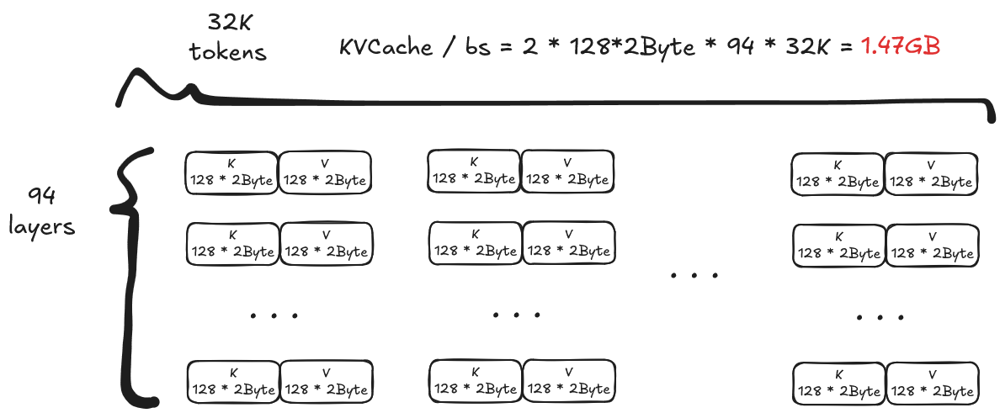

实际上，以上的单卡最大BS推算是过于保守的 —— 下方左图展示了DeepScalar数据集一次推理过程中256条回复的实际长度分布，可以发现仅有少数长尾样本会达到最大长度，大多数序列会在早期退出并释放 KVCache。若按最大序列长度严格限制 max\_num\_seqs，会导致推理初期吞吐量严重受损。

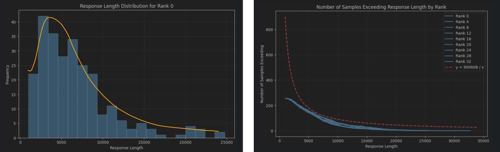

我们进一步尝试以样本平均推理序列长度（7K）估算合理的 max\_num\_seqs，发现结果（约为128）仍然保守。实际测试中，即使将 max\_num\_seqs 设置为256（已经达到预估值的2倍），在这一数据集中依然未触发 KVCache 的OOM。为探究其原因，我们采集了推理过程中各 DP 域内全部 256 个回复的长度，统计"各长度下剩余序列的数量"，并将其与"给定KVCache容量下序列长度-最大序列数量"的反比例曲线绘制在一起，如上方右图所示。可以看到，随着部分序列推理完成并释放 KVCache，剩余序列得以继续增长至最大长度，在任何一个时刻下，这一样本中的各蓝色曲线均处于红色反比例曲线下方，因而未触发KVCache内存不足的问题。尽管如此，上图也同时表明，在推理长度到达5K\~10K时，KVCache内存已经相当紧张，正是因为当前样本中序列结束的速度足够快，系统才在初始高并发下持续运行而未触发OOM。可以预见，在极端情况下，**即使按照样本最小序列长度来计算初始BS**，只要推理过程中剩余序列数量贴合前述反比例函数下降，理论上依然有可能使用有限的KVCache完成推理。

因此，为优化长序列场景下的吞吐性能，我们对 Qwen3-235B 模型采用了 TP4 切分策略：在 Decode 访存 bound 的前提下，用更大的 TP 降低单卡权重占比，从而预留更多 KV cache 空间，同时缓解访存瓶颈（见[切分策略优化](#221-切分策略优化)）；同时通过上述的内存分析，我们将max\_num\_seq设置为256，在不触发OOM前提下进一步充分利用内存，大幅提高推理吞吐。

### 2.2 计算与调度优化​

本实践针对框架的计算和调度做了大量的优化，其中部分的通信及调度问题与[前序工作](https://gitcode.com/cann/cann-recipes-train/blob/master/docs/llm_rl/deepseek_rl_train_optimization.md)的优化是通用的，
此处复用，具体实现参考[相关技术解析](https://gitcode.com/cann/cann-recipes-train/blob/master/docs/llm_rl/deepseek_rl_train_optimization.md)。

1. 针对vLLM框架侧的调度优化：我们将其从Gloo后端的CPU侧通信修改为HCCL后端的NPU侧通信，显著降低通信延时，提升了整体的吞吐，具体参考[前序工作](https://gitcode.com/cann/cann-recipes-train/blob/master/docs/llm_rl/deepseek_rl_train_optimization.md)的 **“RL推理调度bound优化”**。

2. 开启零冗余TP转EP通信优化，将MoE层内的StridedSlice和AllGather算子消除，具体参考[前序工作](https://gitcode.com/cann/cann-recipes-train/blob/master/docs/llm_rl/deepseek_rl_train_optimization.md)的 **“零冗余TP转EP通信优化”**。

本节则着重介绍在长序列场景下实现的4个新优化点。

#### 2.2.1 切分策略优化

##### 现象分析

面对复杂的长序列推理场景，路由专家部分我们默认选择大EP的方案，即EP128的策略；但是对于TP切分策略的选择需要进一步分析。

我们采集了一份长序列下开启多档位编图的profiling数据，取其中一个Matmul计算来分析，如下表所示：

|算子名称|decode_length|shape|Wall Duration|
|--|--|--|--|
|MatMul|2k|"256,2048;4096,2048"|32us|
|MatMul|4k|"256,2048;4096,2048"|32us|
|MatMul|8k|"128,2048;4096,2048"|23us|
|MatMul|16k|"32,2048;4096,2048"|19us|
|MatMul|24k|"4,2048;4096,2048"|15us|

发现随着较多的request推理结束，图的shape不断变小，Matmul计算量明显降低，但是耗时并没有随着计算量的减少等比例变化。

我们猜测长序列的长尾场景下，计算并没有bound，反而绝大部分耗时都在搬运权重，存在明显的访存bound。

##### 优化方案

对于非MoE部分采用更大的TP切分策略，使得每张卡仅加载较小的权重，提高计算在整体耗时中的占比。

为了验证该方案的可行性，我们做了下表所示的实验：

|step|推理模型切分|GBS|采样数|910C卡数|数据集|序列长度|多档位编图|max_num_seq|prompt len|response len|generate_sequence/s|
|--|--|--|--|--|--|--|--|--|--|--|--|
|1|TP4DP32EP128|64|16|64|deepscaler|2K推32K|开|32|76.3|6360|1369.4|
|1|TP1DP128EP128|64|16|64|deepscaler|2K推32K|开|8|76.3|6330.6|1614.2|

上述实验在推理输入数据保持不变的情况下，两种切分策略对应rank上的Matmul的计算量是完全一致的；但是从总耗时以及profiling上可以明显看到TP1切分的Matmul存在严重访存bound，单次执行耗时更久。

根据以上分析，我们采用TP4DP32的切分策略，整网性能更优。

##### 优化效果

1. TP4DP32的切分策略，减少了权重搬移带来的访存开销，在访存Bound场景下，带来了比较明显的性能收益，结果如上表所示。

2. 当前使用TP4切分，模型在单卡上占用更少的权重，可以预留更多的KVCache空间。实际训练中，TP4配置下更不容易出现KVCache不够用导致的request换出的情况，推理更稳定。

 

#### 2.2.2 图模式路径选择

##### 现象分析

在RL推理场景下，如果PyTorch处于Eager模式，那么NPU在大部分时间里都会空闲，CPU侧算子调度开销会成为推理主要耗时。因此通常会使能图模式来减少CPU侧的调度开销，具体分析可以参考[前序工作](https://gitcode.com/cann/cann-recipes-train/blob/master/docs/llm_rl/deepseek_rl_train_optimization.md)的TorchAir整图下沉章节。

目前在verl+vLLM的框架下存在5种可用的图模式路径，我们主要对比了其中两种图模式，并选择了更适合本实践场景的GE图模式。

两种图模式路径差异如下，左边路径为Full\_decode\_only ACLGraph，右边路径是TorchAir GE：

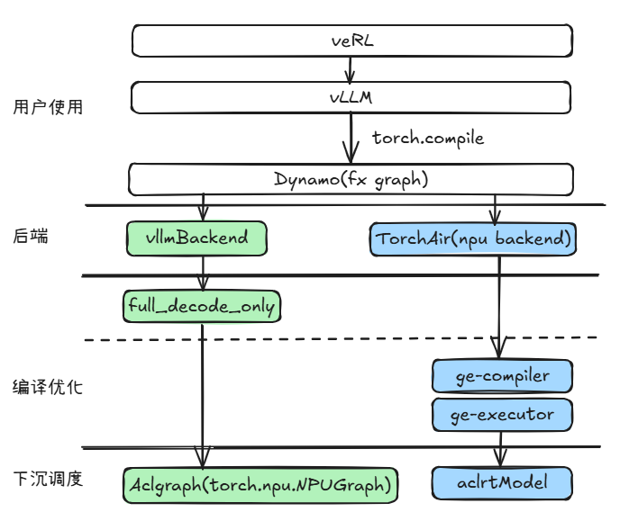

- **Full\_decode\_only ACLGraph:**

  该图模式的主要方案是将整个模型的的前向计算函数封装为一个可运行对象，并捕获前向过程中所有NPU操作序列，当前该方案已经在最新的vLLM-Ascend实现了Qwen3 235B模型的适配。

- **TorchAir GE图模式**：

  TorchAir GE是TorchAir的max-autotune模式。TorchAir将torch.compile生成的FX graph转换为昇腾中间表示（IR，Intermediate Representation），即Ascend IR计算图，并通过GE（Graph Engine，图引擎）实现计算图的编译、优化和执行。同时为了使模型获得最优执行性能，GE提供了计算图优化、多流并行、内存复用、静态kernel和Super\_kernel等技术手段。

##### 方案选择

本实践在Qwen3 235B的长序列训练中的rollout阶段，对两种图模式做了性能对比分析：

|step|mode|GBS|采样数|910C卡数|数据集|序列长度|多档位编图|max_num_seq|Infer_DP|prompt len|response len|generate_sequence/s|
|--|--|--|--|--|--|--|--|--|--|--|--|--|
|1|Full_decode_only ACLGraph|512|16|64|deepscaler|2K推30K|关|64|32|73.7|7089.6|6690|
|1|TorchAir GE|512|16|64|deepscaler|2K推30K|关|48|32|73.7|7099.5|9123.3|
|1|TorchAir GE|512|16|64|deepscaler|2K推30K|关|64|32|73.7|7069.5|8145|
|1|TorchAir GE|512|16|64|deepscaler|2K推30K|关|256|32|73.7|7130.3|6836.2|
|1|TorchAir GE|512|16|64|deepscaler|2K推30K|开|256|32|73.7|7110.8|4918.9|

从结果中可以明显的看到以下结论：

1. 当两种图模式的max\_num\_seq配置一致，即图的batchsize一致时，Full Graph因为其使用了性能更优的算子（ReshapeAndCacheNdKernel和PagedAttentionMaskNdKernel）整体推理耗时更优（上表中1,3行的消融实验）。

2. 较大global batchsize的配置下，当一个DP域的数据无法一次完成推理，例如表中实验：2,3行的max\_num\_seq仅配置为48和64会触发continuous batching，相较于第4行的实验来说则会带来较大的性能劣化；选择更大的max\_num\_seq会带来更大的内存压力，在[内存占用分析与部署策略选择](#21-内存占用分析与部署策略选择)我们也详细分析了推理侧的内存占用，也证明该方案的可行性（上表中2,3,4行的消融实验）。

3. 因为当前Full Graph在推理时占用了更多的内存，导致图的batchsize只能设置在64（更大则会OOM）。**在实际场景下，由于GE Graph可以配置更大的max\_num\_seq并开启多档位编图，反而能获得最优的总体推理耗时**（上表中1,5行的消融实验）。

此外，由于Full graph要求所有kernel输入地址固定为capture时地址，因此必须使用vLLM原生的sleep
mode来保证地址不变更。然而sleep mode依赖关闭PyTorch的虚拟内存，但训练阶段若禁用该功能会引发很多内存碎片，极易引发OOM，同时会导致训练性能也比较差。当前torch\_npu支持动态开启虚拟内存的功能尚在开发中，因此Full\_decode\_only ACLGraph还无法在大集群场景的RL训练中正常运行。

相对应的，如[前言](#1-前言)提到的[Seer论文](https://arxiv.org/html/2511.14617v1)所述，实际部署中常因内存不足，无法一次完成所有prompt推理，就会处于我们消融实验1,2,3行所描述的场景，需要依赖continuous batching来调度所有的请求。针对此场景，该研究提出了一种有效策略来缓解continuous batching带来的长尾问题：

基于"同一 group 内不同输出长度高度相关"的实验结论，优先从每个group中选择一个prompt组成"探测响应"，来实时估计该组其余请求的长度；接着调度器根据预估长度，执行近似 Longest-First Scheduling，优先推理长文本，从而显著压缩长尾。这为内存受限场景下的长尾优化提供了一种新思路。

##### 优化效果

综上所述，考虑到TorchAir GE在大Batchsize场景下的推理性能优势，且无需依赖sleep mode、可以开启Torch的虚拟内存，不影响训练性能，因此本实践最终选择基于TorchAir GE作为推理阶段的图模式方案。

 

#### 2.2.3 FA算子负载均衡优化

##### 现象分析

在这次优化之前，**原有FA算子运行逻辑如下**：

1.  假设现在的场景是在进行decode推理，需要计算的矩阵如下：
    输入为batch\_size=4的GQA attention矩阵，KV头数量为 4，Query头数量为 64，其中两组cache sequence\_length已经推理到28672，但是batch1中另外两组已经推理完成，具体进度如下图所示
    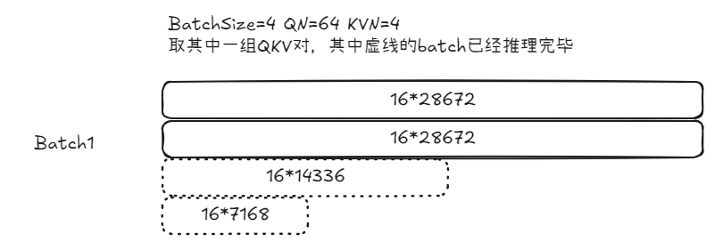
2.  根据计算性能要求进行数据切块，结果如下图所示：
    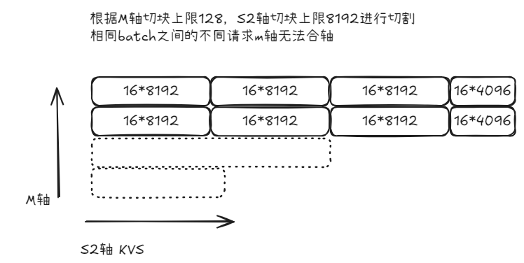

3.  假设最大可调动核数为4，由于没有做负载均衡，现在的两个推理计算分核如下图所示：
    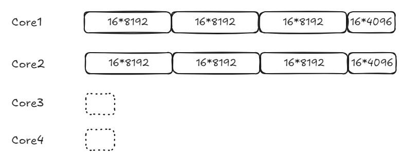
4.  可以观察到，当前仅有两个计算核心处于推理活跃状态，其余两个核心已退出计算任务。

    这个导致了如下问题：有些核还存在大量计算任务，而另外的核处于空闲状态，导致负载不均，算力浪费。

##### 优化方案

本次FA算子优化的核心目标是改善多核负载均衡。具体方案是将IFA算子（IncreFlashAttention）替换为FIA算子（FusedInferAttention），FIA算子当前支持更优的负载均衡逻辑。关于FIA算子的适配实现，请参考[开源仓库](https://gitcode.com/Ascend/op-plugin/blob/7.2.0/docs/context/torch_npu-npu_fused_infer_attention_score.md)。

负载均衡优化面临的关键问题如下：

-   分块：不同大小的负载具有不同的开销（权重），不能统一视为1。

-   分核：所有核数默认全部启动，没有考虑调度以及同步的开销，可能导致性能劣化。

本次优化主要从如下两个方面着手：

1.  确定最优核数：

    -   **增加核数**可降低单核负载，缩短慢核计算时间。

    -   **过多核数**会引入调度与同步开销，反而导致 FA 总耗时上升。

2.  优化块分配策略：

    将块合理分配到每个核，确保各核上的**总计算开销基本均衡。**

本实践最终采用**基于核数的循环模拟**方案，具体实现流程如下：

1.  计算最优核数。

    TotalBlocks：分块总数，TotalCores：总核数

    - 当TotalBlocks \>= (TotalCores-2)∙TotalCores：

      可以保证大任务收益稳定，直接启用全部核心进行满负荷计算。例如TotalBlocks=8，TotalCores=4，则可直接使用4核。

    - 当TotalBlocks \< (TotalCores-2)∙TotalCores：

      假设TotalCores = 8，TotalBlocks = 8，就需要进行核数评估。

      1. 核数范围确定：首先确定模拟的核数范围（MinCore \~ MaxCore）。

         根据实验拟合得的需要分块的最大最小核数公式，计算分核范围：

         $$MinCore = min(\sqrt{TotalBlocks + \frac{1}{4}} + \frac{1}{2},\ TotalCores)$$

         $$MaxCore = min(TotalBlocks,\ TotalCores)$$

         根据上面的例子TotalBlocks进行计算，得到需要遍历的核数在\[3,8\]

      2. 接下来**确定最优分核数**。

         为了确定最优分核数，需要最小化FA总时间$\text{TotalTime}$，其中$\text{CoreCost}$是核计算开销，$\text{CoreUsePlan}$是核调度成本，$\text{CoreUsePlan}$只和分核数k成正比，记作$\rho \times k$，其中$\rho$是常数。

         $$TotalTime = \max\left( \text{CoreCost}_{0}\ldots\text{CoreCost}_{k} \right) + CoreUsePlan(\rho \times k)$$

         根据硬件约束对 attention score 矩阵进行二维切分，得到N个Block分块，基于模拟得出的公式，计算每块的实际开销，按次序记为${\text{Lo}\text{adCost}}_{j}$。

         循环第一步得到的需要遍历的核数范围，通过贪心算法，计算该k核方案的总开销。

         - 对每个核 i ∈ \[0, k−1\]，计算该核开销上限$\text{CostLimit}$，其中$\text{UndistributedLoad}$表示剩余未分配的总开销，$k - i$表示剩余未分配核数：
         
           $CostLimit = \frac{\text{UndistributedLoad}}{k - i}$

         - 把block依次加入当前核并根据公式计算目前核所分配到的开销，当前核的累计总开销$\text{CoreCost}_{i}$满足下面的公式时：

           $$\text{CoreCost}_{i} + \text{LoadCost}_{j} \times 0.5 < CostLimit$$

         - 当前$\text{Block}_{j}$分配给当前$\text{Core}_{i}$，更新$\text{Core}_{i}$的累计开销。否则给下一个核。

           $$\text{Core}_{i} = \ {\text{Core}\text{Cost}}_{i} + \text{LoadCos}t_{j}$$

         - 记录当前分核方案的最慢核计算开销$\text{Cur}\text{MaxCost}$：
           $$CurMaxCost = \ \max\left( \text{CoreCost}_{0}\ldots\text{CoreCost}_{k} \right)$$

         - 最后，将所有分核方案的$\text{TotalTime}$计算出来，取最小的开销成本，即得到最优分核数。

2.  应用最优分核数，**分配最佳分块数**。

    为便于与优化前对比，本例仍然以4核为例，下图展示了块分配优化前后的开销：

    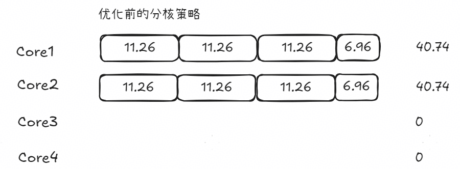
    
    
    该优化已集成于CANN 8.3.RC1，您只需在上层代码中调用对应的FIA算子进行适配即可。

 

##### 优化效果

测试结果表明，在同等配置下，启用负载均衡优化后，系统吞吐从105提升至117，提升幅度11.4%。

|优化|模型切分|GBS|采样数|910C卡数|数据集|序列长度|多档位编图|吞吐tps|prompt len|response len|generate_sequence/s|
|--|--|--|--|--|--|--|--|--|--|--|--|
|使用FA均衡优化前|TP4 PP4 CP4 EP32|512|16|64|deepscaler|2K推32K|开|105|73.7|7092.5|4919|
|使用FA均衡优化后|TP4 PP4 CP4 EP32|512|16|64|deepscaler|2K推32K|开|117|73.7|7110.8|4153|

#### 2.2.4 Decode阶段HostBound优化

##### 现象分析

在优化verl推理过程中，从日志观察到Decode各步骤耗时存在较大波动。为进一步定位，我们采集了profiling数据，发现每次Decode计算时间相对稳定，时间差异主要在于通信拖尾问题。

每次Decode前需要进行多个域的通信：

- 在 has\_unfinished\_requests() 中进行DP域通信。

- 在 VocabParallelEmbedding 中进行TP域通信。

- 在 MoEDispatch 进行EP域通信。

Profiling数据显示，各通信域正常单次执行时间为10\~20ms，但是都可能存在长达几十毫秒\~几千毫秒的拖尾，进而拉长单个step的集体通信时间，三次通信之间仅涉及少量NPU运算。

进一步分析表明，拖尾的根因是CPU侧存在空泡，导致下发延迟。如下图所示，13号卡的all\_reduce操作下发时间晚于同DP域内其他卡，在下发之前的scheduler阶段，CPU上存在一段空白期，NPU上无任何其他操作。该问题表面为通信拖尾，实际上是Host侧因GC与内存操作引入的阻塞，导致Host Bound。

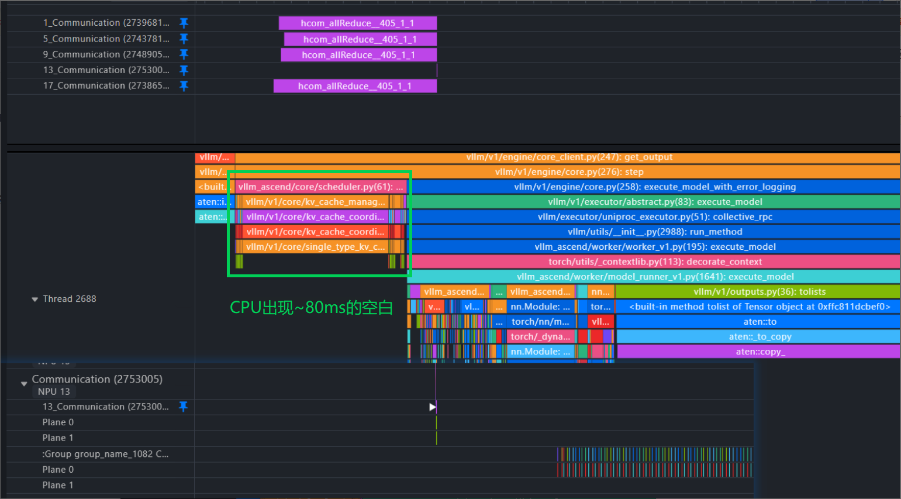

##### 优化方案

基于以上分析，我们进行以下两种优化：

1. **禁用GC**：在decode step执行阶段临时禁用GC，避免因触发GC占用CPU资源导致task下发阻塞，并在执行结束后再打开，避免长期关闭GC导致Host内存泄漏。

2. **添加CPU绑核**：考虑训练场景的Host Bound还有可能由于多线程并发抢占，造成了P核与numa内存的亲和性问题，通过绑核操作可以减少跨numa内存操作，减少抢占。

由于实验中发现Ray拉起训练任务时device id都被设置成了0，常用的torch\_npu的环境变量 CPU\_AFFINITY\_CONF并不能实现绑核操作，所以最终通过在框架初始化阶段ActorRolloutRefWorker时调用linux的taskset命令进行绑核，验证生效。

##### 优化效果

||forward / mean（ms）|generate_sequences / step（s）|
|--|--|--|
|baseline|137.64|4851.98|
|关闭gc|135.19|4635.82|
|关闭gc+添加绑核|124.66|4192.09|

在不开启优化时，单步decode forward平均时间为137.64ms，总推理时间为4851.98s；叠加GC和绑核优化后，单步decode forward平均时间为124.66ms（下降9.4%），总推理时间为4192.09（下降13.6%）。

### 2.3 负载均衡优化

#### 2.3.1 RL rollout长尾负载不均场景优化

为解决强化学习（RL）Rollout阶段因长尾请求导致的"木桶效应"与算力浪费，我们设计并实现了一套在vLLM推理引擎内的动态负载均衡调度方案，通过实时感知并迁移任务，协同多档位编译图能力，显著提升了长序列场景下的全局推理效率和资源利用率。最终实现的Rebalance特性同时支持了“大EP部署场景的单实例内负载均衡”以及"多实例场景的跨实例负载均衡"。

##### 现象分析

**长尾请求引发的"木桶效应"：**在强化学习的Rollout阶段，一个典型的性能瓶颈是"木桶效应"。该现象源于输入Prompt生成的响应（Response）长度存在显著的**长尾分布**。具体表现为：

1.  **任务耗时不均**：少数生成极长序列的任务会成为性能短板，其运行时长远超其他普通任务。

2.  **算力资源浪费**：当处理短序列任务的计算节点（DP组）完成后，它们不得不进入长时间的闲置等待状态，直到那些长序列任务也完成，才能进入下一轮同步。这造成了严重的算力闲置和资源浪费。

因此，解决长尾问题的本质，是在单轮推理的同步场景下实现高效的**负载均衡**，其核心目标是提升进入长尾状态后的整体推理效率。

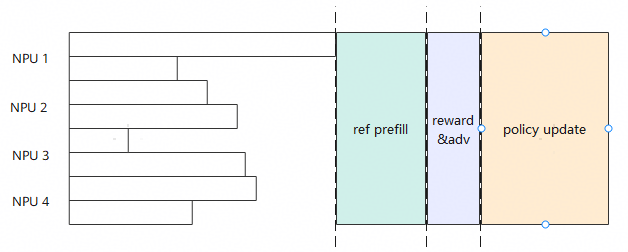

##### 优化方案

**基于动态感知的推理时负载均衡**：方案的核心思想是在推理过程中动态感知全局负载，当检测到DP组间负载不均满足特定条件时，主动触发Rebalance（重均衡）调度，将任务在不同节点间迁移，从而恢复负载均衡，提升系统整体的吞吐和资源利用率。

我们在分析verl调用vLLM的流程后发现，推理环节存在两个循环层面（见下图）：

-   **外层循环（绿色框）**：按Epoch加载数据集进行训练和推理。

-   **内层循环（红色框）**：vLLM接收单批次请求后，调用模型进行推理的循环。

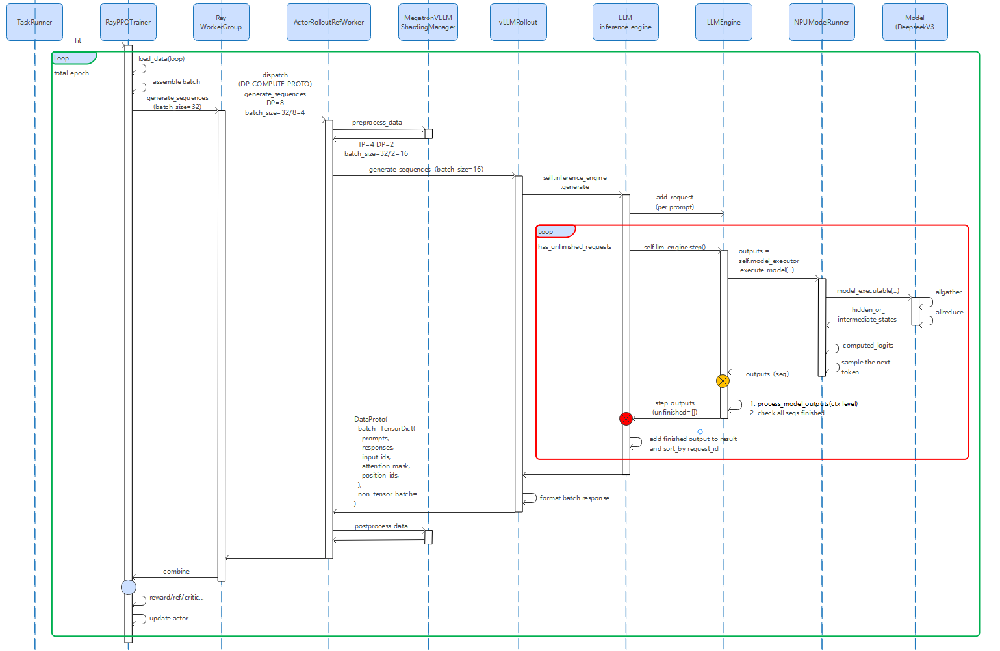

虽然两个层面均可实现请求级的均衡调度，但关键的"DP组推理进度"信息只能在vLLM的**内层循环**中被精确感知。因此，我们决定将优化逻辑聚焦于vLLM推理引擎内部，通过在每个推理Step前追加"负载均衡检查+Rebalance调度"环节，实现对推理任务的实时动态均衡。

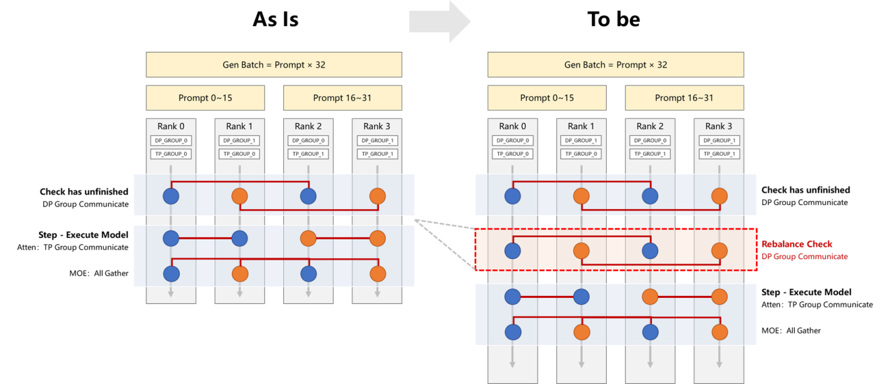

在RL场景中，为了提升性能通常会启用图模式（Graph Mode）。然而，在图模式下，即使推理任务数减少，Batch Size也不会随之降低，导致小批量请求的推理效率低下。

为解决此问题，我们结合了vLLM-Ascend的**多档位编图**能力。该能力可以为不同的Batch Size（如64/32/16/8/4/2/1）预先编译计算图。从下表的TPOT（Time Per Output Token）数据可以看出，随着Batch Size档位的下降，推理性能有显著提升。

<table><thead align="left"><tr id="row7731205617299"><th class="cellrowborder" colspan="2" valign="top" id="mcps1.1.10.1.1">
测试场景：初始BS=64，推理过程中动态BS减半

</th>
<th class="cellrowborder" colspan="7" valign="top" id="mcps1.1.10.1.2">
各BatchSize下的TPOT（ms）

</th>
</tr>
</thead>
<tbody><tr id="row1573118568298"><td class="cellrowborder" valign="top" width="10%" headers="mcps1.1.10.1.1 ">
Model

</td>
<td class="cellrowborder" valign="top" width="20%" headers="mcps1.1.10.1.1 ">
多档位编图

</td>
<td class="cellrowborder" valign="top" width="10%" headers="mcps1.1.10.1.2 ">
64

</td>
<td class="cellrowborder" valign="top" width="10%" headers="mcps1.1.10.1.2 ">
32

</td>
<td class="cellrowborder" valign="top" width="10%" headers="mcps1.1.10.1.2 ">
16

</td>
<td class="cellrowborder" valign="top" width="10%" headers="mcps1.1.10.1.2 ">
8

</td>
<td class="cellrowborder" valign="top" width="10%" headers="mcps1.1.10.1.2 ">
4

</td>
<td class="cellrowborder" valign="top" width="10%" headers="mcps1.1.10.1.2 ">
2

</td>
<td class="cellrowborder" valign="top" width="10%" headers="mcps1.1.10.1.2 ">
1

</td>
</tr>
<tr id="row77311356182913"><td class="cellrowborder" valign="top" width="11.111111111111112%" headers="mcps1.1.10.1.1 ">
DsV3

</td>
<td class="cellrowborder" valign="top" width="11.111111111111112%" headers="mcps1.1.10.1.1 ">
开启

</td>
<td class="cellrowborder" valign="top" width="11.111111111111112%" headers="mcps1.1.10.1.2 ">
76

</td>
<td class="cellrowborder" valign="top" width="11.111111111111112%" headers="mcps1.1.10.1.2 ">
67

</td>
<td class="cellrowborder" valign="top" width="11.111111111111112%" headers="mcps1.1.10.1.2 ">
61

</td>
<td class="cellrowborder" valign="top" width="11.111111111111112%" headers="mcps1.1.10.1.2 ">
57

</td>
<td class="cellrowborder" valign="top" width="11.111111111111112%" headers="mcps1.1.10.1.2 ">
55

</td>
<td class="cellrowborder" valign="top" width="11.111111111111112%" headers="mcps1.1.10.1.2 ">
54

</td>
<td class="cellrowborder" valign="top" width="11.111111111111112%" headers="mcps1.1.10.1.2 ">
54

</td>
</tr>
<tr id="row11731205652917"><td class="cellrowborder" valign="top" width="11.111111111111112%" headers="mcps1.1.10.1.1 ">
DsV3

</td>
<td class="cellrowborder" valign="top" width="11.111111111111112%" headers="mcps1.1.10.1.1 ">
关闭

</td>
<td class="cellrowborder" valign="top" width="11.111111111111112%" headers="mcps1.1.10.1.2 ">
76

</td>
<td class="cellrowborder" valign="top" width="11.111111111111112%" headers="mcps1.1.10.1.2 ">
74

</td>
<td class="cellrowborder" valign="top" width="11.111111111111112%" headers="mcps1.1.10.1.2 ">
72

</td>
<td class="cellrowborder" valign="top" width="11.111111111111112%" headers="mcps1.1.10.1.2 ">
72

</td>
<td class="cellrowborder" valign="top" width="11.111111111111112%" headers="mcps1.1.10.1.2 ">
71

</td>
<td class="cellrowborder" valign="top" width="11.111111111111112%" headers="mcps1.1.10.1.2 ">
71

</td>
<td class="cellrowborder" valign="top" width="11.111111111111112%" headers="mcps1.1.10.1.2 ">
71

</td>
</tr>
</tbody>
</table>

Rebalance调度的核心策略之一，便是优先通过任务迁移，创造条件让全局所有DP组尽快切换到更低的Batch
Size档位，从而最大化性能收益。我们通过对OpenR1-Math-220K数据集的答案长度进行提取，并将其作为推理输出的长度，结合上表中不同BS档位的TPOT时长，对"多档位编图"+"Rebalance"分别开启后的的理论性能收益进行了预估。

模拟实验的结果如下图所示。右侧的模拟实验数据中每个单元格表示在对应推理长度（1\~21K）下的BatchSize档位，从Epoch
1可以看到，单独开启多档位BS编图，BatchSize档位会在推到16K长度时开始下降，如果再额外开启Rebalance特性，档位下降的时机可以提前到6K。综合来看，单独启用多档位编图可带来4%\~8%的收益，而结合Rebalance后，由于档位下降时机被大幅提前，整体性能收益可达**15%\~17%**，Rebalance在多档位基础上额外贡献了9%\~14%的性能提升。

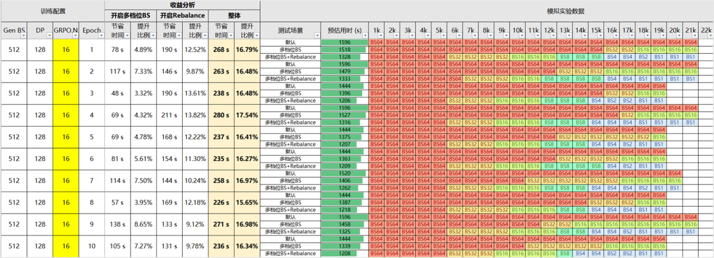

**关键设计点1：Rebalance的条件检测方法与实现逻辑**

为了实现精准的调度决策，系统设计了全局负载状态的同步机制。该机制通过HCCL在DP组间进行高效通信，每个Rank（计算单元）会周期性地向全局共享其调度器的核心状态信息。这些信息主要包括：

-   **请求队列深度**：正在运行（Running）和等待（Waiting）队列中的请求数量，直观反映了各节点的任务压力。

-   **KVCache使用率**：KVCacheManager的内存占用情况，是衡量长序列推理中显存资源是否紧张的关键指标。

通过汇总这些信息，每个Rank就都能够感知全局的负载视图，为是否启动Rebalance提供决策依据。

考虑到DP组间的状态同步会引入额外的通信开销（实验测定小于2毫秒），过于频繁的检测会影响整体推理效率。为了在"调度及时性"与"性能开销"之间取得平衡，我们引入了可配置的周期性检测机制。

-   **基于Step的同步**：利用大模型推理中各DP组间Step基本同步的特性，调度器对每个Rank的推理Step前进行是否需要做Rebalance同步的检查。

-   **可配置的检测策略**：用户可以通过配置文件设定全局状态感知的方式，如检测方式（伴随step计数检测、异步线程周期检测）、间隔步长（每1000个Step检测、每隔30s检测）。

这种设计将周期性检测带来的性能影响降至最低，实现了开销的有效控制。

**关键设计点2：两阶段均衡调度策略**

为了确保调度既高效又稳定，我们设计了一套两阶段的均衡调度算法。

- 阶段一 ：排队请求的跨DP组间及时调度

  因为RL推理阶段，请求任务是提前分配到了各个DP组内，在DP组内存在排队任务的场景下，可能其他DP组已有空闲资源，因此阶段的核心目标是最大化资源利用率，优先解决"忙闲不均"的问题。

  - **触发条件**：当系统中部分DP组存在空闲推理容量，而其他DP组的Waiting队列中仍有积压任务时，触发此策略。

  - **调度逻辑**：调度器会将等待中的任务优先从高负载节点迁移至有空闲容量的节点，快速消化积压请求，提升系统的吞吐。

- 阶段二：运行时请求的负载均衡调度

  此阶段的目标是通过降低KV Cache的内存占用（档位），获取更高的计算性能收益。

  - **触发条件**：仅当全局所有DP组的负载水平均满足"最大档位可下降"的条件时，才会触发此策略。

  - **调度逻辑**：该策略通过全局协同，确保所有节点都能从档位下降中获益。这种"全体一致"的原则，大幅减少了因局部优化而引发的频繁Rebalance，避免了不必要的KV Cache搬运开销，保证了调度的稳定性。

  KV Cache的搬运是调度过程中开销最大的环节。为保证传输效率，算法在选择调度目标时遵循以下原则：

  - **最小化点对点连接**：优先选择能一次性完成多个任务交换的节点对，减少通信链路的建立开销。

  - **避免"多对一"拥塞**：精心设计任务分发路径，防止多个发送方同时向单个接收方传输数据，从而避免网络拥塞和接收端排队，保障数据传输的高效性。

**关键设计点3：请求（Sequence）迁移方案**

为确保所有节点对调度任务有一致的认知并协同执行，我们设计了以下流程：

1.  **本地运算，全局共识**：每个Worker（工作进程）根据全局状态信息，独立运行相同的均衡调度算法，得出一份初步的调度任务清单（例如，节点A需要向节点B发送2个任务）。

2.  **任务详情同步**：由于初始清单只包含任务数量，缺乏具体的请求状态信息，系统会通过一次HCCL的All2AllSingle通信，将需要迁移任务的具体信息（如请求ID、已推理输出的tokens等）在所有Worker间实现数据交换。

3.  **角色判定与有序执行**：每个Worker根据交换后的详细任务列表，判定自己是发送方还是接收方，并按照全局统一的顺序执行迁移操作，确保了整个调度过程的有序性和一致性。

针对正在运行（Running）的任务，其KV Cache也须随之迁移，不然搬迁后的rePrefill将带来较大的负向性能开销，在调度任务同步后，需要进行KV Cache迁移的Worker会建立一次独立的点对点Send/Recv通信来高效传输数据。接收方利用vLLM框架的请求与BlockTable管理机制，在本地NPU上精准地还原KV Cache的状态，确保任务可以无缝地在新的节点上继续推理。

**关键设计点4：对外无感知的推理结果还原**

为了使Rebalance过程对上层应用完全透明，系统在所有Worker完成推理后，会执行一次统一的All2All通信。通过这次通信，所有被迁移过的任务的最终推理结果，都会被准确地传回其原始的Rank。这样，从外部框架来看，请求的处理流程与未发生调度时完全一致，实现了真正的无感知调度。

[Seer论文](https://arxiv.org/html/2511.14617v1)中也提到了他们解决长序列场景下KV Cache不均衡的问题，是基于Mooncake技术，构建 DRAM/SSD 两级 KV Cache池，允许跨实例迁移请求 chunk 时无需 Prefill 重算，和我们的rollout rebalance实现了类似的功能。同时他们提出了一种Divided Rollout策略，将长序列的请求切分为多个子块，每块最多推理8K个token，推理完放回缓存池，再分配给其他实例，直到请求推理完毕；这是一种针对continuous batching场景非常有效推理加速方案，解决了OOM以及中途preempt请求的风险，未来对于Device侧内存不够的场景，使用该方案将会带来很大的收益；但是本实践通过分析推理侧的实际内存，配置了合适的max\_num\_seq，不触发continuous batching，对长尾问题的解决更加有效。

##### 优化效果

**实验1**：早期我们基于DeepSeekV3模型，在256Die的集群上穿刺了Rebalance特性的实际收益。

-   **数据集**: open-r1/OpenR1-Math-220K

-   **关键参数**:

    -   data.train\_batch\_size = 512

    -   data.max\_response\_length = 32768

    -   rollout.n = 16

    -   TP = 2, DP = 128, EP = 256

-   **多档位编图配置**: 64/32/16/8/4

-   **对比场景：**

    1.  verl默认配置（图中红线）

    2.  单独开启多档位编图（图中橙线）

    3.  同时开启多档位编图 + Rebalance特性（图中绿线）

    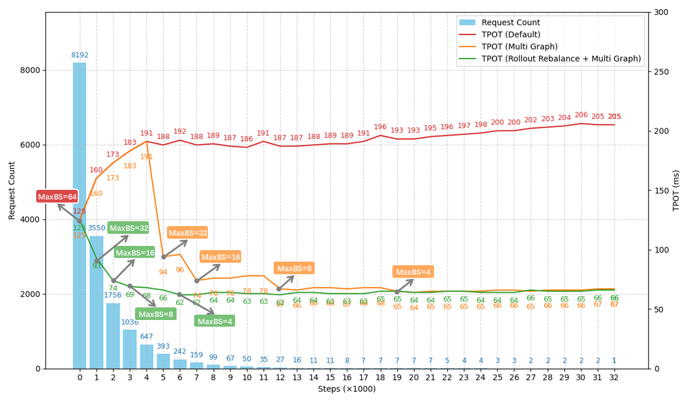

从上图的实验结果可知：

-   **verl默认配置**：总耗时 **6482s**。

-   **开启多档位编图**：总耗时 **2861s**，相较基线性能提升约**56%**。

-   **开启多档位+Rebalance**：总耗时 **2291s**。

与基线相比，本方案最终带来了64%的性能提升。在已开启多档位编图的基础上，Rebalance特性额外带来了20%的性能收益（图中绿色与橙色曲线间的面积即为额外收益部分）。

**实验2:** 基于Qwen3-235B模型，在128Die的集群上进行对比实验。

-   **数据集**: Deepscaler

-   **关键参数**:

    -   data.train\_batch\_size = 512

    -   data.max\_response\_length = 32768

    -   rollout.n = 16

    -   TP = 4, DP = 32, EP = 128

-   **多档位编图配置**: 256/128/64/32/16/8/4

-   **对比场景：**

    1.  verl默认配置

    2.  单独开启多档位编图

    3.  同时开启多档位编图 + Rebalance特性

-   **实验结果：**

    1.  verl默认配置：推理总耗时10213s。

    2.  单独开启多档位编图：推理总耗时7841s，相比基线提升**30%**。

    3.  同时开启多档位编图 + Rebalance特性：推理总耗时6102s，相比基线提升**67%**。

    |优化|模型切分|GBS|采样数|910C卡数|数据集|序列长度|generate_sequence/s|Rollout性能提升|
    |--|--|--|--|--|--|--|--|--|
    |base配置|TP4 PP4 CP4 EP32|512|16|64|deepscaler|2K推32K|10213|-|
    |单独开启多档位编图|TP4 PP4 CP4 EP32|512|16|64|deepscaler|2K推32K|7841|30%|
    |同时开启多档位编图 + Rollout Rebalance|TP4 PP4 CP4 EP32|512|16|64|deepscaler|2K推32K|6102|67%|

    本方案的核心收益来源于"通过负载均衡提前完成档位下降"。因此，其效果与数据集的长尾分布情况强相关。如果数据集本身或通过data balancing等手段使得推理负载已经非常均衡，那么Rebalance特性所能带来的额外收益将会降低。

#### 2.3.2 Expert Parallelism Load Balance

##### 现象分析

- 专家模块：负载"冷热分化"

  MoE模型门控网络会将样本分配给适配专家，导致专家负载两极分化：极端场景下，头部20%"热专家"承担80%以上计算任务，队列长期饱和；尾部30%"冷专家"调用率常低于5%，多数时间闲置。且"冷热"身份会随数据批次切换动态转移，形成负载热点漂移。

- 计算节点：NPU利用率两极失衡

  专家并行架构中，专家固定分配至NPU节点，"冷热分化"直接传导为节点负载不均：极端场景下，承载热专家的节点利用率长期超90%，易现NPU内存溢出；承载冷专家的节点利用率多低于30%，甚至不足10%。节点负载还会随专家"冷热"切换动态波动，静态调度无法适配。

##### 优化方案

EPLB（Expert Parallelism Load Balancer，专家并行负载均衡器）最早是DeepSeek针对大规模混合专家（MoE）模型训练中"负载不均"核心痛点推出的动态负载均衡解决方案。其核心目标是通过智能调度策略与技术优化，消除专家模块及计算节点间的负载差异，最大化NPU资源利用率，突破MoE模型规模化训练的效率瓶颈。

1. 双模式负载均衡调度

   EPLB提供分层与全局两种调度模式，适配不同训练场景：

   - **分层负载均衡策略**

     当专家组数量可以被服务器节点数整除时，EPLB会采用**分层负载均衡策略**，充分利用 DeepSeek-V3 中的组限制路由（Group-Limited Expert Routing）的特性。

     1. 将专家组均匀分配到各个节点，确保节点间的负载平衡。
     2. 在每个节点内复制冗余专家。
     3. 节点内将专家分配到不同的 NPU 上，确保 NPU 间的负载均衡。
     
     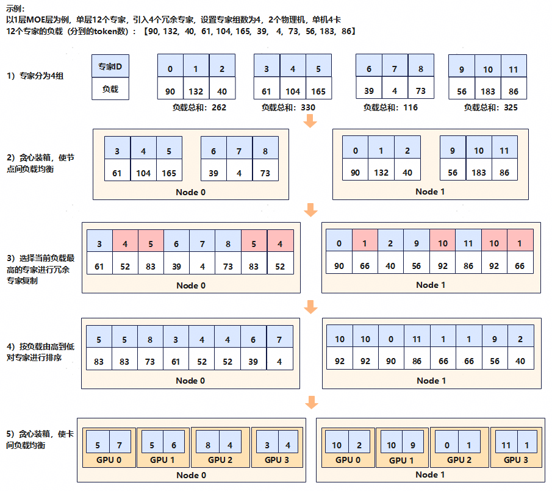
     
   - **全局负载均衡策略**
   
     在其他情况下（如解码阶段），EPLB会切换到**全局负载均衡策略**，忽略专家组的限制，直接在所有 NPU 上复制和分配专家。
     
     - 适用于更大规模的专家并行场景。
     - 灵活应对复杂的负载分布情况。
   
2. 实时负载估计与动态调整

   依托历史计算数据（如任务耗时、调用频率）构建负载估计模型，通过移动平均值等算法实时输出各专家及节点的负载值。基于该估计结果，EPLB动态调整专家复制策略与分配方案，快速适配训练数据分布变化（如批次切换、领域迁移）导致的负载热点漂移。

##### 优化效果

**实验一**

-   实验设置：基于Qwen3-30B加载真实权重，测试开启EPLB前后的推理耗时。
-   实验结果：开启EPLB并无性能提升。

    |模型名称|训练集|序列长度|batch size*n|die数|infer DP|infer EP|infer TP|  是否使能EPLB|generate_sequences / step（s）|
    |--|--|--|--|--|--|--|--|--|--|
    |Qwen3-30B|gsm8k|1K推3K|32*16|16|16|16|1|否|80.19|
    |Qwen3-30B|gsm8k|1K推3K|32*16|16|16|16|1|是|83.16|

-   实验分析：打印推理第1000个迭代的负载（每卡的专家分到的token总和），情况如下表，每卡的负载并无特别大的差异；实验三作为对比实验构造负载不均衡场景，验证EPLB的有效性。

    ||rank0|rank1|rank2|rank3|rank4|rank5|rank6|rank7|rank8|rank9|rank10|rank11|rank12|rank13|rank14|rank15|
    |--|--|--|--|--|--|--|--|--|--|--|--|--|--|--|--|--|
    |layer0|202117|151740|223832|220797|131111|180507|175831|286109|210812|297418|205835|173824| 237945|272396|199340|345822|
    |layer20|200978|213408|326325|317587|245067|220074|298096|176724|201202|246980|282587|102573|170262|142857|94099|419867|
    |layer47|232567|326583|121142|253510|316796|108912|211056|212969|101383|313065|223130|213813|175164|355333|176536|182247|

**实验二**

-   实验设置：基于Qwen3-235B加载真实权重，测试开启EPLB前后的推理耗时。

-   实验结果：开启EPLB并无明显性能提升。

    |模型名称|训练集|序列长度|batch size*n|die数|infer DP|infer EP|infer TP|是否使能EPLB|generate_sequences / step（s）|
    |--|--|--|--|--|--|--|--|--|--|
    |Qwen3-235B|deepscaler|2K推32K|256*16|128|64|64|4|否|2291|
    |Qwen3-235B|deepscaler|2K推32K|256*16|128|64|64|4|是|2273|

**实验三**

-   实验设置：构造极端负载不均衡场景，将选择的专家都固定为0-15号专家，此时rank0、rank1有较高负载，其余卡负载为0。

-   实验结果：推理耗时缩短17.78%。

    |模型名称|训练集|序列长度|batch size*n|die数|infer DP|infer EP|infer TP|是否使能EPLB|generate_sequences / step（s）|
    |--|--|--|--|--|--|--|--|--|--|
    |Qwen3-30B|gsm8k|1K推3K|32*16|16|16|16|1|否|127.52|
    |Qwen3-30B|gsm8k|1K推3K|32*16|16|16|16|1|是|104.85|

**实验结论**

当前Qwen3-30B和Qwen3-235B基于加载真实权重场景测试，实测并无明显性能提升，打印推理过程中每卡的负载，显示并无明显负载不均衡情况。实验三构造明显的负载不均衡场景，显示在极端场景下，EPLB是有明显的性能提升的。实验表明，当负载并无明显不均衡情况，EPLB不能带来性能收益。

#### 2.3.3 输入数据重排序

如[切分策略优化](#221-切分策略优化)所述，为了优化长尾阶段低batch场景下的推理吞吐，我们在attention侧选择了访存bound友好的TP4DP32EP128推理切分配置。基于这一切分方案，我们进一步选择了BS256+DataBalance的输入组织方式以实现较高的端到端推理吞吐。

##### 现象分析

Roofline模型描述了理想情况下算子执行耗时受计算量和访存量的影响，如下图所示，固定访存量大小，设备计算吞吐会随计算强度的提升出现"先线性上升后趋于平稳"的变化趋势。

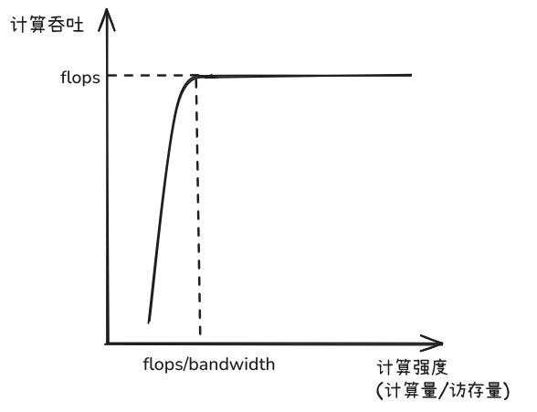

对于Matmul/GroupedMatmul等矩阵乘法算子，不难得到其计算强度恰巧为输入左矩阵bs维度的大小，在理论上可以通过提升bs的方式提升整网Matmul算子的计算吞吐；FIA算子由于每个bs维度拥有独立的KV Cache缓存，其计算强度不随bs增长而变化。另一方面，RL训练所依赖的离线推理场景仅关心一批给定数据的端到端完成耗时，不会受到在线推理场景中各类SLO（Service Level Objective，如TPOT等）条件的制约，因而无需关注bs提升导致的单token推理时延上升。基于这一思路，我们在Qwen3-235B-A22B网络中尝试逐步扩大推理batch size，在Deepscaler数据集中得到了如下的测试结果：

|GBS|实际推理BS|推理总耗时|首DP完成时间|首DP空闲时间|首DP空闲时间占比|
|--|--|--|--|--|--|
|256|24|02:27:11|01:08:53|01:16:18|50.84%|
|256|64|01:22:32|00:40:57|00:41:35|50.38%|
|256|128|01:18:18|00:27:32|00:50:46|64.84%|

可以看出：

1.  在bs提升的初期阶段(24-\>64)，**首DP完成时间**和**推理总耗时**都有较为明显的下降。

2.  随着bs进一步扩大(64-\>128)，**首DP完成时间**进一步降低，而**推理总耗时**仅降低了5%，几乎未变化。

第一阶段的现象契合了Roofline模型的分析，在算子的访存bound阶段提升计算强度，可以在相近时间内完成更多的数据批次的计算 —— 提示在离线推理场景下应选择最优的BS参数，充分利用硬件算力提升整体吞吐。而结合MoE大EP部署下各个DP锁步执行的特性，第二阶段的现象表明推理任务在不同DP间的数据生成长度存在较为显著的差别，致使部分卡在整个推理任务超过64%的时间里处于空闲 —— 提示在同步RL场景下应尝试缓解推理数据集负载不均的问题，避免推理阶段长尾问题导致的巨大算力浪费。

##### 优化方案

-   在数据集负载均衡问题的处理上，verl默认将推理的prompt数据按照采样数n复制后**作相邻排布**，使得各DP域处理间处理的prompt输入完全不同。当倾向于生成长回复和倾向于生成短回复的prompt被分配至不同的DP域时，便会出现极其严重的负载不均现象。对此，我们通过DataBalance的方式，将prompt数据按照采样数n复制后**作间隔排布**，尽可能地将各prompt数据均匀分散到不同DP域中，一定程度上缓解了原本的数据不均衡现象。在训练阶段开始前，再将各个DP域生成的response数据按照原本的方式作重排，保证同一条prompt的不同采样结果依然彼此相邻。
    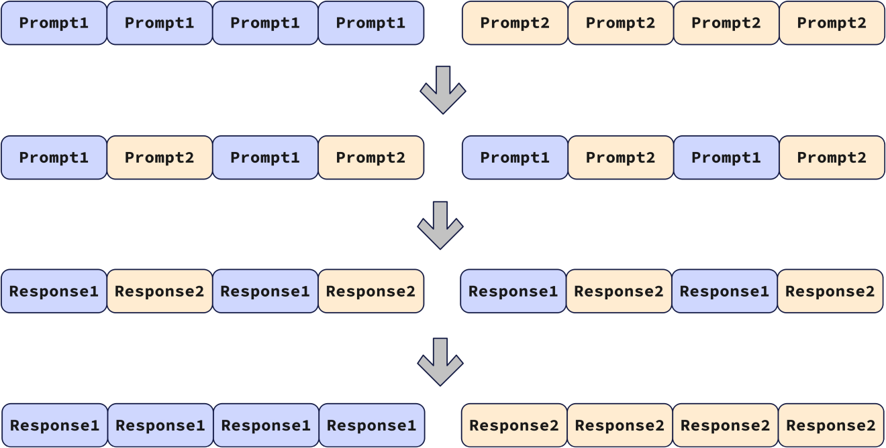

-   相对应的，在前言提到的[Seer论文](https://arxiv.org/html/2511.14617v1)中，他们也发现同一prompt的多个输出有强相关性，即一个组内的输出长度具有强相关性，如下图所示：

    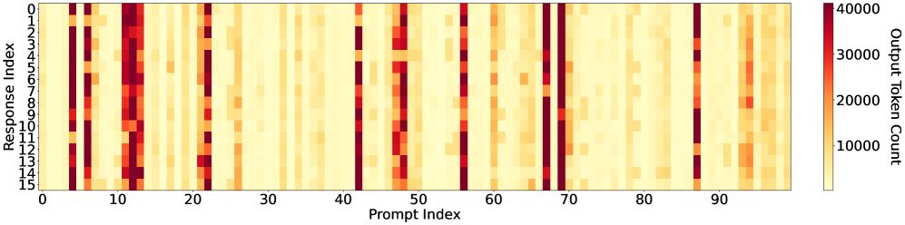

    因此他们将一组prompt请求，进一步切成chunk，并将每一个chunk调度到最空闲的实例，从而解决部分推理实例的OOM以及长尾问题，达到实例间的均衡:
    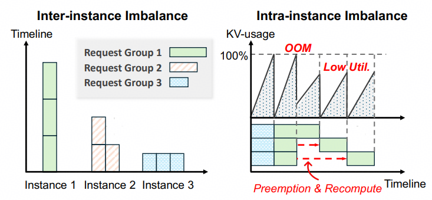
    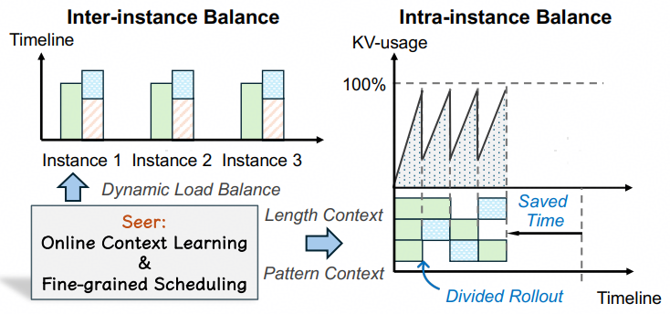

-   相比我们的方案，Seer需要在实例间做请求的调度，而我们仅需要在prompt分发之前对prompt按照采样数n复制后**作间隔排布**就可实现类似的效果，实现非常简单；虽然当前实践中仅存在一个实例，我们在DP域间实现了data balance，未来也可以非常方便的扩展多集群的多实例方案中。

##### 优化效果

在prompt排布顺序经过调整后，BS128配置下的推理长尾情况出现了较大程度的改善，各个DP域负载更加均衡，实现了25%的端到端时延降低。

进一步地，在开启DataBalance缓解负载不均衡带来的长尾瓶颈后，为进一步扩大BS提升吞吐创造了更大的空间。将BS从128逐步提升至192和256的过程中，我们观察到端到端的推理性能实现了进一步的增长。

|GBS|BS|推理吞吐|推理总耗时|首DP完成时间|首DP空闲时间|首DP空闲时间占比|
|--|--|--|--|--|--|--|
|256|128|92|01:18:18|00:27:32|00:50:46|64.84%|
|256|128(DataBalance)|132|00:58:03|00:43:38|00:14:25|24.83%|
|384|192(DataBalance)|160|01:10:00|00:57:17|00:12:43|18.16%|
|512|256(DataBalance)|186|01:21:54|01:08:33|00:13:21|16.30%|

## 3. 训练优化

在RL的训练阶段，我们主要关注长序列场景下的内存问题，最终选择了以TP4PP4CP4EP32为基础的切分部署，并使能swap optimizer、MoE融合算子、梯度累计融合算子等MindSpeed基础内存及性能优化。

### 3.1 内存占用分析和模型切分策略选择

#### 现象分析

训练阶段的内存占用主要包括静态内存与动态内存两大部分，静态内存和动态内存。

-   静态内存：主要由模型参数、梯度及优化器状态占据，其大小相对固定，与模型结构和切分部署方式密切相关。

-   动态内存：主要由前向计算过程中产生的激活占用，因其大小正比于训练输入的序列长度，在长序列样本训练场景中，激活内存往往成为显存瓶颈。

将Qwen3-235B-A22B的模型结构参数带入，可以得到如下的动静态内存占用分布图：

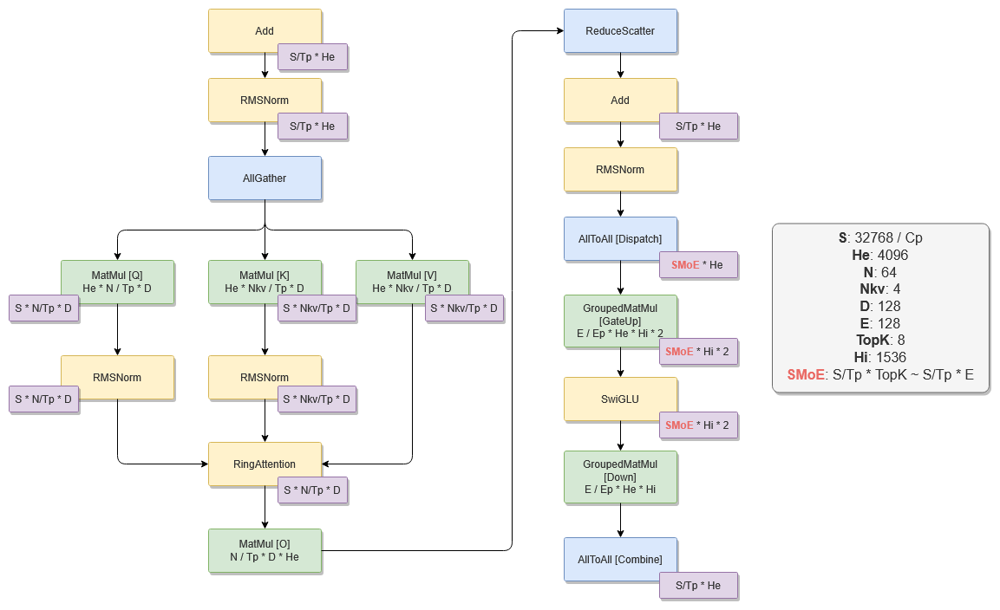

对于**静态内存**，本实践使能了 MindSpeed 的 swap optimizer 优化，在前反向过程中将绝大部分优化器中的静态内存从NPU内存中卸载。静态内存仅保留BF16格式的模型权重以及梯度，在 TP4PP4EP32 的切分部署下，单卡单层 BF16 权重内存占用包含 ATTN 层的 QKVO 与 MoE 层的 Experts，共计34MB + 36MB\*4 = 178MB，按照单个 PP rank 包含24层模型计算，可以得到单卡静态内存占用约为**12.51GB**。考虑到推理过程结束后，每张卡往往存在8\~9G的内存占用，加载静态内存后训练阶段单卡内存占用大约为21.5GB左右。

|TP|PP|EP|单卡模型层数|QKV (MB)|O (MB)|MoE (MB)|单卡权重 (GB)|单卡梯度 (GB)|静态内存 (GB)|
|--|--|--|--|--|--|--|--|--|--|
|4|4|32|24|18|16|144|4.17|8.34|12.51|

对于采用混合专家（MoE）架构的模型，**动态内存**的规模受到专家负载均衡程度的显著影响。在理想负载均衡情况下，各专家分得近似等量的Token，激活内存增长较为可控；然而在长序列场景中，若出现负载不均，部分专家可能需处理远超平均的Token数量，导致对应MoE层激活内存急剧上升，极易引发显存溢出（OOM）问题。如上图所示，MoE层的主要激活值占用来自于包含SMoE因子的三项，其中SMoE为MoE层路由专家经过EP通信后实际分配到的Token序列长度。根据负载均衡的程度，SMoE相对于MoE层输入长度的膨胀系数在8(TopK)到128(Experts)之间波动。

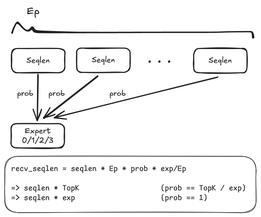

将具体序列长度数据带入，可以得到动态内存估计大小如下表所示，其中MoE部分的每一项展示了负载均衡与极端负载不均的两种场景。可以看到：

-   不开启序列切分时，由于首个PP rank依然会按照模型完整层数存储激活内存，仅ATTN层的激活内存便会达到
    600MB \* 94 = **55.07GB**，因而在当前的32K序列长度下，开启CP切分是必要的。

-   即使在开满序列切分的 TP4CP8 情况下，单层MoE在极端场景下的动态激活内存也可能达到128\*1024\*(4096 + 2\*1536 + 2\*1536) \* 2Byte = **2.5GB**，这样的单层激活内存数量同样是不可接受的。

|TP|PP|CP|EP|ATTN单层激活内存(MB)|QKVO输出(MB)|FA输出(MB)|Norm输出(MB)|Add输出(MB)|MoE单层激活内存(MB)|Dispatch(MB)|GMM1(MB)|SwiGLU(MB)|Combine(MB)|Add输出(MB)|
|--|--|--|--|--|--|--|--|--|--|--|--|--|--|--|
|4|4|8|32|75|26|16|25|8|176 / 2576|64 / 1024|48 / 768|48 / 768|8|8|
|4|4|4|32|150|52|32|50|16|352 / 5152|128 / 2048|96 / 1536|96 / 1536|16|16|
|4|4|2|32|300|104|64|100|32|704 / 10304|256 / 4096|192 / 3072|192 / 3072|32|32|
|4|4|1|32|600|208|128|200|64|1408 / 20608|512 / 8192|384 / 6144|384 / 6144|64|64|

#### 优化方案

为缓解长序列及因 MoE 层负载不均导致的显存压力，本实践使能了 MindSpeed 提供的 CP 切分和 MoE 层重计算技术。其中，MoE层重计算技术[moe\_zero\_memory](https://gitcode.com/Ascend/MindSpeed/blob/master/docs/features/megatron_moe/megatron-moe-zero-memory.md)的核心思想是利用反向传播过程中**原有的**计算或通信，掩盖重计算过程中引入的通信和计算，从而在减少激活值存储的同时降低因此带来的重计算开销。如下图，绿色框代表需要进行重计算的部分，也是MoE层主要激活内存的来源，开启这一功能后，MoE层不再需要存储这一部分随负载情况剧烈变化的激活内存，大大减少了负载不均导致训练阶段OOM的可能。

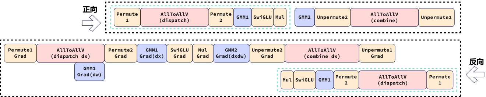

需要注意的是，moe\_zero\_memory的开启前置条件是同时开启MoE层反向计算的自掩盖功能moe\_alltoall\_overlap\_comm，而后者在MindSpeed中的当前实现将会导致MoE层GMM的权重命名方式发生变化，进而影响到RL训练中的reshard流程。[前序工作](https://gitcode.com/cann/cann-recipes-train/blob/master/docs/llm_rl/deepseek_rl_train_optimization.md)中实现了基于AlltoAllV的零冗余训推权重reshard方案提供了对这一场景的支持，有兴趣的读者可以移步了解相关的细节。

#### 优化效果

根据前述动态内存估计表格，开启 moe\_zero\_memory 的情况下 CP2 切分在首个PP rank依然有内存溢出的风险 —— 其静态/外部内存+动态内存+MoE层单层峰值内存可能达到21.5GB+(300+64)MB\*94+10GB = 65GB。因此，本实践最终采取了 TP4PP4CP4EP32 切分作为训练阶段 ATTN 层的切分策略。下图展示了开启 CP2/CP4 时的内存占用情况记录，左图中尝试开启 CP2 切分后训练因 OOM 导致中断，而右图切换到 CP4 切分后，训练阶段内存压力最大的首个PP rank尚可以在现有内存约束下正常执行。

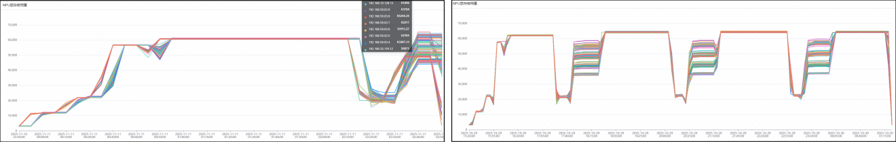

在训练性能方面，相比CP8切分，CP4可以将DP数量扩大一倍并减少RingAttention计算过程中的通信次数，最终实现了30%+的训练吞吐提升。

|GBS|切分配置|训练耗时(s)|训练吞吐|
|--|--|--|--|
|256|TP4PP4EP32CP8|1654|263|
|256|TP4PP4EP32CP4|1057|412|

 

### 3.2 HDP(Hybrid Data Parallelism)混合数据并行

#### 现象分析

上下文并行（Context Parallelism，CP）通过将批次中的序列沿序列长度的维度进行切分，并将其分配至不同设备并行计算，从而有效解决了超长序列的训练问题。在模型训练中，为处理不同长度序列并防止内存溢出（OOM），通常会将多个序列打包成一个达到最大序列长度 max\_packing\_token\_size的序列，并配置足够的 context\_parallel\_size。

然而，该方法存在明显的效率缺陷：无论序列长短，所有序列均需经历相同的划分与通信过程。当短序列与长序列一同被打包并进行CP处理时，短序列本不需拆分的部分也被强制划分，引入不必要的通信开销，造成计算资源浪费与训练效率下降。在训练数据包含大量短序列时，该问题尤为突出。

#### 优化方案

为了解决上述问题，我们采用了一种新的优化算法 —— **混合数据并行（HDP）**。HDP算法将数据并行（DP）和上下文并行（CP）融合，统一进行调度。内置装箱算法将根据序列长度自动选择最优并行策略，动态调整 DP 和 CP 组，保证对长序列进行 CP 的同时，将短序列尽可能划分至 DP 组从而避免其进行不必要的通信计算。

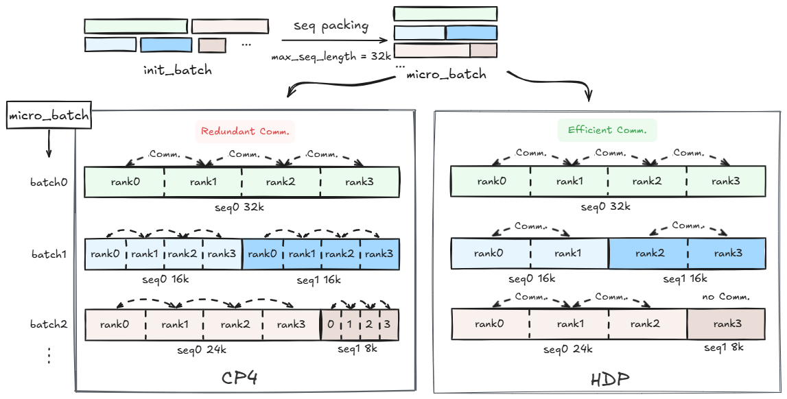

1. HDP装箱分组算法设计

   对于给定的micro\_batch，本算法根据各序列长度以及总rank数对序列进行分组，以图示batch2：\[seq0\_length, seq1\_length\] = \[24k, 8k\] ， cp\_size = 4 的情况为例，最终的分组结果为：\[\[1, 2, 3\], \[4\]\]，seq0占用rank0\~rank2执行CP3，seq1单独占用rank3。具体算法流程如下：

   -   对于给定的micro\_batch，首先根据序列长度及总rank数计算序列预计占用的rank数量。

   -   根据每个序列占用rank数量来进行动态装箱，算法在初次遍历中会对各序列进行整体划分，并保留序列在装箱过程中溢出的部分及其对应的序列索引。

   -   对于序列的溢出部分，算法将根据剩余rank数量进行轮转合并或均衡分组，得到最终的hdp\_group。

   -   另外，算法设定了上、下阈值来保证算法的鲁棒性。

2. 跨Rank序列拆分与聚合

   为保障上下文并行（CP）的正确执行，序列在输入模型前与输出模型后需分别进行前处理与后处理。

   前处理步骤：

   -   获取当前卡在 batch\_hdp\_group 的hdp\_group和对应索引。

   -   根据索引从batch得到对应sequence，并按照hdp\_group的size进行cp切分。

   -   设置实际序列长度，用于 FA 的 TND 模式和 Ring Attention 的 q/k/v 索引。

   后处理步骤：

   -   通过多次 AllGather操作 收集得到所有卡的序列长度和输出数据。

   -   将每张卡上的输出数据按前处理的逆过程进行还原。

3. 框架适配

   为支持HDP，需对模型框架进行以下针对性修改：

   -   Positional Embedding：由于HDP对固定的cp\_size进行了划分，在RoPE位置编码时，需将原有的CP通信范围调整为当前hdp group的组内CP通信范围。

   -   Ring Attention：同样，在Ring attention计算中，需对参数 rank\\cp\_rank\\cp\_global\_ranks\\cp\_outer\_ranks 等进行调整。

#### 实验结果

目前在Deepscaler数据集、GBS512、TP4 PP4 CP4/HDP 128die的设置下进行实验，结果显示：前3个step的训练耗时平均收益仅5%左右，RL端到端性能收益更小。

通过分析，性能收益不显著主要有以下两点原因：

-   Deepscaler数据集生成序列普遍较长，在该数据长度分布情况下，HDP分组难以做到负载完全均衡，蚕食了通信耗时减少带来的性能收益。

-   HDP主要是为了节约CP切分后RingAttention内的通信开销，而在CP大小仅为4的设置下，HDP分组调整空间非常有限。

实验随机选取某一step，统计该步内所有序列的长度分布，以及各长度区间中序列经过HDP算法调度后进行的CP/DP的详细情况，如下图所示。

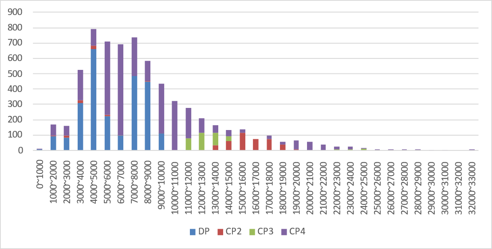

由图中结果可以发现，大多数序列的长度集中在3000以上，这也导致众多序列无法进行DP，转而寻求次优解（CP2、CP3）甚至是CP4。

我们还与HDP获得较高收益的场景进行了实验对比，设置如下：openr1-220k数据集、GBS256、TP4 EP32 PP8 CP8/HDP 256die，模型采用DeepSeekv3。实验同样统计step内所有序列长度以及在不同区间内的各个序列通过HDP算法后进行的CP/DP的详细情况，如下图所示。

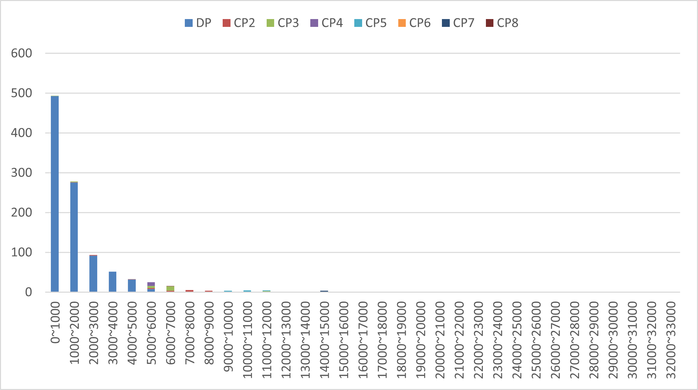

图中可以看到，在该数据集生成的序列普遍集中在3000以下时，大多数的序列都由原来的纯CP8转为DP，这极大程度减少了通信过程的开销，并且基本不会有负载不均的问题。该场景的性能数据如下，最终训练耗时收益在25%以上。

|GBS|切分配置|训练耗时(s)|训练吞吐|
|--|--|--|--|
|256|TP4 EP32 PP8 CP8|178.234|77.14532581|
|256|TP4 EP32 PP8 HDP|133.139|107.2523603|

## 4. 未来展望

历经本次优化实践，我们对未来RL训练长序列优化方向形成了几点思考：

1. 系统优化与算法创新的深度融合是必然趋势。

   当前工作表明，通过模型切分策略优化、动态负载均衡、计算-调度协同等系统级手段，可有效提升长序列训练效率。在关键瓶颈阶段，我们正在推进多项新技术探索，包括：

   -   SAM投机解码（Speculative Adaptive Memory）：该技术无需修改RL训练目标与奖励函数，在RL场景下，由于模型还未完全收敛，尤其适用这种draft-model-free的投机策略；同时在长序列缓存场景下draft-model会具有更高的接受率，这将会极大的助力长序列场景下的RL的推理吞吐提升。在前言提到的[Seer论文](https://arxiv.org/html/2511.14617v1)中，也采用了类似的使用压缩后缀树的draft-model-free的投机解码方式，同时他们采用了汇聚同组多个序列的局部Token模式，非常有效的提升了投机解码的接受率，也给我们提供了新的思路。
   -   长尾长序列的KVP切分：在处理超长序列的请求时，通过将KV Cache分布到多个NPU，使得单个NPU能够处理比其显存容量大得多的序列，从而直接提升单BS的吞吐量；同时动态调整DP域大小，充分利用序列推理完成后空闲DP域的NPU，进一步均衡负载，提高推理吞吐。

2. 注意力机制的不断革新或将重塑长序列处理范式。

   -   以线性注意力（Linear Attention）、状态空间模型（如Mamba2）、近似注意力为代表的新兴技术，有望从根本上解决二次复杂度问题。

   -   以DeepSeek代表的DSA(token-base)/NSA（block-base）等稀疏注意力、以及滑动窗口注意力等优化方案，可在长须列的场景下，保持性能的同时大幅降低计算开销。

   -   Qwen-Next等新一代架构探索，将推动混合注意力机制向更高效、更可扩展的方向演进。当前我们也正在投入Qwen-Next网络的预训练优化，尝试在Ascend上基于Triton实现gated\_delta\_rule融合算子来快速优化模型训练性能，希望能在Ascend上探索出一条能快速适配算法结构创新的新路径。

随着大模型RL训练技术飞速发展，多轮Agent、全模态RL等场景已将序列长度从千级别推向
百万级别。在算法与系统的双重驱动下，持续构建基于昇腾的超长序列训练与推理下一代技术体系，仍面临诸多挑战。我们将持续跟踪前沿进展，为昇腾生态下的长序列RL训练贡献力量。
