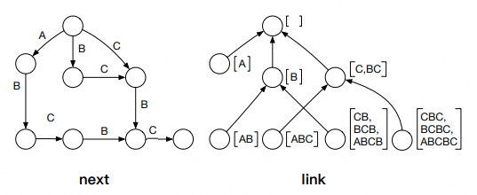
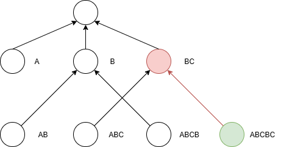
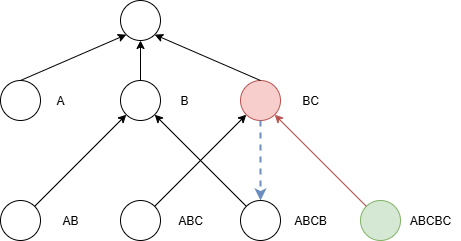
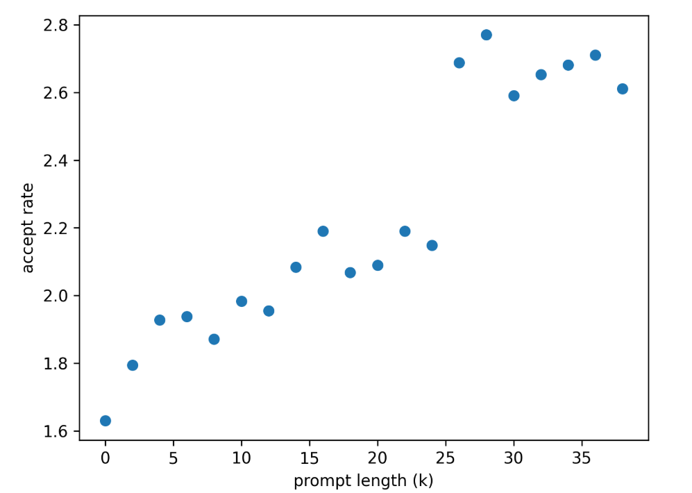
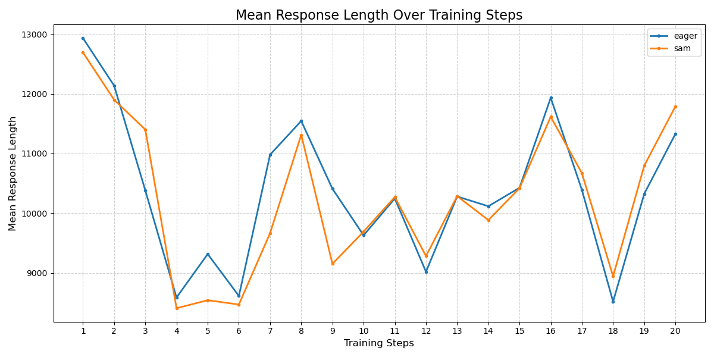
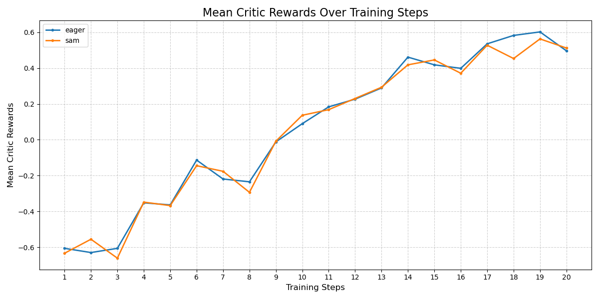
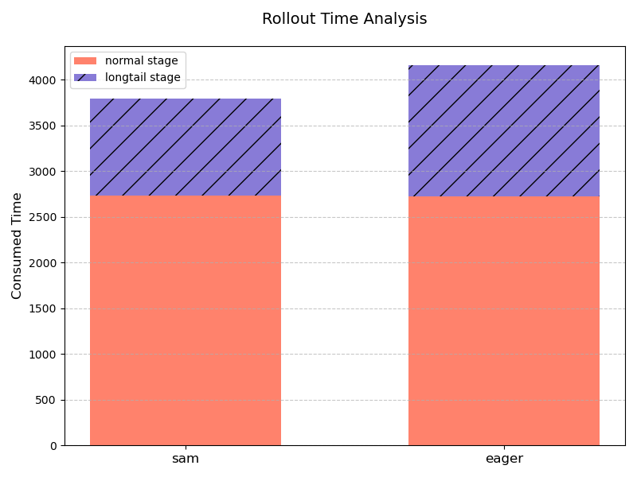

# SAM投机推理：长序列强化学习训练加速利器

针对大语言模型强化学习训练（RL\-training）中的海量交互式采样耗时瓶颈，传统的投机解码（Speculative Decoding）技术依赖辅助模型，而且存在策略更新导致的分布漂移风险。本文提出在 RL 训练中引入一种基于**后缀自动机**（SAM）的无模型（Model\-Free）投机解码方案，该方法无需任何辅助模型，利用 RL 数据（如数学推理、代码生成）中固有的结构化重复特性生成候选序列检索。本文结合自适应 batch 调度与向量化拒绝采样等工程优化，在Qwen3系列模型（32B/235B）上完成了 SAM 投机解码在 RL 后训练场景的端到端验证。实践表明，SAM 在保证精度严格无损的前提下，显著降低了 Rollout 推理延迟，特别是在长尾阶段获得了超过 35% 的加速收益，相关代码已在[cann\-recipes\-train](https://gitcode.com/cann/cann-recipes-train) 全部开源。

## 1. 背景介绍

### 1.1 SAM 原理

SAM（suffix automaton，后缀自动机）是一个能够高效解决许多字符串问题的数据结构。直观上，字符串的 SAM 可以理解为给定字符串的 **所有子串** 的压缩形式。SAM 主要维护两个重要的集合：

1. 结束位置 `endpos`：考虑字符串 S 的任意非空子串 T，我们记 `endpos(T)` 为字符串 S 中 T 的所有结束位置的集合。例如，对于字符串 ABCBC 我们有 `endpos(BC)`={2,4}。在 SAM 中，所有满足 `endpos` 集合相同的字串被归入同一个**状态**，也被称为 **`endpos` 等价类**。`endpos` 等价类的划分使得 SAM 可以以 O(|S|) 的空间复杂度存储所有子串信息。

2. 后缀链接 `link`：对于 SAM 中任意非初始状态 u，u 中的最长子串为 w，则 `link(u)` 指向的状态对应于 w 的后缀中与它的 `endpos` 集合不同且最长的那个，即 u 所代表所有子串的**最大真后缀**所在状态。后缀链接构成了 SAM 的核心树形结构，被称为**后缀链接树**，它使得 SAM 可以在 O(|S|) 的线性时间内构造完成，因为每次添加新字符时，只需要通过后缀链接快速定位和更新相关状态。

下图展示了基于字符串 ABCBC 构建的 SAM：  

  
其中左图 `next` 是 SAM 的状态转移函数，表示的是 SAM 中的不同状态如何按前序进行转移，是 SAM 的**自动机**部分；右图 `link` 则是上文所述的后缀链接，是 SAM 的**结构**部分。SAM 采用线性复杂度的[**增量构造法**](https://oi-wiki.org/string/sam/)，每次向当前 SAM 中加入一个新字符时，同时更新 `next` 和 `link`，单次更新的时间复杂度为 O(1)。

[**SAM Decoding**](https://arxiv.org/abs/2411.10666) **将 SAM 用于投机解码**：投机解码被转化为在后缀自动机中的后缀匹配，使用 SAM 能够在 O\(1\) 的常数时间内高效实现这个过程。

原文中使用了两种后缀自动机——静态 SAM（S-SAM）和动态 SAM（D-SAM）。

* 静态 SAM 是基于已有的语料库构建后缀自动机，将所有文本拼接成连续字符串，并在每个文本片段末尾添加特殊符号（如 EOS），然后逐 token 遍历预处理后的语料，通过添加 next 边和 link 边扩展节点。对于自动机的每一个状态我们记录该状态所对应的所有 endpos 等价字符串第一次出现的位置 (min\_endpos)。

* 动态 SAM 是完全基于当前处理的 prompt 建立一个动态的后缀自动机。​该自动机随生成过程动态扩展，每生成一个新 token 并被 LLM 验证通过后，立即更新 D\-SAM：若当前 token 可通过现有节点的 next 边转移，则直接更新节点状态；若无法转移，则新建节点并添加 next 边和 link 边，确保 D\-SAM 始终包含最新生成的文本序列。对于 D\-SAM，可以在构建自动机的同时维护 min\_endpos。

在本文的实践中，为了实现零迁移成本以及不引入额外系统维护复杂度，我们使用了纯动态 SAM。

**基于 SAM\-Decoding 的草稿（draft）生成**：从当前序列的最后一个 token 开始，通过 SAM 的 link 边回溯，直至找到能通过 next 边转移到下一个 token 的节点。 根据节点的 min\_endpos，在当前文本序列中定位匹配后缀的起始位置，提取后续连续 token 作为候选序列。单次查询的复杂度为最坏 O(|S|) 、平均 O(1)。以下是一个具体的例子。

还是以字符串 ABCBC 为例（下图对应上文的 link 状态图），为了简洁起见，我们使用每个等价类中最长的子串来表示这个节点。当前的最后一个 token 是 C，我们将 SAM 的最后一个节点沿着 link 边回溯，到达节点 BC。

  
该节点能够找到 next 边（下图蓝色虚箭头）转移到下一个 token，停止回溯。该节点中的最长子串 BC 就是我们寻找的（前缀子串中出现过的）**最长后缀**，因此我们将该节点的后续序列 BC 作为本次生成的 draft token。

在生成草稿后，我们会用大模型进行逐 token 验证，若候选 token 符合大模型的预测分布则保留，不符合就触发 “拒绝”—— 从拒绝位置开始由大模型重新生成，这个过程就是**拒绝采样**。拒绝采样确保最终输出和大模型直接生成的结果完全一致，实现 “无损加速”。

> 假设有函数 $\alpha\in[0,1]$ 表示接受概率，**拒绝采样**从 q\(x\) 采样一个样本 x，从 U\[0,1\] 中采样一个随机数 $\epsilon$，若 $\epsilon\leq\alpha(x)$ 则接受该样本，否则拒绝并重新按照此流程采样。

### 1.2 和其他投机方法的比较

随着大语言模型推理加速需求的增长，投机解码已从最初的“大模型+小模型”范式，演化出多种更为精细和高效的技术路线。为了更直观地理解当前业界的前沿方案，我们将重点对比包含 SAM 投机的三种代表性方法：

* ​**SAM\-Decoding**​：基于检索的非参数化方法。

* ​**EAGLE\-3**​：基于特征外推的轻量化 auxiliary head 方法。

* **MTP**​：基于模型本身的自投机方法。

这三种方法分别代表了投机解码的三个不同进化方向：SAM 试图完全通过算法数据结构（后缀自动机）挖掘上下文中的重复模式，以极低的计算代价实现加速；EAGLE\-3 则进一步压榨模型内部特征，通过极其轻量的“寄生” head 在特征层级进行树状推测，代表了辅助模型路线的 SOTA 水平；而 MTP（如 DeepSeek\-V3 所采用）则将投机能力内化为模型训练目标的一部分，通过共享主干参数的辅助头实现原生投机。

下表总结了这三种方法在草稿生成机制、架构需求及适用场景上的核心差异：

<table>
    <thread>
        <tr>
            <th> 特性/算法 </th>
            <th style="width: 30%;"> SAM </th>
            <th style="width: 30%;"> EAGLE-3 </th>
            <th style="width: 30%;"> MTP </th>
        </tr>
    </thread>
    <tbody>
        <tr>
            <td> 草稿生成方式 </td>
            <td> 借助后缀自动机进行检索：从已生成的历史文本中，检索“最长后缀 + 后续序列”作为草稿。</td>
            <td> 在主模型的特征层之上，利用轻量级 EAGLE head（通常1层）结合树状注意力（Tree Attention）进行特征外推，生成草稿。 </td>
            <td> 在模型结构里加入多 token 预测头 (multi-token heads)，这些预测头一次预测多个未来 token 作为草稿。 </td>
        </tr>
        <tr>
            <td> 额外组件 </td>
            <td> 无额外模型参数；如果使用冷启动需要一个额外的语料库。</td>
            <td> 需要训练一个依附于主模型的极小网络（参数量通常 &lt;1%）。采用训练时模拟测试 (Training-time Test)——在训练中直接模拟推理时的“猜测-验证”过程，消除训练与推理的偏差，让 draft 模型输出与主模型的更加一致。</td>
            <td> 在模型结构里加入多 token 预测头 (multi-token heads)，这些预测头一次预测多个未来 token 作为草稿。</td>
        <tr>
        <tr>
            <td> 部署成本/难度 </td>
            <td> 较低：即插即用，无需对模型进行任何微调或附加训练。主要挑战在于工程上高效实现自动机的数据结构；如果使用冷启动则需要一个覆盖面好的语料库。</td>
            <td> 中等：需要针对特定主模型训练对应的 EAGLE Head。虽然训练成本低，但增加了模型管理的复杂度（Base Model + Adapter）。</td>
            <td> 较高：需要在预训练阶段就加入 MTP 头；外挂 MTP head + 微调能让现有模型获得一定程度 MTP 能力，但通常效果远不如原生 MTP 结构。</td>
        </tr>
        <tr>
            <td> 适用场景 </td>
            <td> 在 prompt 复用率高或生成内容具有强结构性时表现极佳。适用于输入输出有高重叠度，或上下文具有强重复模式的场景（如数学、代码和部分 Agent 场景）。 </td>
            <td> 取决于训练 EAGLE head 的数据，在与训练数据分布相似的场景中有较好的表现。 </td>
            <td> 由于使用了原生训练的 MTP heads，具有较好的泛化性，能够应对更加多样化的使用场景。 </td>
        </tr>
    </tbody>
</table>

### 1.3 SAM 接受率

我们使用 Qwen3\-8B 模型在 Math500 数据集测试了 SAM\-Decoding 的接受率，具体的配置为：

* 投机 token 个数：3

* 采样参数：temperature=0，repetition penalty=1，不设置 top\-k 和 top\-p 采样

* 并行设置：tensor parallel = 4

* 推理框架：vLLM\-Ascend

注：这里的接受率指的是 mean acceptance length，包括了1个 bonus token。另外，这里（包括后文中）的 SAM 使用的是动态 SAM，不涉及额外语料库。

可以看到在不使用冷启动的情况下，接受率与序列长度呈正向相关。因此在长序列推理场景使用 SAM\-Decoding 会带来不错的性能收益。我们设置的默认投机个数是3，因为再加上1个本来就要解码的 bonus token 刚好是4个 token。此外，随着投机个数增加带来的接受率提升也有边界效应，不太建议将这个值设太大。

### 1.4 SAM 在 RL 后训练场景落地的意义

在LLM的强化学习后训练场景中，模型需要进行大量的交互式采样来收集或评估数据。这个过程通常涉及数百万次的生成迭代，成为推理成本的主要瓶颈。SAM\-Decoding 因其无模型（Model\-Free）和基于检索（Retrieval\-Based）的特性，为这一关键阶段的加速提供了一种轻量化、易落地的实践路径。

首先，作为一种非参数化的投机采样方法，SAM\-Decoding不需要额外的模型参数，这节省了专门训练 draft model 或者 auxiliary head 的成本，同时也不必担心模型权重更新导致的分布漂移问题。并且在训练时不需要进行额外的内存管理，这对于训推共卡的 Colocate 框架尤为重要，对于现有系统实现了即插即用的加速。

其次，SAM\-Decoding 对强化学习数据集具有天然的​亲和性​。在许多 RL 任务中，生成的 Context 中往往包含大量的​重复或结构化元素​​。例如在 RLVR （Reinforcement Learning with Verifiable Rewards）场景，模型被训练来生成详细、结构化的推理过程，这种推理过程在数学问题求解中表现为重复的公式结构和计算步骤；在代码生成中表现为高度重复的语法模式和库调用；在 Agent 规划任务中表现为结构化的行动指令或观察报告。SAM\-Decoding 的后缀自动机设计能够高效捕捉这些​局部重复和结构化元素​​。它能快速地从历史生成中检索最长匹配后缀作为高质量草稿，从而显著提高 draft token 的​接受率​。这种能力对于需要大量生成结构化、长序列推理轨迹的 RL 后训练流程来说至关重要，能有效降低高昂的采样成本，加速模型在专业领域（如数学、编程和自主智能体）的迭代效率。

月之暗面团队近期提出的 [Seer](https://arxiv.org/abs/2511.14617) 强化学习框架中也使用了基于压缩后缀树的 Model\-Free 投机解码方法，利用 RL 算法（如 GRPO）中 “同一 prompt 生成多个响应” 的分组特性，通过在线上下文学习挖掘组内响应的模式相似性，实现高效、高准确率的投机解码，与本文的 SAM 有异曲同工之妙。

接下来，本文将通过 Qwen3 系列模型长序列 RL 训练实践，详细展开 SAM 投机解码在RL后训练场景的精度与性能验证结论。

## 2. RL 训练精度验证

虽然拒绝采样在理论上保证了 SAM 投机的无损性，但在实践中，精度还受其他各种复杂因素的影响。为了确保 SAM 在 RL 场景的精度正确性，我们进行了包括算子校验、下游任务评测和端到端训练的验证工作。

### 2.1 算子精度

首先是算子的精度验证。普通解码和投机解码使用的是不同的算子，在 vLLM\-Ascend 中，我们使用`torch_npu._npu_paged_attention`进行 token\-by\-token 的解码，使用 `torch_npu._npu_paged_attention_splitfuse` 进行投机解码，生成 draft tokens 的 logprobs。为了验证这两个算子的等价性，我们统计了对相同的输入两个算子对各个 token 预测的 logprobs 的差值，结果如下所示：

可以看到两者之差严格为0，这表明普通解码和投机解码使用的算子之间没有精度差异。

### 2.2 下游评测

我们基于 Qwen3\-32B 模型在数学数据集 GSM8k 以及 AIME2024 进行了纯推理的测评（pass@1）， 采样参数为 temperature=0.6，repetition penalty=1，不设置 top\-k 和 top\-p。 测试结果如下：

| 数据集|不开启SAM|开启SAM|
|---|---|---|
|GSM8k|88.9|88.7|
|AIME2024|66.5|66.8|

可以发现开启 SAM 投机并不影响这些推理任务的准确率。

### 2.3 端到端后训练

最后，我们通过端到端的 RL 训练直接检验 SAM 的精度。我们使用 DAPO 算法（基于[verl](https://github.com/volcengine/verl)）在 DAPO\-MATH\-17k 数据集上训练 Qwen3\-32B 模型，我们固定了 vLLM 的随机种子，开启和不开启 SAM 每步的平均回复长度曲线和 reward 曲线如下所示：
<table>
    <tr>
        <td style="width: 50%; text-align: center;">
            
        </td>
        <td style="width: 50%; text-align: center;">
            
        </td>
    </tr>
</table>

可以看到开启 SAM 的训练曲线在数值和趋势上都与不开启 SAM 的基线基本吻合，结合之前的算子精度和下游评测的验证，可以断定 SAM 投机解码在 RL 后训练场景的精度是无损的。

## 3. RL 训练性能验证

### 3.1 性能优化

投机解码的性能取决于两个因素：第一是接受率，第二是投机算法本身带来的额外耗时（draft token 的生成和验证、拒绝采样）。为了能够最大化 SAM 无损投机在RL训练中的收益，我们需要尽可能地提高接受率，并减少额外耗时。为此，我们做了如下两大优化——关于 batch size 的自适应开关以及拒绝采样加速，相关代码已在[cann\-recipes\-train](https://gitcode.com/cann/cann-recipes-train/blob/master/llm_rl/qwen3) 全部开源。

#### 3.1.1 自适应开关

我们在`vllm_ascend/worker/model_runner_v1.py`中适配了无损投机关于 batch size 的自适应开关，当开关开启时，只有当 vLLM engine 当前处理的请求数量小于等于阈值，投机解码才会生效。设置投机自适应开关既是为了减少额外耗时，也能够提高接受率。

首先，从减少额外耗时角度考虑。我们当前使用的对draft token进行验证的 Page Attention 算子在输入shape（batch size， sequence length）增加时会有比较严重的劣化。在大 batch size 长序列的输入下，draft token 验证带来的额外耗时会超过投机本身的收益。因此我们希望在小 batch size 的情况下才开启 SAM 投机，以平衡加速收益与计算开销。

其次是提高接受率的角度。由于我们目前使用的是动态构建 SAM 的模式，即把当前序列当作后缀自动机的全部语料，在 Rollout 初期，后缀树的体量较小，因此接受率也就较低，这一点在上文 1.3 章节中也有体现。在 Rollout 后期，由于在同步 RL 框架下存在 Rollout 生成长度不均的问题，请求排队和抢占机制会导致长输出请求的调度延迟，从而导致少数请求主导最终执行阶段。我们把单步处理的请求总数当作 Rollout 进程的指示物，来提示是否开启 SAM 投机。这样一来可以在长尾请求中得到显著加速。

#### 3.1.2 拒绝采样加速

拒绝采样是投机推理引入的额外操作，想要最大化投机推理的收益，也需要对这个模块的性能做尽可能的优化。vllm\-ascend原生的投机推理实现性能较差，单个推理 step 会带来超过50ms的额外耗时，完全掩盖了投机推理带来的性能收益。我们使用了纯 Pytorch 层面的代码优化，将拒绝采样的耗时减少到原本的十分之一左右。

本次我们主要优化了`vllm_ascend/sample/rejection_sampler.py`中的三个函数：

* `expand_batch_to_tokens`：把采样参数（temperature、top\-k、top\-p）从“每个请求一个值”的 batch 向量展开成“每个 draft token 一个值”的 token 向量，使后续拒绝采样能逐 token 正确应用这些参数。

* `sample_recovered_tokens_pytorch`：在拒绝采样中为每个被否决的草稿位置即时生成一个 recovered token，保证序列能继续推进。

* `rejection_random_sample_pytorch`：按接受\-拒绝规则逐个比对草稿与目标概率，决定用 draft token、recovered token 还是终止，并在全接受时追加 bonus token，最终拼出随机采样模式下的输出序列。

以`sample_recovered_tokens_pytorch`为例，[原生实现](https://github.com/vllm-project/vllm-ascend/blob/v0.11.0rc0/vllm_ascend/sample/rejection_sampler.py#L461)中含有嵌套的for循环操作。这种逐个元素的操作方式无法利用NPU的并行计算能力，并且在循环内部反复创建新张量（如 `.clone()`, `torch.full()`），导致效率极低。

我们优化的核心思想是​**向量化 \(Vectorization\)**​：去掉所有Python循环，使用PyTorch的张量操作来一次性处理所有数据。我们使用张量操作消除了循环内重复的张量创建，并通过高效的索引和广播实现了关键变量的计算。具体实现参考我们[开源的代码](https://gitcode.com/cann/cann-recipes-train/blob/master/llm_rl/qwen3/patches/vllm_ascend/0009-vllm_ascend-feature-rewrote-rejection-sampler.patch#L215)。后续可以使用 Triton 对这个模块做进一步的优化。

### 3.2 RL 训练实测收益

我们在 DAPO 长序列 RL 场景测试了 SAM 投机解码的加速收益。至于模型选择，我们选用了 Qwen3\-32B dense 模型以及 Qwen3\-235B\-A22B MoE 模型这两个比较有代表性的模型。下文介绍具体的配置和性能数据。

#### 3.2.1 Qwen3\-32B

相关配置：

* 数据集： DAPO\-MATH\-17k

* 最大回复长度（`max_response_length`）：34816

* 训练 batch 大小（`train_batch_size`）：32

* 生成 batch 大小（`gen_batch_size`）：96

* Rollout 最大请求数（`max_num_seqs`）：128

* Rollout 模型张量并行（`tensor_model_parallel_size`）：8

* SAM相关配置：自适应 batch size 开关阈值为8，投机 token 个数为3个。

* 910C卡数：2机16卡32die

* 运行模式：eager

性能数据如下表所示，其中“单轮平均推理时间”指每个 DP （Data Parallel）域的单轮（DAPO 算法由于其动态过滤机制，可能会有多轮生成）推理平均耗时，“单步总推理时间”指单个 step 的 Rollout 总耗时：

| |单轮平均推理时间 / s|单步总推理时间 / s|单步总时间 / s |
|---|---|---|---|
|不开启SAM|3904.22|4159.06|4730.86|
|开启SAM|3548.62|3793.29|4374.99|
|收益|10.02%|9.64%|8.13%|

#### 3.2.2 Qwen3\-235B\-A22B

相关配置：

* 数据集： DAPO\-MATH\-17k

* 最大回复长度（`max_response_length`）：34816

* 训练 batch 大小（`train_batch_size`）：128

* 生成 batch 大小（`gen_btach_size`）：128

* Rollout 最大请求数（`max_num_seqs`）：64

* Rollout 模型张量并行（`tensor_model_parallel_size`）：4

* SAM相关配置：自适应 batch size 开关阈值为8，投机 token 个数为3个。

* 910C卡数：8机64卡128die

* 运行模式：eager

性能数据：

| |单轮平均推理时间 / s|单步总推理时间 / s|单步总时间 / s|
|---|---|---|---|
|不开启SAM|7102.92|14287.54|15441.45|
|开启SAM|6467.52|12811.98|13960.98|
|收益|9.82%|11.52%|10.60%|

#### 3.2.3 客户场景验证

我们在客户的训练场景部署了 SAM 投机解码，帮助达成了 A3 集群 128die Qwen3\-32B+verl+DAPO 强化学习性能提升的目标。

相关配置：

* 最大回复长度（`max_response_length`）：34816

* 训练 batch 大小（`train_batch_size`）：512

* 生成 batch 大小（`gen_btach_size`）：1536

* Rollout 最大请求数（`max_num_seqs`）：256

* Rollout 模型张量并行（`tensor_model_parallel_size`）：8

* SAM相关配置：自适应 batch size 开关阈值为4，投机 token 个数为4个。

* 910C卡数：8机64卡128die

* 运行模式：eager

具体性能数据如下：

| |单步总推理时间 / s|单步总时间 / s |
|---|---|---|
|不开启SAM|9094|11870|
|开启SAM|8223|11000|
|收益|10.59%|7.91%|

#### 3.2.4 Rollout 长尾分析

此外，我们特别统计了 SAM 投机在 Rollout 长尾阶段（当前处理的请求数在投机阈值以下，即下图中紫色部分）的表现，性能达到非投机 **1.35X**。如果后续对算子进行优化，支持更大投机阈值的话，这一收益将更加明显。

## 4. 总结与展望

SAM\-Decoding 的成功落地，证明了在 LLM 的训推加速领域，传统算法和数据结构层面的创新（如后缀自动机）可以作为​模型参数方法强有力的补充。它为 LLM 在长序列、高并发、训推共存的复杂 RL 场景中，提供了一个即插即用并且易于集成的加速方案。这对于迫切需要降低海量交互采样成本的 RL 后训练流程，具有重大的实践意义。后续我们会探索更高效的投机策略（提高接受率），以及尝试与图模式结合（提高算子执行效率）。通过持续的技术深耕和工程优化，我们相信以 SAM 投机解码为代表的 Model\-Free 投机技术，会在 LLM 的强化学习训练中发挥更大的价值。
