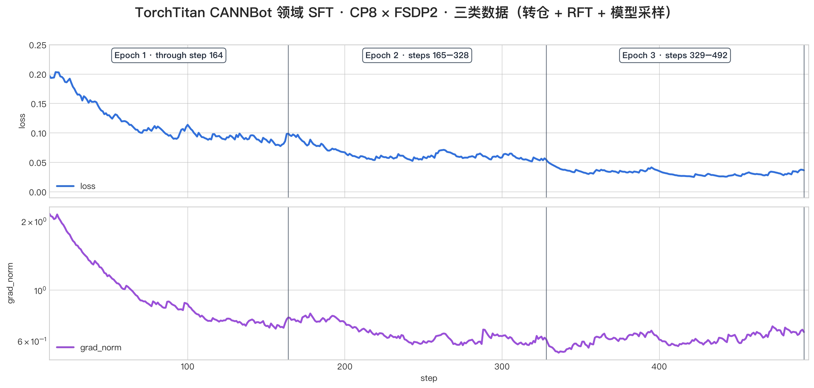
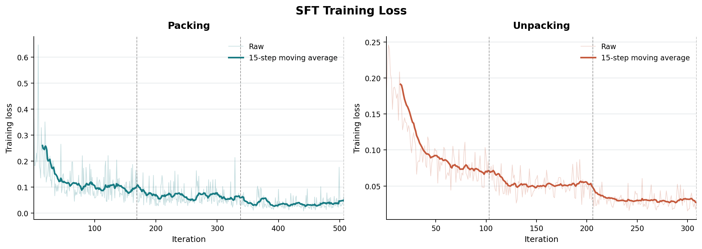
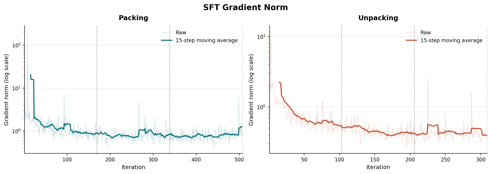
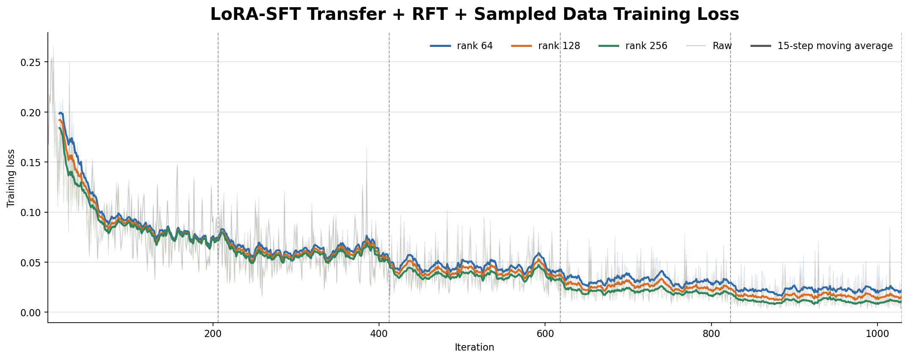
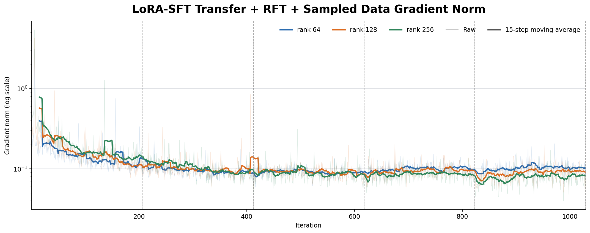
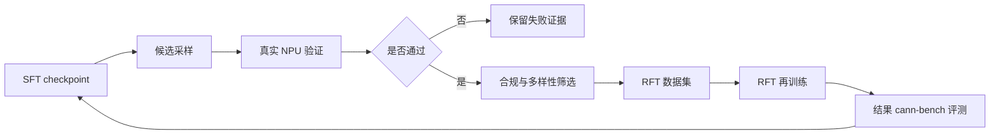
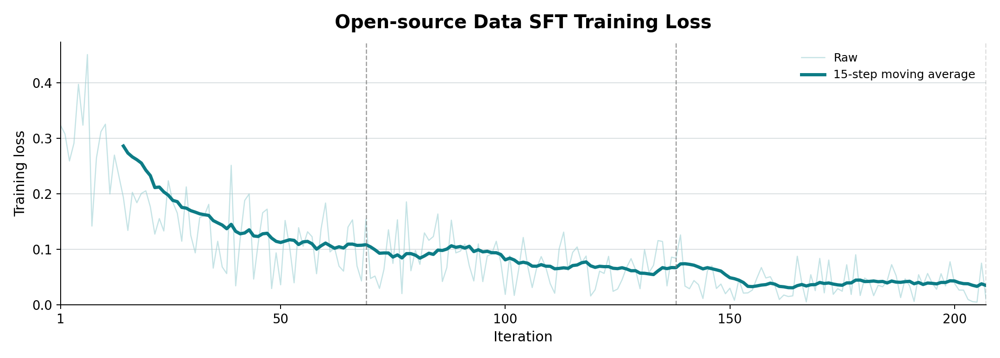
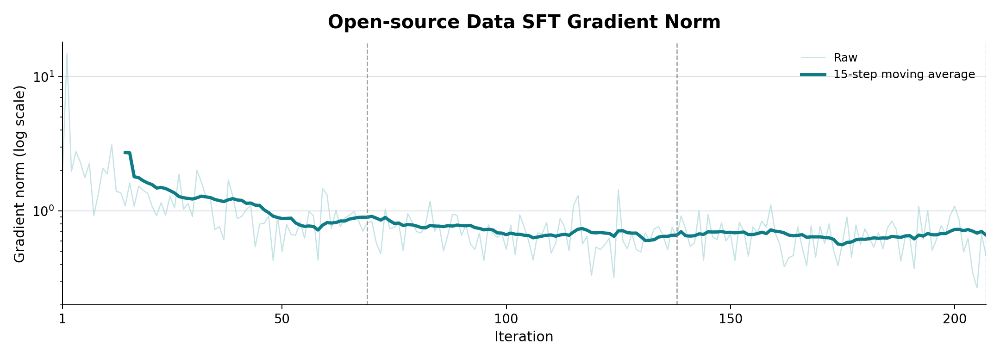
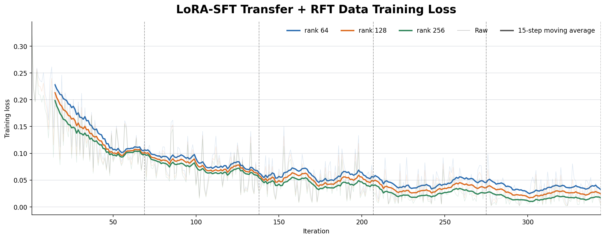
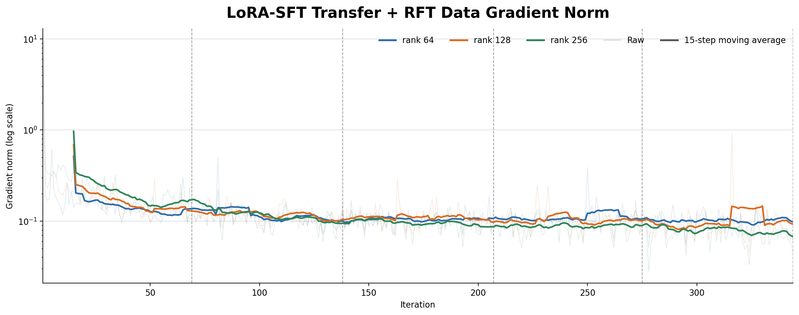

# 面向 cann-bench 的 AscendC 算子生成 SFT 训练实践

---

## 摘要

面向自动生成NPU AscendC 算子任务，模型不仅要理解算子数学语义，还要输出满足代码结构、编译、精度、硬件执行与性能优化等约束的代码。现有通用代码模型在该任务上仍面临领域数据稀缺、长代码交付格式不稳定以及复杂算子/shape 处理能力不足等问题。我们希望围绕这一任务场景，基于开源通用模型，构建完整的后训练流程，提升模型在NPU算子生成方面的能力。其中，SFT/LoRA-SFT训练取得一些初步成果，为支持同领域研究，我们公开训练代码、评测方式以及部分训练数据，欢迎开发者们多多交流指正。

基于 Qwen3.6-27B 基础模型，在Ascend 910C 硬件和 cann-bench level1/level2 任务上，评测 SFT 后模型单轮生成的 AscendC 结果，分数超过了 DeepSeek-V4-Pro-0813/GLM-5.3 等模型的表现。全参 SFT 后，level1 PASS@5 从 12.7 提升至67.3，AVG@5 从 4.1 提升至 45.5；LoRA-SFT后，分数达到 54.6/34.0。相关代码开源在：[qwen36_ascendc 样例目录](https://gitcode.com/cann/cann-recipes-train/tree/master/llm_sft/qwen36_ascendc)，部分训练数据开源在：[数据讨论贴](https://gitcode.com/cann/cann-recipes-train/discussions/2)。

---

## 1. 引言

### 1.1 背景与动机

**为什么直接生成AscendC**：相比使用 Triton、TileLang 等DSL实现方式，直接生成 AscendC 算子性能上限更高，同时也要求模型显式处理更多硬件相关细节，包括多核切分、数据搬运、tiling、同步、尾块等。因此，该任务对模型的领域知识、长代码生成和硬件语义理解提出了更高要求，难度更大，我们认为在 AscendC 任务上实践有效的训练方法论，理论上可以迁移到相对简单的 DSL 生成任务。

**为什么选择后训练方式**：当前有很多 Agent harness 的方式提升算子生成质量，模型利用反馈信息逐轮修复代码，但其效果会同时依赖流程编排、工具设计和推理预算，初始模型能力不足时，Agent 还可能在多轮交互中反复修补局部错误，带来较高的模型调用和验证成本。因此本文优先采用后训练方法，通过参数更新直接增强模型的领域基础能力。当然，我们也在尝试各类 training-free 的方法，通过各类 skills、memory 等提升效果，两种方法本身也可以互相促进，持续提升 Agent 能力。

**为什么评测单轮生成结果**：与多轮评测相比，单轮生成不引入反馈轮数、工具调用和搜索等额外变量，更能反映模型在相同输入下直接生成AscendC 算子的基础水平。可靠的单轮能力也决定了多轮流程的起点质量：初始候选越接近正确且高效的实现，后续 Agent 所需的修复轮次和硬件验证开销越少。因此，提升并评估单轮能力既是本文的阶段性目标，也是后续构建高效多轮生成与优化系统的基础。

### 1.2 输入输出评测

- 评测输入：算子描述及 `proto.yaml`、`desc.md`、`golden.py` 等任务上下文。prompt 示例见[官方示例](https://gitcode.com/cann/cann-recipes-train/blob/master/llm_sft/qwen36_ascendc/prompt_generator/generated_prompt_example.md)。
- 评测输出：满足 `kernel直调` 要求的完整 AscendC 算子交付件。按照字符串组织，格式要求在prompt中说明。
- 评测指标：PASS@5、AVG@5（每个算子进行 5 次生成、评测，取最好结果求平均计算 PASS@5，取所有提交结果求平均计算 AVG@5）。

- 生成方式：训练后的权重部署 vllm 服务进行单轮生成，外部模型通过单轮调用API的方式进行生成，统一按照 cann-bench 评测标准计分。
- 结果对比

| 对比模型                    | Level 1 PASS@5 | Level 1 AVG@5 | Level 2 PASS@5 | Level 2 AVG@5 |
| --------------------------- | -------------: | ------------: | -------------: | ------------: |
| DeepSeek-V4-Flash-0731(max) |           37.8 |          23.2 |           11.6 |           5.6 |
| DeepSeek-V4-Pro-0813(max)   |           46.0 |          19.3 |           11.8 |           4.8 |
| GLM-5.2(max)                |           39.3 |          28.3 |            6.4 |           1.3 |
| GLM-5.3(high)               |           48.4 |          27.7 |              - |             - |
| gpt-5.6-sol                 |           80.2 |          56.5 |           37.3 |          21.2 |
| Qwen3.6-27B                 |           12.7 |           4.1 |              - |             - |
| **Qwen3.6-27B-SFT**         |       **67.3** |      **45.5** |       **28.2** |      **10.2** |

qwen3.6-27B 及其 SFT 模型在采样时都使用官方推荐的采样参数：temperature=0.6，top_p=0.95，top_k=20。从表中结果可以看到，SFT 后模型表现要明显好于 DeepSeek-V4 系列、GLM-5.2 等通用大模型，逐算子结果参见[附录 C](#c-评测结果明细)。在通用大模型评测过程中，出现部分格式不遵从的问题，我们做了对应后处理，详情参考[第 2.5 节](#25-通用模型结果)。


### 1.3 本文亮点

- 通过 SFT 训练后，qwen3.6-27B 在cann-bench level1/level2任务上单轮生成结果超过 DeepSeek-V4、GLM-5.2 等开源模型。
- 开源全参SFT、LoRA SFT 的完整训练代码及部分训练数据，方便开发者复现，对照结果。
- 基于 A3 单机8卡，使用 TorchTitan 框架完成全参 SFT 训练，训练过程数据及评测结果符合预期。

### 1.4 报告结构

本文其余部分组织如下。[第 2 章](#2-任务与评测)定义任务输入、评测标准和 anti_hack 门禁，为后续实验建立统一口径。[第 3 章](#3-任务型数据构造)介绍训练数据的来源、构造方法和过滤方法。[第 4 章](#4-全参数-sft)至[第 6 章](#6-rft)分别报告全参数 SFT、LoRA-SFT 和 RFT 的训练配置、资源开销、主要结果及失败分析。[第 7 章](#7-现有问题与局限)总结现有问题与局限，[第 8 章](#8-开放数据实验)集中比较仅使用开放数据的全参数 SFT 和 LoRA-SFT 实验结果，[第 9 章](#9-未来规划)给出后续数据和训练规划，最后列出[参考文献](#参考文献)与[附录](#附录)。

---

## 2. 任务与评测

### 2.1 任务输入

本项目以 cann-bench benchmark 为目标，训练所使用的题集、答案格式与评分规则均遵循 cann-bench 原仓要求。cann-bench 标准题集包含以下文件：

| 文件 | 作用 | 在任务 prompt 中是否包含 |
| --- | --- | --- |
| `proto.yaml` | 算子 schema、输入输出、属性和签名 | 包含 |
| `desc.md` | 数学语义、约束、dtype/layout 等说明 | 包含 |
| `golden.py` | 生成参考结果，以便进行精度对比 | 包含 |
| `cases.yaml` | 测试用例的 shape、dtype、属性和值域 | 包含 |
| `cases.csv` | 测试用例的表格化索引 | 不包含（信息和cases.yaml重复） |

任务 prompt 还明确了目标硬件为 Ascend 910C（SoC `ascend910_93`）、输出契约等内容。

### 2.2 评测计分

cann-bench level1 包含8个任务，level2 包含16个任务，每个任务生成 5 个独立候选，设任务 `i` 的第 `j` 个候选得分为 `s(i,j)`，每个候选的评分规则参见[cann-bench 官方说明](https://gitcode.com/cann/cann-bench/blob/master/docs/spec/benchmark_spec.md#4-%E8%AF%84%E6%B5%8B%E5%B1%82)，N 个任务的 PASS@5 和 AVG@5 指标定义为：

$$\mathrm{PASS@5}=\frac{1}{N}\sum_{i=1}^{N}\max_{1\leq j\leq 5}s_{i,j},\quad \mathrm{AVG@5}=\frac{1}{N}\sum_{i=1}^{N}\frac{1}{5}\sum_{j=1}^{5}s_{i,j}$$

两项指标均按照官方的 0–100 分数计分（保留一位小数）。

### 2.3 Anti-hack 门禁

任务的核心计算必须在 AscendC Device Kernel 中完成，不得用 ATen、Torch、ACLNN 或 CPU fallback 代替，因此需要排除 hack 行为。我们采用了更严格的hack标准，比如对于 foreach 算子，对于 TensorList 输入输出类型，必须在 kernel 侧进行输入输出处理，这样才符合算子的语义，不能在 plugin 中做循环，多次调用 kernel。

Anti-hack 是计分前的合法性门禁。评测先做规则扫描，未被拦截的提交候选还做一次 LLM 语义审计，具体规则见[附录 A](#a-评测的典型hack行为)。


### 2.4 评测环境

生成结果统一上传到内部搭建的评测服务上，相关的软、硬件版本如下：

| 类别           | 版本         |
| -------------- | ------------ |
| 硬件环境       | Ascend 910C  |
| cann 版本      | 9.1.0-beta.3 |
| torch 版本     | 2.10.0       |
| torch-npu 版本 | 2.10.0.post2 |


### 2.5 通用模型结果

在使用外部模型 API 生成结果的过程中，碰到如下问题：

**输出长度问题**：评测时，我们对训练完的 SFT 模型设置了最大 64K tokens的输出限制，对外部模型未施加限制，但我们实际使用的 GLM-5.2/GLM-5.3 API有单轮最大64K 输出 tokens 的约束，因此 GLM 模型有较多的样例因超过输出长度限制而生成失败：GLM-5.2 分别有 7.5% 和 58.75% 的 Level1 样例和 Level2 样例生成失败，GLM-5.3 则分别有 85% 和 97.5% 的 Level1 样例和 Level2 样例生成失败，并且出现了一个因为推断自身能力不足而拒绝贸然作答的样例，导致评分过差。所以 GLM-5.3 改用在 thinking_mode=high 的评测结果，即使如此，level2 评测时，仍然有接近 90% 的用例超长截断，所以只放 level1 的分数。

**指令遵从问题**：评测 prompt 中给定了交付格式，但 DeepSeek 和 GLM 都存在一定的指令遵从问题，部分输出没有按照约定格式生成，其中 GLM 更为严重。 GLM-5.2 在生成成功的样例中（未因超长而截断的样例）分别有 56.8% 的 Level1 样例 和 81.8% 的 Level2 样例没有按规定格式生成。在统计分数时，对 DeepSeek 和 GLM 生成结果中的格式异常实施了额外的后处理矫正，使其能够正常参与评测。Qwen3.6-27B 基础模型及训练后的模型均未观察到该问题。

此外，评测结果也会有一定程度的波动。推理时每个算子仅采样 5 次，生成本身也具有随机性，因而 PASS@5 和 AVG@5 都是带有抽样噪声的估计。这意味着评测结果中发现的较小分差不能视为稳定优势，较大的差距虽然更有指示性，但可能仍需要在相同配置下进行多随机种子、多轮采样并报告置信区间后才能判断其统计可靠性。

---

## 3. 任务型数据构造

### 3.1 交付件形式

cann-bench 支持多种算子交付方式，对于 AscendC 方式，支持 `aclnn` 和 `kernel直调` 两种算子工程。相比 ACLNN 方式，Kernel 直调交付件的结构更加清晰、简洁；而且 Kernel 直调与 ACLNN 方式之间可以通过相对确定的规则相互转换，模型学会一种形式后，即可通过固定流程转换为另一种交付形式。此外，虽然目前开源算子仓的交付件多以 `aclnn` 方式为主，但形式上于 cann-bench 的交付格式还是有所区别，如 tiling 定义的位置和使用方式。因此，从训练数据制作的角度来说，无论生成 `aclnn` 还是 `kernel直调` 都需要有转换成本。因此，综合考虑后，我们决定将**数据统一转换为 Kernel 直调交付件，并让模型按照这种形式学习和生成**。

### 3.2 开源算子转换

目前，CANN 已经开源 ops-** 系列的多个算子仓库，这些算子以 `aclnn` 交付方式为主。为充分利用这些数据，我们需要将仓上数据的规格、数学定义等信息转换为 cann-bench 题集格式，将代码转换为 `kernel直调` 交付形式。转换工作基于各仓的9.1.0分支进行。

cann-bench 的 `kernel直调` 交付件由以下四个文件组成：

```text
src/<算子名>/
├── CMakeLists.txt
├── op_kernel/
│   ├── <算子名>_kernel.cpp
│   └── <算子名>_launch.h
└── op_plugin/
    └── <算子名>_plugin.cpp
```

仓上 `aclnn` 形式与 cann-bench  `kernel直调` 的主要区别如下：

| 对比项 | 仓上 ACLNN 形式 | cann-bench direct launch |
|---|---|---|
| **调用入口** | 通过 ACLNN 接口及运行时调用链执行 | 通过 PyTorch plugin 直接调用自定义 Kernel |
| **框架依赖** | 包含 Op def、算子注册和 GE/gert `TilingContext` 等框架依赖 | 去除上述框架依赖，使用普通 C++ 接口 |
| **Host Tiling** | 通过 `TilingContext` 读取和回写数据 | 通过普通 C++ 参数接收元数据并返回 TilingData |
| **Kernel Launch** | 由 ACLNN 和运行时调用链完成 | 由 launch wrapper 直接发射自定义 Kernel |
| **Device Kernel** | 在 NPU 侧执行核心张量计算 | 保留并直接调用自定义 AscendC Kernel |

转换过程中，要求不得改变源仓算子的 Kernel 代码、Host Tiling 代码等核心部分，只能补写或改写框架接口、launch wrapper、plugin 参数下发、输出分配及 workspace 分配等胶水代码。我们基于 [cannbot-skills 仓中已有的转换 skill](https://gitcode.com/cann/cannbot-skills/tree/master/ops/ascendc-registry-invoke-to-direct-invoke)，完善了交付格式、质量要求和拦截机制等内容，使用 LLM Agent 进行数据转换。


### 3.3 转换步骤

具体步骤为：

```text
仓上 910B/910C 算子源码
    ↓
抽取 Bundle
    ↓
生成题集
    ↓
转换代码
    ↓
检查与上板测试
    ├─ 通过 → 入库并汇总
    └─ 未通过 → 失败样本 Debug → 重新执行检查与上板测试
```

对于 A2/A3 算子，首先从源仓使用脚本抽取必要代码和信息，生成 Bundle 文件；随后根据 Bundle 生成五文件题集和 direct-launch 四文件答案。题集经过结构与一致性校验，答案经过 anti-hack 检查和上板正确性测试。未通过的答案仅对 direct-launch 胶水层进行调试，并在修复后重新测试。其中具体步骤如下：

| 阶段 | 主要工作 |
|---|---|
| **抽取 Bundle** | 首先批量从仓上算子源码和文档中抽取 Op def、InferShape、Device Kernel、Host Tiling、TilingData、测试信息和必要依赖，去除不需要的框架管线，为每个算子生成一个 Bundle 文件。 |
| **生成题集** | 根据 Bundle 和原始文档按照 cann-bench 格式生成标准题集。 |
| **转换代码** | 转换 tiling/kernel 等核心逻辑代码，补写或改写 `TilingContext` 接口、Kernel 入口、launch wrapper 等 direct-launch 胶水。 |
| **检查与上板测试** | 对题集进行结构与一致性校验，对答案进行 anti-hack 检查和上板精度测试。 |
| **失败样本 Debug** | 对未通过的答案使用 LLM 进行 debug，期间不修改冻结的 Device Kernel 计算主体和 Host Tiling 核心逻辑，仅修复胶水层。修复后的答案需要重新进行 anti-hack 检查和上板测试。 |

我们开放了目前已转换成功的 200 多条数据，代码组织方式如下：

```text
<算子名>/
├── src/
│   ├── CMakeLists.txt
│   ├── op_kernel/<算子名>_kernel.cpp
│   ├── op_kernel/<算子名>_launch.h
│   └── op_plugin/<算子名>_plugin.cpp
├── desc/
│   ├── desc.md
│   ├── golden.py
│   ├── cases.yaml
│   ├── cases.csv
│   └── proto.yaml
```

**需要注意的是，虽然我们做了质量的筛查，但 LLM Agent 生成的题集可能还是存在shape、值域覆盖度不足、甚至描述错误等问题，欢迎大家在使用过程中给我们反馈。**

### 3.4 后处理与难例补充

除了上述的标准流程外，我们对 foreach 类型数据做了额外的后处理。因为这些原始算子代码使用了更为抽象的公共基类，模板参数使用较多，模型按照这些数据学习，生成的代码会保持这种对单独算子来说冗余的编码风格。因此我们对这些算子的 kernel / tiling 代码做了简化，使用简化代码进行训练。

此外，对于部分评测中的复杂场景，我们针对性补充了部分数据，如评测中的 `masked_scale` 算子需要通过级联调用 cast，实现 int8/uint8 到 float32的转换，`foreach_norm` 算子需要处理 foreach + reduction 操作的场景。我们补充了需要使用类似知识的题目以提升在这些样本的效果和稳定性，这部分的实际增益会在[附录 B](#b-难例补充效果)中介绍。

尽管生成数据的题目都是根据原始开源算子仓的文档、实现重新构造的，即使和 cann-bench 已有任务同名，实际要支持的数据类型、值域等要求也往往不同，但为了避免训练数据和评测数据重叠，我们以上数据在加入最终训练集前，仍会与 cann-bench 评测题集进行去重，避免数据污染。

---

## 4. 全参数 SFT

全参数 SFT 的目标是在通用代码能力之上，补齐 AscendC 算子生成所需的领域知识、交付格式和长代码生成能力。本阶段直接更新模型参数，使模型在单轮生成时能够更稳定地理解算子语义，处理核间任务划分、GM/UB 数据搬运、tiling、同步和尾块等硬件相关细节，并按照 cann-bench 的 `kernel_direct` 契约输出完整交付件。

本节报告 Qwen3.6-27B 的语言模型全参数 SFT 实验。训练时冻结视觉模块，仅更新语言模型参数；因此，本文所称“全参数”均指语言模型部分的全参数训练。

### 4.1 数据构成

按照[第 3 章](#3-任务型数据构造)介绍的数据构造方法，我们实际在训练中使用的数据组成如下：

| 数据集 | 样本数 | 占比 | 来源与作用 |
| --- | ---: | ---: | --- |
| `ops-aug-0824` | 285 | 17.3% | 从开源的ops-math/ops-nn等算子仓转换得到，并适配 cann-bench 交付格式 |
| `rft-0824` | 265 | 16.1% | 题目与 ops-aug-0824 数据相同，答案由经过 SFT 的模型采样得到，补充实现多样性 |
| `agent-sampled-0824` | 1,096 | 66.6% | 题目与 ops-aug-0824 数据相同，答案使用其他LLM采样生成，额外增加了76条难例补充数据 |
| **合计** | **1,646** | **100.0%** |  |

训练数据中不包含 thinking 过程，也不包含知识问答类的文本 QA 数据，关于这两类数据的实验情况，将在[第 7 章](#7-现有问题与局限)说明。

### 4.2 训练参数配置

在全参数 SFT 实验中，我们使用同样配置在 TorchTitan-NPU 和 MindSpeed-MM 两个框架上进行了实验，参数配置如下表所示。

| 类别 | 配置 |
| --- | --- |
| 基础模型 | Qwen3.6-27B |
| 上下文长度 | 65,536 tokens |
| 训练轮数 | 3 epochs |
| 优化器 | fused AdamW；`beta1=0.9`，`beta2=0.999`，`eps=1e-8` |
| 学习率 | 峰值 `1e-5`；10% warmup；cosine decay 至 0 |
| 正则化 | weight decay 0；`clip_grad=0.0`，未启用显式梯度裁剪 |
| 数值精度 | FSDP 参数 BF16；梯度归约 FP32；checkpoint 保存为 BF16 |
| 训练资源 | Atlas A3单机8卡 |
| 并行策略 | DP = 2；FSDP = 16；CP = 8；TP = 1 |
| 显存优化 | activation recompute；activation offload；chunk loss；micro_batch_size = 1 |
| 初始状态 | 从 Qwen3.6-27B release checkpoint 加载权重；不加载 optimizer 和 RNG 状态 |
| Checkpoint | DCP 格式；每个 epoch 保存一次 |
| 随机种子 | 42 |
| packing | True |
| loss聚合 | per_token_loss |
| global_batch_size | 2 |

### 4.3 训练过程与结果

使用上述数据和配置，基于Atlas A3单机环境训练3个 epoch，TorchTitan 训练过程的loss和gradient norm如下：



<p align="center"><strong>图 4a　SFT 的 training loss 曲线和 grad norm 曲线。</strong> 从曲线图上看，训练过程中，loss 和 grad norm 都呈现出较为清晰的下降趋势。</p>

SFT 模型在 cann-bench 测试集上的分数如下表所示：

| 模型 | 推理模式 | Level 1 PASS@5 | Level 1 AVG@5 | Level 2 PASS@5 | Level 2 AVG@5 |
| --- | --- | ---: | ---: | ---: | ---: |
| Qwen3.6-27B Base Model | thinking | 12.7 | 4.1 | - | - |
| SFT Model | no-thinking | 58.6 | 33.1 | 19.8 | 5.1 |
| SFT Model | thinking | 67.3 | 45.5 | 28.2 | 10.2 |

本次实验中，我们使用 TorchTitan-NPU 框架进行实验，可以看到 SFT 模型的分数相比原始基模有显著提升。

虽然训练时并没有开启 thinking，但在推理时开启 thinking 模式能够进一步提升分数。此外，我们希望在下游的 RL 任务中进一步提升 thinking 的能力，因此我们在 SFT 阶段使用 thinking 推理模式的结果作为当前阶段模型能力的最终衡量。

### 4.4 不同 loss 类型对比

在初期探索时，我们首先进行了使用 per_sample_loss 的实验（训练时样本使用 unpacking），在确定了训练效果之后，我们使用了 per_token_loss + packing 数据的方式提升训练效率。per_sample_loss 实验时将 global_batch_size 设置为 16，loss类型使用 per_sample_loss。以下是在 MindSpeed-MM 框架下进行两类 loss 实验的结果对比。




<p align="center"><strong>图 4b　Packing 与 Unpacking 的 training loss 曲线。</strong> 浅色线为逐步原始值，深色线为 15-step 滑动平均。两组 loss 的聚合方式分别为 per-token 和 per-sample，绝对数值不宜直接横向比较。</p>



<p align="center"><strong>图 4c　Packing 与 Unpacking 的 grad norm 曲线。</strong> 纵轴使用对数尺度，以同时展示 packing 初期的高梯度尖峰和后续主体区间。</p>

两组实验的 epoch 平均 training loss 都持续下降。由于 loss 定义不同，这些数字只用于判断各自运行的纵向趋势。由于 `clip_grad=0.0`，训练过程出现的这些grad_norm 尖峰没有被显式裁剪。

在 cann-bench level1 和 level2 上的评测结果如下所示：

| loss类型 | 推理模式 | Level 1 PASS@5 | Level 1 AVG@5 | Level 2 PASS@5 | Level 2 AVG@5 |
| --- | --- | ---: | ---: | ---: | ---: |
| per_sample_loss | no-thinking | 61.0 | 35.6 | 17.2 | 6.0 |
| per_sample_loss | thinking | 62.0 | 39.9 | 28.1 | 7.4 |
| per_token_loss | no-thinking | 50.5 | 20.9 | 15.2 | 4.4 |
| per_token_loss | thinking | 57.0 | 38.3 | 25.3 | 8.3 |

单次训练和推理的结果可能存在波动，从开启 thinking 推理的实验来看，两种类型的结果较为接近。但 packing 方式有较大的性能优势，从训练效率角度考虑，可以优先选择 packing 方式进行实验。同样3个 epoch，packing 方式的耗时只需要 unpacking 的 2/3


---

## 5. LoRA-SFT

### 5.1 目标与实验设计

LoRA-SFT 从 Qwen3.6-27B Base 权重开始，在保持基础模型参数冻结的情况下，为选定线性层引入低秩更新。对于原权重矩阵 $W$，[LoRA](https://arxiv.org/abs/2106.09685) 将训练后的权重写为

$$
W' = W + \frac{\alpha}{r}BA,
$$

其中 $r$ 为 LoRA rank，$A$ 和 $B$ 为可训练的低秩矩阵。实验固定 $\alpha/r=2$，设置 $r\in\{64,128,256\}$。LoRA 分支均从 Base 权重开始训练，不从全参数 SFT checkpoint 继续训练，用来比较参数高效微调的效果和资源开销。

除训练数据组合和 LoRA rank 外，其余超参数保持一致。三类数据的来源、作用和样本统计见[第 4.1 节](#41-数据构成)，使用 no-thinking 模板，训练 5 个 epoch。每个 checkpoint 按[第 2 章](#2-任务与评测)的统一协议，在 cann-bench Level 1 和 Level 2 上分别进行 thinking/no-thinking 单轮生成评测。后文统一报告整体表现较优的 epoch 4 checkpoint 结果。

### 5.2 LoRA 实现与训练配置

LoRA 训练基于 [MindSpeed-MM](https://gitcode.com/Ascend/MindSpeed-MM) 的 FSDP2 实现。训练时基础模型与视觉模块保持冻结，仅 LoRA 参数参与优化；LoRA 参数以 fp32 训练，模型参数和保存权重采用 bf16，梯度规约采用 fp32。LoRA 注入范围覆盖标准自注意力层的 `q_proj`、`k_proj`、`v_proj`、`o_proj`，以及 MLP 的 `gate_proj`、`up_proj`、`down_proj`，不包含 Gated DeltaNet（GDN）线性注意力层。

**表 11：LoRA-SFT 公共训练配置**

| 配置项 | 设置 |
| --- | --- |
| 基础模型 | Qwen3.6-27B |
| 训练环境 | 单节点 Ascend A3、16 die、单 die 64 GB；CANN 9.0.0 |
| 软件版本 | PyTorch 2.7.1、torch-npu 2.7.1、Transformers 5.2.0、PEFT 0.7.1、Triton-ascend 3.2.1 |
| 分布式配置 | Ulysses/CP 8 |
| 批大小 | micro batch size 1，global batch size 8 |
| 序列 | cutoff length 65,536，unpacking |
| 优化器 | fused AdamW，学习率 $1\times10^{-4}$，cosine decay，warmup ratio 0.05，weight decay 0 |
| 训练轮数 | 5 epochs，gradient clipping 1.0，seed 42 |
| LoRA | rank 64/128/256，alpha 128/256/512，dropout 0.05，默认初始化 |
| target modules | 标准 self-attention 的 q/k/v/o projection 与 MLP 的 gate/up/down projection |

### 5.3 训练过程与主要结果

图 5a～图 5b 展示三个 LoRA rank 的训练过程。每组实验共训练 1,029 个 iteration，虚线标记 iter 206、412、618、823 和 1,029 的五个 epoch checkpoint。



<p align="center"><strong>图 5a　转仓数据、RFT 数据和采样数据实验的 training loss 曲线。</strong> 浅色线为逐步原始值，深色线为 15-step 滑动平均。</p>



<p align="center"><strong>图 5b　转仓数据、RFT 数据和采样数据实验的 grad norm 曲线。</strong> 纵轴使用对数尺度，以展示训练初期的梯度尖峰和后续主体区间。</p>

从训练曲线可以看到，三个 rank 的 epoch 平均 training loss 均逐轮下降。训练过程中，该组实验的 grad norm 在 iter 6 达到最大值 5.374，随后回落，没有出现持续发散。

结合各 checkpoint 的评测结果，LoRA rank 256 的 epoch 4 checkpoint 综合表现最好，如下表（评测单元格统一写作“PASS@5 / AVG@5”）：

| LoRA rank | Checkpoint | Level 1 thinking | Level 1 no-thinking | Level 2 thinking | Level 2 no-thinking |
| ---: | ---: | ---: | ---: | ---: | ---: |
| 256 | epoch 4 | 54.55 / 34.03 | 59.89 / 31.84 | 24.11 / 6.10 | 25.65 / 9.60 |

### 5.4 Target modules 对比

我们对不同模块使用 LoRA 的效果做了对比。实验均采用 rank 256，统一报告 epoch 4 checkpoint 的结果，其余训练配置保持不变。同一数据组合内设置三种 target modules：主实验同时训练 Full Attention 的 `q_proj`、`k_proj`、`v_proj`、`o_proj` 和 FFN 的 `gate_proj`、`up_proj`、`down_proj`；第一组对比在主实验基础上移除 Full Attention projection，仅训练 FFN 的 `gate_proj`、`up_proj` 和 `down_proj`；第二组保留主实验中的 Full Attention 和 FFN projection，并额外训练 GDN 的 `in_proj_qkv` 和 `out_proj`，不包含 `in_proj_z`、`in_proj_b` 和 `in_proj_a`。

| Target modules | Level 1 thinking | Level 1 no-thinking | Level 2 thinking | Level 2 no-thinking |
| --- | ---: | ---: | ---: | ---: |
| Full Attention + FFN（主实验） | 54.55 / 34.03 | 59.89 / 31.84 | 24.11 / 6.10 | 25.65 / 9.60 |
| FFN | 41.05 / 27.65 | 49.48 / 34.12 | 13.12 / 5.18 | 26.01 / 9.34 |
| Full Attention + FFN + 部分 GDN | 58.28 / 37.29 | 47.7 / 31.11 | 20.62 / 7.3 | 20.84 / 8.65 |

除上述对比外，在前期训练中，我们还发现，将 GDN 的 `in_proj_z`、`in_proj_b`、`in_proj_a` 纳入 LoRA target modules 后，不同 rank 的模型均出现明显的能力坍塌，严重时在 thinking 模式下无法稳定输出格式字符。因此，主实验没有训练这些模块。

从结构上看，可能因为 `in_proj_b` 和 `in_proj_a` 的输出维度仅为 value head 数，是两个较窄的投影；所用 rank 已接近或超过其最大秩，LoRA 参数量相对原权重也较大。三个投影又直接参与 GDN 的状态更新和门控。但由于还没有进行逐模块消融和权重增量分析，这里先记录这一现象，不作归因。

### 5.5 不同 LoRA rank 的对比

统一使用 epoch 4 checkpoint 对比不同 lora rank 下的评测结果。就本组实验结果而言，rank=256的结果最优，但整体未呈现 rank 越大评测效果越好的趋势。

| LoRA rank | Level 1 thinking | Level 1 no-thinking | Level 2 thinking | Level 2 no-thinking |
| ---: | ---: | ---: | ---: | ---: |
| 64 | 46.21 / 29.09 | 49.09 / 33.23 | 11.83 / 4.19 | 18.18 / 7.60 |
| 128 | 39.97 / 25.54 | 46.28 / 24.90 | 12.15 / 3.36 | 18.14 / 6.32 |
| 256 | 54.55 / 34.03 | 59.89 / 31.84 | 24.11 / 6.10 | 25.65 / 9.60 |

### 5.6 与 Base 和全参数 SFT 的比较

对比全参数 SFT 的表现，使用[第 4.4 节](#44-不同-loss-类型对比)中 MindSpeed-MM unpacking 配置，LoRA-SFT 使用 rank 256 的 epoch 4 checkpoint。

| 方法 | Level 1 thinking | Level 1 no-thinking | Level 2 thinking | Level 2 no-thinking | 总epoch数 | 训练耗时 | 峰值显存 |
| --- | ---: | ---: | ---: | ---: | --- | ---: | ---- |
| 基础模型 | 12.7 / 4.1 | — | — | — | — | — | — |
| 全参数 SFT | 62.0 / 39.9 | 61.0 / 35.6 | 28.1 / 7.4 | 17.2 / 6.0 | 3 | 约 3.7 h | 约 46 GiB |
| LoRA-SFT | 54.6 / 34.0 | 59.9 / 31.8 | 24.1 / 6.1 | 25.7 / 9.6 | 5 | 约 4.5 h | 约 27 GiB |

从表 14 可以看到，全参数 SFT 在 thinking 模式下的结果整体更高；在 no-thinking 模式下，LoRA-SFT 的 Level 1 结果接近全参数 SFT，Level 2 的 PASS@5 和 AVG@5 更高。资源方面，LoRA-SFT 的峰值单卡显存约为 27 GiB，全参数 SFT 约为 46 GiB；LoRA-SFT 还可以在 8 die 上完成训练。因为评测波动的原因，该结果仅作为参考。

---

## 6. RFT

本文的 RFT 指 Rejection Sampling Fine-Tuning。其基本思想是：从已有 SFT checkpoint 出发，在基线权重上生成多个候选实现，上板筛选出正确样本，再将这些样本用于后续训练，形成“模型采样—硬件验证—数据筛选—重新训练—再次评测”的闭环。

与一次性构造的静态训练集相比，RFT 的优势在于训练数据来自模型自身的生成分布，学习难度更低，可以通过多次采样构建多样性数据，保持模型的探索能力，为 RL 训练打下基础。

### 6.1 整体流程

RFT从某个SFT checkpoint开始，采样题目从SFT训练集中抽取，一次完整的RFT闭环包含六个阶段：

1. 选择当前SFT checkpoint与目标任务；
2. 使用各种采样方法产生候选实现；
3. 在真实NPU环境完成编译、运行、精度与anti_hack验证；
4. 对通过候选进行去重和实现路线筛选入库；
5. 根据算子分类、难度、重复率和数据规模构造RFT训练集；
6. 基于SFT权重继续训练或混入SFT数据中重新训练。



<p align="center"><strong>图 6a　RFT端到端闭环。</strong> 从SFT checkpoint出发，依次完成候选采样、真实NPU验证、路线筛选、RFT再训练与 cann-bench 评测。</p>

### 6.2 数据采样方法

实际采样中我们发现，在数据样本较少的初期，经过SFT之后，模型采样成功率还是很低，无法满足大规模样本生成的需要。复杂算子基本失败，简单算子也难以探索到多种实现路径，为此，我们采用如下几种办法扩大采样：

1. **原生Direct**：只提供原生任务prompt，模型独立生成完整实现。
2. **信息补充**：提供必要API、ABI、数值公式或目标路线，不直接提供完整答案；分别服务于0→1知识补充和第二路径探索。
3. **多轮反馈修复**：对目进行4次独立生成后选择最佳表现的2个算子作为初修复，根据结果再优选1个深度修复。

采样时，当前的 checkpoint 产生的样本会统一作为 RFT 样本池化使用，不只用于自身的继续训练。不同方法面对的题目难度和场景都不同，成功率不能直接横向对比。下表是历史代表实验的典型采样成功率，可以看出大致的生产效率：

| 生产方法 | 典型采样成功率 | 结论 |
|---|---|---|
| 原生Direct | 约48.5% | 已会算子产率较高，但未知结构曾连续96次没有成功，平均值不能代表0→1能力 |
| 信息补充 | 约18.8% | 适合补明确的接口、类型和ABI知识，实际收益强依赖目标算子与信息质量 |
| 多轮反馈修复 | 约23.2% | 适合near-pass收尾，但需要多轮生成、上板和串行选择 |

模型生成的候选要经过格式检查、anti-hack、上板精度验证，还需要和已有实现进行对比去重，最终约10000条采样数据中，形成265条数据，覆盖139个算子。

### 6.3 联合混训与增量训练

对于RFT数据，我们验证了两种使用方式：一是与原有SFT数据直接混合训练，二是先完成SFT，再使用RFT数据进行增量训练。实验发现，两种方式的效果和基础数据的组成、增量训练的超参关系较大。

**早期实验**：基础数据以仓库转换数据和部分文本QA数据为主，增量训练的效果更优，具体如下表：

| 设置 | 训练方式 | 评测结果（PASS@5/AVG@5） |
|---|---|---|
| 基础数据 | 基础数据训练3 epoch                         | cann-bench level1：39.3/25.5 |
| 基础数据 + RFT 数据混训 | 在上述数据中加入RFT数据，共同训练3 epoch | cann-bench level1：42.6/30.7 |
| 增量训练 | 基础数据 checkpoint + 200条 RFT 训练2 epoch | cann-bench level1：48.6/39.1 |

**规模实验**：按照[第 4 章](#4-全参数-sft)描述的数据组成进行训练，基础数据只包含前两类数据，再集中训练RFT。

| 设置 | 训练方式 | 评测结果 |
|---|---|---|
| 联合混训 | 基础数据训练3 epoch + RFT 数据训练 3 epoch | cann-bench level1：53.1/33.9 |
| 基础数据 | 基础数据训练3 epoch | cann-bench level1：46.7/27.0 |
| 增量训练 | 基础数据 checkpoint + 265条 RFT 训练 3 epoch | cann-bench level1：20.5/12.8 |

实验结果上看到：
- 在基座模型较弱、欠拟合时，集中的小规模RFT训练能有效放大监督信号；
- 当基座模型已经在大规模数据上收敛后，同样强度的集中训练会造成过拟合和灾难性遗忘。

因此，在数据规模扩大后，应优先选择混训以保证分布稳定，若必须做增量/分阶段训练，则必须同步降低学习率、减少epoch，并引入基础数据回放。


---

## 7. 现有问题与局限

> 本章只保留有实际观察或证据的问题，每项说明现象、影响范围和当前缓解方式。

### 7.1 thinking 能力训练

目前训练数据不包含思维链，评测时开启 thinking 就会有训练和推理设置不一致的问题，可能造成训练效果下降。但为了后续 RL/Agentic RL 的训练效果，thinking 是必须开启的。所以我们尝试补充了 thinking 数据，训练后模型能够遵循思维链的格式，但评测结果不佳，仍需进一步补充数据和实验。

**实验一：增加代码注释**

在增加人工构造的思维链之前，我们预先尝试了加入代码注释后的训练效果。我们在完整答案、Kernel 代码、Tiling 代码和 ABI 代码前均加入了包含实现细节的注释。使用注释增强后的代码在采样数据上进行训练，会造成一定程度的性能回退。

**实验二：使用 LLM 构造的 thinking**

随后，我们使用 LLM 构造的 thinking 补齐缺失的思维链。训练数据在 `<think></think>` 块中加入由 LLM Agent 生成的思维链，并在推理时开启 thinking。

初步结果显示，未能显著提升模型能力或稳定性，反而使平均分下降明显，但我们也发现，思维链似乎只是增大了方差，并没有使模型失去正确生成算子的能力。因为我们进一步测试了模型在 PASS@30 下的表现：对每个算子采样 30 次并取最高分后，模型仍能达到约 60 分。

### 7.2 QA数据的训练效果

除了使用当前的任务型数据外，我们尝试增加部分文本QA数据作为训练集。QA 数据主要依据官方资料和评测出现的典型问题构造：前者包括官方接口文档、编程指南和性能优化资料，用于确定 API 签名、参数语义、平台支持范围及调用限制；后者是针对评测中出现的典型编译问题补充对应的文本数据。共构造QA数据约2K条。

我们使用纯 QA 数据、任务数据与 QA 混合数据开展多轮实验。纯 QA 训练的效果并不理想，模型在部分样本中能够正确生成局部接口调用或实现局部计算过程，但解析或编译失败仍较常见，调整推理配置也未带来稳定改善。将 QA 与任务数据混合后，在 `mish` 和 `sigmoid` 的部分评测样本中可以观察到更合理的接口选择，但这些变化无法单独归因于 QA，现有实验结果也尚未显示其已转化为持续、稳定的整体提升，部分结果还出现了回退。进一步复核表明，即使部分旧错误不再出现，样本仍可能因新的编译、运行或精度问题而失败。目前推测此类数据和单轮生成代码结果的任务要求分布偏差较大，没有明显效果，尝试在后续 Debug 任务中进行针对训练。

### 7.3 复杂数据的缺失

在训练过程中，我们发现，算子仓转录数据带来的效果增益仍不明显。因此，后续实验需要引入更多复杂算子，并进一步简化从算子仓转录得到的 Kernel 和 Tiling 代码，使答案更加结构化，以便用作任务型训练数据。同时，算子采样也将覆盖更多高质量、高难度的算子，不再局限于 Level 1 和 Level 2 算子。

### 7.4 ILP问题

当前模型在 SFT Loss 已经较低的情况下，仍无法稳定复现训练样本的正确结果，简单增加训练轮数或数据比例也可能带来通用能力回退，难以稳定解决问题。比较符合[参考文献 7](https://arxiv.org/abs/2604.10079)中提到的 ILP 问题（Incomplete Learning Phenomenon）。因为算子数据构造和验证成本较高，模型如果对训练样本的掌握情况不好，相当于对数据的浪费，同时造成下游RL训练的难度增加。后续会围绕这一问题进行充分的根因分析和专项修复。

## 8. 开放数据实验

我们开放了部分数据集，基于此数据集和前述的参数进行了实验，以下是我们的实验结果，欢迎各位开发者基于此进行复现，或做进一步的尝试。两组实验均按照[第 2 章](#2-任务与评测)的统一评测协议进行。

### 8.1 全参数 SFT 实验

开放数据合计 550 条样本，训练过程的 loss 曲线图和 grad norm 曲线图如下所示：



<p align="center"><strong>图 8a　仅使用开放数据训练的 loss 曲线。</strong> 浅色线为逐 iteration 原始 loss，深色线为 15-step 移动平均；虚线标记 epoch checkpoint 边界。</p>



<p align="center"><strong>图 8b　仅使用开放数据训练的 grad norm 曲线。</strong> 纵轴使用对数尺度；浅色线为原始梯度范数，深色线为 15-step 移动平均，虚线标记 epoch checkpoint 边界。</p>

训练结束后进行五轮生成评测，结果如下。

| 框架 | 推理模式 | Level 1 PASS@5 | Level 1 AVG@5 | Level 2 PASS@5 | Level 2 AVG@5 |
| --- | ---: | ---: | ---: | ---: | --- |
| TorchTitan | thinking | 55.2 | 30.7 | 7.2 | 3.3 |
| TorchTitan | no-thinking | 40.6 | 22.0 | 1.6 | 0.3 |
| MindSpeed-MM | thinking | 51.4 | 24.8 | 8.0 | 2.2 |
| MindSpeed-MM | no-thinking | 39.1 | 19.8 | 1.0 | 0.2 |

结果表明，仅使用开放数据已经能够学习基本的 AscendC 交付格式和部分算子模式，但对 Level 2 复杂算子及多样实现的覆盖仍然不足。

### 8.2 LoRA-SFT 实验

只使用开放数据进行 LoRA 训练，超参配置不变，分别采用 LoRA rank 64、128 和 256 训练 5 个 epoch。每组实验共训练 344 个 iteration，虚线标记 iter 69、138、207、275 和 344 的五个 epoch checkpoint。



<p align="center"><strong>图 8c　开放数据实验的 training loss 曲线。</strong> 浅色线为逐步原始值，深色线为 15-step 滑动平均。</p>



<p align="center"><strong>图 8d　开放数据实验的 grad norm 曲线。</strong> 纵轴使用对数尺度；三个 rank 均在训练初期出现梯度尖峰，随后回落至稳定区间。</p>

只使用开放数据的训练结果评测如下：

| LoRA rank | Level 1 thinking | Level 1 no-thinking | Level 2 thinking | Level 2 no-thinking |
| ---: | ---: | ---: | ---: | ---: |
| 64 | 38.8 / 30.8 | 24.3 / 16.7 | 7.7 / 2.8 | 0.2 / 0.0 |
| 128 | 50.0 / 24.7 | 41.7 / 23.3 | 4.9 / 2.2 | 2.6 / 0.5 |
| 256 | 45.9 / 35.6 | 52.0 / 24.0 | 9.1 / 3.1 | 1.6 / 0.3 |

---

## 9. 未来规划

### 9.1 RL 训练与 Agentic RL 训练

在现有 SFT 和 RFT 工作的基础上，继续开展单轮 RL，重点提高复杂算子生成的成功率。目前初步的 RL 实验发现模型采样成功率低，有效训练信号不足，reward的设计也需要持续实验。

在此基础上，后续还将探索多轮 Agentic RL，使模型能够根据编译、精度和运行反馈逐步修正生成结果，并评估多轮反馈对算子生成成功率的提升。

### 9.2 多任务 SFT 与轨迹数据建设

当前 SFT 主要使用“任务描述—最终正确代码”形式的生成数据，能够帮助模型学习 AscendC 编程方式、kernel_direct 交付格式和基本算子实现范式，但对完整问题解决过程的监督仍然不足。实际算子开发通常需要经历代码生成、编译、运行、精度检查、错误定位和性能优化等多个阶段。仅学习最终代码，模型难以掌握如何利用环境反馈定位复杂问题、进行性能优化，也难以为后续多轮 Agent 和 Agentic RL 提供稳定基础。

下一阶段将构建面向 AscendC 算子开发的全流程轨迹数据。数据主要来自真实 Agent 运行日志、benchmark 任务回收记录和数据构造阶段产生的候选实现，抽取并保留任务规格、各轮代码及修改、编译与运行结果、精度误差、性能数据等，整理为以下多种 SFT 任务：

- **Kernel Generation**：对齐当前 SFT 数据格式，输入为问题描述，输出为经过验证的完整 AscendC 交付件。
- **Kernel Debug**：输入问题描述、当前实现，编译日志、执行日志、精度结果，输出为成功修复问题的版本。
- **Kernel Optimizations**：输入问题描述、当前实现、profiling信息、性能结果，输出优化方案和更优的实现版本。
- **Agentic SFT**：使用完整的带工具、skills等的轨迹数据训练，使模型具备多轮生成、优化的基础能力。

### 9.3 复杂算子数据扩充

目前算子数据以 Elementwise/Reduction 等简单算子类型为主，复杂算子、复杂 Shape和强硬件约束场景覆盖不足，同时 thinking 数据的质量也需要持续提高，后续会持续提升。随着 A5 等新硬件持续发布，也需要补充对应数据提升模型在不同代际芯片上生成算子的泛化能力。

### 9.4 方法论的跨模型迁移验证

相关训练方法迁移到 DeepSeek-V4-flash 等更大模型，验证方法论在不同参数规模、基础知识能力模型上的收益稳定性、成本和适用边界。

---

## 参考文献

- Gao X, Pan D, Su Y, et al. *CANN Bench: Benchmarking Agent Generated Kernels against Real NPU and Algorithmic Limits*. arXiv preprint arXiv:2607.20518, 2026. [https://arxiv.org/abs/2607.20518](https://arxiv.org/abs/2607.20518)

- Dai W, Wu H, Yu Q, et al. *CUDA Agent: Large-Scale Agentic RL for High-Performance CUDA Kernel Generation*. arXiv preprint arXiv:2602.24286, 2026. [https://arxiv.org/abs/2602.24286](https://arxiv.org/abs/2602.24286)

- Baronio C, Marsella P, Pan B, et al. *Kevin: Multi-Turn RL for Generating CUDA Kernels*. International Conference on Learning Representations (ICLR), 2026. [https://arxiv.org/abs/2507.11948](https://arxiv.org/abs/2507.11948)

- Li X, Sun X, Wang A, et al. *CUDA-L1: Improving CUDA Optimization via Contrastive Reinforcement Learning*. arXiv preprint arXiv:2507.14111, 2025. [https://arxiv.org/abs/2507.14111](https://arxiv.org/abs/2507.14111)

- Cheng K, Lu S, Liao S, et al. *MusaCoder: Native GPU Kernel Generation with Full-Stack Training on Moore Threads GPU*. arXiv preprint arXiv:2606.04847, 2026. [https://arxiv.org/abs/2606.04847](https://arxiv.org/abs/2606.04847)

- Guha E, Marten R, Keh S, et al. *OpenThoughts: Data Recipes for Reasoning Models*. International Conference on Learning Representations (ICLR), 2026. [https://proceedings.iclr.cc/paper_files/paper/2026/hash/b010241b9f1cdfc7d4c392db899cef86-Abstract-Conference.html](https://proceedings.iclr.cc/paper_files/paper/2026/hash/b010241b9f1cdfc7d4c392db899cef86-Abstract-Conference.html)

- Xue C, Wang Y, Liu M, et al. *Why Supervised Fine-Tuning Fails to Learn: A Systematic Study of Incomplete Learning in Large Language Models*. arXiv preprint arXiv:2604.10079, 2026. [https://arxiv.org/abs/2604.10079](https://arxiv.org/abs/2604.10079)

---

## 附录

### A. 评测的典型hack行为

| 典型 Hack 行为 | 常见表现 | 采取措施 |
|---|---|---|
| 调用框架算子代算 | 在 plugin 中调用 `torch`、ATen 或 Tensor 的计算接口完成核心计算 | 通过黑名单规则直接拦截已枚举的 `torch`、ATen 和 Tensor 计算调用 |
| 转发现成 CANN 算子 | 通过 `aclopExecuteV2`、`OpCommand::RunOpApi` 等方式调用官方算子，绕过自定义 Kernel | 对可明确枚举的 ACLNN、ACL 执行接口和封装入口建立规则，并持续补充新出现的显式调用模式 |
| CPU fallback | 将 Tensor 搬到 CPU，使用 PyTorch、标准数学函数或 CPU 循环完成计算 | 通过规则直接拦截 `.to(torch::kCPU)`、`.to(c10::kCPU)` 等已知 CPU 迁移形式及 plugin 中的直接 Tensor 运算 |
| 在 plugin 中完成数据处理 | 使用 `as_strided`、`transpose`、`permute`、`view`、`split`、`stack` 等操作完成布局变换、切分或拼接 | 将已知高风险的布局变换、切分和拼接接口纳入规则黑名单 |
| 空壳或伪 Kernel | Kernel 为空、未被 launch，或使用 CUDA 风格伪代码、虚构 API、普通 C++ 标量循环冒充 AscendC 实现 | 对可确定的空代码、关键调用缺失和明显伪接口建立结构规则 |
| 固定用例或退化实现 | 根据特定 shape、dtype、属性设置特殊分支，或返回常量、忽略输入、使用简化逻辑冒充目标算子 | 对可稳定描述的固定条件分支、常量写入和未使用输入模式建立特征规则 |

实际评测采用串行的两阶段 Anti-Hack 流程：提交首先经过规则检测，命中规则时直接拦截；所有通过规则检测的提交随后统一执行一次 LLM 语义审计。LLM 结合任务规格和完整代码判断是否存在规则遗漏的作弊行为，作为规则检测之后的通用兜底。

### B. 难例补充效果

我们补充构造了 masked 类算子题目和 foreach 算子题目，其中 foreach 算子 46 道题，masked 算子 30 道题，共 76 道题。每题各采样一次。

在实验中，我们发现 foreach 算子的采样数据对实验效果有提升，无论推理时开启还是关闭 thinking，但只有 foreach_addcdiv_scalar 的正确率和稳定性提升，foreach_norm 仍然基本都是编译错误，没有改善。而对 masked 类型算子的补充，只有在模型推理关闭 thinking 时才观察到分数提升。

在采样数据中，foreach 和 masked 算子题集来源统计如下，其中每个算子均采样一次：

| 算子类别 | 题目来源于仓上 | 题目来源于构造 | 合计 |
|:--|--:|--:|--:|
| foreach | 61 | 46 | **107** |
| masked | 5 | 30 | **35** |
| **合计** | **65** | **76** | **142** |

### C. 评测结果明细

第1章 SFT 模型评分的详细评分如下。编译失败的提交未进入 case 和性能评测，因此通过用例数与加速比记为“—”，分数按页面显示为 `0.00`。

| 提交序号 | 算子 | 结果 | 通过用例数 | 加速比 | 分数 |
| ---: | --- | --- | ---: | ---: | ---: |
| 1 | `exp` | `precision_fail` | 13/20 | 2.42× | 56.53 |
| 2 | `exp` | `pass` | 20/20 | 2.07× | 84.89 |
| 3 | `exp` | `pass` | 20/20 | 2.13× | 84.95 |
| 4 | `exp` | `pass` | 20/20 | 1.60× | 80.74 |
| 5 | `exp` | `pass` | 20/20 | 2.14× | 85.01 |
| 6 | `foreach_addcdiv_scalar` | `pass` | 20/20 | 1.61× | 84.08 |
| 7 | `foreach_addcdiv_scalar` | `pass` | 20/20 | 1.64× | 84.17 |
| 8 | `foreach_addcdiv_scalar` | `compile_fail` | — | — | 0.00 |
| 9 | `foreach_addcdiv_scalar` | `pass` | 20/20 | 1.63× | 84.30 |
| 10 | `foreach_addcdiv_scalar` | `pass` | 20/20 | 1.68× | 84.70 |
| 11 | `foreach_norm` | `compile_fail` | — | — | 0.00 |
| 12 | `foreach_norm` | `compile_fail` | — | — | 0.00 |
| 13 | `foreach_norm` | `compile_fail` | — | — | 0.00 |
| 14 | `foreach_norm` | `compile_fail` | — | — | 0.00 |
| 15 | `foreach_norm` | `compile_fail` | — | — | 0.00 |
| 16 | `gelu` | `precision_fail` | 18/20 | 0.52× | 60.25 |
| 17 | `gelu` | `compile_fail` | — | — | 0.00 |
| 18 | `gelu` | `precision_fail` | 12/20 | 0.63× | 40.56 |
| 19 | `gelu` | `precision_fail` | 12/20 | 0.48× | 38.17 |
| 20 | `gelu` | `precision_fail` | 18/20 | 0.50× | 59.74 |
| 21 | `masked_scale` | `compile_fail` | — | — | 0.00 |
| 22 | `masked_scale` | `compile_fail` | — | — | 0.00 |
| 23 | `masked_scale` | `compile_fail` | — | — | 0.00 |
| 24 | `masked_scale` | `compile_fail` | — | — | 0.00 |
| 25 | `masked_scale` | `pass` | 20/20 | 2.12× | 86.29 |
| 26 | `mish` | `compile_fail` | — | — | 0.00 |
| 27 | `mish` | `precision_fail` | 12/20 | 1.29× | 47.06 |
| 28 | `mish` | `compile_fail` | — | — | 0.00 |
| 29 | `mish` | `pass` | 20/20 | 1.65× | 82.44 |
| 30 | `mish` | `pass` | 20/20 | 1.65× | 82.38 |
| 31 | `sigmoid` | `pass` | 20/20 | 0.83× | 71.12 |
| 32 | `sigmoid` | `pass` | 20/20 | 0.75× | 68.88 |
| 33 | `sigmoid` | `pass` | 20/20 | 0.73× | 68.43 |
| 34 | `sigmoid` | `pass` | 20/20 | 0.75× | 69.04 |
| 35 | `sigmoid` | `pass` | 20/20 | 0.87× | 71.43 |
| 36 | `swi_glu` | `compile_fail` | — | — | 0.00 |
| 37 | `swi_glu` | `pass` | 20/20 | 0.70× | 65.83 |
| 38 | `swi_glu` | `pass` | 20/20 | 0.68× | 65.59 |
| 39 | `swi_glu` | `precision_fail` | 12/20 | 1.58× | 46.41 |
| 40 | `swi_glu` | `precision_fail` | 18/20 | 1.19× | 67.92 |
| **汇总** | — | — | — | — | **PASS@5 = 67.3；AVG@5 = 45.5** |
