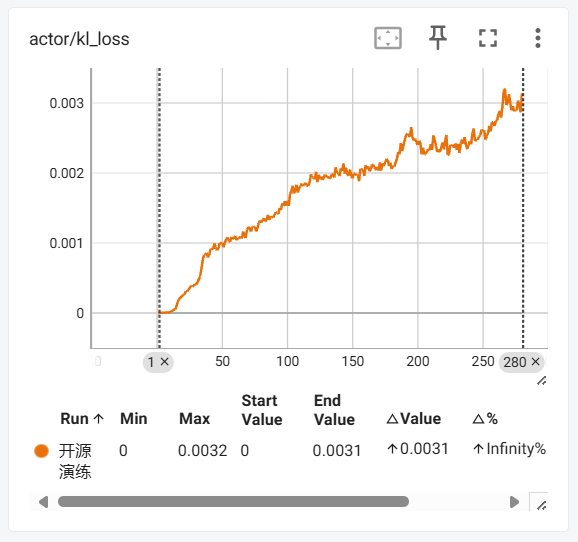
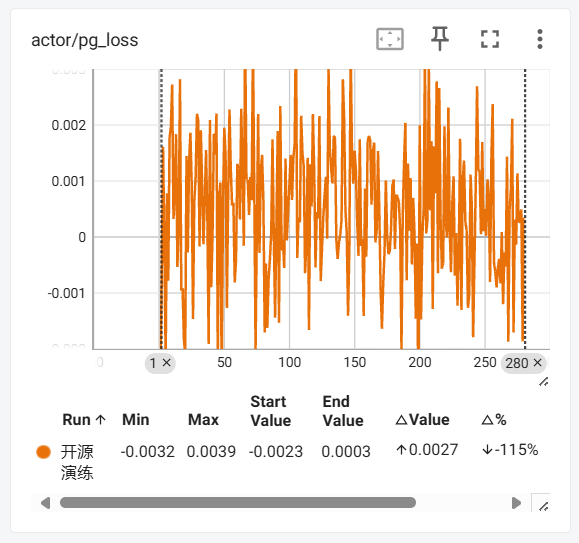
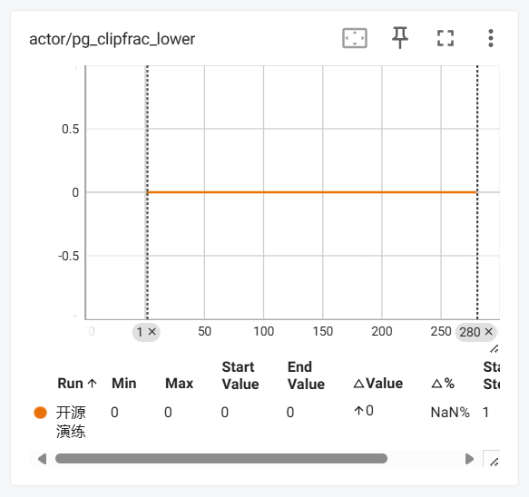
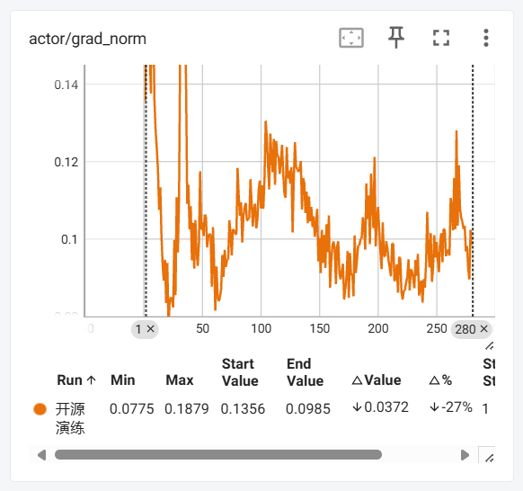
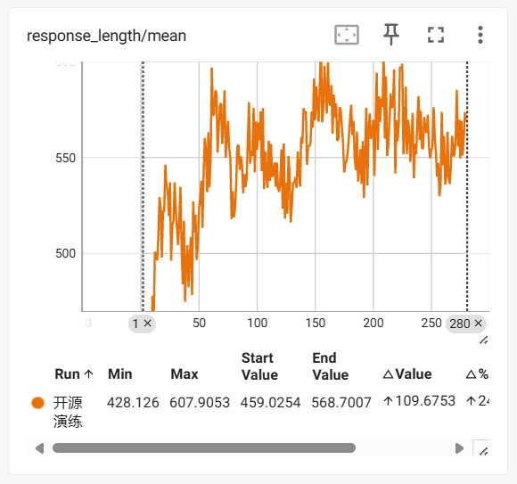

# 基于verl框架的Qwen2.5强化学习实践样例

## 概述

本项目基于 **Qwen2.5-1.5B-Instruct** 模型，采用 **verl** 强化学习框架，在 **MATH-lighteval** 数学推理数据集上进行了训练。目标是提升小模型在复杂数学问题上的分步推理能力，使其能够生成逻辑严密且结果可验证的推理过程。本样例最低只需要单卡 Atlas A2 环境，帮助大家快速上手，使用昇腾 NPU 完成 RL 训练任务。

## 支持的产品型号

<term>Atlas A2系列产品</term>

## 环境准备

1. 使用 Docker 构建环境。

   ```shell
   # 获取Docker镜像
   docker pull quay.io/ascend/vllm-ascend:v0.9.1

   # 构建Docker容器
   docker run \
   --name ${YOUR_CONTAINER_NAME} \
   --device=/dev/davinci0 \
   --device=/dev/davinci1 \
   --device=/dev/davinci2 \
   --device=/dev/davinci3 \
   --device=/dev/davinci4 \
   --device=/dev/davinci5 \
   --device=/dev/davinci6 \
   --device=/dev/davinci7 \
   --device /dev/davinci_manager \
   --device /dev/devmm_svm \
   --device /dev/hisi_hdc \
   -v /usr/local/dcmi:/usr/local/dcmi \
   -v /usr/local/bin/npu-smi:/usr/local/bin/npu-smi \
   -v /usr/local/Ascend/driver/lib64/:/usr/local/Ascend/driver/lib64/ \
   -v /usr/local/Ascend/driver/version.info:/usr/local/Ascend/driver/version.info \
   -v /etc/ascend_install.info:/etc/ascend_install.info \
   -v /root/.cache:/root/.cache \
   -v ${HOST_WORKSPACE}:${HOST_WORKSPACE} \
   -w ${HOST_WORKSPACE} \
   --shm-size=100g \
   --privileged=true \
   -itd \
   quay.io/ascend/vllm-ascend:v0.9.1 \
   /bin/bash

   # 进入容器
   docker exec -it ${YOUR_CONTAINER_NAME} bash
   ```

   其中：
   - `--name ${YOUR_CONTAINER_NAME}`为配置容器名
   - `-v ${HOST_WORKSPACE}:${HOST_WORKSPACE}`为挂载业务目录
   - `-w ${HOST_WORKSPACE}`为设置工作目录，进入后直接操作

2. 安装 CANN 软件包。

   本样例依赖的 CANN 软件版本为 `CANN：8.2.RC1` ，请从[软件包下载地址](https://www.hiascend.com/developer/download/community/result?module=cann&cann=8.2.RC1)下载如下软件包，并参考[ CANN 安装文档](https://www.hiascend.com/document/detail/zh/CANNCommunityEdition/82RC1/softwareinst/instg/instg_0000.html?Mode=PmIns&InstallType=local&OS=Debian&Software=cannToolKit)进行安装。

   - 开发套件包：`Ascend-cann-toolkit_${version}_linux-${arch}.run`
   - 二进制算子包：`Ascend-cann-kernels-${chip_type}_${version}_linux-${arch}.run`
   - NNAL加速包：`Ascend-cann-nnal_${version}_linux-${arch}.run`

   软件包文件名中 `${version}` 表示CANN包版本号，`${arch}` 表示CPU架构（如aarch64、x86_64）。

3. 下载项目源码并安装依赖的 python 库。

   ```shell
   # 下载项目源码，以master分支为例
   git clone https://gitcode.com/cann/cann-recipes-train.git

   # 安装依赖的python库
   cd cann-recipes-train/llm_rl/qwen2_5/verl_npu_demo
   pip install -r requirements.txt
   ```

4. 安装 verl 。

   ```shell
   # verl源码请下载到qwen2_5/verl_npu_demo/目录下
   git clone https://github.com/volcengine/verl.git
   cd verl
   git checkout 634bd935
   pip install -r requirements-npu.txt
   pip install -e .
   ```

## 权重准备

1. 权重下载

   ```shell
   # 获取模型权重文件
   hf download Qwen/Qwen2.5-1.5B-Instruct --local-dir model/Qwen2_5_1_5B_Instruct/
   ```

   模型权重文件会存放到 `verl_npu_demo/verl/model/Qwen2_5_1_5B_Instruct` 路径下。

   如果 hf CLI 出现网络问题可配置代理或使用 hf 镜像站，不同操作系统和 Shell 中临时修改为 hf 镜像站的方法如下（仅当前会话有效）：

   ```shell
   # Linux (Bash)
   export HF_ENDPOINT=https://hf-mirror.com
   
   # Windows PowerShell
   $env:HF_ENDPOINT = "https://hf-mirror.com"
   ```

   > 说明：若您的网络无法连通 huggingface ，请从[权重文件下载地址](https://huggingface.co/Qwen/Qwen2.5-1.5B-Instruct)手动下载。

2. 替换 Tokenizer 配置文件

   将本样例优化的 Tokenizer 配置文件 `tokenizer_config.json` 从 `verl_npu_demo` 移动到 `verl_npu_demo/verl/model/Qwen2_5_1_5B_Instruct` 目录下，进行覆盖替换操作。

## 数据集准备

执行如下命令，使用数据预处理脚本 `verl_npu_demo/verl/examples/data_preprocess/math_dataset.py` 在线获取 MATH-lighteval 数据集并处理成 verl 所需格式。

  ```shell
  cd examples/data_preprocess
  python3 math_dataset.py --local_dir ../../data/math/data
  ```

数据处理脚本执行完后，会获得训练所需的数据集文件 `train.parquet` 和 `test.parquet` 。

> 说明：若您的网络无法连通 huggingface ，请参见附录中的[手动下载 MATH-lighteval 数据集](#dataset_download)进行下载。

## 强化学习训练

1. 配置训练脚本。

   将训练脚本 `run_qwen2_5_1_5b.sh` 从 `verl_npu_demo` 移动到 `verl_npu_demo/verl` 目录下。

2. 修改奖励函数。

   将本样例优化后的奖励函数 `new_math_reward.py` 从 `verl_npu_demo` 移动到 `verl_npu_demo/verl/verl/utils/reward_score` 目录下。

   > 关于本样例奖励函数设计点可参见附录中的[新奖励函数介绍](#reward_function)。

3. 执行训练脚本。

   ```shell
   # 返回verl_npu_demo/verl目录，创建训练日志目录
   mkdir run_log
   
   # 执行训练脚本
   bash run_qwen2_5_1_5b.sh
   ```

   训练得到的模型权重文件都存放在 `verl_npu_demo/verl/checkpoints` 路径下。

## 合并模型权重

如果是多卡训练，训练完成后则需要合并模型权重。

以训练任务中第 20 步保存 checkpoint 为例，合并方法如下：

```shell
python3 -m verl.model_merger merge \
    --backend fsdp \
    --local_dir checkpoints/verl_grpo_example_math/qwen2_5_1_5b_math/global_step_20/actor \
    --target_dir checkpoints/verl_grpo_example_math/qwen2_5_1_5b_math/global_step_20/actor/huggingface
```

合并完成后，第 20 步 checkpoint 完整模型权重文件的存储在 `verl_npu_demo/verl/checkpoints/verl_grpo_example_math/qwen2_5_1_5b_math/global_step_20/actor/huggingface` 中，可用于后续模型效果验证和推理。

## 模型效果验证

在强化学习训练中，受奖励函数设计缺陷等多重因素影响，极易出现 **奖励黑客（Reward Hacking）** 现象 —— 即策略模型并非通过真正掌握任务核心能力（如本样例中解决数学问题的能力）来获取奖励，而是学会利用奖励模型或奖励机制的漏洞 “欺骗” 系统以最大化奖励，同时可能伴随对训练分布的过拟合，导致模型在真实场景中的泛化性能严重不足。例如本样例中的 GRPO 策略模型，就可能在训练过程中发展出此类 “取巧” 策略，而非真正习得数学问题的求解能力。

因此，本样例使用<a href="https://github.com/open-compass/opencompass" target="_blank"> **OpenCompass** </a>**开源大模型测试框架**来对训练结果进行测试，确保训练得到的模型真实可用。

1. 下载 OpenCompass 。

   ```shell
   # 返回qwen2_5/verl_npu_demo目录，git获取源码
   git clone https://github.com/open-compass/opencompass.git

   cd opencompass
   # 安装相关依赖，如果遇到pyext的报错，请注释掉verl_npu_demo/opencompass/requirements/runtime.txt中pyext这一行
   pip install -r requirements.txt
   ```

2. 准备 MATH-lighteval 测试数据集。

   - 下载数据集（如已下载请忽略）

      ```shell
      # 在verl_npu_demo/verl目录中下载
      hf download DigitalLearningGmbH/MATH-lighteval --repo-type=dataset --local-dir data/math
      ```

      将数据集文件存放到 `verl_npu_demo/verl/data/math` （需新建）路径下。

   - 转换数据集

      使用格式转换脚本 `verl_npu_demo/parquet2json.py` 将hf上下载的测试集数据 `test-00000-of-00001.parquet` 转换为 OpenCompass 测试所需的 `json` 格式。

      ```shell
      # 在verl_npu_demo/opencompass目录中新建数据存放目录
      mkdir -p data/math

      # 执行数据集转换命令
      python3 ../parquet2json.py \
          --input "../verl/data/math/data/test-00000-of-00001.parquet" \
          --output "data/math/math.json"
      ```

      > **注意**：该测试数据集需命名为 `math.json`

3. 配置测试脚本

   本样例模型配置脚本路径： `verl_npu_demo/opencompass/opencompass/configs/models/qwen2_5/hf_qwen2_5_1_5b_instruct.py` 。

   ```python
   from opencompass.models import HuggingFacewithChatTemplate

   models = [
       dict(
           type=HuggingFacewithChatTemplate,
           abbr='qwen2.5-1.5b-instruct-rl',
           path='<model_path>',
           max_out_len=1024,
           batch_size=32,
           run_cfg=dict(num_gpus=1),
       )
   ]
   ```

   参数说明：

   - `abbr` ：测试结果中用于区分不同测试的代号，可自定义。
   - `path` ：测试模型存放的绝对路径，示例： `/home/cann-recipes-train/llm_rl/qwen2_5/verl_npu_demo/verl/checkpoints/../../global_step_<训练步数>/actor/huggingface` 。
   - `max_out_len` ：测试过程中模型生成的最大长度。
   - `batch_size` ：测试过程中模型生成时的批量处理大小。

   样例代码中 `max_out_len=1024` 和 `batch_size=32` 的组合适用于显存为 64GB 的 NPU 。

4. 执行测试。

   使用**同一测试数据**分别对**基模**和**强化学习训练模型**进行对比测试：

   在 `verl_npu_demo/opencompass` 路径下运行测试脚本命令：

   ```shell
   python3 run.py \
       --models hf_qwen2_5_1_5b_instruct \
       --datasets math_gen_a58d9d \
       --max-num-worker 4  # 4张卡测试，单卡测试该参数省略
   ```

   本样例测试结果如下：

   |            model             | step |    dataset     | version |  metric  | mode | qwen2.5-1.5b-instruct-hf |
   | :--------------------------: | :--: | :------------: | :-----: | :------: | :--: | :----------------------: |
   |    qwen2.5-1.5b-instruct     |  0   | MATH-lighteval | a58d9d  | accuracy | gen  |        **43.48**         |
   | qwen2.5-1.5b-instruct-rl-280 | 280  | MATH-lighteval | a58d9d  | accuracy | gen  |        **55.06**         |

   可以看到，经过强化学习，**Qwen2.5 1.5B-instruct** 模型在 **MATH** 数据集上得到 **26.6%** 的性能提升。

## 训练过程可视化

在模型训练过程中，通过可视化工具追踪关键指标（如损失值、准确率、学习率等）可以帮助开发者更直观地理解模型训练状态、及时发现问题并优化调参策略。常用的可视化工具包括 **SwanLab** 和 **TensorBoard** ，两者均支持在训练环境中记录日志数据，然后传输到本地用浏览器查看，具体操作方式如下：

### SwanLab

SwanLab 是一款轻量级实验管理与可视化工具，主打简洁的界面和高效的实验对比功能，适合快速追踪训练过程并管理多组实验参数。

1. **配置训练脚本与环境变量**

   首先修改训练启动脚本 `run_qwen2_5_1_5b.sh` ，将日志输出方式从 TensorBoard 切换为 SwanLab ：

   找到 `trainer.logger=['console','tensorboard'] \` 一行，修改为：

   ```shell
   trainer.logger=['console','swanlab'] \
   ```

   然后在训练环境中配置 SwanLab 日志存储路径和运行模式，通过环境变量指定：

   ```shell
   export SWANLAB_LOG_DIR=./swanlab_log  # 日志保存路径，可自定义
   export SWANLAB_MODE=local  # 本地运行
   ```

2. **获取训练日志**

   训练过程中，日志数据会自动写入 `SWANLAB_LOG_DIR` 指定的 `./swanlab_log` 文件夹。训练结束后，将该文件夹完整复制到本地。

3. **安装 SwanLab**

   在本地环境中安装 SwanLab 及其 dashboard 功能：

   ```shell
   pip install swanlab[dashboard]
   ```

4. **启动 SwanLab 看板并查看数据**

   打开本地环境的终端或命令提示符，运行命令启动 SwanLab：

   ```shell
   # 启动SwanLab看板，将<directory_name>标记替换为本地保存数据的目录
   swanlab watch <directory_name>
   ```

   运行此命令后会出现如下提示，说明 SwanLab 已成功运行，在浏览器中打开对应链接即可查看可视化训练数据。

   ```shell
   # 输出示例
   swanboard: SwanLab Experiment Dashboard v0.6.8 ready in 111ms
   
                            ➜  Local:   http://127.0.0.1:5092
                            ➜  press ctrl + c to quit
   ```

### TensorBoard

TensorBoard 是机器学习领域应用最广泛的可视化工具之一，支持多框架适配，可展示标量曲线、模型结构、图像样本等多种数据类型。

1. **获取训练日志**

   将训练环境中的 `verl_npu_demo/verl/tensorboard_log` 文件夹通过文件传输工具完整复制到本地。

2. **安装 TensorBoard**

   在本地环境中安装 TensorBoard ：

    ```shell
    pip install tensorboard
    ```

3. **启动 TensorBoard 并查看数据**

   打开本地环境的终端或命令提示符，运行如下命令启动 TensorBoard：

   ```shell
   # 将<directory_name>标记替换为本地保存数据的目录
   tensorboard --logdir=<directory_name>
   ```

   运行此命令后会出现如下提示，说明 TensorBoard 已成功运行，在浏览器中打开对应链接即可查看可视化训练数据。

   ```shell
   # 输出示例
   Serving TensorBoard on localhost; to expose to the network, use a proxy or pass --bind_all
   TensorBoard 2.19.0 at http://localhost:6006/ (Press CTRL+C to quit)
   ```

### 训练指标

1. 策略模型健康度指标

   - `actor/entropy` (熵)：
      - **是什么**：衡量模型输出的“不确定性”或“探索性”。
      - **怎么看**：**高熵**（如 2.0+）表示模型在积极探索多种答案；**低熵**（如 < 0.5）表示模型变得确定，只输出少数几种答案。**趋近于 0 是危险信号**，说明模型停止探索（模式崩溃）。

   - `actor/kl_loss` (KL散度损失)：
      - **是什么**：衡量当前模型与参考模型（或旧模型）行为差异的代价。
      - **怎么看**：是**约束模型不要偏离太远**的关键。需要与 `kl_coef` 配合看。**过高**说明模型行为变化太大；**过低**说明约束可能太强或模型没在学习。

   - `actor/pg_loss` (策略梯度损失)：
      - **是什么**：策略模型的核心损失，代表模型为了获得更高奖励而尝试做出的更新幅度。
      - **怎么看**：**正值是正常的**，表示模型正在学习。最需要警惕的是出现 **`nan`**，这意味着训练数值不稳定，容易崩溃。

   

2. 性能与奖励指标

   - **`val-core/.../reward/mean@1` (验证奖励)**：
      - **是什么**：在验证集上，奖励模型给生成答案的平均打分。
      - **怎么看**：这是训练追求的**直接目标**，希望它越高越好。但必须保持怀疑，需要与真实准确率对照，防止“奖励黑客”。

   - **`critic/score/mean` (评论家评分)**：
      - **是什么**：在 GRPO 中，这通常代表**基于分组相对比较计算出的优势函数 (Advantage) 估计值**，或者是从奖励模型中推导出的价值评估。它不是由一个独立的 Critic 模型产生的，而是通过**同一批次内不同 response 之间的相对比较**计算得出的。
      - **怎么看**：它应该与 `val-core` 的奖励值大致在同一量级。如果两者差异巨大，说明 Critic 没训练好。

   

3. 训练稳定性指标

   - `actor/pg_clipfrac` (策略梯度剪辑比例)：
      - **是什么**：在PPO算法中，有多大比例的更新因为幅度过大而被裁剪。
      - **怎么看**：**一个中间值（如 10%-25%）是健康的**，说明 PPO 剪辑机制在正常工作。**过高**（如 >30%）说明更新过于剧烈；**过低**（如 <5%）可能说明约束太强或学习率太低。

   - `actor/grad_norm` (梯度范数)：
      - **是什么**：所有参数梯度向量的大小。
      - **怎么看**：**稳定在一个较小的值**（如 0.1-1.0）代表训练稳定。**突然变大**可能是梯度爆炸的前兆。

   - `response_length/mean` (生成回答长度)：
      - **是什么**：模型生成回答（response）的平均长度（通常以 token 数量为单位）。
      - **怎么看**：
	    - **突然急剧上升**：可能意味着模型开始“胡言乱语”，生成了冗长、重复或无意义的文本。这是模型可能发生**退化（degeneration）** 或**模式崩溃（mode collapse）** 的早期信号。
	    - **突然急剧下降**：可能意味着模型变得过于“懒惰”或“保守”，只输出极其简短、无信息的回答（例如，只输出“是”、“否”或标点符号）。这也是另一种形式的退化。

   

3. 训练效率指标

   - `perf/mfu/actor` (模型浮点利用率)：
      - **是什么**：衡量硬件计算能力被利用的效率百分比。
      - **怎么看**：越高越好，说明硬件没闲着。但 RLHF 中由于涉及大量序列生成，MFU 通常不会很高。

   - `perf/throughput` (吞吐量)：
      - **是什么**：每秒处理的 token 数量。
      - **怎么看**：**越高越好**，直接代表训练速度。

   

## 附录

1. 手动下载MATH-lighteval数据集<a id="dataset_download"></a>

   如果无法连通 huggingface，可以使用本地加载数据集的方式，首先将数据集下载到本地：

   [数据集下载地址](https://huggingface.co/datasets/DigitalLearningGmbH/MATH-lighteval)（推荐使用 hf CLI ）

   ```shell
   # 在verl_npu_demo/verl目录下
   hf download DigitalLearningGmbH/MATH-lighteval --repo-type=dataset --local-dir data/math
   ```

   将数据集文件存放到 `verl_npu_demo/verl/data/math` （需新建）路径下。

   数据处理前修改 `verl_npu_demo/verl/examples/data_preprocess/math_dataset.py` 中的 `datasets.load_dataset` ，将数据集从 hf 加载改为本地加载。

   ```python
   # 修改前：
   print(f"Loading the {data_source} dataset from huggingface...", flush=True)
   dataset = datasets.load_dataset(data_source, trust_remote_code=True)
   
   # 修改后：
   print(f"Loading the {data_source} dataset from local file...", flush=True)
   dataset = datasets.load_dataset(
       'parquet',
       data_files={
           'train': '../../data/math/data/train-00000-of-00001.parquet',
           'test': '../../data/math/data/test-00000-of-00001.parquet'
       }
   )
   ```

   使用数据预处理脚本 `math_dataset.py` 本地加载数据集并处理成verl所需格式。

   ```shell
   cd examples/data_preprocess
   python3 math_dataset.py --local_dir ../../data/math/data
   ```

   运行数据处理脚本，获得训练所需的数据集文件 `train.parquet` 和 `test.parquet`。

2. 新奖励函数介绍<a id="reward_function"></a>

   verl 框架中 `MATH` 任务的原生奖励函数仅采用“字符串等价性”进行评判，在数学含义等价但字符串形式不同的场景（如 0.25 和 1/4 ）会产生误判，进而误导模型训练。此外，该函数仅输出 0 或 1 的二元评分，导致奖励信号过于稀疏，不利于模型学习。本样例重新设计了奖励函数，修正了上述问题。

   本样例的新奖励函数首先引入**基于数学语义等价性**的判断机制以提升准确性；其次在准确度基础上，新增格式规范性和思维链完整性两类分级奖励，通过多维度信号缓解奖励稀疏问题，同时引导模型生成更规范的表达和更完整的推理过程。

   新奖励函数采用 **“答案正确性优先”** 的设计原则：若答案本身不正确，则直接不纳入格式规范性与思维链质量的评分。这一设定的核心考量是：模型天然倾向于学习成本更低的优化方向，若允许错误答案仍能通过格式或思维链获得奖励，会削弱模型对 “精准求解” 的目标导向，最终阻碍其在核心的答案准确度上取得突破。

   本样例设计的 MATH 的奖励函数见 `verl_npu_demo/new_math_reward.py` ，示意图如下：

   

   新奖励函数通过训练脚本 `run_qwen2_5_1_5b.sh` 中的 `custom_reward_function.path` 参数调用：

   ```shell
   custom_reward_function.path=./verl/utils/reward_score/new_math_reward.py \
   ```
