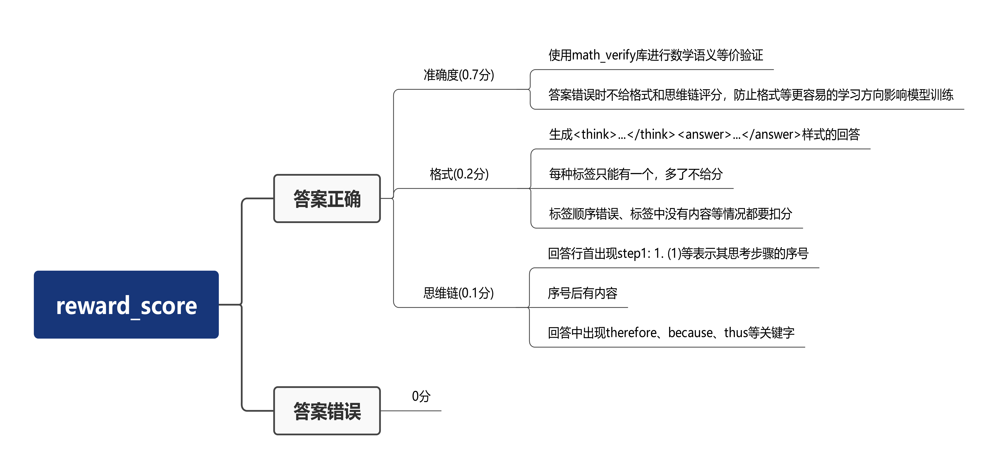

# 一站式平台快速启动RL训练示例

## 概述

本项目基于 **Qwen2.5-1.5B-Instruct** 模型，采用 **verl** 强化学习框架，在 **MATH-lighteval** 数学推理数据集上进行了训练。目标是提升小模型在复杂数学问题上的分步推理能力，使其能够生成逻辑严密且结果可验证的推理过程。本样例最低只需要单卡 Atlas A2 环境，帮助大家快速上手，使用昇腾 NPU 完成 RL 训练任务。

## 支持的产品型号

<term>Atlas A2/A3系列产品</term>

## 环境准备

1. 在[cann-recipes-train](https://gitcode.com/cann/cann-recipes-train)网页点击CANNLab，创建开发环境。

   一站式平台镜像选择：cann_8.5.2-A3 或者 cann_8.5.2-A2。

2. 安装 vllm 和 vllm-ascend。

   ```shell
   # 安装vllm
   pip install -v vllm==0.11.0

   # 安装vllm-ascend
   pip install -v vllm-ascend==0.11.0
   ```

3. 安装依赖的 python 库。

   ```shell
   # 安装依赖的python库
   cd llm_rl/qwen2_5/verl_npu_demo
   pip install -r requirements.txt
   ```

4. 安装 verl 。

   ```shell
   # verl源码请下载到qwen2_5/verl_npu_demo/目录下
   git clone https://github.com/volcengine/verl.git
   cd verl
   git checkout release/v0.6.1
   pip install -e .
   ```

   完成后当前目录为 `verl_npu_demo/verl`。

## 权重准备

1. 权重下载（优先推荐 ModelScope）

   1.1 ModelScope 命令行下载（推荐）

   ```shell
   # 在 verl_npu_demo/verl 目录下执行
   modelscope download --model Qwen/Qwen2.5-1.5B-Instruct --local_dir model/Qwen2_5_1_5B_Instruct/
   ```

   1.2 Hugging Face 下载（备用）

   ```shell
   # 在 verl_npu_demo/verl 目录下执行
   hf download Qwen/Qwen2.5-1.5B-Instruct --local-dir model/Qwen2_5_1_5B_Instruct/
   ```

   若 hf CLI 出现网络问题，可配置代理或使用镜像站：

   ```shell
   export HF_ENDPOINT=https://hf-mirror.com
   ```

   > 说明：
   > - 模型权重文件最终存放路径：`verl_npu_demo/verl/model/Qwen2_5_1_5B_Instruct`
   > - 若命令行下载失败，可手动下载：
   >   - ModelScope 手动下载地址：[Qwen2.5-1.5B-Instruct](https://www.modelscope.cn/models/Qwen/Qwen2.5-1.5B-Instruct)
   >   - Hugging Face 手动下载地址：[Qwen2.5-1.5B-Instruct](https://huggingface.co/Qwen/Qwen2.5-1.5B-Instruct)

2. 替换 Tokenizer 配置文件

   将本样例优化的 Tokenizer 配置文件 `tokenizer_config.json` 从 `verl_npu_demo` 移动到 `verl_npu_demo/verl/model/Qwen2_5_1_5B_Instruct` 目录下，进行覆盖替换操作。

   ```shell
   # 从 verl_npu_demo/verl 返回 verl_npu_demo
   cd ..
   mv -f tokenizer_config.json verl/model/Qwen2_5_1_5B_Instruct/
   ```

## 数据集准备

执行如下命令，使用数据预处理脚本 `verl_npu_demo/verl/examples/data_preprocess/math_dataset.py` 在线获取 MATH-lighteval 数据集并处理成 verl 所需格式。

  ```shell
  # 在 verl_npu_demo 目录下执行
  cd verl/examples/data_preprocess
  # 若网络无法连通 huggingface，先执行：export HF_ENDPOINT=https://hf-mirror.com
  python3 math_dataset.py --local_dir ../../data/math/data
  ```

数据处理脚本执行完后，会获得训练所需的数据集文件 `train.parquet` 和 `test.parquet` 。

> 说明：若您的网络无法连通 huggingface ，请参见附录中的[手动下载 MATH-lighteval 数据集](#dataset_download)进行下载。

## 强化学习训练

1. 配置训练脚本。

   将训练脚本 `run_qwen2_5_1_5b_single.sh` 从 `verl_npu_demo` 移动到 `verl_npu_demo/verl` 目录下。

   ```shell
   # 从 verl/examples/data_preprocess 返回 verl_npu_demo
   cd ../../..
   mv -f run_qwen2_5_1_5b_single.sh verl/
   ```

2. 修改奖励函数。

   将本样例优化后的奖励函数 `new_math_reward.py` 从 `verl_npu_demo` 移动到 `verl_npu_demo/verl/verl/utils/reward_score` 目录下。

   ```shell
   # 在 verl_npu_demo 目录下执行
   mv -f new_math_reward.py verl/verl/utils/reward_score/
   ```

   > 关于本样例奖励函数设计点可参见附录中的[新奖励函数介绍](#reward_function)。

3. 执行训练脚本。

   ```shell
   # 进入 verl_npu_demo/verl 目录，创建训练日志目录
   cd verl
   mkdir run_log

   # 执行训练脚本
   bash run_qwen2_5_1_5b_single.sh
   ```

## 训练过程可视化

在模型训练过程中，通过可视化工具追踪关键指标（如损失值、准确率、学习率等）可以帮助开发者更直观地理解模型训练状态、及时发现问题并优化调参策略。常用的可视化工具包括 **SwanLab** 和 **TensorBoard** ，两者均支持在训练环境中记录日志数据，然后传输到本地用浏览器查看，这里以 **TensorBoard** 为例：

### TensorBoard

TensorBoard 是机器学习领域应用最广泛的可视化工具之一，支持多框架适配，可展示标量曲线、模型结构、图像样本等多种数据类型。

1. **获取训练日志**

   将训练环境中的 `verl_npu_demo/verl/tensorboard_log` 文件夹通过文件传输工具完整复制到本地。

2. **安装 TensorBoard**

   在本地环境中安装 TensorBoard ：

    ```shell
    pip install tensorboard
    ```

3. **启动 TensorBoard 并查看数据**

   打开本地环境的终端或命令提示符，运行如下命令启动 TensorBoard：

   ```shell
   # 将<directory_name>标记替换为本地保存数据的目录
   tensorboard --logdir=<directory_name> --bind_all
   ```

   运行此命令后会出现如下提示，说明 TensorBoard 已成功运行，在本机浏览器或局域网内的其他设备上打开`http://<你的IP地址>:6006/`即可查看可视化训练数据。

   ```shell
   # 输出示例
   TensorBoard 2.19.0 at http://<你的IP地址>:6006/ (Press CTRL+C to quit)
   ```

## 附录

1. 手动下载MATH-lighteval数据集<a id="dataset_download"></a>

   如果无法连通 huggingface，可以使用本地加载数据集的方式，首先将数据集下载到本地：

   [数据集下载地址](https://huggingface.co/datasets/DigitalLearningGmbH/MATH-lighteval)（推荐使用 hf CLI ）

   ```shell
   # 在verl_npu_demo/verl目录下
   hf download DigitalLearningGmbH/MATH-lighteval --repo-type=dataset --local-dir data/math
   ```

   将数据集文件存放到 `verl_npu_demo/verl/data/math` （需新建）路径下。

   数据处理前修改 `verl_npu_demo/verl/examples/data_preprocess/math_dataset.py` 中的 `datasets.load_dataset` ，将数据集从 hf 加载改为本地加载。

   ```python
   # 修改前：
   print(f"Loading the {data_source} dataset from huggingface...", flush=True)
   dataset = datasets.load_dataset(data_source, trust_remote_code=True)
   
   # 修改后：
   print(f"Loading the {data_source} dataset from local file...", flush=True)
   dataset = datasets.load_dataset(
       'parquet',
       data_files={
           'train': '../../data/math/data/train-00000-of-00001.parquet',
           'test': '../../data/math/data/test-00000-of-00001.parquet'
       }
   )
   ```

   使用数据预处理脚本 `math_dataset.py` 本地加载数据集并处理成verl所需格式。

   ```shell
   cd examples/data_preprocess
   python3 math_dataset.py --local_dir ../../data/math/data
   ```

   运行数据处理脚本，获得训练所需的数据集文件 `train.parquet` 和 `test.parquet`。

2. 新奖励函数介绍<a id="reward_function"></a>

   verl 框架中 `MATH` 任务的原生奖励函数仅采用“字符串等价性”进行评判，在数学含义等价但字符串形式不同的场景（如 0.25 和 1/4 ）会产生误判，进而误导模型训练。此外，该函数仅输出 0 或 1 的二元评分，导致奖励信号过于稀疏，不利于模型学习。本样例重新设计了奖励函数，修正了上述问题。

   本样例的新奖励函数首先引入**基于数学语义等价性**的判断机制以提升准确性；其次在准确度基础上，新增格式规范性和思维链完整性两类分级奖励，通过多维度信号缓解奖励稀疏问题，同时引导模型生成更规范的表达和更完整的推理过程。

   新奖励函数采用 **“答案正确性优先”** 的设计原则：若答案本身不正确，则直接不纳入格式规范性与思维链质量的评分。这一设定的核心考量是：模型天然倾向于学习成本更低的优化方向，若允许错误答案仍能通过格式或思维链获得奖励，会削弱模型对 “精准求解” 的目标导向，最终阻碍其在核心的答案准确度上取得突破。

   本样例设计的 MATH 的奖励函数见 `verl_npu_demo/new_math_reward.py` ，示意图如下：

   

   新奖励函数通过训练脚本 `run_qwen2_5_1_5b_single.sh` 中的 `custom_reward_function.path` 参数调用：

   ```shell
   custom_reward_function.path=./verl/utils/reward_score/new_math_reward.py \
   ```
