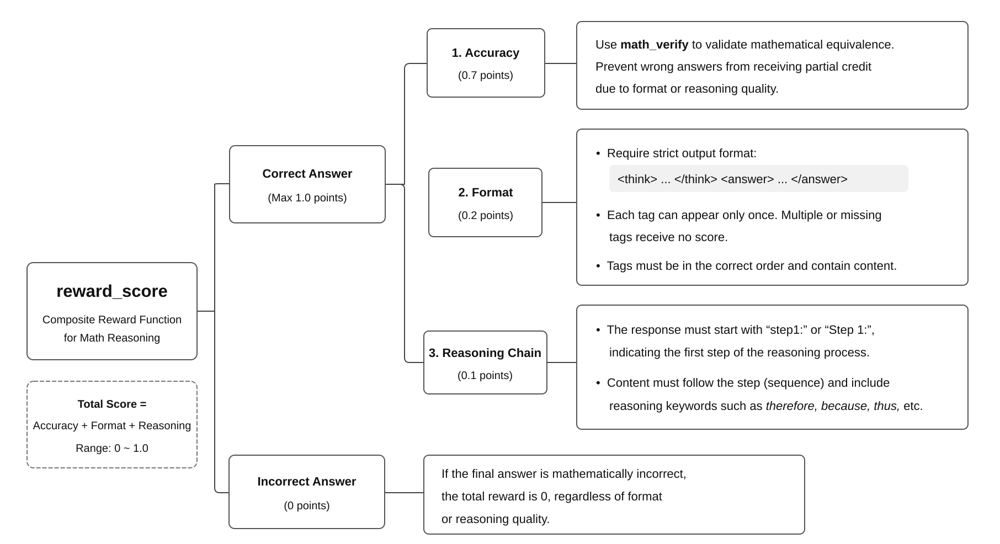

# Quick Start RL Training Examples on CANNLab

## Overview

This project is based on the **Qwen2.5-1.5B-Instruct model** and uses the **verl** reinforcement learning framework to train on the **MATH-lighteval** mathematical reasoning dataset. The goal is to improve the step-by-step reasoning capabilities of small language models on complex mathematical problems, enabling them to generate logically rigorous and verifiable reasoning processes.

This example requires only a single-card **Atlas A2** environment at minimum, providing a quick and easy way to get started with reinforcement learning (RL) training tasks using **Ascend** NPU.

## Supported Hardware Models

<term>**Atlas A2/A3** Series Products</term>

## Environment Preparation

1. Go to the [cann-recipes-train](https://gitcode.com/cann/cann-recipes-train) webpage, click **CANNLab**, and create a development environment.

   One-Stop Platform Image Selection: Choose cann_8.5.2-A3 or cann_8.5.2-A2.

2. Install vllm and vllm-ascend.

   ```shell
   # Install vllm
   pip install -v vllm==0.11.0

   # Install vllm-ascend
   pip install -v vllm-ascend==0.11.0
   ```

3. Install the required Python libraries.

   ```shell
   # Install the required Python libraries
   cd llm_rl/qwen2_5/verl_npu_demo
   pip install -r requirements.txt
   ```

4. Install verl.

   ```shell
   # Install the verl source code to the qwen2_5/verl_npu_demo/ directory.
   git clone https://github.com/volcengine/verl.git
   cd verl
   git checkout release/v0.6.1
   pip install -e .
   ```

   After completing the above steps, the current directory should be `verl_npu_demo/verl`.

## Model Weight Preparation

1. Model Weight Download (ModelScope Recommended)

   1.1 Download Using the ModelScope Command Line (Recommended)

   ```shell
   # Execute the following command in the 'verl_npu_demo/verl' directory
   modelscope download --model Qwen/Qwen2.5-1.5B-Instruct --local_dir model/Qwen2_5_1_5B_Instruct/
   ```

   1.2 Download from Hugging Face (Alternative)

   ```shell
   # Execute the following command in the 'verl_npu_demo/verl' directory
   hf download Qwen/Qwen2.5-1.5B-Instruct --local-dir model/Qwen2_5_1_5B_Instruct/
   ```

   If you encounter network issues with the hf CLI, configure a proxy or use a mirror site:

   ```shell
   export HF_ENDPOINT=https://hf-mirror.com
   ```

   > **Note:**
   > - The final storage path for the model weights is: `verl_npu_demo/verl/model/Qwen2_5_1_5B_Instruct`
   > - If the command-line download fails, you can manually download the model from:
   >   - ModelScope: [Qwen2.5-1.5B-Instruct](https://www.modelscope.cn/models/Qwen/Qwen2.5-1.5B-Instruct)
   >   - Hugging Face: [Qwen2.5-1.5B-Instruct](https://huggingface.co/Qwen/Qwen2.5-1.5B-Instruct)

2. Replace the Tokenizer Configuration File

   Move the optimized Tokenizer configuration file `tokenizer_config.json` provided in this example from `verl_npu_demo` to the `verl_npu_demo/verl/model/Qwen2_5_1_5B_Instruct` directory and replace the existing file.

   ```shell
   #  Return to the 'verl_npu_demo' directory from 'verl_npu_demo/verl'
   cd ..
   mv -f tokenizer_config.json verl/model/Qwen2_5_1_5B_Instruct/
   ```

## Data Set Preparation

Run the following command to use the data preprocessing script `verl_npu_demo/verl/examples/data_preprocess/math_dataset.py` to automatically download the **MATH-lighteval** dataset and preprocess it into the format required by verl.

  ```shell
# Run the following commands in the 'verl_npu_demo' directory
cd verl/examples/data_preprocess

# If Hugging Face is not accessible due to network issues, configure the mirror endpoint first:
export HF_ENDPOINT=https://hf-mirror.com

python3 math_dataset.py --local_dir ../../data/math/data
  ```

After the data preprocessing script finishes running, the required training dataset files `train.parquet` and `test.parquet` will be generated.

> **Note:** If Hugging Face is inaccessible due to network issues, refer to the appendix [Manually Download the MATH-lighteval Dataset](#dataset_download) to download the dataset manually.

## RL Training

1. Set up the training script

   Move `run_qwen2_5_1_5b_single.sh` from `verl_npu_demo` to `verl_npu_demo/verl` directory.

   ```shell
   # Return to the verl_npu_demo directory from verl/examples/data_preprocess.
   cd ../../..
   mv -f run_qwen2_5_1_5b_single.sh verl/
   ```

2. Modify the Reward Function

   Move the optimized reward function file `new_math_reward.py` from the `verl_npu_demo` directory to the `verl_npu_demo/verl/verl/utils/reward_score` directory.

   ```shell
   # Run the following command in the 'verl_npu_demo' directory:
   mv -f new_math_reward.py verl/verl/utils/reward_score/
   ```

   > For more details about the reward function design of this example, refer to the appendix [Introduction to the New Reward Function](#reward_function).

3. Run the Training Script

   ```shell
   # Navigate to the 'verl_npu_demo/verl' directory and create a directory for training logs.
   cd verl
   mkdir run_log

   # Run the RL training script
   bash run_qwen2_5_1_5b_single.sh
   ```

## Training Process Visualization

During model training, visualization tools can be used to track key metrics (such as loss, accuracy, and learning rate), helping developers better understand the training status, identify issues in a timely manner, and optimize hyperparameter tuning strategies. Common visualization tools include **SwanLab** and **TensorBoard**. Both tools support recording log data during training and transferring it to a local machine for visualization through a web browser. In this section, we use **TensorBoard** as an example:

### TensorBoard

**TensorBoard** is one of the most widely adopted visualization tools in machine learning. It supports multiple deep learning frameworks and provides visualization for various data types, including scalar metrics, model graphs, and image samples.

1. **Collect Training Logs**

   Copy the entire `verl_npu_demo/verl/tensorboard_log` folder from the training environment to your local machine using a file transfer tool.

2. **Install TensorBoard**

   Install **TensorBoard** in the local environment

    ```shell
    pip install tensorboard
    ```

3. **Launch TensorBoard and View the Data**

   Open a terminal on your local machine and run the following command to start TensorBoard:

   ```shell
   # Replace <directory_name> with the local directory path where the data is saved.
   tensorboard --logdir=<directory_name> --bind_all
   ```

   After running this command, the following message will appear, indicating that TensorBoard is running successfully. You can then open `http://<your_IP_address>:6006/` in a browser on the local machine or another device on the same network to view the training data visualization.

   ```shell
   # Output Example
   TensorBoard 2.19.0 at http://<Your_IP_address>:6006/ (Press CTRL+C to quit)
   ```

## Appendix

1. Manually Download the **MATH-lighteval** Dataset <a id="dataset_download"></a>

   If you cannot access Hugging Face due to network issues, you can load the dataset locally. First, download the dataset to the local environment:

   [Dataset Download Link](https://huggingface.co/datasets/DigitalLearningGmbH/MATH-lighteval) (The `hf` CLI is recommended)

   ```shell
   # Run the following command in the `verl_npu_demo/verl` directory:
   hf download DigitalLearningGmbH/MATH-lighteval --repo-type=dataset --local-dir data/math
   ```

   After the download is complete, the dataset files will be located in the `verl_npu_demo/verl/data/math/` directory. The original parquet files are stored in the `data/math/data/` subdirectory:
   `verl_npu_demo/verl/data/math/data/train-00000-of-00001.parquet` and `test-00000-of-00001.parquet`.

   The preprocessing script `examples/data_preprocess/math_dataset.py` in verl `release/v0.6.1` provides native support for loading the raw dataset locally using the `--local_dataset_path` parameter. **No source code changes are required.** Run the following command directly:

   ```shell
   cd examples/data_preprocess
   python3 math_dataset.py \
       --local_dir ../../data/math/data \
       --local_dataset_path ../../data/math/data
   ```

   where:
   - `--local_dataset_path`: The directory containing the raw parquet dataset files, including `train-00000-of-00001.parquet` and `test-00000-of-00001.parquet`.
   - `--local_dir`: The output directory where the processed parquet files required for verl training are saved.

   After the process completes, the training dataset files required by verl, `train.parquet` and `test.parquet`, will be generated in the `verl_npu_demo/verl/data/math/data/` directory.

2. Introduction to the New Reward Function<a id="reward_function"></a>

   The native reward function for the `MATH` task in the verl framework only evaluates answers based on **string equivalence**. This may lead to incorrect judgments when mathematically equivalent answers have different string representations (for example, `0.25` and `1/4`), which can mislead model training. In addition, the original reward function only provides a binary score of 0 or 1, resulting in overly sparse reward signals that make model learning more difficult. This example redesigns the reward function to address these issues.

   The new reward function introduced in this example first incorporates a **mathematical semantic equivalence** evaluation mechanism to improve accuracy. On top of answer correctness, it additionally introduces two types of graded rewards: **format compliance** and **chain-of-thought completeness**. These multi-dimensional reward signals help alleviate the sparse reward problem while encouraging the model to generate more standardized responses and more complete reasoning processes.

   The new reward function follows the design principle of **"answer correctness first"**: if the answer itself is incorrect, the format compliance and chain-of-thought quality scores are not considered. The key motivation behind this design is that models naturally tend to optimize toward lower-cost objectives. If incorrect answers can still receive rewards through formatting or reasoning quality, the model's focus on the core objective of **accurate problem solving** may be weakened, ultimately preventing further improvement in answer accuracy.

   The MATH reward function designed in this example is implemented in `verl_npu_demo/new_math_reward.py`, as illustrated in the following figure:
   

   The new reward function is configured through the `custom_reward_function.path` parameter in the training script `run_qwen2_5_1_5b_single.sh`:

   ```shell
   custom_reward_function.path=./verl/utils/reward_score/new_math_reward.py \
   ```