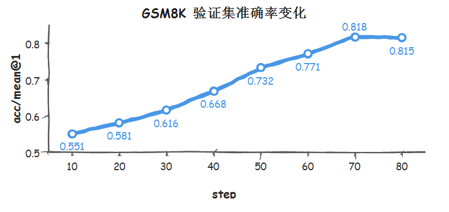

# Qwen3 TorchTitan RL训练样例

## 概述

本样例面向 Qwen3 系列模型，基于 [veRL](https://github.com/volcengine/verl) 的 TorchTitan 训练引擎能力，提供 NPU 环境下的 TorchTitan 训练适配 patch 和训练启动脚本示例。

当前目录的组织方式与 `llm_rl/qwen3/verl-mindspeed` 保持一致：

- `patches/`：存放针对框架源码的 git patch，patch 内部路径统一以 `llm_rl/qwen3/verl-torchtitan/` 为前缀。
- `internal/`：存放训练启动脚本示例。
- `download_frameworks_source_code.sh`：下载并切换依赖框架源码版本。
- `build_project.sh`：拷贝依赖源码、应用 patch，并在拷贝 `vllm_ascend` 包代码前重新编译安装 `vllm-ascend`。
- `apply_all_patches.sh`：按文件名版本序统一应用当前样例下的所有 patch。

当前提供的训练脚本以 Qwen3-30B-A3B、单机 16 卡 GRPO 训练为示例，使用 TorchTitan 作为 actor/ref 训练引擎，使用 vLLM 作为 rollout 引擎，具体训练性能及结果如下所示：

**GRPO算法RL训练**：基于Atlas A3 16卡集群，加载真实权重，使用gsm8k数据集，Prefill/Decode阶段长度分别为256与4096，性能测试结果如下：

   | 基础模型        | 机器型号      | GBS | n_samples | step | max_prompt_length(最大输入长度) | max_response_length(最大输出长度) | perf/time_per_step(首步总时间) |
   | --------------- | ------------- | --- | --------- | ---- | ------------------------------- | --------------------------------- | ------------------ |
   | Qwen3-30B-A3B   | Atlas A3 16卡 | 8   | 2         | 1    | 256                             | 4096                              | 653                |

   随迭代进行，gsm8k 验证集准确率变化如下：

   <p align="center">
     
   </p>

## 组件版本

| 组件 | 版本/Commit ID |
|------|----------------|
| verl | e9aa879bc61821621a36881ea305eaa0785520c1 |
| torchtitan | ac13e536c84e7f6647b14fa9375c3c8a8a2b8578 |
| torchtitan-npu | 29bbc8ba5bee5daf63f8a0c09512038449ffaf37 |
| vllm | 0.15.0 |
| vllm-ascend | 0.15.0rc1 |
| torch | 2.12.0 |
| torch_npu | 2.12.0rc1 |

## 硬件和环境要求

产品型号：Atlas A3 系列

操作系统：Linux ARM

镜像版本：cann:8.5.0-a3-openeuler24.03-py3.11

建议在已安装 CANN、torch、torch_npu 以及基础编译工具链的镜像或容器中运行。请根据实际 CANN 安装目录 source 环境变量，例如：

```bash
source /usr/local/Ascend/ascend-toolkit/set_env.sh
```

运行前建议确认 `torch_npu`、`torchtitan`、`torchtitan_npu`、`vllm` 和 `vllm-ascend` 已安装或已加入 `PYTHONPATH`。

## 基于Dockerfile构建环境

环境搭建可以基于 Dockerfile 快速实现。本样例提供的 Dockerfile 会基于 vllm-ascend A3 镜像安装基础工具链，并拉取 `verl`、`torchtitan`、`torchtitan-npu` 和 `vllm-ascend` 源码到 `/workspace`。

1. 基于Dockerfile创建镜像。
   ```bash
   # 下载本样例所在代码仓，以 master 分支为例
   git clone https://gitcode.com/cann/cann-recipes-train.git

   cd ./cann-recipes-train/llm_rl/qwen3/verl-torchtitan

   docker build -t qwen3-torchtitan-env -f Dockerfile.vllm_ascend.torchtitan.qwen3 .
   ```

   可通过当前目录 **run_container.sh** 创建容器。请传入容器名称和镜像名称：
   ```bash
   bash run_container.sh qwen3_torchtitan qwen3-torchtitan-env
   ```
   该脚本会挂载常用 NPU 设备、驱动目录和数据目录，并在容器创建后自动进入容器。
   请确保 `cann-recipes-train` 仓库位于容器可见的挂载目录中，例如 `/home` 或 `/data` 下；进入容器后需切换到该仓库的 `llm_rl/qwen3/verl-torchtitan` 目录继续执行后续步骤。

2. 源码准备及安装所需的python依赖。
   ```bash
   # Dockerfile 已预置 /workspace 下依赖框架源码，基于 Dockerfile 创建环境时无需执行 download_frameworks_source_code.sh。
   # 进入容器后，拷贝依赖源码、应用 patch 并按需编译安装 vllm-ascend。
   bash build_project.sh
   ```

   若未基于 Dockerfile 创建环境，需要手动下载依赖框架源码后再构建：
   ```bash
   bash download_frameworks_source_code.sh
   bash build_project.sh
   ```

   `vllm-ascend` 当前最高适配到 `torch_npu==2.10.0`，而本样例使用的 TorchTitan 版本依赖 `torch==2.12`。两者存在版本差异，可能导致 vLLM 原有融合算子在运行时报错。`build_project.sh` 会在拷贝 `vllm_ascend` 包代码前，先基于 `vllm-ascend` 源码重新编译安装。

   `build_project.sh` 默认使用以下源码目录，若源码目录不同，可在执行前通过环境变量覆盖：

   | 环境变量 | 默认值 | 说明 |
   |----------|--------|------|
   | `VERL_SRC_DIR` | `/workspace/verl` | veRL 源码目录 |
   | `TORCHTITAN_SRC_DIR` | `/workspace/torchtitan` | TorchTitan 源码目录 |
   | `TORCHTITAN_NPU_SRC_DIR` | `/workspace/torchtitan-npu` | TorchTitan-NPU 源码目录 |
   | `VLLM_ASCEND_SRC_DIR` | `/workspace/vllm-ascend` | vllm-ascend 源码目录 |

3. 使能patch修改。
   `build_project.sh` 会自动调用 `apply_all_patches.sh` 完成 patch 应用。如果需要单独使能 patch，可在 `cann-recipes-train` 仓库根目录下运行：
   ```bash
   bash llm_rl/qwen3/verl-torchtitan/apply_all_patches.sh
   ```

   `apply_all_patches.sh` 会在 `patches` 目录下查找所有 `*.patch` 文件，按文件名版本序排序后统一应用。大部分 patch 内部路径以 `llm_rl/qwen3/verl-torchtitan/` 为前缀；`patches/torchair` 下的 patch 会在 Python `site-packages` 中动态查找 `torch_npu/dynamo/torchair` 实际安装路径后应用。

## 数据集准备

本样例中使用的 gsm8k 数据集准备方法可参考 [verl官方文档](https://verl.readthedocs.io/en/latest/preparation/prepare_data.html)。

数据格式可参考 veRL 对 RLHF/RL 数据集的要求，常见字段包括 prompt、response 或用于奖励计算的任务字段。若使用 GSM8K、DeepScaler、DAPO 等数据集，请先按对应数据处理脚本生成 parquet 文件。

运行前请将训练脚本中的数据集路径替换为实际数据集路径。

```bash
data.train_files=/path/to/gsm8k/train.parquet
data.val_files=/path/to/gsm8k/test.parquet
```

## 模型权重准备

本样例使用的模型权重准备方法如下：

### Qwen3-30B-A3B

```bash
# 下载 Qwen3-30B-A3B 及完整权重至当前样例目录的 ./Qwen3-30B-A3B 目录下。
mkdir ./Qwen3-30B-A3B
pip install modelscope
modelscope download --model Qwen/Qwen3-30B-A3B --local_dir ./Qwen3-30B-A3B
```

下载完成后，将训练脚本中的 `MODEL_PATH` 修改为实际 HuggingFace 格式模型权重目录。若按下文从 `cann-recipes-train/llm_rl/qwen3/verl-torchtitan` 目录启动训练，路径可配置为：

```bash
MODEL_PATH=./Qwen3-30B-A3B
```

模型权重目录需至少包含模型配置、tokenizer 文件和完整权重文件，并确保当前环境可以被 veRL、TorchTitan 和 vLLM 正确加载。

## RL后训练执行

当前目录提供了一个 TorchTitan GRPO 训练脚本示例：

```bash
internal/train_grpo_qwen3_30b_a3b_16die.sh
```

在 `cann-recipes-train/llm_rl/qwen3/verl-torchtitan` 目录下启动示例：

```bash
bash internal/train_grpo_qwen3_30b_a3b_16die.sh
```

执行前请根据实际环境修改脚本中的以下配置：

| 配置项 | 说明 |
|--------|------|
| `MODEL_PATH` | Qwen3 模型权重路径 |
| `data.train_files` | 训练数据路径 |
| `data.val_files` | 验证数据路径 |
| `ASCEND_RT_VISIBLE_DEVICES` | 可见 NPU 设备 |
| `NUM_GPUS` | 单节点参与训练的 NPU 数量 |
| `FSDP_SIZE` | TorchTitan FSDP shard 并行规模 |
| `TP_SIZE` | TorchTitan tensor parallel 并行规模 |
| `EP_SIZE` | TorchTitan expert parallel 并行规模 |
| `actor_rollout_ref.rollout.tensor_model_parallel_size` | vLLM rollout TP 并行规模 |
| `actor_rollout_ref.rollout.data_parallel_size` | vLLM rollout DP 并行规模 |
| `actor_rollout_ref.rollout.max_model_len` | rollout 最大模型上下文长度 |

训练脚本默认启用的关键环境变量包括：

| 环境变量 | 说明 |
|----------|------|
| `HYDRA_FULL_ERROR=1` | 展示完整 Hydra 错误栈 |
| `RAY_EXPERIMENTAL_NOSET_ASCEND_RT_VISIBLE_DEVICES=1` | 避免 Ray 自动覆盖 NPU 可见设备 |
| `HCCL_CONNECT_TIMEOUT=3600` | 增大 HCCL 连接超时时间 |
| `PYTORCH_NPU_ALLOC_CONF=max_split_size_mb:256` | 调整 NPU 显存分配策略 |

可通过命令行追加 Hydra 参数覆盖脚本默认配置，例如：

```bash
bash internal/train_grpo_qwen3_30b_a3b_16die.sh \
  trainer.total_training_steps=10 \
  trainer.test_freq=5
```

## 附录

### 文件说明

| 上级目录 | 文件路径 | 说明 |
|----------|----------|------|
| verl | [0001-verl-feature-add_torchtitan_npu.patch](patches/verl/0001-verl-feature-add_torchtitan_npu.patch) | 适配 TorchTitan 在 NPU 场景下的运行逻辑，包括基于 `torchtitan_npu` 的融合算子优化、NPU expandable segments 设置、TorchTitan flavor 推导修正和训练 worker 结束后的显存清理。 |
| torchtitan | [0001-torchtitan-bugfix-qwen3_init_for_npu.patch](patches/torchtitan/0001-torchtitan-bugfix-qwen3_init_for_npu.patch) | 调整 Qwen3 初始化和 debug 配置，规避 NPU 场景下不兼容的初始化参数和 flash debug 配置。 |
| torchair | [0001-torchair-bugfix-adapt_hint_int_import.patch](patches/torchair/0001-torchair-bugfix-adapt_hint_int_import.patch) | 修改 `torch_npu` 内置 TorchAir 代码，兼容不同 torch 版本中 `hint_int` 与 `optimization_hint` 的符号导入差异。 |
| vllm_ascend | [0001-vllm_ascend-feature-align_torch_2_12_build.patch](patches/vllm_ascend/0001-vllm_ascend-feature-align_torch_2_12_build.patch) | 调整 `llm_rl/qwen3/verl-torchtitan/vllm-ascend` 源码目录下构建和依赖文件中的 `torch`、`torch-npu` 版本约束，用于和 TorchTitan 训练环境对齐。 |
| torchtitan | [Dockerfile.vllm_ascend.torchtitan.qwen3](Dockerfile.vllm_ascend.torchtitan.qwen3) | 构建 Qwen3 TorchTitan 样例基础运行镜像，预置基础工具链并拉取依赖框架源码。 |
| torchtitan | [run_container.sh](run_container.sh) | 基于指定镜像创建并进入容器，挂载 NPU 设备、驱动和常用宿主机目录。 |
| torchtitan | [download_frameworks_source_code.sh](download_frameworks_source_code.sh) | 下载并切换本样例依赖的 `verl`、`torchtitan`、`torchtitan-npu` 和 `vllm-ascend` 源码版本。 |
| torchtitan | [build_project.sh](build_project.sh) | 拷贝依赖源码、应用 patch、编译安装适配当前 torch/torch_npu 版本的 `vllm-ascend`。 |
| torchtitan | [apply_all_patches.sh](apply_all_patches.sh) | 一键应用本样例按仓库拆分存放的 `verl`、`torchtitan` 和 `vllm-ascend` patch。 |
| internal | [train_grpo_qwen3_30b_a3b_16die.sh](internal/train_grpo_qwen3_30b_a3b_16die.sh) | Qwen3-30B-A3B 使用 TorchTitan 作为 actor/ref 训练引擎、vLLM 作为 rollout 引擎的 GRPO 训练启动脚本示例。 |

### 注意事项

1. 当前 patch 按源码仓库拆分存放，但应用路径统一对应 `llm_rl/qwen3` 下拷贝后的源码目录。
2. 训练脚本中的模型、数据和 profile 路径均为占位示例，运行前必须替换为实际路径。
3. 如果切换 CANN、torch 或 torch_npu 版本，建议清理编译和运行缓存后再启动训练：

```bash
rm -rf kernel_meta
rm -rf .torchair_cache
rm -rf .cache
rm -rf /root/.cache
rm -rf /root/atc_data/
```
