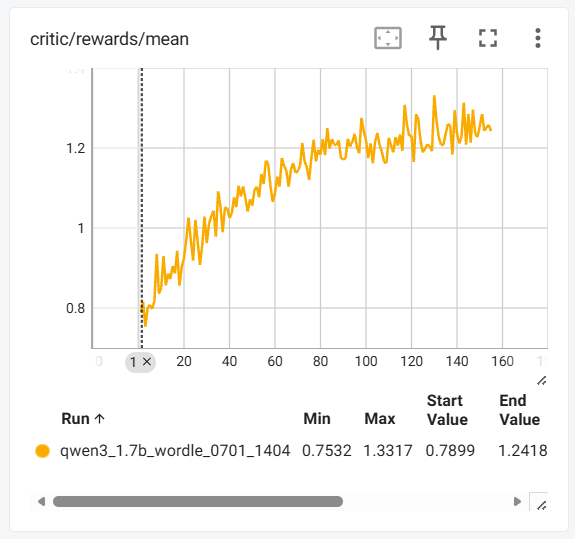
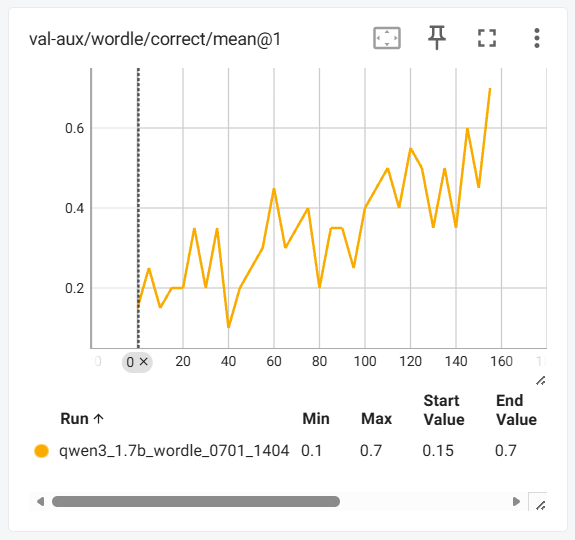
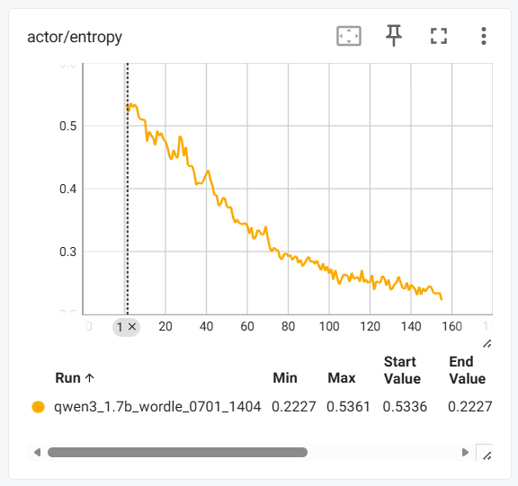

# Wordle RL Training on Ascend NPU

在 Ascend NPU (910B/C) 上基于 [verl](https://github.com/volcengine/verl) 框架进行 Wordle 多轮游戏 RL 训练。

## 支持的产品型号

<term>Atlas A2/A3系列产品</term>

## 环境准备

1. 在 [cann-recipes-train](https://gitcode.com/cann/cann-recipes-train) 网页点击 CANNLab，创建开发环境。

   一站式平台镜像选择：cann_9.0.0-A3。

2. 进入 `llm_rl/qwen3_wordle/` 目录，按照以下步骤完成安装和训练。

## 原理

Wordle 是一个 6 轮猜词游戏，模型需要根据环境反馈 (G/Y/X) 逐步推理出秘密单词。训练使用 GRPO 算法，通过 `WordleAgentLoop` 实现多轮交互：

1. LLM 接收游戏状态 → 生成 `<guess>[word]</guess>`
2. 猜词与答案比对 → 计算 G/Y/X 反馈
3. 反馈作为 user message 追加到对话
4. 重复直到猜中或达到最大轮次

## 环境要求

| 项目 | 版本 |
|------|------|
| torch | 2.9.0 |
| torch_npu | 2.9.0 |
| vllm | 0.18.0 |
| vllm-ascend | 0.18.0 |
| verl | 0.8.0 |
| nltk | 3.9.4 |
| textarena | 0.7.4 |

## 目录结构

完成全部步骤后，目录结构如下：

```
llm_rl/qwen3_wordle/
├── README.md
├── requirements.txt
├── prepare_data.py                      # 数据生成脚本
├── wordle_reward.py                     # 奖励函数
├── run_qwen3_1.7b_wordle_npu.sh         # 训练启动脚本
├── patches/
│   └── 0001-wordle-agent-loop.patch     # verl 补丁
├── data/                                # 第 4 步生成
│   ├── wordle_train.parquet
│   └── wordle_test.parquet
├── models/                              # 第 5 步放入 SFT 权重
│   └── Qwen3-1.7B-Wordle-SFT/
└── verl/                                # 第 2 步 clone
```

## 快速开始

以下所有命令均在 `llm_rl/qwen3_wordle/` 目录下执行。

### 1. 安装 vLLM 和 vLLM-Ascend

> vLLM 和 vLLM-Ascend 需安装到 `/home/developer/` 目录下，避免与训练工作目录产生 Python 导入冲突。

```bash
WORKDIR=$(pwd)
cd /home/developer

git clone --depth 1 --branch v0.18.0 https://github.com/vllm-project/vllm
cd vllm && VLLM_TARGET_DEVICE=empty pip install -v -e . && cd ..

git clone --depth 1 --branch v0.18.0 https://github.com/vllm-project/vllm-ascend.git
cd vllm-ascend && git submodule update --init --recursive && pip install -v -e . && cd ..

cd "$WORKDIR"  # 回到 llm_rl/qwen3_wordle/
```

### 2. 安装 verl

```bash
git clone --depth 1 --branch v0.8.0 https://github.com/verl-project/verl
cd verl && pip install -v -e . && cd ..
```

### 3. 安装依赖

```bash
pip install -r requirements.txt

# NLTK 数据（TextArena Wordle 依赖 pos_tag 过滤词性）
python3 -c "import nltk; nltk.download('words'); nltk.download('averaged_perceptron_tagger_eng')"
```

### 4. 准备数据

```bash
python3 prepare_data.py \
    --num_train 2000 --num_test 20 \
    --output_dir data
```

生成 `data/wordle_train.parquet` 和 `data/wordle_test.parquet`，词表来源于 TextArena Wordle-v0。

### 5. 准备模型权重

使用 ModelScope 下载预训练好的 Qwen3-1.7B Wordle SFT 权重：

```bash
modelscope download --model misumisumisu/Qwen3-1.7B-Wordle-SFT --local_dir models/Qwen3-1.7B-Wordle-SFT
```

或通过环境变量自定义路径：

```bash
MODEL_PATH=/path/to/your/model bash run_qwen3_1.7b_wordle_npu.sh
```

> 这里使用的是本 recipe 已完成训练验证的 ModelScope 权重。其模型架构为 Qwen3ForCausalLM，基座模型是 [Qwen3-1.7B](https://modelscope.cn/models/Qwen/Qwen3-1.7B)。
> 也可以基于同一基座自行训练 SFT 模型；SFT 数据格式应与 RL prompt 一致（system + game prompt），规范输出为 `<guess>[word]</guess>`。

### 6. 安装 Wordle Agent Loop

在 verl 源码中应用 patch（注册 `WordleAgentLoop` 并添加实现）：

```bash
cd verl && git apply ../patches/0001-wordle-agent-loop.patch && cd ..
```

### 7. 启动训练

```bash
bash run_qwen3_1.7b_wordle_npu.sh
```

## 训练过程可视化

训练过程中使用 TensorBoard 记录关键指标（reward、entropy、kl_loss 等），TensorBoard 的基础使用方法参考 [qwen2_5/verl_npu_demo README 中的 TensorBoard 部分](../qwen2_5/verl_npu_demo/README.md#tensorboard)。

简要步骤：

1. 训练日志位于 `./tensorboard_log/` 目录，将其完整复制到本地。
2. 本地安装 TensorBoard：`pip install tensorboard`
3. 启动看板：`tensorboard --logdir=<directory_name> --bind_all`
4. 浏览器打开 `http://<你的IP地址>:6006/` 查看训练曲线。

> 训练曲线在 `TIME SERIES` 页签，验证 rollout 的完整对话在 `TEXT` 页签。

## 配置参数

可通过环境变量配置的参数：

| 参数 | 默认值 | 说明 |
|------|--------|------|
| `MODEL_PATH` | `./models/Qwen3-1.7B-Wordle-SFT` | SFT 模型权重路径 |
| `TRAIN_BATCH_SIZE` | 64 | 训练 batch size |
| `MAX_PROMPT_LENGTH` | 1024 | prompt 最大 token |
| `MAX_RESPONSE_LENGTH` | 4096 | response 最大 token |
| `ROLLOUT_N` | 8 | 每个 prompt 的并行 rollout 数 |
| `MAX_TURNS` | 6 | Wordle 最大猜词轮次 |
| `ACTOR_LR` | 1e-6 | Actor 学习率 |
| `NGPUS_PER_NODE` | 2 | 训练卡数 |
| `ROLLOUT_TP` | 2 | vLLM tensor parallel |

脚本内置的关键超参（如需修改请编辑脚本）：

| 超参 | 值 | 说明 |
|------|-----|------|
| `entropy_coeff` | 0.002 | 熵奖励系数，维持探索，过低易崩塌，过高易发散 |
| `kl_loss_coef` | 0.001 | KL 散度损失系数，约束策略漂移 |
| `kl_loss_type` | low_var_kl | 低方差 KL，数值更稳定 |
| `lr_scheduler_type` | cosine | 余弦退火，防止后期过更新 |
| `min_lr_ratio` | 0.1 | 余弦退火终点的 LR 比例 |
| `lr_warmup_steps_ratio` | 0.03 | LR 热身步数占比 |
| `total_epochs` | 5 | 训练总轮数 |
| `save_freq` | 25 | checkpoint 保存间隔（步） |

## 奖励函数

奖励由 `wordle_reward.py::compute_score` 计算，每轮 rollout 的最终奖励包含：

| 组件 | 分值 | 说明 |
|------|------|------|
| `correct_answer` | 1.0 | 猜中秘密单词 |
| `partial_answer` | 0.0-0.8 | 部分匹配 (0.2 × 绿色 + 0.1 × 黄色) |
| `length_bonus` | 0.0-1.0 | 步数越少奖励越高 |
| `format_reward` | 0.0-0.2 | 使用 `<guess>[word]</guess>` 的回合占比 (权重 0.2) |

该设计参考了 [Prime Intellect Verifiers 的 Wordle 环境](https://github.com/PrimeIntellect-ai/verifiers/blob/main/environments/wordle/wordle.py)，并针对 verl rollout 数据做了适配：

- `partial_answer` 保留整条轨迹中匹配度最高的猜词，而非只看最后一次反馈。
- `length_bonus` 使用 Agent Loop 实际消耗的轮次数，格式错误的回复同样计入轮次。
- `format_reward` 计算采用规范格式 `<guess>[word]</guess>` 的回合占比。

## CPU 单元测试

奖励函数测试不依赖 NPU，可在 `llm_rl/qwen3_wordle/` 目录执行：

```bash
python3 -m unittest discover -s tests -v
```

## 性能参考

Qwen3-1.7B Wordle RL, 2×Ascend 910C：

| 指标 | 参考值 |
|------|--------|
| 单步耗时 | ~250s |
| Reward | 0.82 → 1.20 (155 步) |
| correct | 15% → 70% (155 步) |

训练曲线（TensorBoard）：





## 文件说明

| 文件 | 说明 |
|------|------|
| `run_qwen3_1.7b_wordle_npu.sh` | NPU 训练启动脚本 |
| `wordle_reward.py` | 自定义奖励函数 (correct + partial + length + format) |
| `prepare_data.py` | 从 TextArena Wordle-v0 词表生成训练/测试数据 |
| `patches/0001-wordle-agent-loop.patch` | Wordle Agent Loop 补丁（应用到 verl 源码） |
