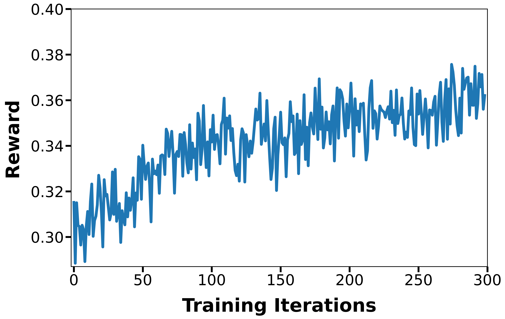

# FLUX GRPO 多模态强化学习训练样例

### 概述

本样例参考 DanceGRPO 的 FLUX GRPO 训练流程，提供在昇腾 NPU 上进行文生图模型强化学习训练的适配补丁。样例以 FLUX 模型为基础，使用 GRPO 算法和 HPSv2 奖励模型对生成图片质量进行优化。

当前目录仅保存适配补丁，不直接包含上游框架源码。使用时需要先准备 DanceGRPO 和 diffusers 源码，再将本目录下的 patch 应用到对应仓库。

本样例主要包含如下适配：

- 将训练和预处理流程从 CUDA/NCCL 适配为 NPU/HCCL。
- 为 diffusers 中 FLUX 相关算子增加 NPU 适配，包括 NPU fused RMSNorm 和 rotary position embedding 处理。
- 增加 NPU 训练环境变量配置和 Atlas A3 16 die 训练启动脚本。
- 增加 `rollout_batch_size`、`train_micro_batch_size` 等训练参数，优化 rollout 和训练阶段的 batch 组织。
- 当前默认使用 HPSv2 作为奖励模型；`use_pickscore` 参数暂未适配 NPU，开启后不会生效。

### 支持的产品型号

Atlas A3 系列产品。

本样例将原仓 `scripts/finetune/finetune_flux_grpo_8gpus.sh` 脚本适配为 8 NPU die 训练脚本，并额外提供 16 NPU die 训练脚本 `scripts/finetune/finetune_flux_grpo_a3_16die.sh`。不同机器的 NPU 编号、CANN 安装路径、通信网卡和启动方式可能不同，请根据实际环境修改脚本中的环境变量和 `torchrun` 参数。

### 文件说明

| 文件路径 | 说明 |
| :--- | :--- |
| [patches/DanceGRPO.patch](patches/DanceGRPO.patch) | 适配 DanceGRPO/FastVideo 工程，使能 NPU 预处理、FLUX GRPO 训练、HPSv2 奖励计算和 A3 16 die 启动脚本。 |
| [patches/diffusers.patch](patches/diffusers.patch) | 适配 diffusers FLUX 相关模块，增加 `NpuFusedRMSNorm`、`torch_npu` 导入和 NPU 上的 RoPE 处理。 |

### 环境准备

1. 环境构建

    **方式一**：使用 Docker 构建环境。请使用已安装 CANN、驱动和 `torch-npu==2.7.1` 的镜像，或基于昇腾官方镜像自行安装对应版本依赖。以下命令以 Atlas A3 16 die 为例，`${IMAGE_NAME}`、`${HOST_WORKSPACE}` 和 `${YOUR_CONTAINER_NAME}` 请替换为实际值。

    ```shell
    docker run \
    --device=/dev/davinci0 --device=/dev/davinci1 --device=/dev/davinci2 --device=/dev/davinci3 \
    --device=/dev/davinci4 --device=/dev/davinci5 --device=/dev/davinci6 --device=/dev/davinci7 \
    --device=/dev/davinci8 --device=/dev/davinci9 --device=/dev/davinci10 --device=/dev/davinci11 \
    --device=/dev/davinci12 --device=/dev/davinci13 --device=/dev/davinci14 --device=/dev/davinci15 \
    --device=/dev/davinci_manager --device=/dev/devmm_svm --device=/dev/hisi_hdc \
    -v /etc/localtime:/etc/localtime \
    -v /usr/local/dcmi:/usr/local/dcmi \
    -v /usr/local/Ascend/driver:/usr/local/Ascend/driver \
    -v /usr/local/bin/npu-smi:/usr/local/bin/npu-smi \
    -v ${HOST_WORKSPACE}:${HOST_WORKSPACE} \
    -w ${HOST_WORKSPACE} \
    --shm-size=100g \
    --privileged=true \
    -itd \
    --net=host \
    --name ${YOUR_CONTAINER_NAME} \
    ${IMAGE_NAME} \
    /bin/bash

    docker exec -it ${YOUR_CONTAINER_NAME} bash
    ```

    **方式二**：使用 Conda 构建环境。请参考 CANN 安装方式手动安装，或在 conda 环境中安装。

    ```shell
    conda create -n flux_grpo python=3.11 -y
    conda activate flux_grpo
    ```
    安装 `torch-npu==2.7.1`
    ```shell
    pip install torch==2.7.1 torch-npu==2.7.1
    ```

2. 下载本仓库源码。

    ```shell
    cd path-to-cann-recipes-train/
    git clone https://gitcode.com/cann/cann-recipes-train.git
    ```
    本案例内容位于 `path-to-cann-recipes-train/cann-recipes-train/multimodal_rl/flux_grpo`。

3. 准备 DanceGRPO 源码并应用补丁。`${FLUXGRPO_PATH}` 请替换为所使用的本案例地址；如果源码已经下载，也可以直接进入对应目录执行 `git am`。应用补丁后安装相关环境。

    ```shell
    cd "${FLUXGRPO_PATH}"
    git clone https://github.com/XueZeyue/DanceGRPO.git
    cd DanceGRPO
    git checkout 15cc71d
    git am "${FLUXGRPO_PATH}"/patches/DanceGRPO.patch
    bash env_setup.sh
    cd ..
    ```

4. 准备并安装 diffusers。`DanceGRPO.patch` 中依赖 `diffusers==0.32.0`，将 diffusers 切换到对应版本后再应用补丁。

    ```shell
    git clone https://github.com/huggingface/diffusers.git
    cd diffusers
    git checkout v0.32.0
    git am "${FLUXGRPO_PATH}"/patches/diffusers.patch
    pip uninstall diffusers
    pip install -e .
    cd ..
    ```

5. 准备 HPSv2 奖励模型依赖。训练脚本默认开启 `--use_hpsv2`，需要安装 HPSv2 并将权重放到 `hps_ckpt/HPS_v2.1_compressed.pt`。

    ```shell
    git clone https://github.com/tgxs002/HPSv2.git
    cd HPSv2
    git checkout 866735ecaae999fa714bd9edfa05aa2672669ee3
    pip install -e .
    cd ..
    ```

6. 安装 `decord`。aarch64 版本无法直接 `pip install decord==0.6.0`，可以按照如下方式安装。

    ```shell
    mkdir ffmpeg-decord
    cd ffmpeg-decord

    # 安装依赖包ffmpeg
    wget https://ffmpeg.org/releases/ffmpeg-4.0.1.tar.bz2 --no-check-certificate
    tar -xvf ffmpeg-4.0.1.tar.bz2
    mv ffmpeg-4.0.1 ffmpeg
    cd ffmpeg
    ./configure --enable-shared
    make -j 64
    make install
    cd ..

    # 安装decord
    git clone --recursive https://github.com/dmlc/decord
    cd decord
    if [ -d build ];then rm -rf build;fi && mkdir build && cd build
    cmake .. -DUSE_CUDA=0 -DCMAKE_BUILD_TYPE=Release
    make -j 64
    make install
    cd ../python
    pip install -e .
    cd ..
    ```

### 数据集和模型权重准备

1. 准备 FLUX 模型权重。训练脚本默认从 `data/flux` 加载模型和 VAE，请将所需 FLUX 权重下载到该目录。

    ```shell
    cd "${FLUXGRPO_PATH}"/DanceGRPO
    mkdir -p data/flux
    # 根据模型许可和实际网络环境下载 FLUX 权重到 data/flux
    ```
    hugging_face 下载地址：https://huggingface.co/black-forest-labs/FLUX.1-dev
    
    modelscope 下载地址：https://www.modelscope.cn/models/black-forest-labs/FLUX.1-dev

2. 准备 HPS 和 CLIP 权重。训练脚本默认从 `hps_ckpt` 加载，请将所需权重下载到该目录。

    ```shell
    mkdir -p hps_ckpt
    cd hps_ckpt
    # HPS_v2.1_compressed.pt 下载方式 1
    wget https://huggingface.co/xswu/HPSv2/resolve/main/HPS_v2.1_compressed.pt?download=true
    # HPS_v2.1_compressed.pt 下载方式 2
    wget https://www.modelscope.cn/models/AI-ModelScope/HPSv2/resolve/master/HPS_v2.1_compressed.pt

    # open_clip_pytorch_model.bin 下载方式 1
    wget https://huggingface.co/laion/CLIP-ViT-H-14-laion2B-s32B-b79K/resolve/main/open_clip_pytorch_model.bin?download=true
    # open_clip_pytorch_model.bin 下载方式 2
    wget https://www.modelscope.cn/models/laion/CLIP-ViT-H-14-laion2B-s32B-b79K/resolve/master/open_clip_pytorch_model.bin

    cd ..
    ```

3. 准备训练 prompt 数据，生成 FLUX RL embeddings。预处理脚本默认读取 `assets/prompts.txt` 中的内容作为 prompts，生成 embeddings，默认生成位置和训练脚本默认读取位置为 `data/rl_embeddings/videos2caption.json`。

    ```shell
    # 如需修改 NPU 数量、CANN 路径或模型路径，请先编辑脚本
    bash scripts/preprocess/preprocess_flux_rl_embeddings.sh
    ```


### GRPO 训练执行

在 DanceGRPO/FastVideo 源码根目录下执行训练脚本。运行前请重点检查脚本中的如下配置：

- `source /usr/local/Ascend/cann/set_env.sh`：根据实际 CANN 安装路径修改。
- `ASCEND_RT_VISIBLE_DEVICES`：根据实际使用的 NPU 编号修改。
- `--pretrained_model_name_or_path`、`--vae_model_path`：默认指向 `data/flux`。
- `--data_json_path`：默认指向 `data/rl_embeddings/videos2caption.json`。
- `--use_hpsv2`：默认使用 HPSv2 奖励模型，需要提前准备 `hps_ckpt/HPS_v2.1_compressed.pt`。

16 NPU die 训练示例：

```shell
bash scripts/finetune/finetune_flux_grpo_a3_16die.sh
```

8 NPU die 训练示例：

```shell
bash scripts/finetune/finetune_flux_grpo_8gpus.sh
```

多机训练可参考 `scripts/finetune/finetune_flux_grpo.sh`，并根据实际集群修改 `--nnodes`、`--node_rank`、`--master_addr` 和 `--master_port`。

训练输出默认保存在如下目录：

- `data/outputs/grpo`：训练 checkpoint 和输出结果。
- `images`：rollout 过程中生成的图片样例。
- `wandb`：如开启 wandb，则保存日志相关文件。

### 训练效果与性能

下图展示了训练过程中 reward 指标的变化趋势：



在 Atlas A3 16 die 上，设置 `train_micro_batch_size=1`、`rollout_batch_size=4`、`gradient_accumulation_steps=4`，对应全局训练批次大小（train GBS）为 64。该配置下的实测训练耗时如下：

| 训练迭代数 | 训练耗时 |
| :---: | :---: |
| 200 iterations | 17.22 小时 |
| 300 iterations | 25.83 小时 |

由于硬件平台、软件栈及具体运行环境存在差异，以上数据用于展示本样例在 Atlas A3 上的实际训练性能，不作为严格的同条件性能对比。

### 常见问题

1. 如果 `git am` 失败，请确认上游源码版本与补丁生成版本匹配；若上游代码已有较大变化，需要手动解决冲突后继续执行 `git am --continue`。

2. 如果训练启动后找不到 HPSv2 权重，请确认文件路径为 `hps_ckpt/HPS_v2.1_compressed.pt`，或在训练代码中修改 `cp` 路径。

3. 如果更换 CANN 或 torch-npu 版本后出现编译缓存问题，建议清理如下目录后重新运行：

    ```shell
    rm -rf kernel_meta
    rm -rf .cache
    rm -rf /root/.cache
    ```

4. 当前 `--use_pickscore` 暂未适配 NPU，训练脚本建议保持使用 `--use_hpsv2`。

5. 安装时如遇 GCC 版本问题，可在 conda 环境中安装 GCC（以 aarch64 和 GCC11 为例）：
    ```shell
    conda install -c conda-forge gcc_linux-aarch64=11 gxx_linux-aarch64=11
    export CC="$CONDA_PREFIX/bin/aarch64-conda-linux-gnu-gcc"
    export CXX="$CONDA_PREFIX/bin/aarch64-conda-linux-gnu-g++"
    ```

6. 运行时如遇 `OSError: libswscale.so.5: cannot open shared object file: No such file or directory` 报错，表示程序在运行时找不到 FFmpeg 的动态库 `libswscale.so.5`，先执行 `find /usr -name libswscale.so.5`，动态库 `libswscale.so.5` 通常会出现在 `/usr/local/lib` 的子目录下，再执行 `export LD_LIBRARY_PATH=/usr/local/lib:$LD_LIBRARY_PATH`，然后运行程序即可。

7. 运行时如遇 `ImportError: .../libGLdispatch.so.0: cannot allocate memory in static TLS block` 报错，推荐预加载 `libGLdispatch`，先找到系统的 `libGLdispatch.so.0`：`find /usr -name libGLdispatch.so.0`，若出现 `/usr/lib/aarch64-linux-gnu/libGLdispatch.so.0`，执行 `export LD_PRELOAD=/usr/lib/aarch64-linux-gnu/libGLdispatch.so.0`，随后运行程序即可。
